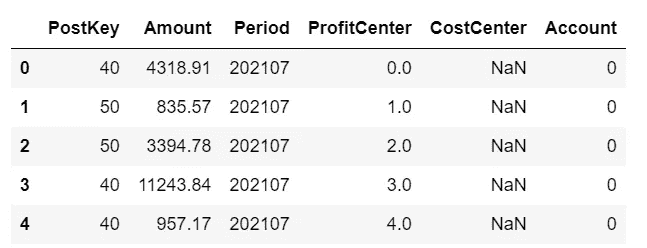
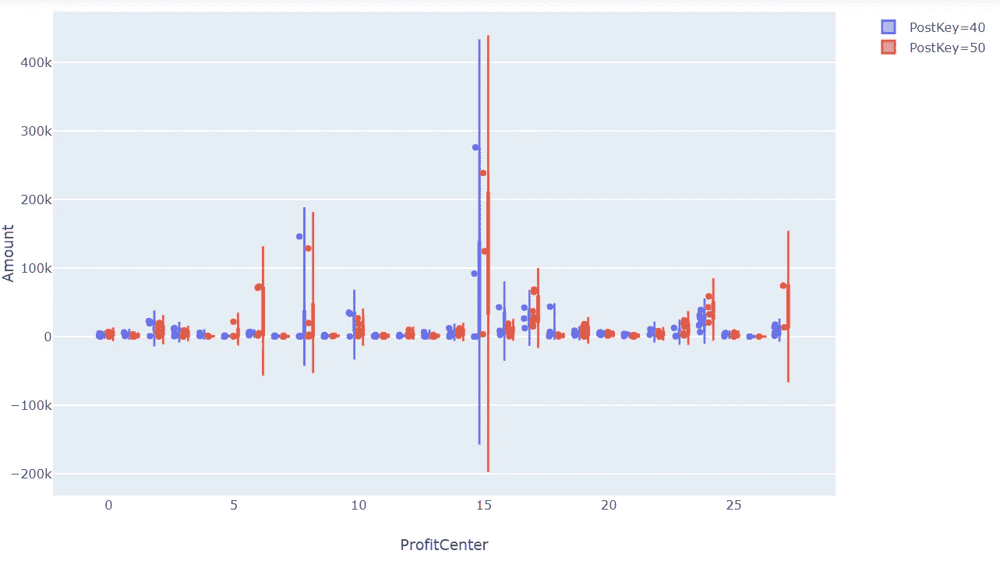
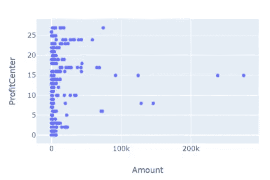
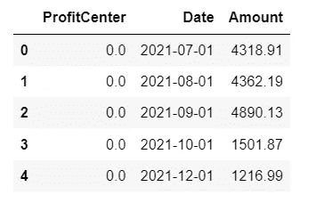
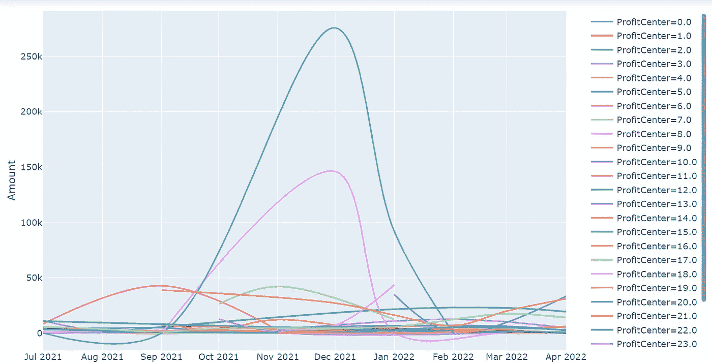
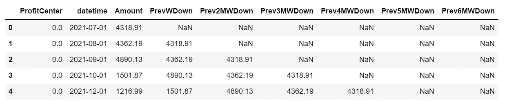
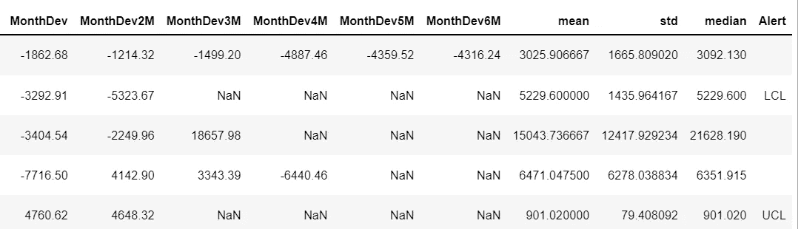
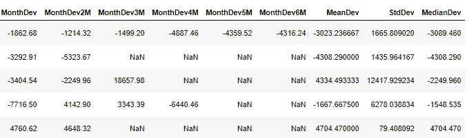
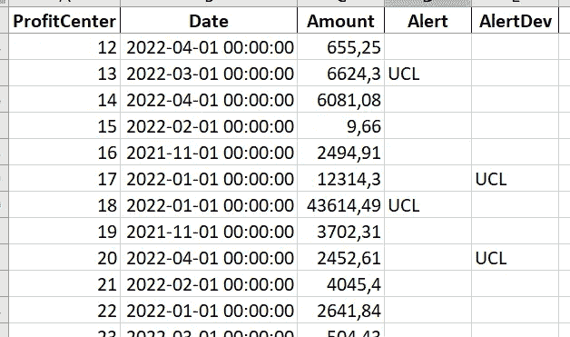

# 折旧异常检测

> 原文：<https://towardsdatascience.com/depreciation-anomaly-detection-fc8802ee6966>

## 财务减记的应用统计过程控制

每一滴水都很重要(巴伐利亚瀑布，图片由作者提供)

折旧是指一种会计方法，用于在有形资产或实物资产的使用寿命内分配其成本。在本帖中，每个利润和成本中心每月计算一次所用资产的价值。折旧会计会极大地影响一个人的利润。这就是为什么密切监控非常重要。现在，我们将学习如何使用应用统计流程控制技术，立即发现月度减记中的异常情况。

首先让我们看看数据:

折旧是在过帐期间、帐户、利润和成本中心级别进行的。

**分布:**

让我们使用 Plotly Express 交互式绘制每个利润中心的金额分布和过账键。

Plotly 非常方便，因为它的交互式可视化(图片作者)

从每个利润中心的总体分布来看，我们可以看到一些利润中心比其他利润中心有更大的范围。

(图片由作者提供)

在这里同时考虑两种发布类型是没有意义的。我们将只考虑每个利润中心每月发布类别 40 的金额，并按日期对结果进行排序。

查看折线图，我们可以看到每个利润中心都可能存在缺失月份。介于两者之间的特定利润中心没有减记是有原因的，因此这很好。

中间可能有几个月没有折旧(图片由作者提供)

**计算控制上下限:**

我们的目标是建立一个利润中心级别的警报，一旦当月的偏差超出预期，就会触发我们。我们的想法是，当我们下个月折旧时，我们希望得到通知，以防特定利润中心的折旧明显高于或低于我们对前六个期间的预期。为此，首先我们对每月折旧进行分组和排序，并计算当月与上月(班次 1)之间的差异，第二次更新(班次 2)等等。

现在，在每一行中，我们可以将当前金额与前一个月(PrevWDown)、前二个月(Prev2MWDown)等进行比较。直到我们连续获得最近 6 个月的数据:

最后，我们计算这些月方差的均值、标准差和中值。

在这个例子中，我们不再考虑中位数。但是在继续之前，您可能想仔细看看您的数据的分布情况。因为只有当您知道数据的位置和分布时，您才能设置有意义的警报。我们将使用统计过程控制技术来计算警报。如果您想了解更多关于 SPC 和 QCC 的信息，请参阅本文:

 [## 通过统计过程控制推动您的销售

### 质量控制图是一个被低估的销售分析概念吗？

towardsdatascience.com](/push-your-sales-with-statistical-process-control-52321f329405) 

我们不会完全遵循质量控制图原则，但我们会出于财务目的采用这些原则:

这意味着，如果最近一个月的金额高于平均值标准偏差的三倍，预警会将此行标记为“控制上限”(UCL)。如果每个利润中心的当前折旧应低于平均值减去三倍标准差，它将被标记为“控制下限”(LCL)。因此输出如下所示:

受控制移动范围图的启发，我们还将分别添加最近 6 个月与最新金额的偏差，以更好地对当前折旧进行排序:

我们使用 drop_duplicates 只保留每个利润中心的最新行

..并计算这些方差的均值和标准差:

现在，您可以轻松检查利润中心在当前折旧期内的任何异常值，以及它们的平均值和范围:

祝贺您，您已经将统计过程控制应用到您的财务减记中。下个月，您可以通知您的会计同事有关平均值或范围的任何触发的警报。如果数据可以描述为正态分布，通常在质量控制图上使用平均值的 3 倍标准差。您应该将此修改为您的数据分布，这样您就不会收到错误的警报。

非常感谢阅读，我希望这是支持。你可以在我的 Github 库中找到完整的 Jupyter 笔记本。随时在 [LinkedIn](https://de.linkedin.com/in/jesko-rehberg-40653883) 、 [Twitter](https://twitter.com/DAR_Analytics) 或[工作室(有或没有 VR)](https://jesko-rehberg.medium.com/virtual-reality-vr-for-education-a532aa5b6272) 与我联系。