# Sigmoid 函数和交叉熵函数的导数

> 原文：<https://towardsdatascience.com/derivative-of-sigmoid-and-cross-entropy-functions-5169525e6705>

## Sigmoid 激活和交叉熵损失函数的逐步微分

本文将逐步介绍 Sigmoid 函数和交叉熵函数。在模型训练期间执行[反向传播时，理解这两个函数的导数在机器学习领域是至关重要的。](/how-does-back-propagation-work-in-neural-networks-with-worked-example-bc59dfb97f48)

由 [Saad Ahmad](https://unsplash.com/@saadahmad_umn?utm_source=medium&utm_medium=referral) 在 [Unsplash](https://unsplash.com?utm_source=medium&utm_medium=referral) 上拍摄的照片

# s 形函数的导数

Sigmoid/ Logistic 函数定义为:

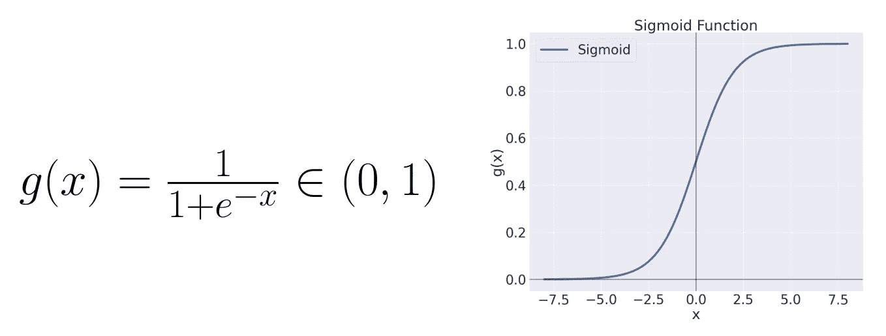

图 1: Sigmoid 函数。左:Sigmoid 方程，右是方程的绘图(来源:作者)。

其中`e`是**欧拉数**——一个近似等于`2.718281828459`的超越常数。对于`x`的任意值，Sigmoid 函数`g(x)`落在`(0, 1)`范围内。随着`x`的值减小，`g(x)`接近`0`，而随着`x`变大，`g(x)`趋向于`1`。例子，

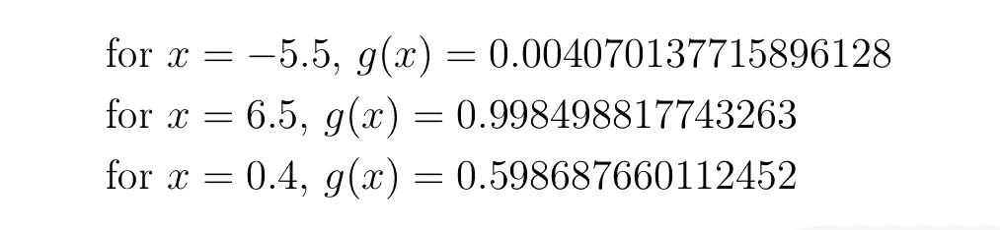

g(x)的某些值给定 x 的值。

从这里开始，我们将使用两种方法— **商和微分链规则对 Sigmoid 函数进行微分。**

## 用商法则求 Sigmoid 函数的导数

**第一步:**陈述商法则

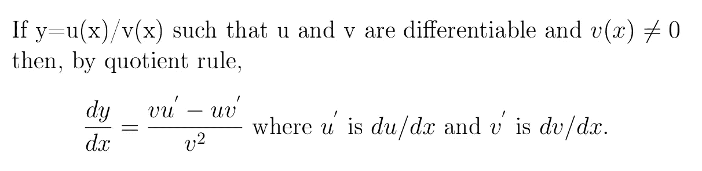

商数法则。

商法则读作“*商的导数是分母乘以分子的导数减去分子乘以分母的导数一切除以分母的平方。*

第二步:应用商法则

根据 Sigmoid 函数、`g(x)` 和商法则，我们有

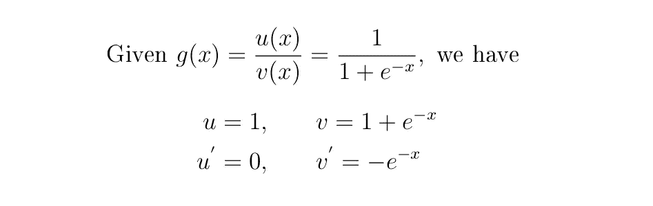

需要注意两件事:

*   常数的导数等于零。这就是为什么`u’=0`。
*   `v`中指数函数`e*`的微分被**指数微分法则**覆盖。

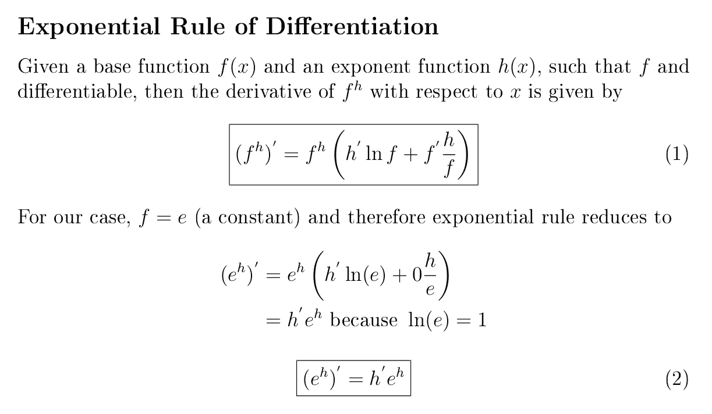

指数法则。

根据商和指数微分法则，我们有

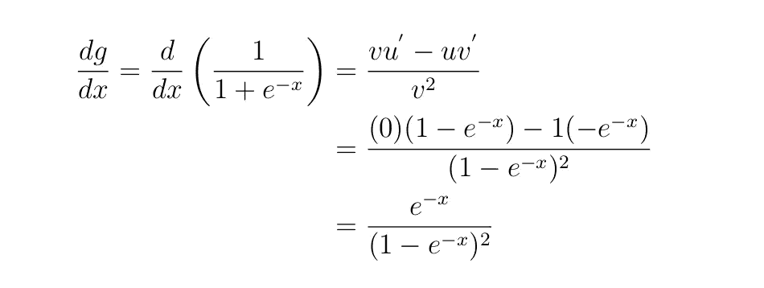

这是 Sigmoid 函数的导数，但我们可以进一步简化，如下一步所示。

**第三步:**简化导数

在这一步中，我们将使用代数上的一些概念来简化第二步中的求导结果。

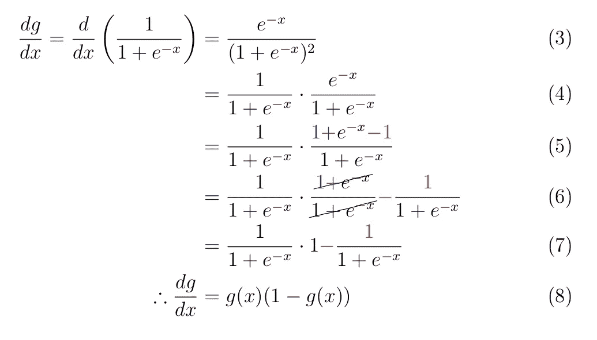

**注意:**在等式 5 中，我们在等式上加了 1，减了 1，所以我们实际上什么也没改变。

这标志着使用商法则的微分过程的结束。

## 用链式法则判别 Sigmoid 函数

**第一步:**链式法则

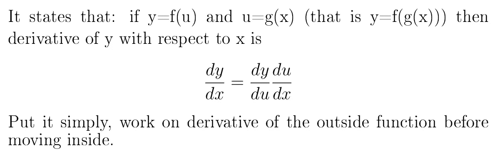

链式法则。

**步骤 2:** 将 Sigmoid 函数重写为负指数

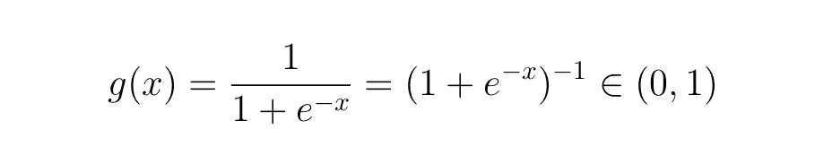

**步骤 3:** 在步骤 2 中对 Sigmoid 函数应用链式法则

让，

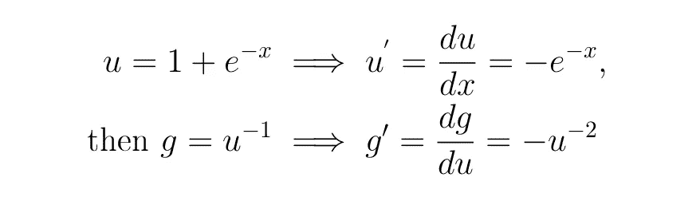

然后，根据链式法则，我们将如下进行:

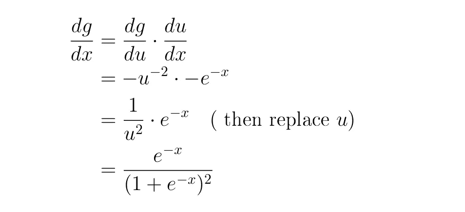

在这一点上，您可以使用我们在处理商数规则时所采取的相同步骤来简化方程(方程`3`到`8`)。

这是 Sigmoid 函数及其导数的图

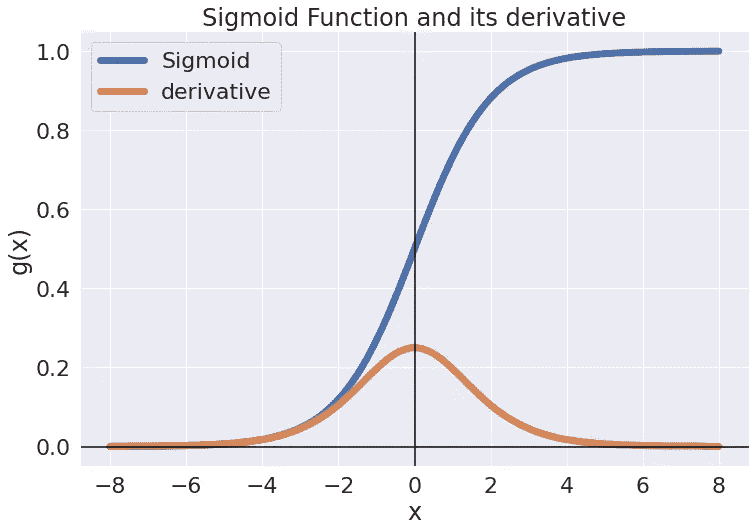

Sigmoid 函数及其导数(来源:作者)。

# 交叉熵函数的导数

交叉熵损失函数是用于分类问题的一个非常重要的代价函数。然而，在本帖中，我们将只关注损失函数的微分。尽管如此，你可以在下面的链接中读到更多关于交叉熵损失函数的内容

</cross-entropy-loss-function-f38c4ec8643e>  

交叉熵损失函数定义为:

其中 t **ᵢ** 是真值，p **ᵢ** 是 i **ᵗʰ** 类的概率。

对于具有两个类别的分类，我们有二元交叉熵损失，其定义如下

二元交叉熵损失函数，其中 t 是真值，yhat 是预测概率。

## 二元交叉熵函数的导数

二元损失的真实标签`t`是一个已知值，而`yhat`是一个变量。这意味着函数将对`yhat`进行微分，并将 t 视为常数。现在让我们继续研究导数。

**第一步:**陈述两条规则我们需要区分二元交叉熵损失

为了区分二元交叉熵损失，我们需要这两条规则:

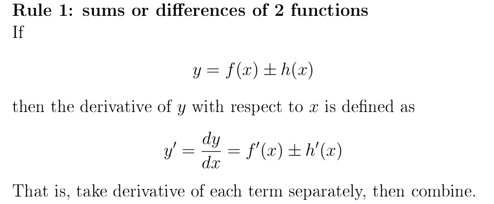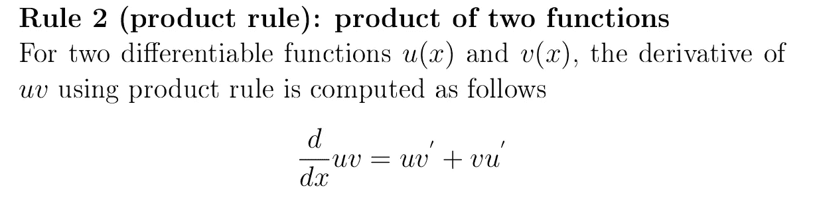

而乘积法则是这样写的，“*两个函数乘积的导数就是第一个函数乘以第二个函数的导数加上第二个函数乘以第一个函数的导数。*”

**第二步:**功能微分

我们将使用*乘积规则*来分别处理这两项的导数；然后，通过*规则* `*1*`我们将结合两个导数。

由于我们有两个未知数——`t`和`yhat` ——我们将实际处理偏导数(一个多变量函数的偏导数是它对其中一个变量的导数，其他变量被视为常数)。

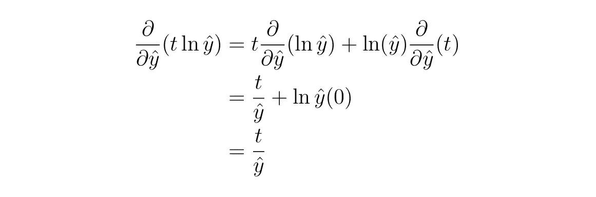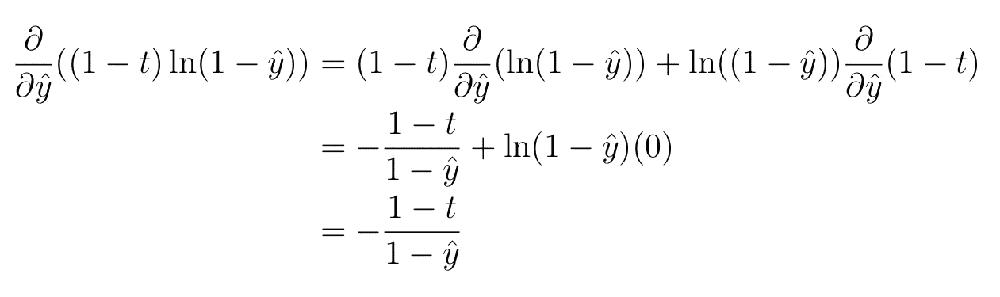

因此，二元交叉熵损失函数的导数变成

这标志着本文的结束。感谢阅读:-)

# 结论

在本文中，我们研究了 Sigmoid 函数和二元交叉熵函数的导数。前者主要在机器学习中用作激活函数，而后者通常用作评估模型的成本函数。这里发现的导数在网络的[反向传播过程](/how-does-back-propagation-work-in-neural-networks-with-worked-example-bc59dfb97f48)中尤其重要——这是模型训练中的一个重要步骤。

请[以每月 5 美元的价格注册成为 medium 会员](https://medium.com/@kiprono_65591/membership)，以便能够阅读我和其他作者在 Medium 上的所有文章。

你也可以[订阅，以便在我发表文章时将我的文章放入你的邮箱](https://medium.com/subscribe/@kiprono_65591)。

感谢您的阅读，下次再见！！！