# 推导网球比赛时长的公式

> 原文：<https://towardsdatascience.com/deriving-a-formula-for-the-length-of-a-tennis-game-9b5a4a1a92dd>

Jeffery Erhunse 在 Unsplash 上的照片

## 使用基于点数的建模方法得出每场比赛的预期点数

在变得兴奋和深入二项变量和几何级数的本质之前，让我们从头开始。为什么？为什么我们会关心如何写一个网球比赛长度的方程？

当谈到能够为一场网球比赛的持续时间写一个“封闭形式的方程”时，答案可能是我们*不在乎(除了只想掸掉数学蜘蛛网上的灰尘)。在计算机和模拟的时代，不需要没有用的数值帮助就能解决这个问题。但是能够将网球比赛的持续时间与发球方在任何给定的点*获胜的概率`p`联系起来的想法是*有用的。*

网球目前是:

*   随着比赛变得越来越长，非常长的比赛越来越频繁，显然陷入了一点危机。
*   预示着新一批更高的球员，更高的球员带来更凶猛的发球，并在任何特定的比赛中给发球球员更多的统治力。

思考以上两件事是我如何在业余时间琢磨这个想法的。下面是一个使用“基于点的建模”的演练，演示如何在一场给定的网球比赛中推导出预期点数的公式，然后用 python 进行了一点模拟，以确保我没有在所有`p`和`n`飞来飞去的时候走错地方。

## 基于点的建模基础

给定服务器赢得一分的概率`p`(因此返回者的`(1-p)`获胜)，如果我们玩`n`分，我们可以将服务器赢得`x`分的概率写为:

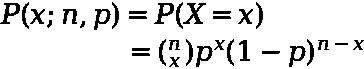

作者图片

这只是一个陈述，概率遵循二项式分布，因为每个点都被视为二元结果(或者伯努利随机变量，如果你觉得有趣的话)。一场网球比赛可以被认为是围绕着一些标准的各种分数的集合，例如:

*   一旦一个玩家得到 4 分，他们就赢得了比赛
*   如果两个玩家都是 3 分，那么你需要得到 2 分(平手)

我们可以用下图描绘一场网球比赛的结构:

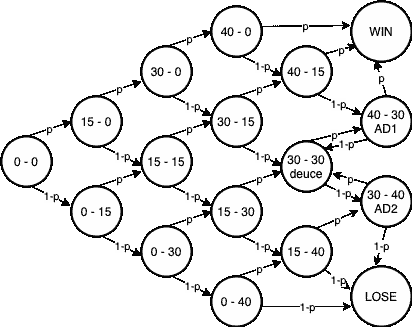

图片由作者使用[https://app.diagrams.net/](https://app.diagrams.net/)

让我们通过几个例子来解释这个图表。如果服务器赢了每一分，那么我们沿着上面的对角线——我们玩 4 分，并且以概率`p`服务器赢了每一分。按照上面的格式写下来:

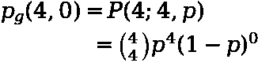

作者图片

…在这里，我介绍了上面的`p(4,0)`符号，表示游戏以服务器赢得 4 分和返回者赢得 0 分而结束的概率。

类似地，如果服务器赢了 4 分，返回者赢了 1 分，那么我们沿着对角线向上，但是在某一点我们向下倾斜，因为返回者赢了一分。重要的是，**这种下降不会发生在最后的**时刻，即服务器赢得 4 分，然后*返回者赢得他们的分，因为在这种情况下，游戏已经结束了。因此，我们需要消除发生这种情况的场景——当服务器连续赢得 4 分时。*

这是[包含-排除原则](https://en.wikipedia.org/wiki/Inclusion%E2%80%93exclusion_principle)的一个应用，在整个过程中都很重要——假设我们没有平手，一旦一个玩家赢得 4 分，游戏就结束了。同样，如果你想想象一下，那么你可以说我们正在模拟一个马尔可夫链，我们已经达到了一个“吸收状态”——即一个玩家达到 4 分，我们不再“过渡”到其他状态，因为游戏已经结束。

使用上面的符号，我们最终得到:

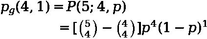

作者图片

…这里的`(4, 4)`减法是去除 1 个状态，在该状态下，发球方连续赢得 4 分，然后*和*发球方赢得他们的。

## 将获胜概率转化为游戏持续时间

在上面我们已经关注了*概率*，但是我们在这里关心的是一场游戏的*持续时间*。事实上，当我们有一个给定的服务器赢得分数的概率`p`时，我们关心的是*期望的*游戏持续时间。为了计算这一点，我们真的需要求和:

*   在`x`点数后游戏结束的概率
*   次数`x` -玩的点数

对于`x`的每个值。我们可以把它写成下面的等式:

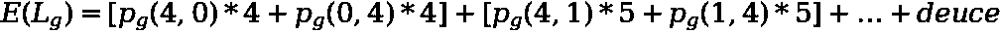

作者图片

我们有:

*   “赢得爱情”(发球者或回球者)的概率乘以 4 点
*   “赢到 15 分”(发球方或回球方)的概率乘以 5 分
*   等等。等等。等等。
*   一些“包罗万象”的术语，指的是更复杂的平分，因为它涉及一些潜在的来回(将在后面讨论)。

考虑到每场比赛至少要有 4 分，我们可以将它改写为:

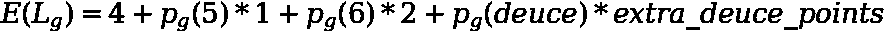

作者图片

…其中`p(n)`表示在`n`点后游戏结束的概率。在上文中，我们只是重新考虑了一些因素，因此我们没有“概率乘以点数”，而是“概率乘以额外的点数”——额外点数是指每场比赛最低 4 点以上的点数。我们现在可以依次讨论这些术语。

## 打了 5 分(多打了 1 分)

正如我们在上面看到的，我们有一个游戏“赢到 15 分”的概率公式。现在需要做的就是把服务器赢的概率加到 15，返回者赢的概率加到 15。这里我们可以利用二项分布是对称的这一事实；

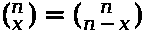

作者图片

然后我们得到 5 分后游戏结束的概率:

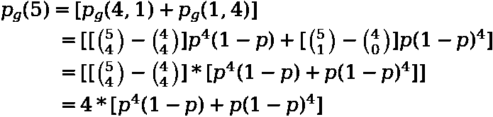

作者图片

在这里，我们利用了对称性的事实来折叠二项式系数，即`(5,1) = (5,4)`和`(4,4) = (4,0)`

## 打了 6 分(多打了 2 分)

与上面非常相似，我们可以计算出我们打 6 分并且比赛结束的概率，然后我们将它乘以 2，因为我们在网球比赛中比最低的 4 分多打了 2 分:

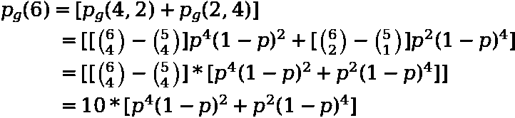

作者图片

## 两点

与前一个例子不同，使用“平分”,我们需要计算 2 个分量，而前一个例子中我们只需要计算 1 个分量——在该状态下结束的概率。这两个组件是:

*   在打完`n`分后以那种状态结束的概率(就像以前一样)。
*   玩的点数

我们可以按顺序拍摄。

## 平手的概率

这一点相对简单，因为平分的概率只是每个玩家赢得 3 分的情况下玩 6 分的概率——直接来自二项式分布:

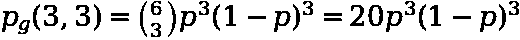

作者图片

## 点数打成平手

这是最难的部分。一旦我们打成平手，我们知道我们将在一场比赛的最低 4 分的基础上再多打 4 分。换句话说，我们能玩的最低分是 8 分——6 分平手，2 分如果平手被直接“解决”。然而，如果我们来回一点，我们可能会玩得更多(先取得优势，然后回到平手等)。就像之前一样，我们需要把事情分成游戏结局:

*   如果服务器赢了。
*   如果返回者获胜。

## 如果服务器赢了，额外加分

如果服务器以平手获胜，我们可以将期望的额外点数表述为:

作者图片

这是什么意思？

*   `p(n+2,n)`是返回者有 n 分，服务器多 2 分的概率。从平手开始，比赛就结束了，因为从平手开始，再赢 2 分就足以赢得比赛。
*   `[4 + 2n]`是额外的分数，例如，如果我们立即“解决”平分，即`n=0`，那么我们有 4 个额外的分数。
*   然后，我们对所有可能的`n`求和，即`n=0`是如果立即解决平分，`n=1`是如果我们来回一次，`n=2`是如果我们来回两次等等。等等。

我们首先需要进入`p(n+2, n)`——我们可以这样写:

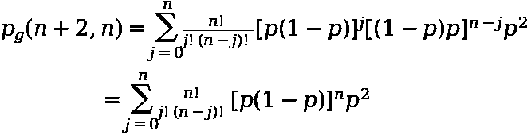

作者图片

为了解决这个问题，我们可以去掉所有不依赖于`j`的东西，并利用二项式系数的[和公式:](https://en.wikipedia.org/wiki/Binomial_coefficient#Sums_of_binomial_coefficients)

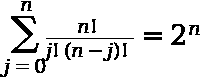

作者图片

这留给我们以下等式:

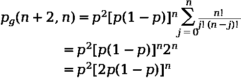

作者图片

将这个代入上面的等式，我们得到:

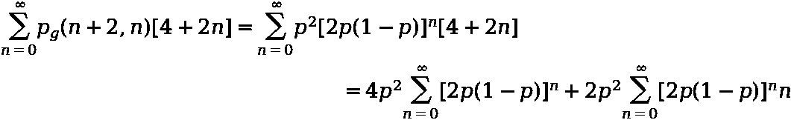

作者图片

…我们在上面的结果中进行了替换，并去掉了`[4+2n]`括号，将`p^2`移到求和之外，因为它不依赖于`n`。这意味着我们现在有两个术语:

*   4(如果我们打成平手，所打的最少额外杆数)乘以服务器赢平手的概率。
*   `2n`(来回的加分)乘以来回`n`轮后平手结束的概率。

查看这些表达式，我们会发现它们都是几何级数，但形式略有不同。第一项是以下形式的标准几何级数:

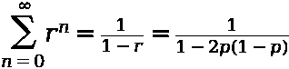

作者图片

…最后，我根据我们的情况进行了替换:`r=2p(1-p)`。第二个系列的形式为:

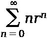

作者图片

我们可以先解决这个问题，如果我们对之前的“标准”几何级数进行微分，我们会得到:

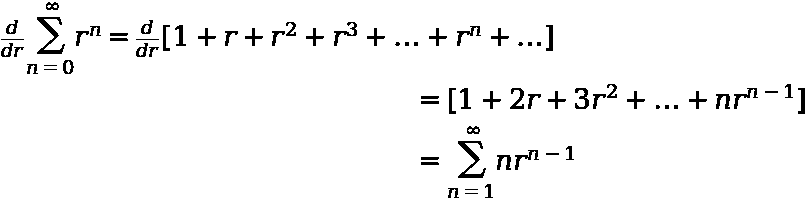

作者图片

我们还可以区分该系列的解决方案，以获得:

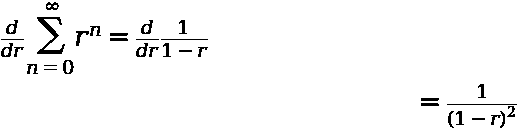

作者图片

最后我们可以乘以`r`得到我们感兴趣的量:

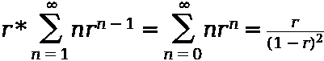

作者图片

代入我们的情况`r=2p(1-p)`，我们得出:

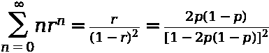

作者图片

现在我们有了构建模块，我们可以将它们放在一起，以获得预期的额外分数:

*   一旦我们进入平手
*   如果服务器赢了

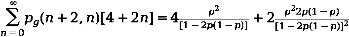

作者图片

换句话说，这表明我们增加了 4 个点乘以服务器赢得平分的概率，再加上 2 个额外的点乘以服务器最终赢得平分的“来回”的预期持续时间。虽然有点拗口，但是能够用英语陈述这个等式总是很好的——即使它不是“简单”的英语。

## 如果返回者获胜，则加分

我们已经完成了服务器案例的所有繁重工作，返回器几乎完全相同，除了我们将几个`p`转换为`(1-p)`。为返回器添加的额外点数的表达式为:

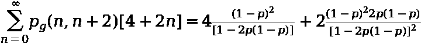

作者图片

## 把所有的放在一起

现在我们已经计算了所有的组件，是时候把它们放在一起了。在所有的推导和替换之后提醒我们自己:

*   4 个基点
*   5 个总点数乘以 1 个额外点数后游戏结束的概率
*   在 6 个总点数乘以这 2 个额外点数后游戏结束的概率
*   我们打成平手并且服务器获胜的概率乘以与之相关的额外分数
*   我们进入平手和返回者获胜的概率乘以与此相关的额外分数

现在是丑陋的部分:

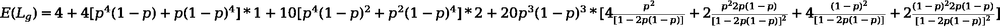

作者图片

## 我们的函数在图形上是什么样的？

现在我们有了方程，让我们:

*   用 python 写出来
*   将输出与模拟游戏持续时间进行比较
*   尝试产生一些有趣的结果

以下是上述公式在 python 中的实现:

那么它看起来如何呢——让我们画出`p`的不同值的`game_length`的输出。从上面的公式中可以看出:

*   有了`p=0`或`p=1`，我们会期望`game_length`输出 4——这个游戏只能因爱而赢或输
*   随着`p`的到来，游戏的预期长度会增加，因为有更多的额外积分可以玩

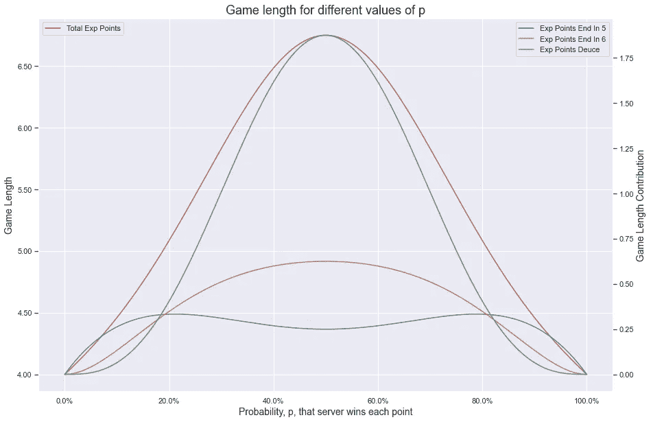

作者图片

所以我们可以看到:

*   正如所料，在极端情况下，我们最终最多打了 4 分。
*   随着游戏变得更加平衡(`p`接近 50%)，那么预期的游戏持续时间增加到 6.75 的峰值。
*   预期游戏持续时间的增加是由于游戏“赢到 30 分”的概率增加，但尤其是进入平手，这总体上支配了额外的游戏时间。

由此得出了一个很好的结论。如果人们真的担心整个网球比赛的长度，那么有一个简单的建议——删除平分，并用“突然死亡”点代替。事实上，这是过去 4 年来在下一代 ATP 总决赛中测试过的东西。

## 使用 python 进行检查

现在，让我们模拟网球比赛，看看我们的公式的输出如何与它们生成的比赛长度分布进行比较。为了模拟网球比赛，我们将使用我编写的轻量级 [tennisim](https://github.com/mjam03/tennisim) 包。

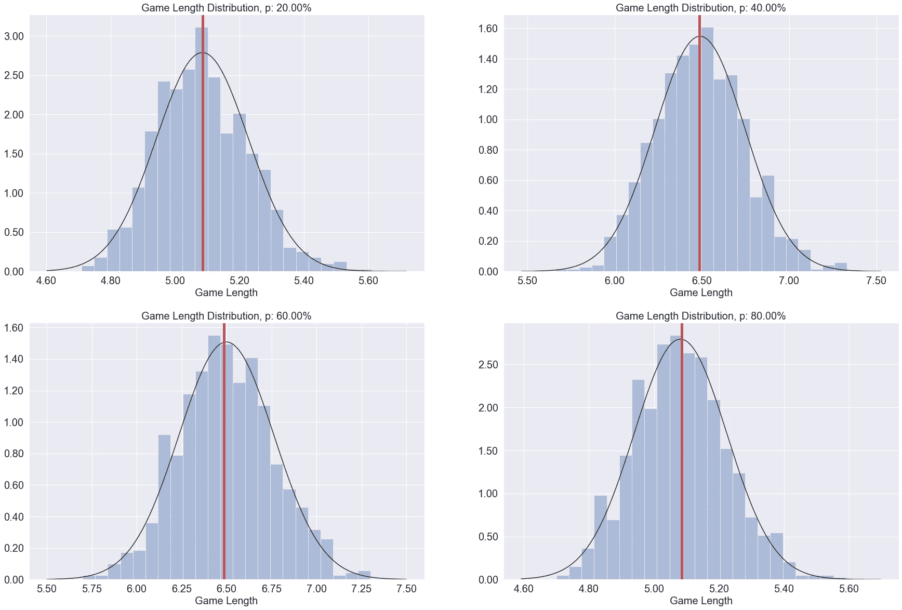

作者图片

上图显示了不同的`p`值在我们运行模拟时游戏长度的分布情况。具体到左上角的图表，我们有:

*   模拟 100 个游戏并记录它们的平均长度
*   重复了 1000 次
*   将这些值绘制成一个分布，并在我们推导出的方程值上标记为垂直红线

鉴于红线似乎正好位于每个分布的中间，那么我们可以说情况看起来相当不错。

## 结论

正如开始提到的，*需要*来表达一场网球比赛的长度，因为一个封闭形式的方程是最小的。这一点通过以下事实得到了证明:

*   “暴力破解”和模拟数百万场网球比赛只需要很少的代码
*   100，000 场游戏需要< 1 second to simulate (using 【 on my mac)

Nevertheless sometimes it’s fun to see if it can be done as well as provide some useful insights as to *为什么*游戏越平衡时间越长。

如上图之一所示，**更长预期游戏的真正驱动因素是进入平手**。杜斯相对于`4`的最短持续时间增加的额外 4 个镜头，以及如果你来回移动的话*甚至更多*的潜力是真正推动期望更高的原因。如果真的担心网球比赛的长度，那么取消平局可能是保留其他驱动比赛长度的方面(抢七局，现有的设置结构)的一种方式，同时缩短比赛——因此比赛。