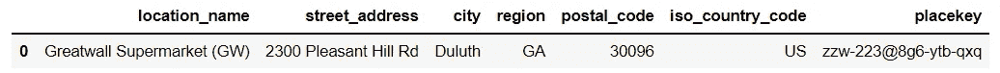
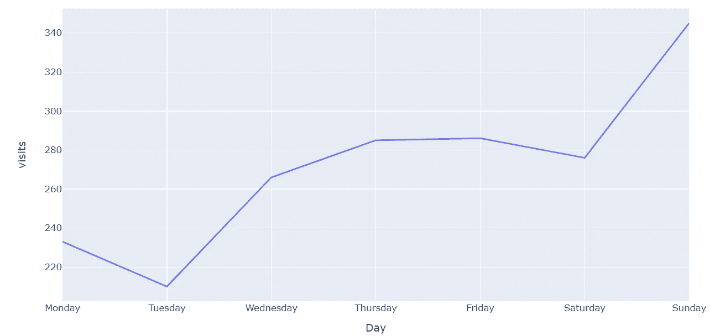
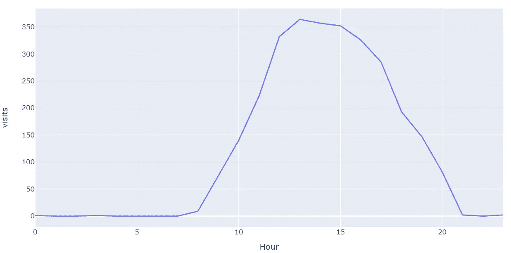
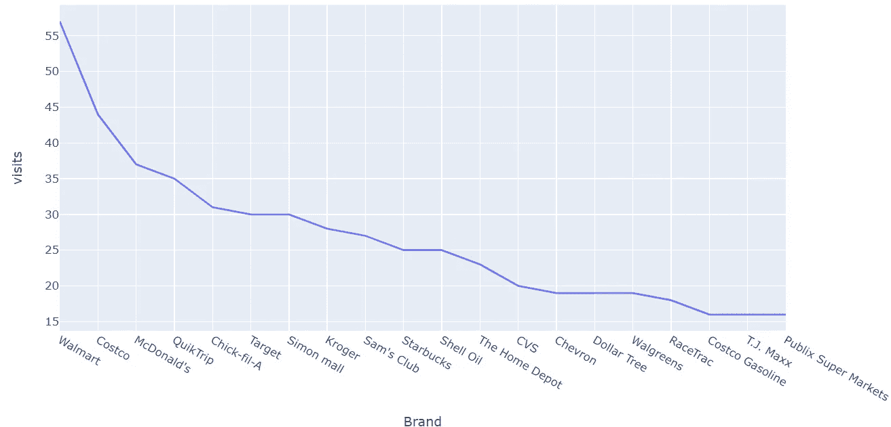
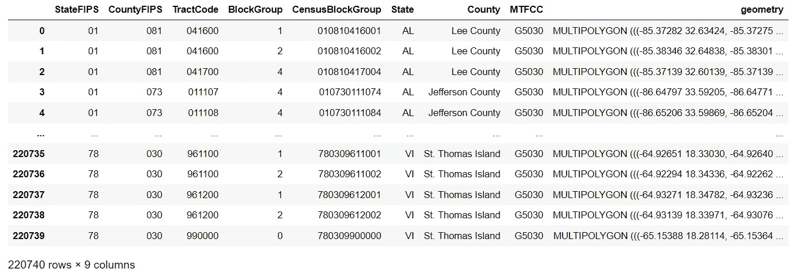
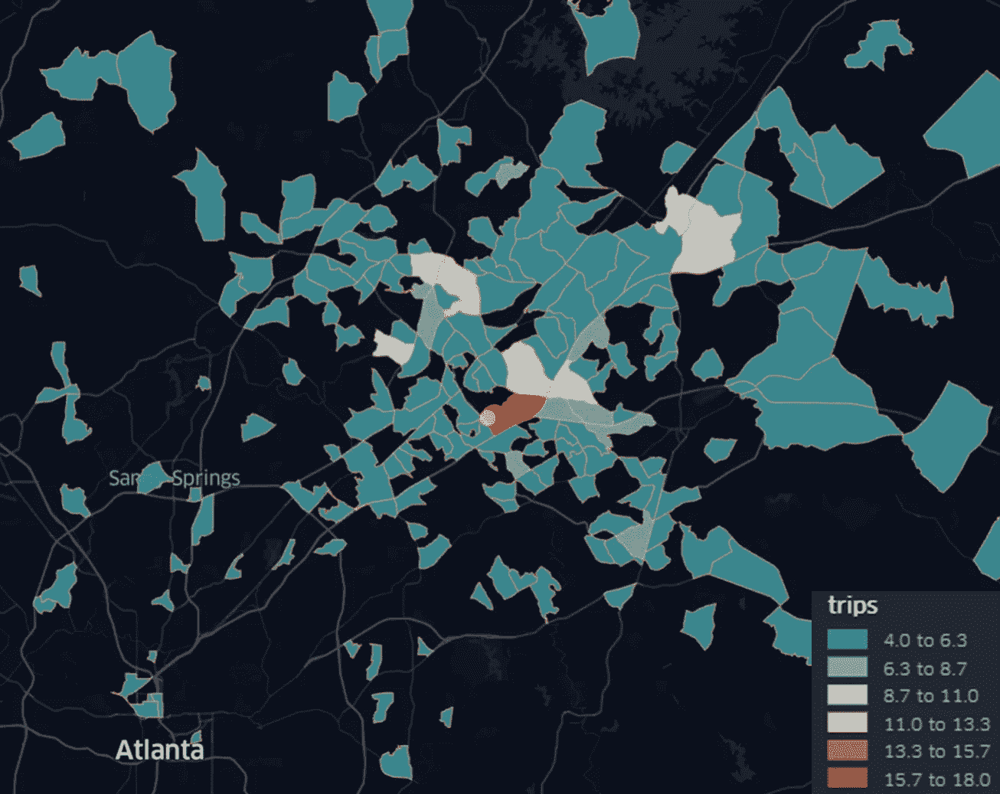
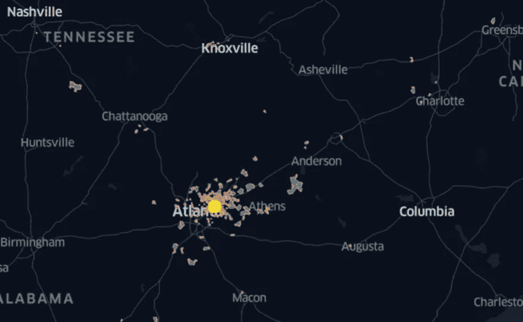

# 使用 SafeGraph 获得位置智能洞察

> 原文：<https://towardsdatascience.com/deriving-location-intelligence-insights-using-safegraph-d53803e239cb>

# 使用 SafeGraph 获得位置智能洞察

## SafeGraph 提供基于动态位置的数据。让我们利用这一点来获得研究见解。

香港夜间交通| [PxHere](https://pxhere.com/en/photo/1200898)

在他们的[网站](https://www.safegraph.com/)上，SafeGraph 提到他们有超过 1100 万条兴趣点(POI)记录，包括位置、品牌等数据。查看[文档](https://docs.safegraph.com/docs)，基本上有三种数据集:地点、几何和模式(他们最近也引入了新的花费数据集)。在本文中，我将结合 3 种主要的数据类型，介绍一个基于位置的 SafeGraph 数据用例。

# 安全图表 API

首先，我将假设我是一个流量很大的店主，我需要更多关于访客的详细信息。这就把我的选择范围缩小到了零售店、杂货店，基本上是人们经常去的地方(甚至在疫情期间)。我选择了我们家最喜欢的杂货店——[长城超市](https://www.gw-supermarket.com/project/supermarket-of-atlanta/) (GW 超市)，位于德卢斯地区，离亚特兰大不到一个小时的路程。我妻子是中国人，我们喜欢中国菜。此外，我还和食品柜台和收银台的人交了一些朋友，因为他们很乐意和一个看起来不像中国人，但会说一点普通话的人交谈。

GW 超市在当地非常有名，因为它的食品种类繁多，商店规模也很大。我听说过这样的故事，人们经常从附近的州开车去长城超市，把食物储存在大冰柜里，然后马上回家。让我们看看 SafeGraph 是否可以提供任何关于 GW 超市访客来自哪里的位置见解。

如果一切顺利，我们可以使用 SafeGraph 核心 API 来查找 GW 超市的 placekey(我们需要查询模式信息)。

成功！我们现在有了 GW 超市的钥匙！

来自 SafeGraph |塞犍陀·维韦克的 GW placekey

我们可以使用这个 placekey 通过 SafeGraph 核心和月度模式 API 查询相关信息:

最受欢迎的日子是星期六和星期天，最不受欢迎的日子是星期一和星期二。就我个人而言，我宁愿在本周晚些时候去买杂货。

2021 年 12 月白天参观 GW 超市|塞犍陀·维韦克

按小时划分的访问量显示，高峰时间是上午 11 点至下午 5 点。我通常在上午 10 点或下午 2 点去 GW，但没有真正注意到哪个时间更拥挤(尽管我注意到在某些情况下 GW 更拥挤)。下次我们买杂货时，我会记住这一点的！

2021 年 12 月 GW 超市每小时访问量|塞犍陀·维韦克

去 GW 的游客更有可能去沃尔玛、好市多和麦当劳。对于一点位置上下文；沃尔玛就在 GW 的正对面，最近的好市多也在 1.5 英里之外。好市多很少。所以这是有道理的。

2021 年 12 月 GW 游客去过的其他品牌|塞犍陀·维维克

# 安全图几何

我已经向您展示了 SafeGraph 的位置和模式功能。但是 SafeGraph 还有另一个强大的几何功能，有助于理解和可视化地理空间趋势。具体来说，我感兴趣的问题是 GW 的访问者主要来自哪里？他们是本地人吗？他们来自其他州吗？

对应于 GW 访问数据的数据帧由单行组成。一些列包含可以用来推断用户来自哪里的字典。特别是,‘visitor _ daytime _ cbgs’列包含访问者的数量及其主要的[人口普查区块组(cbg) ID](https://en.wikipedia.org/wiki/Census_block_group) 。然而，这个 cbg 号码并没有告诉我们任何关于地点的信息。那么我们如何得到 cbg 的位置和几何形状呢？

为此，我求助于 SafeGraph 提供的人口普查数据(这是[免费下载的](https://www.safegraph.com/free-data/open-census-data)！).cbg 几何数据为 geojson 格式，可通过 geopandas 读取。

CBG 几何数据来自 SafeGraph |塞犍陀·维韦克

最后，我将其保存为 geojson，并使用 kepler.gl(参见我最近关于 kepler.gl 的[文章)来可视化显示 CBG 访问的 Choropleth 地图，以及 GW(大黄点)的位置。](/visualizing-geospatial-traffic-data-in-kepler-gl-773dd14fc98a)

GW 位置(大黄点)和 2021 年 12 月主要日间 CBGs 的访问量|塞犍陀·维韦克

缩小，你可以看到有来自佐治亚州以外的 CBGs 的游客，包括田纳西州和北卡罗来纳州！看起来，人们开车几个小时去 GW 购物的故事可能有些道理！

GW 位置(大黄点)和 2021 年 12 月主要日间 CBGs 的访问量(缩小)|塞犍陀·维韦克

# 外卖食品

SafeGraph 数据提供了相当多的位置洞察力，他们的 API 超级友好。没有太多的教程介绍用例，但这可能是因为该公司相对较新。对于那些希望在不投资密集型架构的情况下提高位置洞察力的公司来说，跟踪商店访问量是非常诱人的。

数据是聚合的，好坏取决于你的需要。好的一面是 SafeGraph 已经做了一些(实际上相当周到！)初步分析，以便您可以使用它们的格式化数据来生成见解。此外，这种聚合消除了某些隐私问题。不好的一面是，你可能会错过一些对访问有用的细节性见解。

总的来说，SafeGraph 是一个提供位置洞察力的伟大工具。最近有许多研究使用 SafeGraph 数据来回答重要的研究问题，特别是与新冠肺炎疫情期间人们的运动模式相关的问题。我敢肯定，在未来几年，使用 SafeGraph 进行位置智能的研究人员和公司的数量只会越来越多！

[*关注我*](https://medium.com/@skanda.vivek) *如果你喜欢这篇文章——我经常写复杂系统、物理学、数据科学和社会的界面。*

*如果你还不是中会员，想支持我这样的作家，可以通过我的推荐链接随意报名:*[*https://skanda-vivek.medium.com/membership*](https://skanda-vivek.medium.com/membership)

*每周数据透视* [*订阅此处*](https://skandavivek.substack.com/) *！*