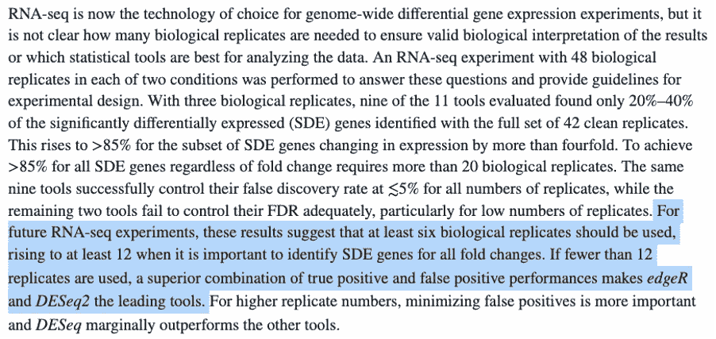
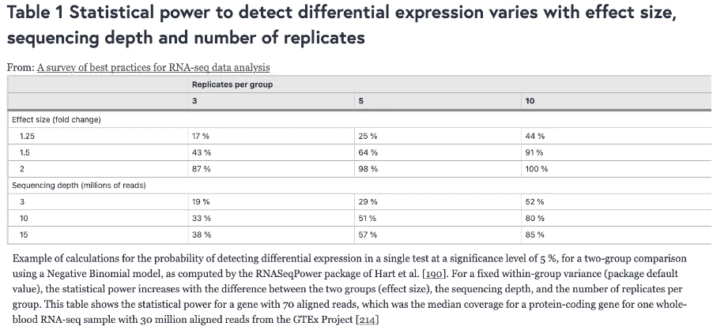
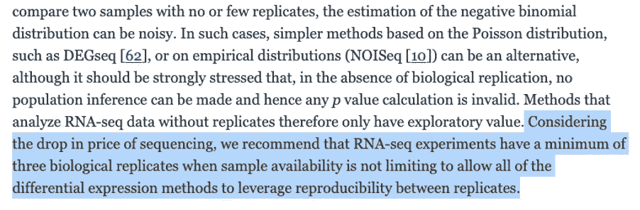
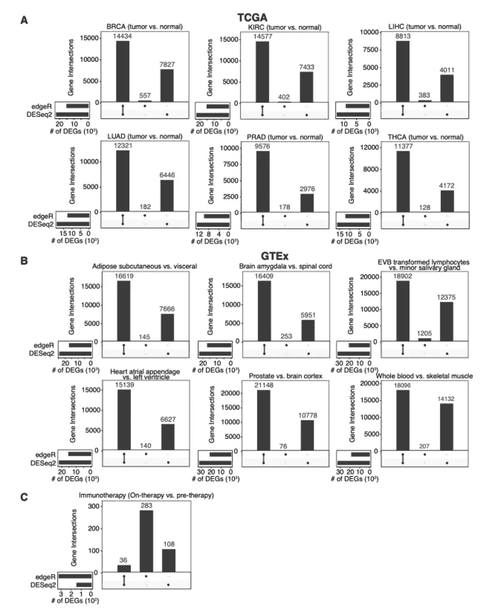
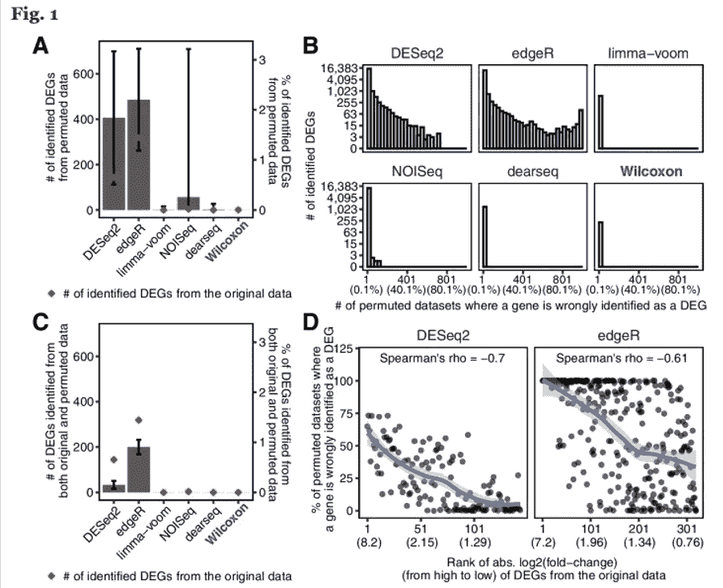
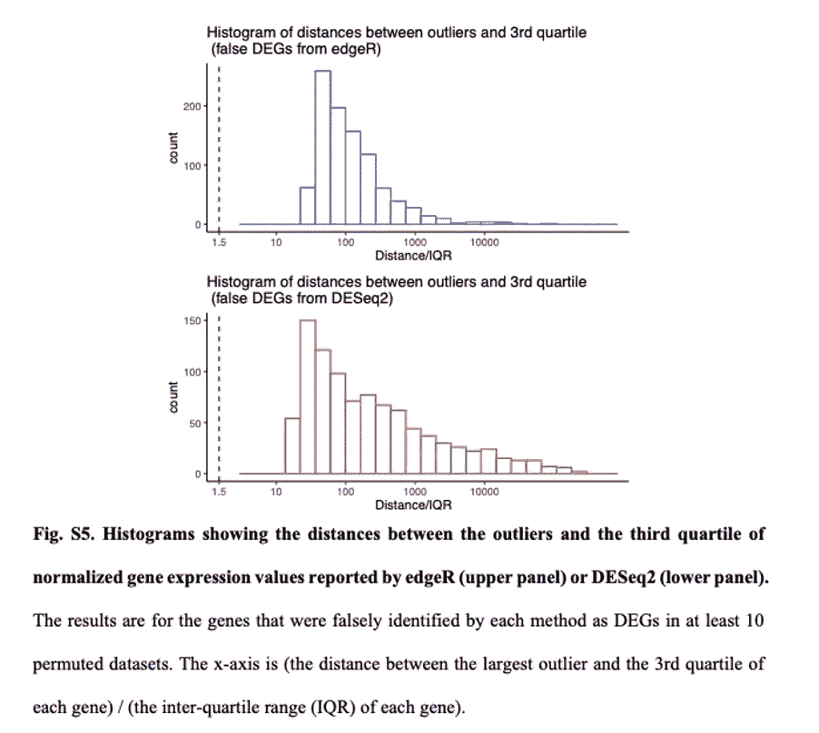
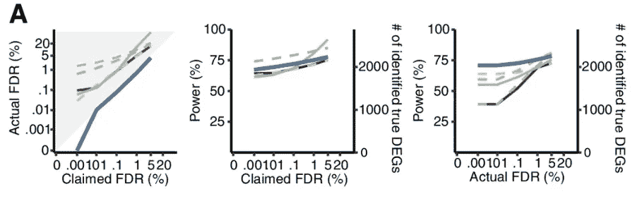
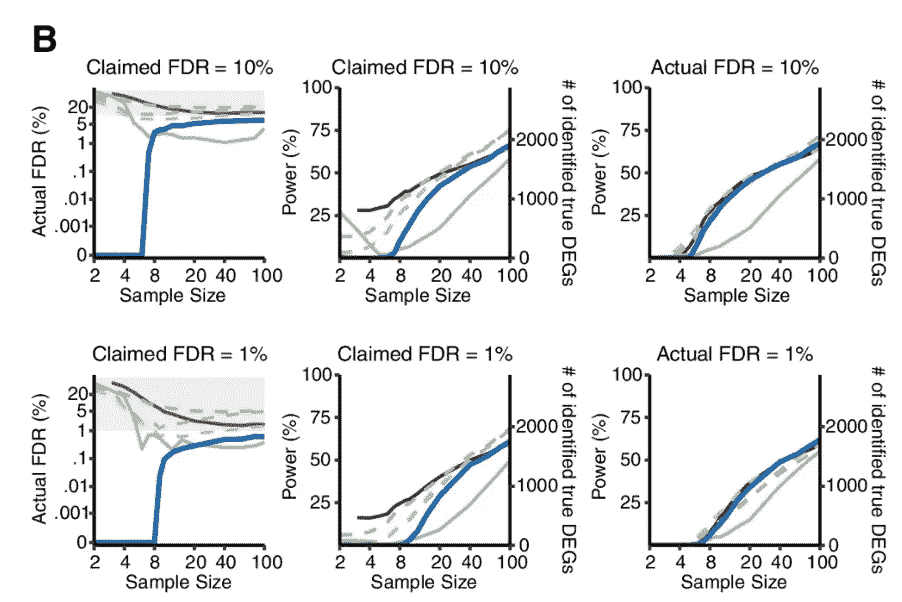
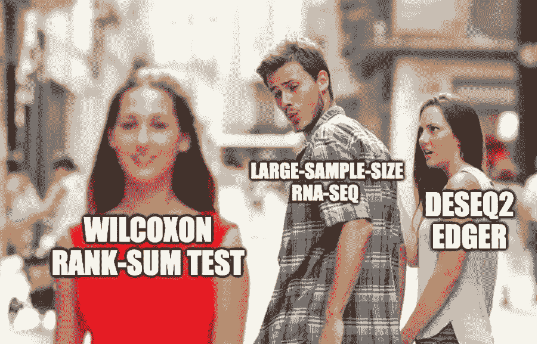

# DESeq2 和 edgeR 不应再成为大样本差异基因表达分析的默认选择

> 原文：<https://towardsdatascience.com/deseq2-and-edger-should-no-longer-be-the-default-choice-for-large-sample-differential-gene-8fdf008deae9>

## 除非必要，否则不应增加复杂性。

大样本数据可能不需要假设。

**Author:** fei.zhao (思考问题的熊)

**原帖:**[https://kaopubear . top/blog/2022-03-20-do-use-deseq 2-edger-in-human-population-samples](https://kaopubear.top/blog/2022-03-20-donot-use-deseq2-edger-in-human-population-samples)

**经作者许可，由**葛新洲和李静怡翻译

对于我们的*基因组生物学*文章的简短介绍，请参见[https://towardsdatascience . com/a-large-sample-crisis-or-not-640224020757](/a-large-sample-crisis-or-not-640224020757)

在博士期间，我喜欢在不忙的时候评估和比较各种生物信息学软件包。有时我会对转录组样本应用两三种差异分析方法。当我想要严谨时，我会取这些方法的鉴别差异表达基因(DEGs)的交集；当我想变得“精明”时，我会选择结果看起来“最好”的方法(想必你也是这样)。

在 2021 年，当我将研究领域从植物转向癌症后，当我分析大样本数据集如 TCGA 数据时，我经常直接使用 Wilcoxon 秩和检验来比较肿瘤样本和正常样本，以找到 deg。原因无非是这个经典测试的无敌计算效率。当然，在大多数情况下，我会同时使用 Wilcoxon 秩和检验和 DESeq2，这样做的好处是我可以让 DESeq2 为大样本数据运行，并离开座位休息一会儿。

在 2022 年，几天前，发表在 *Genome Biology* 上的一篇论文使用了相对严格的论点，认为简单的 Wilcoxon 秩和检验应该在大样本 RNA-seq 差异表达分析中取代 DESeq2 和 edgeR，即使计算时间不是一个问题。

下面是论文链接([https://doi.org/10.1186/s13059-022-02648-4](https://doi.org/10.1186/s13059-022-02648-4))。你可以直接看原文，也可以继续看我的文章。

> *李、、葛新洲、彭芳略、、李静怡。"在分析人类群体样本时，流行的差异表达方法夸大了假阳性."*基因组生物学 *23，第 1 期(2022 年 3 月 15 日):79。*

**RNA-seq 实验需要多少个重复？**

自从 RNA-seq 出现以来，最基本但关键的应用是通过比较两组(有时是多组):肿瘤和正常组织样品、不同治疗条件下的细胞系等来鉴定 deg。

在实践中，我们通常只测量高通量转录组数据的 3 个重复，这里的“重复”是指生物学重复而不是技术重复。有时两次复制就够了，甚至一次复制也能被一些软件处理。

为什么要重复 3 次？原因是“第三次才是魅力”，材料和预算有限。几年前，一些研究论文讨论了多少次重复就足够了；然而，他们没有达成共识:有人说至少 6 次重复，有人说 4 次重复就足够了，还有人说找到所有 deg 至少需要 12 次重复(见下面的截图)。



截图来自[https://rnajournal.cshlp.org/content/22/6/839.short](https://rnajournal.cshlp.org/content/22/6/839.short)

2016 年，[一篇关于 RNA-seq 分析的高被引综述论文](https://genomebiology.biomedcentral.com/articles/10.1186/s13059-016-0881-8)，也发表在了*基因组生物学*上，给出了下表和样本量建议。简而言之，至少需要 3 次重复。



截图自[https://genomebiology . biomed central . com/articles/10.1186/s 13059-016-0881-8](https://genomebiology.biomedcentral.com/articles/10.1186/s13059-016-0881-8)



截图自[https://genomebiology . biomed central . com/articles/10.1186/s 13059-016-0881-8](https://genomebiology.biomedcentral.com/articles/10.1186/s13059-016-0881-8)

事实上，以前对重复次数的分析大多是基于 DEseq2 和 edgeR 等流行软件进行的。现在有趣的是，DESeq2 和 edgeR 不被推荐用于大样本分析。

**DEseq2 和磨边机不适用于大样本**

从上面关于样本量的讨论中，我们可以看到转录组差异分析的最大挑战一直是小样本量:三次重复是魅力所在吗？

面对这种小样本问题，基于关于 RNA-seq 数据的各种参数分布假设，开发了统计方法和软件。最受欢迎的两种方法是 DEseq2 和 edgeR，其核心假设是每个基因的序列读取计数在一个条件下遵循**负二项分布**。基于这一假设，他们根据自己的逻辑集合对原始读取计数进行规范化。另一种方法 DEGseq 采用泊松分布，而不是负二项分布，当每个条件只有一个重复时，可以使用这种方法。

此外，DEseq2 和 edgeR 等软件固有地假设两种条件下的样本在很大程度上是相同的:大多数基因没有差异表达。这带来了第一个问题:在样本量从几十到几千的群体水平的 RNA-seq 研究中，我们还能相信大多数基因没有差异表达吗？

为了评估 DESeq2 和 edgeR 识别 DEGs 的能力，李*等人*(这篇新的*基因组生物学*论文的作者)在 13 个群体水平的 RNA-seq 数据集上测试了 DESeq2 和 edgeR，总样本量从 100 到 1376 不等。分析显示，DESeq2 和 edgeR 在这些数据集上发现了非常不同的 deg。



补充图来自[https://genomebiology . biomed central . com/articles/10.1186/s 13059-022-02648-4](https://genomebiology.biomedcentral.com/articles/10.1186/s13059-022-02648-4)

从上图中的结果可以看出，在免疫治疗数据集上，通过 DESeq2 或 edgeR 鉴定的 deg 中只有 8%是一致的(通过两种方法鉴定)。在其他群体水平的 RNA-seq 数据集上，DESeq2 比 edgeR 识别了更多的 deg。

出了事，肯定有心魔。要看到问题出在哪里，我们需要从错误发现率(FDR)控制的角度进行深入调查。大样本对于 FDR 评估有一个固有的优势:它们可以被置换以产生阴性对照样本，在此基础上可以估计 FDR。

因此，李*等人*对两组样本进行了置换，使得每一个新的组都包含来自两个原始组的样本。通过重复随机置换 1000 次，李等*从原始数据集生成 1000 个置换数据集。*

结果令人激动。

首先，DESeq2 和 edgeR 分别有 84.88%和 78.89%的概率从置换数据集比从原始数据集识别更多的 deg。

第二，在分别由 DESeq2 和 edgeR 从原始数据集中识别的 144 和 319 DEGs 中，有 22 个(15.3%)和 194 个(60.8%)是从至少 50%的置换数据集中识别的，因此是虚假的。也就是说，DESeq2 和 edgeR 有太多的误报。

最重要的是，李*等人*发现，具有较大倍数变化的基因更有可能被 DESeq2 和 edgeR 从置换数据集中识别出来。在实践中，我们都倾向于认为具有较大倍数变化的基因更可能重要，但事实是这些基因不一定有差异表达。

还有一件事。如果你很好奇那些假阳性 DEGs 中富集了哪些生物功能？嗯…免疫相关。



图 1 来自[https://genomebiology . biomed central . com/articles/10.1186/s 13059-022-02648-4](https://genomebiology.biomedcentral.com/articles/10.1186/s13059-022-02648-4)

**为什么 DEseq2 和 edgeR 不起作用？**

为什么 DESeq2 和 edgeR 从这个免疫治疗数据集中发现了这么多假阳性 DEGs？最直接的猜测是，该数据集中的基因计数不再符合 DESeq2 和 edgeR 假设的负二项分布。

为了验证这个假设，李等人选择了两组基因。一组包含从≥20%置换数据集鉴定为 deg 的基因；另一组由从≤0.1%置换数据集鉴定为 deg 的基因组成。在评估负二项式模型对每组基因的拟合优度时，李*等人*揭示了第一组基因的模型拟合度确实较差，这与这些基因为假阳性的事实相一致。

进一步说，为什么负二项式模型拟合度很差？作者在至少 10%的置换数据集中检查了所有被误认为 DEGs 的基因。相对于 DESeq2 或 edgeR 拟合的负二项式模型，所有这些基因都有异常值测量。



补充图来自[https://genomebiology . biomed central . com/articles/10.1186/s 13059-022-02648-4](https://genomebiology.biomedcentral.com/articles/10.1186/s13059-022-02648-4)

在 edgeR 和 DESeq2 等参数测试方法中，无效假设是基因在两种情况下具有相同的平均表达。因此，异常值的存在会严重影响他们的分析结果。相比之下，Wilcoxon 秩和检验在存在异常值时表现更好，因为其零假设是一个基因在一种条件下比在另一种条件下具有更高或更低的表达的概率相等。也就是说，Wilcoxon 秩和检验更关注基因表达等级，而不是实际的基因表达水平。

除了 DESeq2 和 edgeR，在免疫治疗数据集上，李*等*还比较了其他几种有代表性的方法，其中 limma-voom 是和 DESeq2、edgeR 一样的参数检验；NOISeq 和 dearseq(最近发表的一种为大样本设计的方法)是像 Wilcoxon 秩和检验一样的非参数检验。

在哪些方法发现更少的假阳性 DEGs 方面，DESeq2 和 edgeR 显然输掉了竞争，而其他方法在这个免疫治疗数据集上表现良好。如果我们比较一下这些方法找到真正 deg 的能力会怎么样呢？

李*等人*从 12 个 GTEx 和数据集分别生成了 50 个半合成数据集(具有已知的真 deg 和非 deg)。如下图所示，只有 Wilcoxon 秩和检验可以在 0.001%至 5%的 FDR 阈值范围内持续控制 FDR。此外，就实际 FDR 的功效而言，Wilcoxon 秩和检验优于其他五种方法。下图中，蓝线显示的是 Wilcoxon 秩和检验，黄色和紫色虚线对应的是 DEseq2 和 edgeR。



图 2A 来自[https://genomebiology . biomed central . com/articles/10.1186/s 13059-022-02648-4](https://genomebiology.biomedcentral.com/articles/10.1186/s13059-022-02648-4)

**什么时候使用 Wilcoxon 秩和检验？**

由于 Wilcoxon 秩和检验适用于大样本的 DEG 分析，所以关键问题是什么样的样本量可以被认为是大样本？

为了研究样本大小如何影响六种 DEG 识别方法的性能，Li *等人*对每个数据集进行下采样，以获得每个条件下样本大小从 2 到 100 的数据集。

从下图可以看出，在 1% FDR 阈值下，当每个条件的样本量小于 8 时，我们不应使用 Wilcoxon 秩和检验。同时，当每个条件的样本量超过 8 时，与三种参数检验方法(DESeq2、edgeR 和 limma-voom)和其他两种非参数检验方法相比，Wilcoxon 秩和检验取得了相当或更好的功效。

考虑到 DEG 在所有基因中的比例可能会对结果产生影响，李*等*也生成了 5 个 DEG 比例(1%、3%、5%、9%、20%)的数据集，评估结果显示 Wilcoxon 秩和检验仍然具有良好的 FDR 控制和功效。

因此，从李*等人*的分析结果来看，**当每个条件的样本量大于 8 时，可以毫不犹豫地使用 Wilcoxon 秩和检验。**



图 2B 来自[https://genomebiology . biomed central . com/articles/10.1186/s 13059-022-02648-4](https://genomebiology.biomedcentral.com/articles/10.1186/s13059-022-02648-4)

**如何使用 Wilcoxon 秩和检验？**

众所周知，三种参数测试方法——deseq 2、edgeR 和 limma——长期以来一直主导着转录组研究。基本上所有的大规模研究都用它们来寻找 deg。然而，这三种方法最初都是为解决小样本问题而设计的。

在样本量更大(至少几十个)的总体水平研究中，参数假设通常不再必要。同时，样本量越大，越有可能出现异常值，这将违反参数假设并使 p 值计算无效，从而使 FDR 控制成为问题。

最后一个问题是如何合理使用 Wilcoxon 秩和检验进行差异表达分析。

与 DESeq2、edgeR 和 limma 不同，Wilcoxon 秩和检验不是一种基于回归的方法，因此不能调整可能的混杂因素(如测序深度的差异)。因此，在使用 Wilcoxon 秩和检验之前，建议研究人员对 RNA-seq 样本进行标准化，以消除可能的批次效应。

关于数据规模，我个人不认为我们使用 DESeq2 的相对对数表达式、edgeR 的 M 值的修剪平均值或 TPM 是一个大问题。(如果你有悟性，一定会愿意全部尝试。)

最后，李*等人*提供了一个 [R 代码实例](https://rpubs.com/LiYumei/806213)，使用 edgeR TMM + wilcox.test()进行 DEG 分析。

```
# read datareadCount <- read.table(file = "examples/examples.countMatrix.tsv", header = T, row.names = 1, stringsAsFactors = F, check.names = F)conditions <- read.table(file = "examples/examples.conditions.tsv", header = F)conditions <- factor(t(conditions))# edgeR TMM normalizey <- DGEList(counts = readCount, group = conditions)## Remove rows conssitently have zero or very low countskeep <- filterByExpr(y)y <- y[keep, keep.lib.sizes = FALSE]## Perform TMM normalization and convert to CPM (Counts Per Million)y <- calcNormFactors(y, method = "TMM")count_norm <- cpm(y)count_norm <- as.data.frame(count_norm)# Run the Wilcoxon rank-sum test for each genepvalues <- sapply(1:nrow(count_norm), function(i){data <- cbind.data.frame(gene = as.numeric(t(count_norm[i,])), conditions)p <- wilcox.test(gene~conditions, data)$p.valuereturn(p)})fdr <- p.adjust(pvalues, method = "fdr")# Calculate the fold-change for each geneconditionsLevel <- levels(conditions)dataCon1 <- count_norm[,c(which(conditions==conditionsLevel[1]))]dataCon2 <- count_norm[,c(which(conditions==conditionsLevel[2]))]foldChanges <- log2(rowMeans(dataCon2)/rowMeans(dataCon1))# Output results based on the FDR threshold 0.05outRst <- data.frame(log2foldChange = foldChanges, pValues = pvalues, FDR = fdr)rownames(outRst) <- rownames(count_norm)outRst <- na.omit(outRst)fdrThres <- 0.05write.table(outRst[outRst$FDR<fdrThres,], file = "examples/examples.WilcoxonTest.rst.tsv", sep="\t", quote = F, row.names = T, col.names = T)
```

**遗言**

毕竟我觉得没必要对我们之前做过的分析有太多的自我怀疑。但是在将来，当对每组 8 个以上的样本进行差异分析时，我们不要忘记也尝试一下 Wilcoxon 秩和检验。如果有人问你为什么不用专门为微分分析设计的 DESseq2 和 edgeR，只要出示这张纸，当然还有这张图。



图片来自[https://kaopubear . top/blog/2022-03-20-do-use-deseq 2-edger-in-human-population-samples](https://kaopubear.top/blog/2022-03-20-donot-use-deseq2-edger-in-human-population-samples)；由[https://knowyourmeme.com/memes/distracted-boyfriend](https://knowyourmeme.com/memes/distracted-boyfriend)的迷因赵飞修改