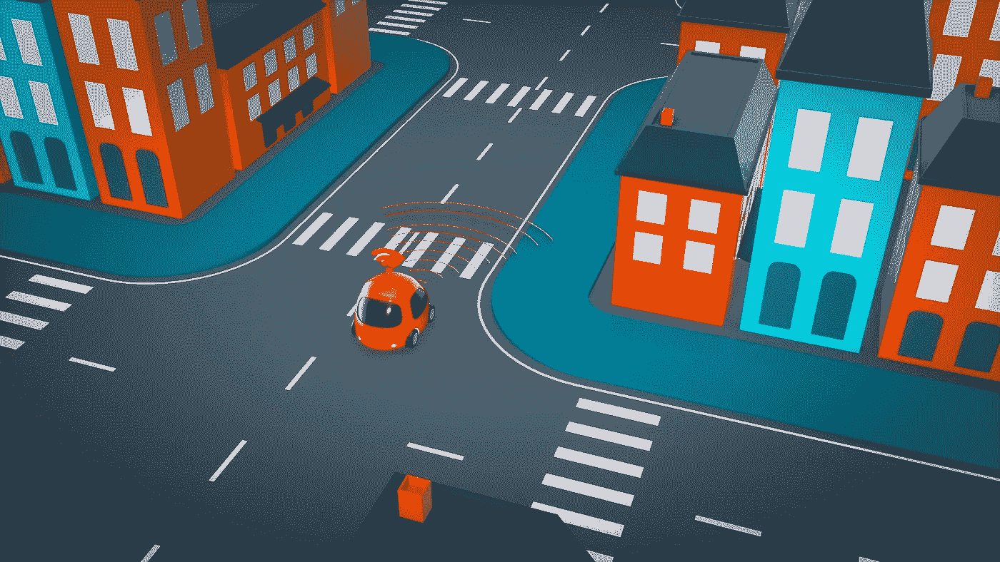

# 自动驾驶汽车机器学习平台的挑战

> 原文：<https://towardsdatascience.com/design-challenges-of-machine-learning-platform-for-autonomous-vehicles-58917c59f575>

## 意见

图片来自 [Pixabay](https://pixabay.com/illustrations/car-automobile-3d-self-driving-4343634/)

自动驾驶汽车(AV)是移动的未来。由于最近的技术突破，它们不再只存在于科幻电影或技术演示中。今天，我们可以看到自动驾驶汽车在大都市的街道上行驶，提供 robotaxi 服务。

由于过去十年深度学习的巨大成功，作为 AVs 大脑的软件在很大程度上从基于规则的算法转向了数据驱动的机器学习(ML)算法。如今，ML 已经渗透到自主车辆设计的几乎每个阶段，从感知、行为预测、运动规划到控制、地图绘制和路径选择等。

# ML 平台的作用

AVs 极高的安全要求为系统中每个阶段的 ML 算法提出了很高的标准。ML 模型中 1%精度的提高可能表明驾驶安全性的显著提高和/或减少不必要的车辆搁浅的机会。由于这些原因，影音公司的 ML 从业者正在尽最大努力推动最先进(SOTA)模型的边界。同时，这些模型还需要适合车辆的板载，并满足延迟、存储器和功率限制。

考虑到 ML 模型开发如此复杂和具有挑战性的目标，ML 平台的作用是提供来自底层 ML 基础设施的简化接口，使得具有建模专业知识的 ML 从业者可以更加专注于 ML 算法设计和增强。

# **设计挑战**

除了更好的可用性和资源效率是广告定位和推荐系统等其他行业所期望的目标之外，无人驾驶汽车行业的 ML 平台设计还面临一些独特的挑战:

## **海洋大小数据挖掘**

由于数据源的性质，例如远程和短程激光雷达、全景摄像机、雷达探测、环境声音、高清晰度道路地图等。，训练数据的规模是巨大的。一方面，原始数据对提高模型质量非常有价值，但获取成本很高；另一方面，某些事件极其罕见，使得数据集高度不平衡。挑战不仅在于如何高效地存储和传输数据，还在于如何从这个巨大的数据空间中智能地识别出有趣的事件。

## 异构模型

AVs 的 ML 系统是真正的多模态和多任务的。训练数据的形式包括 3D 点云、2D 视频、雷达扫描、高清道路图和表格数据，如路况、限速、交通信息、天气等。每个模型可以被训练用于各种任务，包括行人检测、车辆检测、虚假物体(例如路边的树枝)检测等。当我们看到网络架构向基于变压器的主干网发展的趋势时，我们期待在几个有代表性的模型中有更多的模型任务整合。同时，即使对于诸如行为预测的相同任务，预测行人和车辆的行为可能需要不同的建模算法。

尽管非常希望为自动驾驶汽车建立和训练一个端到端的模型(从传感器数据到最终的车辆控制信号)，但由于车载推理延迟的限制和每个阶段的模型可解释性要求，这在不久的将来可能是不可行的。

## 培训效率

鉴于训练数据的庞大规模和建模算法的频繁发展，ML 平台必须提供一种解决方案，使 ML 从业者能够快速迭代模型开发周期，同时有效利用计算资源。因为自动驾驶汽车的大多数模型需要在专用加速器集群上训练，如 GPU、TPU 等。一个好的 ML 平台需要设计一个高效的分布式培训基础设施，但不需要 ML 从业者进行太多的手动配置，以使其易于使用。

另一方面，由于各种数据处理和增强需求，训练数据管道也可能成为计算瓶颈。ML 平台需要提供有效的输入数据处理管道，以确保加速器不会缺乏训练数据。

## 机载推理优化

一方面，模型的准确性可以改变自动驾驶汽车的安全性和商业成功；另一方面，一旦训练了高质量的模型，如何将它部署到汽车上(也称为车载)，以便它可以在所需的延迟限制(通常小于 100 毫秒)内帮助做出驾驶决策。

由于物理和成本的限制，自动驾驶汽车无法在车上携带无限的计算资源。在汽车上运行的模型之间也存在顺序依赖性(例如，一些感知模型需要在行为模型之前运行)。它变成了数据流图上的约束时间约束优化问题。延迟优化需要首先在时序关键路径上执行。各种模型推理优化技术，如网络剪枝和模型量化等。可以被利用，然而，不像在一些边缘 ML 的情况下，模型精度不能妥协。

同样，一个好的 ML 平台应该为 ML 从业者提供这样的优化解决方案，使他们相信他们训练的模型可以成功地部署在汽车上，而不会损失准确性。

## 特别培训要求

由于在严格的延迟限制内训练高质量模型并将其部署到汽车上的难度，一个好的 ML 平台应该为 ML 从业者提供各种解决方案。例如，一种神经架构搜索(NAS)解决方案，用于找到产生高精度但满足推理延迟约束的良好模型架构。或者是一种蒸馏解决方案，它在船外训练一个大而精确的模型，并蒸馏出一个较小但同样精确的模型，以部署在船上。

# 未来

移动的未来正在到来。在旧金山和凤凰城等大城市，我们已经看到完全自动驾驶的出租车在街上行驶，为数千名乘客——公众成员——提供服务。我们预计在不久的将来，这种车队将会迅速扩大规模，在卡车运输和本地配送等其他领域也将会出现 AVs。

这个行业的可行性和可扩展性需要深度学习模型算法的持续进步，以及支持有效数据挖掘、更快模型迭代和优化部署的良好 ML 平台。当自动驾驶汽车行业扩展到更多的汽车和地理位置时，ML 平台也应该支持持续学习和更好地与模拟集成。

***声明:*** *以上为作者个人观点。这里陈述的任何假设和观点都是他们的，不代表他们现在或以前的雇主。*