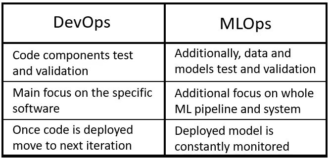
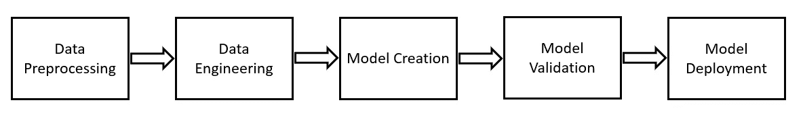
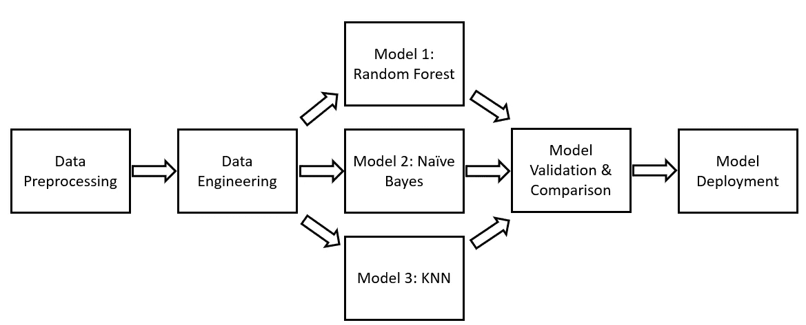
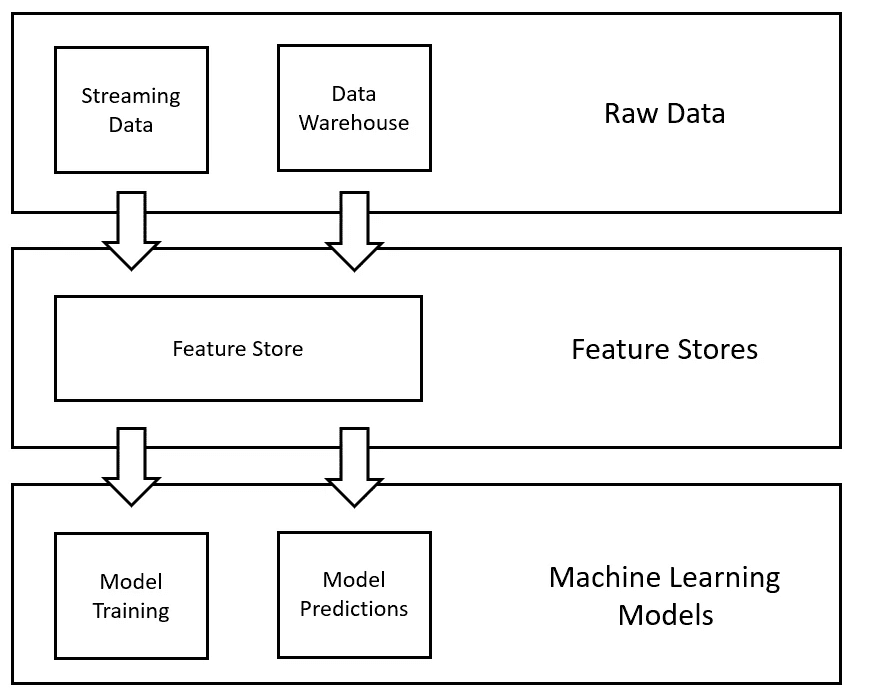
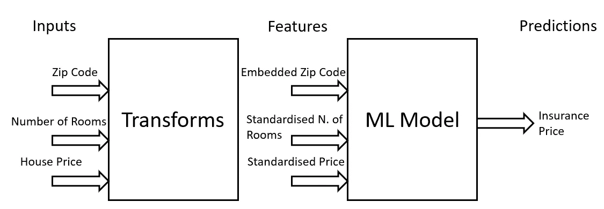
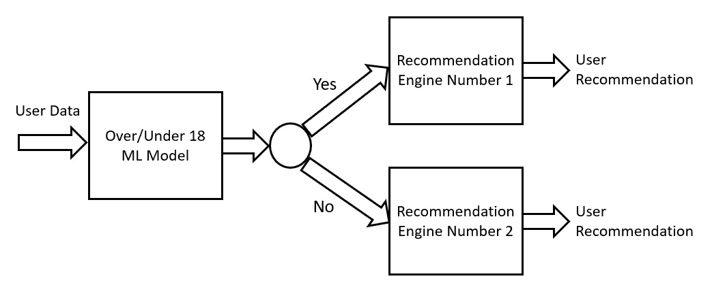

# 机器学习中的设计模式

> 原文：<https://towardsdatascience.com/design-patterns-in-machine-learning-for-mlops-a3f63f745ce4>

## 概述创建成功的机器学习解决方案时遇到的一些最常见的设计模式

朱莉安娜·马尔他在 [Unsplash](https://unsplash.com?utm_source=medium&utm_medium=referral) 上拍摄的照片

# 介绍

设计模式是针对常见问题的一组最佳实践和可重用解决方案。数据科学和软件开发、架构等其他学科。由大量重复出现的问题构成，因此尝试对最常见的问题进行分类，并提供不同形式的蓝图来轻松识别和解决它们，可以为更广泛的社区带来巨大的好处。

在软件开发中使用设计模式的想法首先是由 Erich Gamma 等人提出的。艾尔。在“*设计模式:可重用面向对象软件的元素”*【1】*中，以及最近应用于机器学习过程中，感谢Sara Robinson 等人。艾尔。在“*机器学习设计模式”*【2】。*

*作为本文的一部分，我们现在将发现构成 **MLOps** 的不同设计模式。MLOps(机器学习- >操作)是一套旨在将实验性机器学习模型转化为生产性服务的流程，可随时在现实世界中做出决策。其核心是，MLOps 基于与 DevOps 相同的原则，但更侧重于数据验证和持续培训/评估(图 1)。*

**

*图 1: DevOps 和 MLOps(图片由作者提供)。*

*MLOps 的一些主要优势包括:*

*   *缩短上市时间(更快的部署)。*
*   *增强的模型稳健性(更容易识别数据漂移、重新训练模型等。).*
*   *更灵活地训练/比较不同的 ML 模型。*

*另一方面， **DevOps** 强调了软件开发的两个关键概念:持续集成(CI)和持续交付(CD)。持续集成侧重于使用中央存储库作为团队在项目上协作的手段，并在不同团队成员添加新代码时尽可能自动化添加、测试和验证新代码的过程。通过这种方式，可以随时测试应用程序的不同部分是否可以正确地相互通信，并尽快识别任何形式的错误。连续交付的重点是平稳地更新软件部署，尽量避免任何形式的停机。*

# *MLOps 设计模式*

## *工作流管道*

*机器学习(ML)项目由许多不同的步骤构成(图 2)。*

**

*图 2: ML 项目关键步骤(图片由作者提供)。*

*当建立一个新模型的原型时，为了对整个过程进行编码，通常会从使用一个单独的脚本( **monolithic** )开始，但是随着项目复杂性的增加，越来越多的团队成员可能会参与进来，那么就有必要将项目的每个不同的步骤分成一个单独的脚本(**微服务**)。采用这种方法的一些好处是:*

*   *更容易试验不同步骤编排的变化。*
*   *通过定义使项目可伸缩(新的步骤可以很容易地添加和删除)。*
*   *每个团队成员可以专注于流程中的不同步骤。*
*   *可以为每个不同的步骤创建分离的赝像。*

*工作流管道设计模式旨在定义一个蓝图来创建 ML 管道。ML 管道可以用一个**有向无环图(DAG)** 来表示，其中的每一步都用一个容器来表征(图 3)。*

**

*图 3:有向无环图示例(图片由作者提供)。*

*按照这种结构，就有可能创造可重复和可管理的 ML 过程。使用工作流管道的一些好处是:*

*   *通过添加和删除流程中的步骤，可以创建复杂的实验来测试不同的预处理技术、机器学习模型和超参数。*
*   *单独保存每个不同步骤的输出，如果仅在最后的步骤中应用了任何改变，则可以避免在流水线的开始重新运行步骤(因此节省了时间和计算能力)。*
*   *在出现错误的情况下，可以很容易地确定哪个步骤可能需要更新。*
*   *一旦使用 CI/CD 部署到生产中，就可以根据不同的因素安排管道重新运行，这些因素包括:时间间隔、外部触发器、ML 指标的变化等。*

## *功能存储*

*特征存储是为机器学习过程设计的数据管理层(图 4)。这种设计模式的主要用途是简化组织管理和使用机器学习功能的方式。这是通过创建某种形式的中央存储库来完成的，该存储库由公司用来存储为 ML 过程创建的所有特征。通过这种方式，如果数据科学家可能需要不同 ML 项目的相同特征子集，他们就不必多次经历将原始数据转换为处理过的特征的过程(这可能很耗时)。两种最常见的开源特性商店解决方案是 [Feast](https://feast.dev/) 和 [Hopsworks](https://www.hopsworks.ai/) 。*

**

*图 4:特性存储设计模式(图片由作者提供)。*

*关于特性商店的更多信息可以在我之前的文章中找到。*

## *改变*

*Transform 设计模式旨在通过将输入、功能和转换保持为独立的实体，使在生产中部署和维护机器学习模型变得更加容易(图 5)。事实上，原始数据通常需要经过不同的预处理步骤，以便随后用作机器学习模型的输入，并且这些转换中的一些需要被保存，以便在预处理数据以进行推断时被重新使用。*

**

*图 5:输入和特性的关系(图片由作者提供)。*

*例如，在训练 ML 模型之前，通常将归一化/标准化技术应用于数值数据，以便处理异常值并使数据看起来更像高斯分布。然后应该保存这些转换，以便将来有新数据可供推断时可以重用。如果不保存这些转换，那么我们将在训练和服务之间创建一个数据偏差，其中为推理提供的输入数据与用于训练 ML 模型的输入数据相比具有不同的分布。*

*为了避免培训和服务之间的任何类型的偏差，另一个解决方案是利用特性存储设计模式。*

## *多模态输入*

*不同类型的数据，如图像、文本、数字等。可以用于训练 ML 模型，尽管某些类型的模型只能接受特定类型的输入数据。例如，Resnet-50 能够仅将图像作为输入数据，而其他 ML 模型如 KNN (K 最近邻)能够仅将数字数据作为输入。*

*为了解决一个 ML 问题，可能需要使用不同形式的输入数据。在这种情况下，需要应用某种形式的转换来创建所有不同类型的输入数据的公共表示(多模态输入设计模式)。作为一个例子，让我们想象我们被提供了文本、数字和分类数据的组合。为了训练一个 ML 模型，我们可以利用诸如情感分析、单词包或单词嵌入等技术将文本数据转换成数字格式，并使用 one-hot-encoding 来转换分类数据。通过这种方式，我们将拥有相同格式(数字)的所有数据，准备用于训练。*

## *串联*

*在某些情况下，仅仅使用单一的 ML 模型是不可能解决 ML 问题的。在这种情况下，有必要创建一系列相互依赖的 ML 模型，以实现最终目标。作为一个例子，让我们假设我们正试图预测向用户推荐什么样的商品(图 6)。为了解决这个问题，我们希望首先创建一个能够预测用户年龄是大于还是小于 18 岁的模型，然后根据该模型的响应将我们的流路由到两个不同的 ML 推荐引擎之一(一个用于为 18 岁以上的用户推荐产品，另一个用于为 18 岁以下的用户推荐产品)。*

**

*图 6:级联设计模式(图片由作者提供)。*

*为了创建 ML 模型的这个*级联*，我们需要确保一起训练它们。事实上，由于它们相互依赖，如果第一个模型发生了变化(没有更新其他模型),那么这可能会导致后续模型的不稳定性。然后，可以使用工作流管道设计模式来自动化这种类型的流程。*

# *结论*

*在本文中，我们探讨了支撑 MLOps 的一些最常见的设计模式。如果你有兴趣了解更多关于机器学习中的设计模式，更多信息可以在 AIDevFest20 上 Valliappa Lakshmanan 的 [this talk](https://www.youtube.com/watch?v=_Ni6JWdeCew) 和“机器学习设计模式”图书 public [GitHub repository](https://github.com/GoogleCloudPlatform/ml-design-patterns) 中找到。*

# *联系人*

*如果你想了解我最新的文章和项目[，请通过媒体](https://pierpaoloippolito28.medium.com/subscribe)关注我，并订阅我的[邮件列表](http://eepurl.com/gwO-Dr?source=post_page---------------------------)。以下是我的一些联系人详细信息:*

*   *[领英](https://uk.linkedin.com/in/pier-paolo-ippolito-202917146?source=post_page---------------------------)*
*   *[个人网站](https://pierpaolo28.github.io/?source=post_page---------------------------)*
*   *[中等轮廓](https://towardsdatascience.com/@pierpaoloippolito28?source=post_page---------------------------)*
*   *[GitHub](https://github.com/pierpaolo28?source=post_page---------------------------)*
*   *[卡格尔](https://www.kaggle.com/pierpaolo28?source=post_page---------------------------)*

# *文献学*

*[1]“设计模式:可重用面向对象软件的要素”(Addison-Wesley，1995)。访问地点:[www.uml.org.cn/c%2B%2B/pdf/DesignPatterns.pdf](http://www.uml.org.cn/c%2B%2B/pdf/DesignPatterns.pdf)*

*[2]“机器学习设计模式”(Sara Robinson et .艾尔。，2020)访问:[https://www . oreilly . com/library/view/machine-learning-design/9781098115777/](https://www.oreilly.com/library/view/machine-learning-design/9781098115777/)*