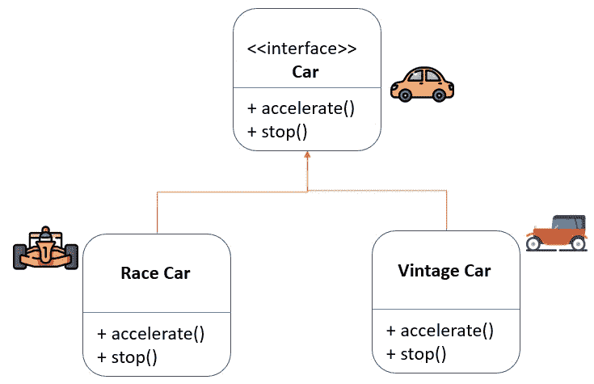
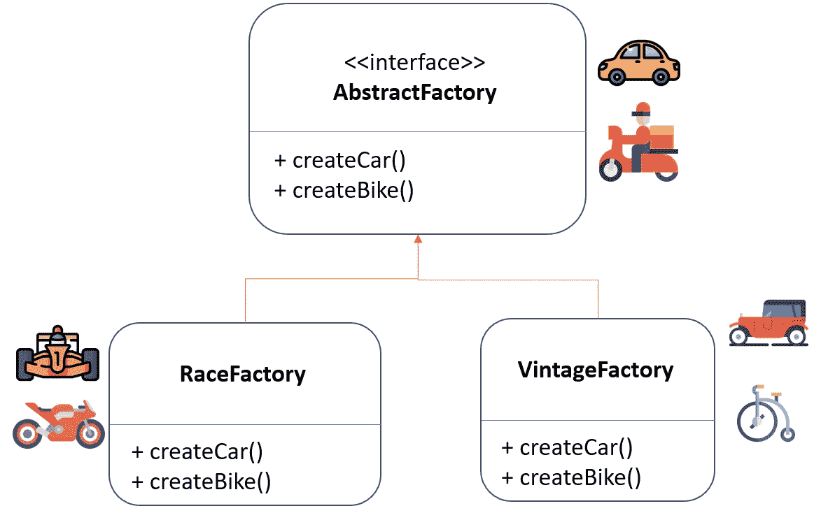
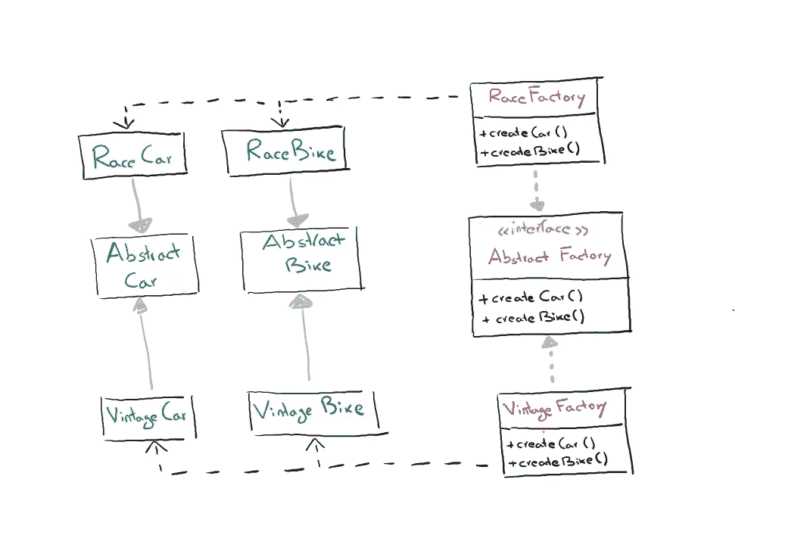

# 面向机器学习工程师的 Python 设计模式:抽象工厂

> 原文：<https://towardsdatascience.com/design-patterns-with-python-for-machine-learning-engineers-abstract-factory-f761f89a3c12>

奥马尔·弗洛雷斯在 [Unsplash](https://unsplash.com?utm_source=medium&utm_medium=referral) 上拍摄的照片

## 了解如何通过采用设计模式来构建代码

## **简介**

一个模式描述了一个经常重复出现的问题，并根据类/对象组织提出了一个可能的解决方案
，这个解决方案
通常被认为可以有效地解决问题本身。
设计模式有四个主要特征:

*   **名称:**帮助我们用一两个词来识别问题和解决方案的助记参考。
*   **问题:**问题的描述和模式提供解决方案的环境。
*   **解决方案:**描述了构成
    解决方案的基本元素以及它们之间的关系。
*   **后果:**规定应用建议的解决方案可能带来的后果。

设计模式有几个类别，但有两个主要标准:

**图案所指:**

*   **对象**:在
    执行时可以改变的对象之间的关系。
*   **类**:关注类和子类之间的关系。

**模式的作用(目的):**

*   **创建**:关于创建对象的过程。
*   **结构**:关注类和对象的组成。
*   **行为**:定义类和对象如何交互，以及
    在它们之间分配职责。

但是存在多少设计模式呢？在下图中，您将看到一个设计模式列表，该列表根据它们的范围和目的组织在一个表格中。在下面的文章中，我们将介绍最常见的设计模式。

设计模式(作者图片)

## 如何定义一个设计模式？

设计模式是由一些描述和促进其使用的基本属性定义的。这些属性是:

*   **结构**:通过 UML 图形化表示所涉及的类以及它们之间的关系
    。(1) **参与者**:参与模式的班级，他们的关系和责任。(2) **协作**:各个阶层如何协作实现目标。
*   **后果**:使用该模式的优缺点以及使用该模式可能产生的副作用。
*   **实现**:实现
    的技术和建议，也参考具体的编程语言。
*   **示例源代码**:为实现提供
    指南的代码片段。
*   **已知用途**:在现有系统中使用的例子。
*   **相关模式**:与其他模式的区别和最重要的关系。

# 抽象工厂

在我看来，理解如何定义设计模式的最简单的方法是展示一个例子，让我们从抽象工厂开始。

我们经常发现自己不得不创造一些相似但彼此不同的新对象。假设我们必须创建几辆汽车，它们都将共享几个属性，例如有四个轮子和一个方向盘，它们还将共享几个功能，例如*加速*和*停止(刹车)*。
但是如果我们想要创造出有自己特色的汽车，比如*“老爷车”*和*“赛车”*，这些汽车将会有特定于子类的属性和功能。

这正是设计模式帮助我们的地方，帮助我们轻松、动态地管理这些共享属性和功能但又互不相同的对象的创建。抽象工厂推荐的第一件事是为每个产品显式声明接口(不能被实例化的类)，例如一辆*汽车*和一辆*自行车*产品。然后你可以让所有的产品变体实现这些接口，这样我们就可以确信它们将共享所有对象共有的属性和功能，比如 *accelerate()* 和 *stop()* 。

作者图片

现在我们定义一个抽象工厂的接口，也就是说，一个类的接口，其功能允许我们创建一个类型为 *Car* 或 *Bike* 的新对象。将实际创建类型为 *race* 或 *vintage* 的汽车的工厂必须实现该接口的方法。

作者图片

这样，每个特定的子产品都有一个工厂，并且在创建每个单独的对象时，不必添加属性和函数。

此外，使用 RaceFactory 等工厂规格的客户将获得一辆赛车。几个月后，当他去买一辆新自行车时，它也将是一辆赛车，因为它来自同一家工厂，所以他不必担心有不同风格的产品。

抽象工厂 UML(作者图片)

## 让我们编码

如果到目前为止你仍然不清楚这种设计模式是为了什么以及它是如何工作的，欢迎加入我们的俱乐部！如果你和我一样，编程会让你头脑清醒。

首先，我们创建一个 AbstractFactory，在 Python 中，抽象类是继承 ABC 的类，如下例所示。这个抽象类有两个方法，一个创建汽车，一个创建自行车。所以任何继承这个抽象类的类都必须以自己的方式实现这两个方法。

在 RaceFactory 和 VintageFactory，我们都有制造汽车和自行车的方法。您会看到两者都返回类型为 Car 和 Bike 的对象(用符号表示: ***- > Car*** )。
但实际上，Car 和 Bike 是抽象类，实际的类是 RaceCar 和 VintageCar (RaceBik 和 VintageBike)。通过这种方式，每个工厂将生产与之相关的汽车(或自行车)。
在这种情况下，RaceCar (RaceBike)和 VintageCar (VintagBike)唯一不同的是，它打印的是*“快”*而不是*“慢”*。

现在，客户将选择其中一家工厂(将其作为输入)，然后他将创建一辆汽车和一辆自行车，他将确保汽车和自行车具有相同的风格，它们要么是赛车型，要么是复古型。

在创建它们之后，他将使用 Car 和 Bike 类提供的方法对它们进行测试。

# 最后的想法

设计模式描述了一个经常重复出现的问题，并根据类/对象组织提出了一种可能的解决方案，这种解决方案通常被认为可以有效地解决问题本身。我们经常面临这样的问题:想要实例化一个对象而不精确地指定类，但是尊重多个对象之间的一致性，为此，学习如何使用抽象工厂是非常有用的。
在未来的文章中，我将阐述机器学习工程师需要了解的其他设计模式，以便能够编写干净的结构化代码。

# 结束了

*马赛洛·波利蒂*

[Linkedin](https://www.linkedin.com/in/marcello-politi/) ， [Twitter](https://twitter.com/_March08_) ， [CV](https://march-08.github.io/digital-cv/)