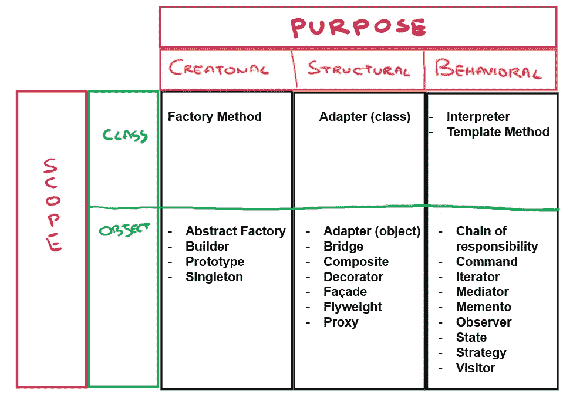
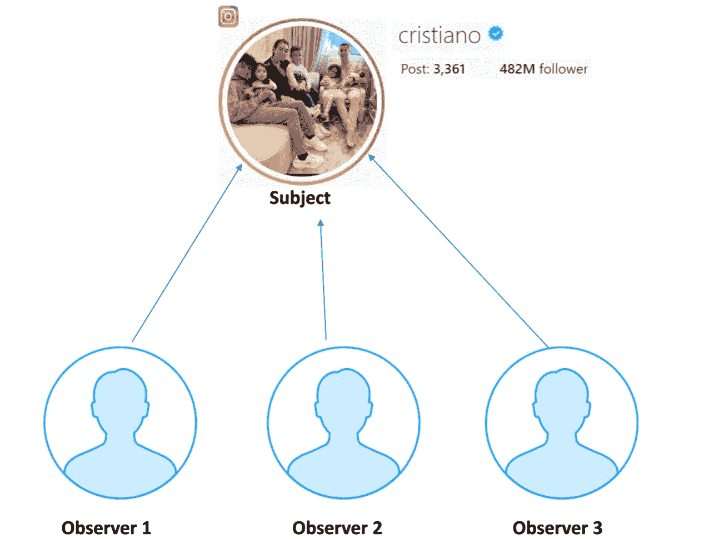
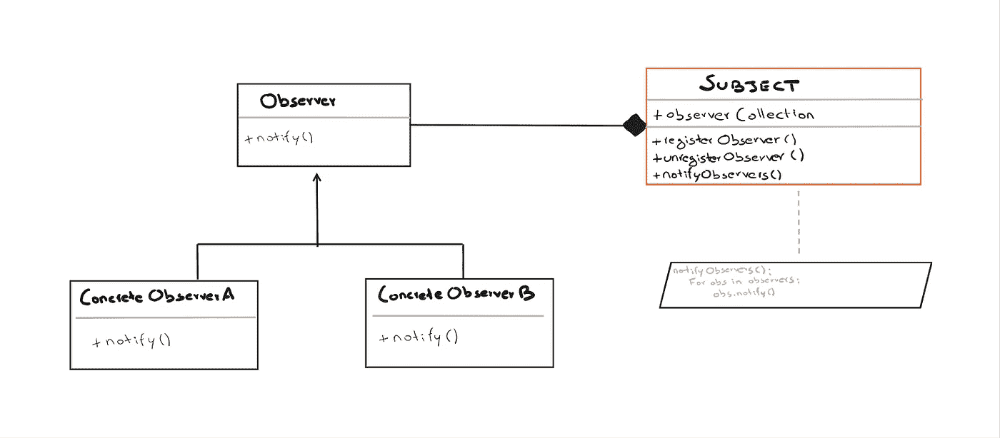

# 用 Python 为机器学习工程师设计模式:观察者

> 原文：<https://towardsdatascience.com/design-patterns-with-python-for-machine-learning-engineers-observer-23cde7ecb2ed>


[梁杰森](https://unsplash.com/@ninjason?utm_source=medium&utm_medium=referral)在 [Unsplash](https://unsplash.com?utm_source=medium&utm_medium=referral) 上的照片

## 通过一个基于 Instagram 的例子了解如何使用观察者设计模式

# 介绍

在我的上一篇文章“用 Python 为机器学习工程师设计模式:抽象工厂”中，我介绍了设计模式，以及为什么了解它们并能够使用它们很重要。我还深入研究了本系列的第一个设计模式 AbstractFactory。如果你还没有读过，我建议你看一看。

为了快速总结计算机科学中的设计模式，特别是在软件工程中，它是一个概念，可以被定义为对一个重复出现的问题的通用设计解决方案。它是一种描述或逻辑模型，用于解决在软件设计和开发阶段的不同情况下可能出现的问题，甚至在计算部分的求解算法定义之前。

设计模式总是由 5 个元素定义:*名称、问题、解决方案和结果。*

根据设计模式所解决的问题以及模式是应用于类还是对象，设计模式有多种类型。在下图中，您可以看到最常见的设计模式。



设计模式(作者图片)

# 观察者

在我看来，理解如何定义设计模式的最简单的方法是通过展示一个例子，让我们从观察者设计模式开始！

假设你是一个足球迷，你最喜欢的球员是克里斯蒂亚诺罗纳尔多。你充满热情，想要知道关于这个球员的每一条新闻和更新，所以你决定在 Instagram 上关注他。
现在你关注了克里斯蒂亚诺·罗纳尔多，每次他在 Instagram 上发布帖子或做出动作，你都会收到通知，所有内容都会出现在你的订阅源中。
在这个模式中，我们有两个演员，你是**观察者**，而 c 罗是**主体**。

但你会很容易明白，这不可能是一对一的关系。克里斯蒂亚诺罗纳尔多是 Instagram 上最受关注的账户之一，迄今为止拥有大约 4 . 82 亿关注者。这会让你明白**一个主题可以有多个观察者**，他们都对他的更新感兴趣。所以**关系**必须是**一对多**类型的。



主体与观察者的关系(图片由作者提供)

# 类图

在我向您展示如何用 Python 实现这种设计模式之前，我为您带来了一个带有类图的图像，以便您能够理解需要应用的类和方法之间的关系。



类图(图片由作者提供)

*   观察者和主体是界面
*   所有需要数据的观察者都需要实现观察者接口。
*   notify()方法定义了当主体提供其数据时要采取的动作。
*   该主题维护一个名为“观察者”的观察集合，它是当前注册的观察者的列表。
*   registerObserver()和 unregisterObserver()分别是添加和移除观察器的方法。
*   当数据发生更改并且需要向观察器提供新数据时，会调用 notifyObservers()。

## 我们来编码吧！

首先，我们创建抽象类 Observer 和 Subject。在 Python 中，要创建一个抽象类，你必须继承 ABC。观察者将拥有一个 update()抽象方法，当他关注的 VIP 账户发布新内容时，该方法会立即通知他。
而主题，即拥有众多关注者的 VIP 有 3 个抽象功能，一个用于注册新用户，一个用于删除他，另一个(最重要的)用于通知他的所有关注者他创建了一个新帖子。

现在我们创建 InstaVIP 类，即负责实例化我们的 VIP(如 Cristiano Ronaldo)的类。
注意，notifyObserver 滚动查看名为 observers_collection 的列表中保存的所有 VIP 关注者，以通知他们。

现在我们发展跟随者类，也就是我们观察者的类。每个观察者由一个用户名定义。在这个类中，我们应该定义 update()方法，每当 VIP 发布内容时都会调用这个方法。理想情况下，这种方法将更新我们的 Instagram 提要，但在这种情况下，它只会简单地打印出 VIP 发布了新内容的事实。

现在我们主要创建两个 Instagram 账户:[@真实账户 1](http://twitter.com/theRealAccount1) 和[@官方账户 2](http://twitter.com/account2Official)。然后，我们实例化我们的 VIP 克里斯蒂亚诺罗纳尔多。
受试者必须注册我们的关注，当这两个账户在罗纳尔多的 Instagram 账户中点击“关注”时，就会发生这种情况。
现在 c 罗将使用 new post()方法创建一个新帖子。

在生成克里斯蒂亚诺罗纳尔多的新帖子时，将调用两个帐户的更新方法，这实际上将打印:

```
created new post
notification for @theRealAccount1 : new post created by Ronaldo notification for @account2Official : new post created by Ronaldo
```

# 最后的想法

> 设计模式描述了一个经常重复出现的问题，并根据类/对象组织提出了一种可能的解决方案，这种解决方案通常被认为可以有效地解决问题本身。

这种模式被广泛使用:它被用于许多库、GUI 工具包、MVC 架构模式、消息传递和实时系统。

这种设计模式带来了多种优势:

*   该模式是应用使对象之间的耦合尽可能弱的原则的一个很好的例子。所以，增加了所谓的宽松。
*   它允许将数据有效地发送到其他对象，而不需要对 Subject 或 Observer 类进行任何更改。
*   受试者和观察者是独立的，其中一个组件的变化不需要另一个组件的变化。
*   观察员可以随时添加/删除

在各种各样的应用程序中，我们发现了同样的问题，即需要在主题更改数据时得到通知(例如，see 已经发布了一些内容)，这种设计模式如果应用得当，可以让我们的生活变得更加轻松！在未来的文章中，我将讨论机器学习工程师需要知道的其他设计模式，以便能够编写干净的结构化代码。

# 结束了

*马赛洛·波利蒂*

[Linkedin](https://www.linkedin.com/in/marcello-politi/) ， [Twitter](https://twitter.com/_March08_) ， [CV](https://march-08.github.io/digital-cv/)