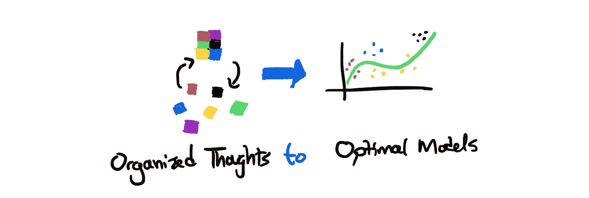
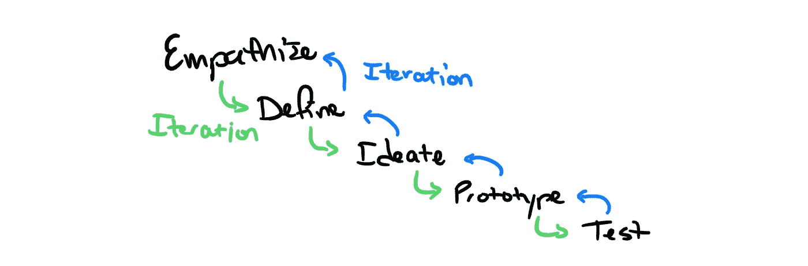
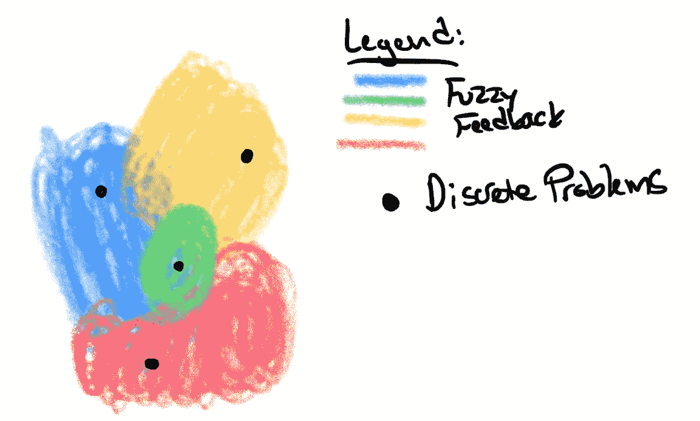
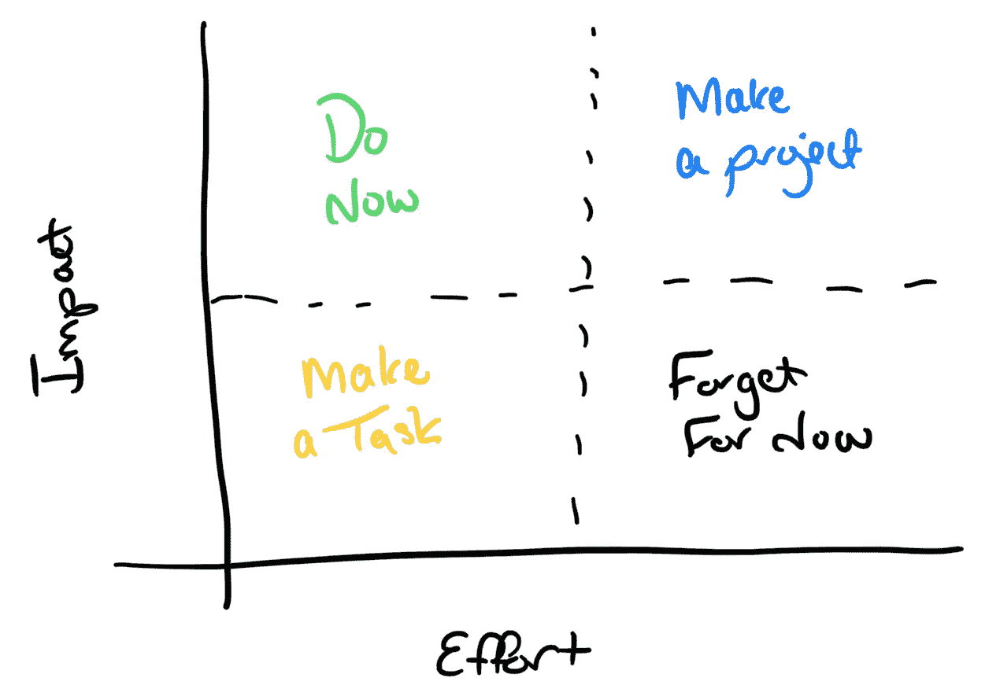
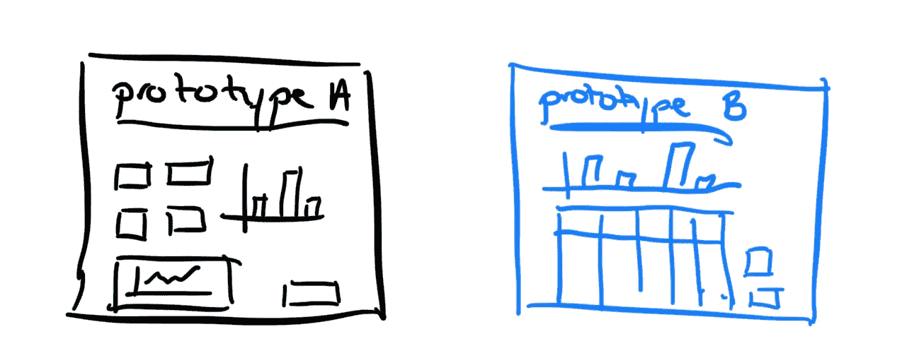
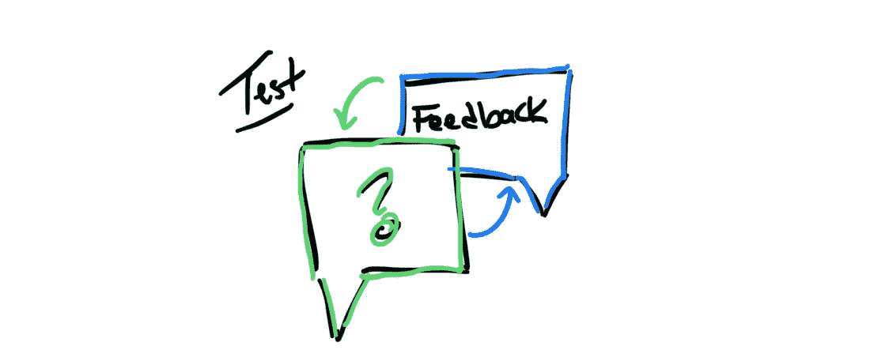

# 设计思维提高您的数据科学

> 原文：<https://towardsdatascience.com/design-thinking-improves-your-data-science-4c4aaaa9204a>

## *了解您的问题并增加项目影响的新方法*

由[杰森古德曼](https://unsplash.com/@jasongoodman_youxventures?utm_source=unsplash&utm_medium=referral&utm_content=creditCopyText)在 [Unsplash](https://unsplash.com/s/photos/design-thinking?utm_source=unsplash&utm_medium=referral&utm_content=creditCopyText) 上拍摄的照片

设计思维帮助你组织思想，创造最佳解决方案。在项目开始时，我们这些数据科学家会就问题陈述和数据提出问题。涉众通常会对他们的问题给出一些具体(或不具体)的答案。这通常发生在几次会议中。我们将需求牢牢地掌握在手中，并开始争论数据、构建模型等。

但是…如果你正在做的问题陈述不是你被要求解决的真正问题呢？如果最后，在做了大量工作之后，你向涉众展示了你的成果，而他们并不感兴趣，或者更糟的是，没有使用这些成果，那该怎么办？在这篇文章中，我将介绍一些使用设计思维来避免这些结果的方法。

## 这对数据科学家有什么影响？

数据科学家可能犯的最大错误之一是直接跳到项目的开发，而没有花足够的时间来理解具有最大影响的**真实**目标。

有时候，这些目标很容易确定，也很容易看到并发症的到来。如果数据科学家熟悉问题空间和/或集成到业务流程中，这通常是正确的。

许多数据科学家作为“第三方”参与进来，帮助推动团队的战略目标。这意味着误解问题和创建不符合涉众期望的解决方案的风险很高。或者更糟——创造出错误的解决方案。如果您参与了这些类型的项目，那么这篇文章就是为您准备的。在开始数据科学工作之前，我们可以使用一个框架来帮助消除这种风险。这个框架就是设计思维。

设计思维帮助你组织思想，创造最佳解决方案。

# 什么是设计思维？

根据[交互设计](https://www.interaction-design.org/literature/article/what-is-design-thinking-and-why-is-it-so-popular)基金会的说法——“设计思维是一个迭代的过程，在这个过程中，你寻求理解你的用户，挑战假设，重新定义问题，并创造出你可以原型化和测试的创新解决方案。”

这使我们作为数据科学家能够:

*   弄清楚我们试图解决的真正问题是什么
*   了解我们是否需要一个模型
*   确保利益相关者的想法就是我们要提供的
*   了解该模式将如何影响用户/业务

有几个正式的基于设计思维的过程。如果你愿意，你可以选择跟随他们(比如设计冲刺)。然而，对我来说，设计思维不是一个正式的过程，而是一个如何思考以及如何理解你在和谁/什么一起工作的框架。这意味着设计思维结构可以根据受众、业务和问题而变化。

设计思维的一般阶段

通常，设计思维被认为是移情、定义、构思、原型和测试的迭代路径。这里强调的是**迭代**这个词。虽然我正在检查的步骤是线性显示的，但是每个步骤都可以根据需要再次执行。很多时候，我重复这些步骤来收集更多的信息，并进一步完善我对问题、用户或涉众的理解。

每个步骤的一般定义是:

*   **感同身受**:对你的客户和他们面临的问题建立理解。
*   **定义**:定义需要解决的问题。
*   想出解决问题的所有不同方法。任何想法都可能是好主意。之后，缩小到最佳想法。
*   原型:为你想要建造的东西开发一个尽可能简单的工作模型。
*   **测试**:和你的利益相关者一起测试这个想法。获得他们的反馈。

让我们回顾一下如何利用每个步骤开始下一个项目。

# 有同感

作为数据科学家，我们的第一本能是开始理解我们将要用来解决问题的数据。然而，我们需要了解，对于涉及这个问题的人来说，数据之外还有什么。我们可以拥有世界上所有的数据，但如果我们不知道用户或利益相关者如何与产品交互，不了解他们对产品的理解，我们就不可能做出完全解决他们问题的解决方案。这里我最喜欢的一句话是，我们需要“爱上问题”。爱上这个问题让我们能够理解我们的客户/利益相关者正在经历的事情。

有几种不同的方法可以让我们产生共鸣:

## 面谈

*   花一个小时(或更多)与利益相关者进行一对一会谈。
*   学习你的利益相关者现在使用的语言、行话和方法，以及他们看到的差距。
*   了解他们今天是如何工作的，或者他们目前看到了什么。
*   收集他们的想法，如果他们有魔杖可以让一切变得更好，他们会如何使用该产品。

## 产品探索

*   了解您正在使用的产品，如果它现在有版本的话
*   在测试环境中获得一个用户帐户，或者在生产环境中获得一个只读帐户，以测试产品并熟悉新用户如何与产品交互。
*   利用您对数据的理解来了解您的解决方案将如何影响您的解决方案的客户。
*   作为一名数据科学家，您有一个非常有用的视角来识别其他人可能看不到的其他可能的改进或机会。

## 与领导层、产品经理和团队领导的讨论

*   询问领导层目前如何使用产品/数据/系统来推动他们的业务目标(如果是的话)。确定解决方案将如何或可能如何促成这些结果。注:如果解决方案对业务目标没有贡献，它是涉众想要或需要的吗？
*   如果领导层没有使用结果来驱动任何业务目标，那么就要弄清楚向流程中添加模型度量的需求。注意:也许可以创建一个有助于业务总体目标的新指标。

# 规定

一旦收集了背景和理解，我们需要将它们提炼为需要解决的问题。定义阶段应该与您的利益相关者一起完成，它将鼓励就需要解决的问题进行富有成效的对话。这些对话还确保了问题对客户/利益相关方和数据科学家的意义的一致性。

在“定义”阶段，将模糊的用户反馈转化为离散的问题。

其中最重要的方面是:

1.  用利益相关者使用的术语和语言来定义问题
2.  使用从访谈中获得的知识来告知应该生成什么问题陈述

现在，问题陈述有可能演变成远景陈述。减轻这种情况的方法是确保您定义的问题是可管理的和可操作的。如果你和习惯于为团队设定愿景的人一起工作，这一点尤其重要，因为这种愿景设定对他们来说可能是最自然的。

相反的情况也可能是正确的——一个问题陈述可能被锁定在当今问题的框架中。如果你的观众是由那些在日常工作中的人组成的，这种情况就会发生。重要的是要确保问题陈述是一个延伸目标，并且我们不必考虑当今的框架、限制或结构。在项目完成后，它们可能没有用，甚至不存在。

有几种方法来定义问题陈述，但我最常用的两种是“我们如何”(HMW)陈述和五个 W 的使用，这将在下面讨论。

## **我们可能如何“HMW”陈述**

我最喜欢的生成问题陈述的方法是使用 HMW 陈述。在这个过程中，每个人都要写下问题陈述，以“我们该如何……”开始。它们通常是单独生成的，并由小组投票以获得最佳的问题陈述。HMW 的陈述写得很积极，以确保我们记住用户的感受。

一些例子是:

*   **"** 我们如何……重新设计购车体验，让人们随时知道他们的车值多少钱？”
*   **“**我们如何……让用户确信他们的数据是安全的？”

确保 HMW 的陈述没有暗示结果——目标不是找出**如何**解决这个问题，而是确定**问题是什么**。以下是根据前面的例子改写的 HMW 语句的一些例子，这些例子暗示了一种结果:

*   **"** 我们如何……构建一个模型，从汽车元数据中预测汽车价值？”
*   **“**我们如何……创建一个数据锁定系统来保护我们的数据？”

看到暗示一个结果有多容易了吗？我们都有想法，但在我们开始考虑如何解决问题之前，我们希望确保我们在问题上意见一致。有时候，你可能会发现你被要求解决的问题可以用模型之外的东西来解决。

现在，这个过程的目标是提出一个或多个方法。相关人员还需要理解这条路径是迭代的，团队正在寻找正确的问题和正确的解决方案——知道想法和需求可以像业务一样变形和改变。

## **五个 W**

如果您时间紧迫，这五个 W 允许将问题陈述快速分解成一个单独的问题陈述。这五个 W 是谁、什么、何时、何地和为什么。在这种情况下，问问你自己和团队(可能会有一些争论):

*   谁将使用结果？
*   他们需要用它做什么？
*   他们打算什么时候使用它？(在他们流程的哪个点？)
*   他们会在哪里，在什么平台上使用？
*   他们为什么要使用这个结果？(重要吗？)

一旦你有了 HMW 陈述或者回答了五个 W，你就至少有了一个团队可以解决的问题陈述。投票选出最重要的问题陈述后，下一步是考虑解决问题的所有方法。这是被称为构思的设计思维过程的想法产生步骤。

# 想象

现在你有了我们的问题陈述，你需要考虑解决问题的不同方法。在这一步，任何想法都是好想法，重数量轻质量。如果可能的话，确保与你的利益相关者一起完成这一步，这样你就可以立即收到关于这些想法的反馈。利用这段时间将技术性发言融入到非技术性的故事中。

当你构思时，试着讨论以前解决过类似问题陈述的类似解决方案。这可能是在同一个行业或不同的行业。这些类型的对话可以产生更多有趣的想法和灵感，将现有的或新的数据与问题陈述结合起来。例如，如果你试图找出卡车司机停车睡觉的最佳地点，你能建立一个类似 Airbnb 的模型，让司机呆在家里吗？

使用白板、PowerPoint 或 Google Sheets 来记录想法是有益的。想出尽可能多的想法，并根据复杂性、完成时间和影响对它们进行优先排序。为此，我喜欢记住[闪电决策堵塞](https://uxplanet.org/lightning-decision-jam-a-workshop-to-solve-any-problem-65bb42af41dc) **对努力矩阵的影响。**

闪电决策堵塞对工作矩阵的影响

# 原型

一旦你有了如何解决问题的想法列表，下一步就是建立一个原型。

想出几个快速建造的原型。

现在，我们不是在谈论一个功能齐全的应用程序。这里的目标是建立一些看起来可以工作的东西，但是要抱着“假装直到你成功”的心态。

最重要的是，这个成果不是模型设计。它应该是您希望构建的任何模型的输出。最终，您的数据科学解决方案可能会以某种可视化形式结束，这可能是一个仪表板、应用程序中的通知或 API 响应。在这种情况下，我们期待构建出最终结果**可能**的样子，而不是一个实际的完全功能的结果。

这个原型可以是模型将返回的内容的 JSON 文件，应用程序外观的 PowerPoint，或者模型将生成的图表的手绘图片。没有构建原型的“最佳”方法。我通常会采用这种方法，让我在几个小时内创建几个逼真的原型。

# 试验

一旦你有了一个或多个原型，测试它们并通过展示给利益相关者来收集关于设计的反馈。这是反馈的重要时机。如果你想要创造的东西没有得到涉众的认可，这通常是任何差异出现的时候。这也是反馈和调整的时间。涉众注意到的任何问题或者可以改进的地方都应该被添加到最终模型的需求中。

收集关于原型的反馈时，一些重要的考虑事项是:

## **回答问题不引导反馈**

尽量不要直接回答类似“这个指标应该是什么？”不要直接用“那是每小时预约的数量”来回答，而是问用户利益相关者或者用户认为是什么。

例如，回答“这个指标应该是什么？”“如果有的话，你认为这个指标意味着什么？”

这让您更深入地了解问题的驱动因素。可能是特征不够清楚，或者是结果没有用或者不符合预期？

## **沉默是好的**

不要介意沉默——让利益相关者或用户玩或研究结果。尽量不要引导用户浏览你的原型。如果你的解决方案应该是不言自明的，那么用户应该能够理解解决方案告诉他们什么。当用户研究原型时，如果有安静的咒语也没关系。

# 测试后

在我们得到简单原型的反馈后，真正的工作就开始了。

有了清晰的结果，有了能够为客户着想的保证，有了提供客户重视的解决方案的信心，您就可以开始构建真正的解决方案了。

设计思维过程的好处是，你可以清楚地知道需要做什么。此外，您的利益相关者感觉与您的流程有联系。他们相信你正在创造对他们有益的东西。他们相信你理解他们的观点，他们的机会在哪里，并且你能发现其他的机会在哪里。

尝试在你的下一个项目中使用这些方法——你可能会对你学到的东西感到惊讶。

# **更多资源**

如果你有兴趣深入研究几个不同的设计思维过程的细节，有几个优秀的资源也有助于激发这篇文章。我最喜欢的两个是:

*   [冲刺:如何在短短五天内解决大问题并测试新想法(thesprintbook.com)](https://www.thesprintbook.com/book)。这是一个满满一本书，长达一周的设计思考过程。
*   [闪电决策堵塞:解决任何问题的研讨会|作者 Jonathan Courtney | UX 星球](https://uxplanet.org/lightning-decision-jam-a-workshop-to-solve-any-problem-65bb42af41dc)。这是一篇优秀而简短的文章，描述了闪电决策堵塞(一个 45 分钟的活动)。

除非另有说明，所有图片均为作者所有。

请随时在 [LinkedIn](https://www.linkedin.com/in/taylor-jensen-02999/) 上与我联系。