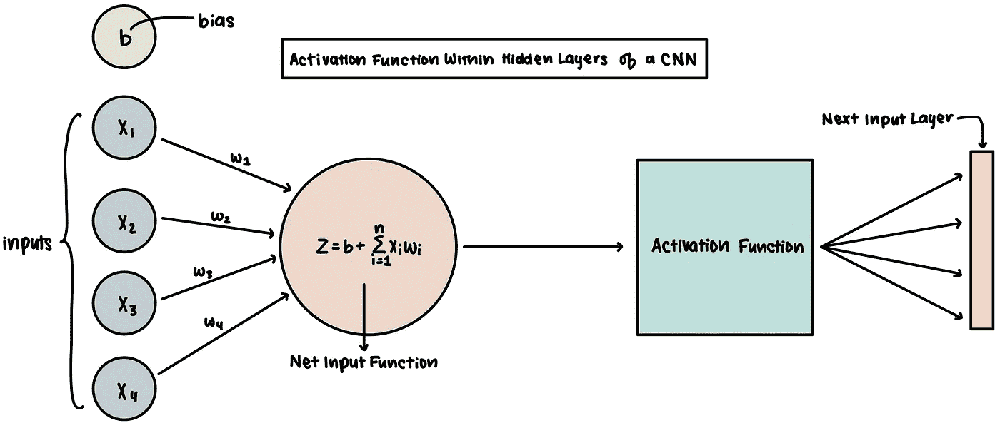
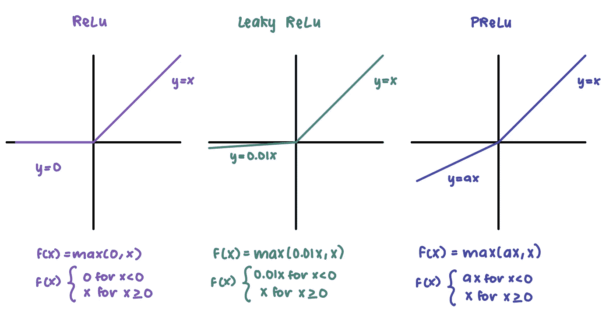
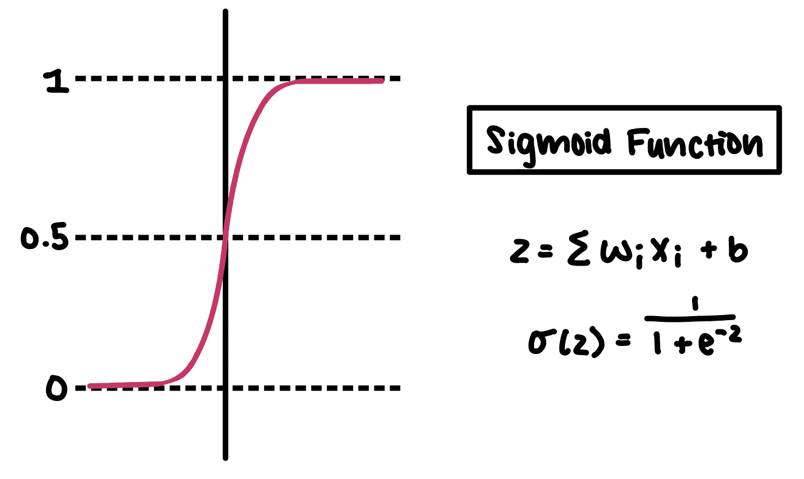
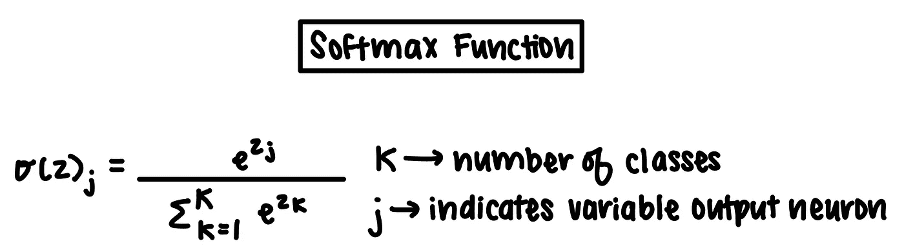
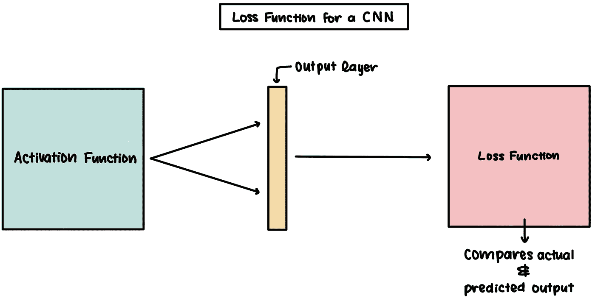
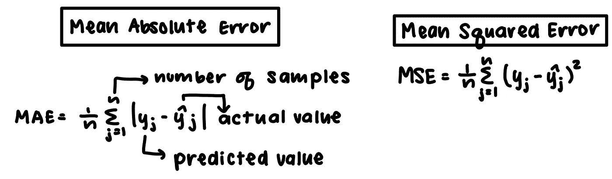
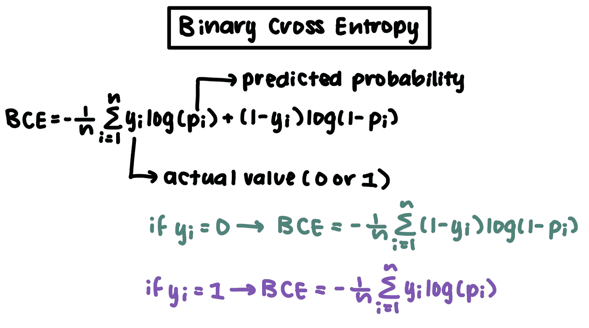
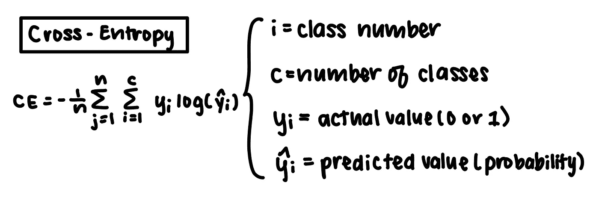

# 具有激活和丢失功能的设计思维

> 原文：<https://towardsdatascience.com/design-thinking-with-activation-and-loss-functions-5516cf323942>

## 根据“人-术语”重新定义算法问题

照片由[像素](https://www.pexels.com/photo/clear-light-bulb-355948/?utm_content=attributionCopyText&utm_medium=referral&utm_source=pexels)的[皮克斯拜](https://www.pexels.com/@pixabay?utm_content=attributionCopyText&utm_medium=referral&utm_source=pexels)拍摄

深度学习越来越受欢迎，因为它能够获取大量数据来解决复杂的问题。虽然像机器学习这样的应用看起来几乎很神奇，但重要的是要记住它们并不神奇。

## 关于深度学习架构的一点信息

深度学习架构被热切地研究和开发，具有独特的功能和理念来解决不同的问题。例如，递归神经网络(RNNs)在自然语言处理中表现良好，因为它们可以保留基于时间的信息并理解句子结构。相比之下，卷积神经网络(CNN)更适合对图像进行分类，因为它们可以通过卷积层处理空间数据。

在深度学习模型中的许多对象和函数中，激活和损失函数提供了许多可定制性。类似于单词的组合可以构建成千上万个不同的句子，这些功能可以实现许多解决问题的技术。

## 激活功能

激活函数将一个神经元的输入映射到下一层的输入。在这样做的时候，深度学习架构被设计成处理非线性问题，非线性问题比线性问题更难解决。

卷积神经网络或 CNN 的密集层内的激活函数的一般示意图(图片由作者在 Notability 提供)。

在这个例子中，一个神经元接收四个输入，每个输入都有一个权重来确定它在网络中的重要性。净输入是输入权重乘积与随后添加的偏差的总和。

接下来是激活函数，它将最终调用传递到下一个输入层的内容。虽然有许多不同的激活功能，这里是一些常用的。

**整流线性单元(ReLu)**

这些函数中的每一个都利用不同的方法来解决负 x 值的问题。

整流线性单元采用整流激活函数来确定神经元的输出。对于正的 *x* 值，结果就是简单的 *x* 。对于负的 *x* 值，结果固定为 0。ReLu 函数使每个具有负净输入的神经元无效，导致许多死亡神经元。

其他激活方法通过使神经网络中的负值持续存在，在防止死亡神经元方面变得可行。对于小于 0 的值 *x* ，Leaky ReLu 将函数的斜率设置为 0.01，而参数 ReLu (PReLu)允许模型为值 *a* 的斜率进行训练。

仅凭这三个函数，我们就能更好地评估问题的复杂程度。使用 ReLu 表现良好的模型不需要太多的信息来得出准确的结论。相比之下，由许多不同斜率值的预激活函数组成的网络需要更高的精度和数据处理。

**乙状结肠**

Sigmoid 函数通常用于深度学习架构，因为它们很容易将非线性引入网络(图片由作者以 Notability 表示)。

通常使用 Sigmoid 函数，因为它们将净输入展平到 0 到 1 之间的值。该激活函数通常位于输出层之前，因为它为每个输出标签提供了概率。鉴于运算的简单性质，Sigmoid 函数也很好地引入了非线性。

**门控线性单元(GLU)**

门控线性单元有一种独特的激活神经元的方法。

GLUs 将净输入乘以通过 sigmoid 函数的净输入产生的输出。这样，他们以一种微妙的方式增加了网络的非线性。当输出变得非常大时，Glu 表现良好，因为它们乘以 0 到 1 之间的值。

**Softmax**

Softmax 函数提供了另一种分配概率的方法(由作者以显著性显示图像)。

与 sigmoid 函数类似，softmax 函数输出概率。然而，这个激活函数做得更明确一些。分子代表一个类的输入，分母代表类输出的总和。这种激活函数改善了对模型数据的直观分析，因为具有较大输出的神经元将比其他输出指示更可能的预测。

## 损失函数

损失函数与“成本函数”同义，因为它们计算函数的损失来确定其可行性。

损失函数在神经网络的末端执行，比较实际和预测的输出，以确定模型的准确性(图像由作者以显著性表示)。

上面我们有一个激活函数输出输出层的概率。通过比较预测值和实际答案，我们可以计算模型的准确性，并更新整个网络的权重。比如说，一个卷积神经网络预测一个图像有 30%的几率是猫，10%的几率是青蛙，60%的几率是马。如果图像的实际标签是一只猫，那么损失会非常大。

选择最佳损失函数至关重要，因为它是模型是否过度拟合或欠拟合的最佳指标。下面是一些典型的损失函数，供你在下一个深度学习项目中考虑。

**平均绝对误差(MAE)和均方误差(MSE)**

平均绝对误差和均方误差在不正确预测的惩罚中有所不同(图片由著名作者提供)。

平均绝对误差和平方误差是深度学习架构中不同哲学的很好例子。当预测值和实际值之间的差异增大时，MSE 与 MAE 相比会受到更大的惩罚。

如果模型变得对错误过于敏感并记忆训练数据，那么这种更大的损失可能变得不利。但是，MAE 损失函数可能会导致缺少重量变化，从而导致模型不符合要求。

**二元交叉熵**

二元交叉熵可以使用 2 种不同的计算方法，具体取决于实际值(图片由著名作者提供)。

二进制交叉熵(BCE)利用-log(x)函数，因此相对于 1，概率值越高，损失越小。这种方法将有助于解决二元分类问题。如果模型试图确定图像是钢笔还是铅笔，并且它预测图像是钢笔的概率为 20%，则图像是铅笔的概率为 80%。

现在，假设图像实际上是一支铅笔。根据该等式，当实际值为 1 时，您将执行 0.8 的负对数，导致损失 0.097。您还可以通过比较笔的预测输出 0.2 和实际值 0 来计算该损失。

**交叉熵**

交叉熵只通过实际类的预测值计算损失(图片由《显要》作者提供)。

交叉熵(CE)损失函数有效地利用了与二进制交叉熵(BCE)损失函数相同的函数。然而，CE 将该函数推广到具有多类输出的网络。也是因为这个原因，模型只能通过正确类别的预测值来计算损失函数。一键编码将 0 分配给错误的类，将 1 分配给有效的类，以区分它们。

## 运用设计思维

设计思维参与解决问题的过程。虽然它大量用于用户界面和用户体验(UI/UX)设计，但它适用于构建深度学习架构。

这种解决问题的技术与神经网络通过其流畅的“开箱即用”但系统的方法理解复杂的非线性关系的能力有相似之处。我发现有一句话很好地概括了这一点，它是这样的:

> “设计思维是一个非线性的迭代过程，团队使用它来了解用户，挑战假设，重新定义问题，并创建原型和测试的创新解决方案。”—交互设计基础

那么，我们到底该如何应对这一切呢？

设计思维有 5 个步骤，它们和科学方法一样经过了反复试验。

1.  **感同身受:**与用户建立联系，倾听他们的心声。尽可能了解用户的问题。
2.  **定义:**清楚地概述你的用户的问题。试着将用户的问题与他们的其他方面联系起来。
3.  **构思:**针对每个确定的问题提出多种解决方案。尝试将你的解决方案与过去或替代方案进行比较，找出改进的方法。
4.  原型:为每个问题集中到一个单一的解决方案，并为它们制定小的、具体的实例。
5.  测试:部署和评估您的解决方案。如果遇到困难，尝试重新定义你的问题。

当测试和重新评估模型的感兴趣的问题和解决方案时，确定使用哪个激活和损失函数变得相关。通过比较和对比某些函数组合的准确性，我们可以更好地理解手头的问题。

例如，如果我们试图在给定多个因素的情况下预测房屋的最优销售价格，我们可以运行 ReLu 作为我们的激活函数，并尝试均方误差、二元交叉熵和交叉熵损失函数。更进一步，假设 MSE 损失函数是提供有意义信息的唯一成本函数。然后你可以推断出你正在处理一个线性回归问题。假设 MSE 成本函数比 MAE 成本函数提供更好的结果。在这种情况下，您可以得出结论，在您的数据中存在相对更复杂的关系，需要一个更具响应性的损失函数来正确训练权重。

有了这些信息，您就可以尝试 ReLu、PReLu 和 Leaky ReLu，找出最佳的激活功能。如果 Leaky ReLu 表现最好，您将有更多的证据证明权重必须非常敏感，以考虑数据中的复杂性。

我们可以将相同类型的演绎分析分别应用于使用 BCE 和 CE 损失函数的二元逻辑回归和多类分类问题。根据哪些函数执行得最好和最差，您可以将问题转移到更直接的方面。

这种解决问题的技术也可以推广到深度学习架构。与主要使用 tanh 和 sigmoid 激活函数的递归神经网络(RNNs)相反，通常发现卷积神经网络(CNN)使用 ReLu 激活函数。这一发现表明，在分析句子时，RNNs 必须对识别时间模式更敏感。

## **总结**

> “设计团队使用设计思维来解决定义不清/未知的问题(又名[邪恶问题](https://www.interaction-design.org/literature/topics/wicked-problems))，因为他们可以用*以人为中心的*方式重新构建这些问题，并专注于对用户来说最重要的事情。”—交互设计基础

在整篇文章中，越来越清楚的是，一系列精心设计的激活和损失函数对于构建最佳深度学习架构是必要的。当面对抽象的计算和结果时，我们应该评估模型是如何处理信息流的。激活函数处理前向传播(信息的前向流动)以向前传递数据，而损失函数处理反向传播(信息的后向流动)以提高赋予数据片段重要性的权重。

这种循环的测试和检查过程与测试和重新定义模型功能的设计思维结合得很好。此外，理解每个激活和损失函数背后的特质和推理将使我们能够深入思考在我们蓬勃发展的世界中等待着的错综复杂的问题。

## 资源

[1] B. Jason，[训练深度学习神经网络时如何选择损失函数](https://machinelearningmastery.com/how-to-choose-loss-functions-when-training-deep-learning-neural-networks/) (2020)，机器学习掌握

[2] B. Jason，[训练深度学习神经网络的损失和损失函数](https://machinelearningmastery.com/loss-and-loss-functions-for-training-deep-learning-neural-networks/) (2019)，机器学习掌握

[3] S. Fawaz，[《完整的神经网络训练营:理论、应用》第 2 节&第 3 节](https://www.udemy.com/course/the-complete-neural-networks-bootcamp-theory-applications/) (2021)

[4] D. Yann，F. Angela，A. Michael 和 G. David，[用门控卷积神经网络进行语言建模](https://arxiv.org/abs/1612.08083)

[5] B. Avijeet，[2022 年你应该知道的 10 大深度学习算法](https://www.simplilearn.com/tutorials/deep-learning-tutorial/deep-learning-algorithm) (2021)，SimpliLearn

[6] B. Pragati， [12 种类型的神经网络激活函数:如何选择？](https://www.v7labs.com/blog/neural-networks-activation-functions) (2022)，V7 实验室

[7] [设计思维](https://www.interaction-design.org/literature/topics/design-thinking)，交互设计基础