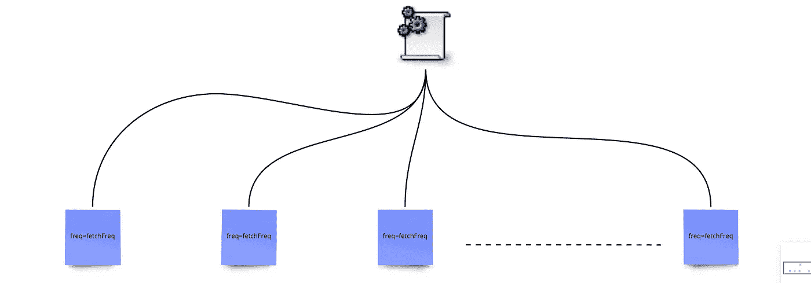
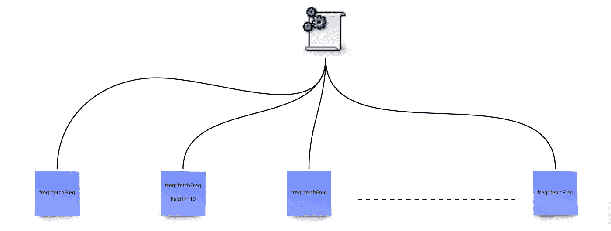

# 设计数据系统:复杂性和模块化设计

> 原文：<https://towardsdatascience.com/designing-data-systems-complexity-modular-design-384b28fec672>

## 数据科学家和工程师的设计思维方法。


[Med Badr Chemmaoui](https://unsplash.com/@medbadrc?utm_source=medium&utm_medium=referral) 在 [Unsplash](https://unsplash.com?utm_source=medium&utm_medium=referral) 上拍摄的照片

# 动机

从笔记本到创建在现实世界中工作的机器学习系统，意味着从编写简单的脚本、笔记本和在实验室环境中可视化数据转变环境。现在是考虑建立一个系统的时候了，好的系统具有关键特征，即弹性、性能和可靠性。通常，当我们设计系统时，由于在开发过程中采取的增量决策，复杂性的摩擦阻力开始变得明显。这些增量决策是几个约束条件的结果，例如期限、预算约束和开发团队的技术技能。

系统环境中的复杂性是指任何使理解系统变得困难，并且在以后的阶段修改系统变得困难的东西。随着系统的开发和扩展，增加的复杂性增加了以添加新功能、性能优化等形式进行更改的时间成本。仅举几个例子。因此，让我们在这篇文章中开始讨论，以更深入地理解什么是复杂性，以及它如何影响我们开发的系统。

# 复杂性

让我们正式思考复杂性。当我们开发系统时，为了对系统进行修改，我们需要采取一定数量的行动。这些动作有一个与之关联的时间值，即完成该动作所用的时间。因此，如果我们想用数学的方法来表达，我们可以把总复杂性看作是与每个动作相关的复杂性的总和`a`比如我们称之为`c(a)`，与每个动作相关的时间为`t(a)`。因此总复杂度为`SUM(c(a).t(a))`。为了最小化复杂性，一个显而易见的方法是最小化`t(a)`，并且在可能的情况下，以这样一种方式设计系统的单个组件，使得与那些组件相关联的动作具有更少的`c(a)`。复杂性的主要衍生因素是依赖性和模糊性。

依赖性是指系统各部分之间的相互依赖性。系统的一部分按照其规格运行的依赖性越多，该部分就会变得越复杂。晦涩是缺乏可视性，最终导致系统的复杂性。在团队环境中处理大规模系统时，晦涩是很常见的，随着代码库变得越来越老，越来越大，晦涩也越来越多。

为了更好地理解复杂性及其衍生因素，让我们通过观察复杂性的影响来进一步分解它，然后理解首先是什么导致了复杂性的产生。

# 复杂性的影响

随着系统复杂性的增加，一些事情被放大了:改变的难度，认知负荷的增加，以及未知的数量。

## 改变难度

让我们用一个简单的调度器的例子来理解，这个调度器为欺诈检测系统获取数据。假设您需要以相同的时间间隔从两个不同的财务来源获取数据，并合并这些数据源以生成最终的数据集。您以每天一次的频率编写两个解析器。对于您的 cron 作业脚本，您硬编码了频率值，因为您只编写了两个脚本，并且您可以很容易地对将来可能出现的任何变化进行修改(对吗？我们都去过…)！现在，假设您必须进行一项更改，将获取频率从每天一次更改为每小时一次，以便为您的系统提供更多实时数据。现在，您必须进入这两个脚本并进行更改。

现在，您的欺诈检测系统已经投入使用，并受到高级管理层的欢迎，他们会派销售团队去获得更多的数据合同，以纳入更多的数据，并增加最终数据集的广度。如果您获得了 10 个以上的数据源，那么每当获取频率发生配置更改时，您就必须在 12 个获取脚本中进行更改。


硬编码的 cron 作业脚本。(作者:尤弗伦德·吉尔)

现在，避免硬编码的一个简单方法是用变量`fetchFreq`改变频率的硬编码值，并从某个配置文件中修改该变量。现在新的建筑看起来像这样，



配置文件连接的 cron 作业脚本。(作者:尤弗伦德·吉尔)

有了这个架构，我们需要在配置文件中做一个改变，系统的其余部分将被更新。在这里，我们能够最小化从单个 cron 作业的各种`freq`变量副本到一个配置文件的获取调度的依赖性。这种方法通过将依赖性减少到仅仅一个文件来处理依赖性引起的复杂性。

对配置文件所做的更改更不容易出错，并且更省时。开发人员需要担心配置文件中的变量`fetchFreq`,而不是担心所有单独的脚本。这让我们讨论复杂性的下一个普遍影响。

## **认知负荷增加**

认知负荷是工程师在做出改变之前需要了解的关于系统的信息量。具有大量依赖性的高度耦合的代码要求工程师在开始计划特定于变化的实现细节之前，理解其他代码的所有本质，以理解它们的变化的下游影响。简单来说，他们花更多的时间在与手头任务无关的细节上。

在任何真实世界的系统中，都会有依赖性，这是不可避免的。问题是这些依赖带来了多少复杂性，对维护系统的工程师的认知负荷有什么相对影响？

回到我们调度器的前一个例子，我们通过引入配置文件来分离获取脚本。现在从工程师的角度来看，他们只需要在修改之前关注配置文件中的代码。他们不需要学习我们 12 个脚本的任何实现细节。这减少了工程师的认知工作，从而减少了学习时间，提高了生产率。

## 未知数的数量

未知是您的变更在系统中引入的任何问题，只有当系统投入使用并且开始出现错误时，您才能意识到这些问题。现在让我们稍微扩展一下我们的调度程序。假设您的经理进来并注意到，在其中一个数据源中，我们需要根据频率对其中一个字段进行单位转换。Martin 目前是负责 cron 脚本的工程师，他加入了更改字段值的代码。现在你的系统看起来像这样，



添加了修改的 Cron 作业脚本。(作者:尤弗伦德·吉尔)

假设马丁找到了他的下一个任务，而你接替了他的角色。由于更改很小且很快，Martin 忘记记录更改。现在，您的工程经理进来将获取频率从每天一次增加到每小时一次，您继续修改配置文件。因为您不知道添加到第二个脚本中的代码，所以您肯定所有的东西都经过了测试，并且您的更改是可以进行的。只有在变更被合并到生产中之后，您的业务团队才会开始注意到他们的报告中突然出现的奇数，并且您将获得另一张票来修复这些变更。所以这些都是随着系统复杂性的增加而增加的未知因素。

未知的根本原因是复杂系统中的晦涩。现实世界的开发发生得很快，没有时间记录所有的变化，因为重点可能是发布一个特性而不是干净的代码。因此，在处理代码库和功能不断增长的实际系统时，晦涩是一个普遍的问题。减少晦涩依赖于各种因素，例如设计的简单和清晰，文档和沟通，等等。

> 复杂性是它现在和将来的所在。让我们尝试用模块化设计方法来降低这种复杂性！

# 标准设计

模块化设计是将系统分解成一组更小的组件的哲学，这些组件称为模块，可以重复使用，相对独立于其他部分，比原始系统更简单。让我们回到我们的欺诈检测系统来理解模块化设计方法。

欺诈检测系统有几个要求，即*获取数据、数据清理和准备、数据建模、分析、日志记录和健康监控。*如果系统以模块化方式设计，每个服务负责一项特定任务，则所有这些要求都可以满足。例如，数据获取可以是一个服务，数据建模可以是另一个服务，它们的实现完全相互独立。它是系统最高层的基本分解。这种方法可以从较高层到较低层迭代地继续。

让我们把重点放在数据获取服务上，并进一步分解它。该服务可以进一步分解为负责获取数据和调度服务的逻辑功能的子服务。我们现在有两个相对独立的模块。为了进一步分解，我们可以采用其中一个子服务，比如调度，并将其分解为单独的 cron 作业，就像我们前面看到的那样。每个 cron 作业都是相互独立的，在这个抽象层次上是一个独立的模块。

我希望您已经理解了这个想法的基本要点以及在不同抽象层次上创建模块的过程。现在让我们了解声音模块的主要特征。

## 连接

每个模块都有一个接口，该接口承载着关于模块的正式和非正式信息。任何模块的正式信息都由输入属性、输出值和任何与错误相关的警告组成。具体来说，如果我们在代码级别讨论，正式信息将包括你的函数签名或类签名。非正式信息是关于依赖关系和特定行为的，比如顺序调用模块的某些部分。

在设计一个接口时，关键的事情之一是提供足够的关于接口的信息，让用户知道它的主要功能和方法/服务。实现细节应该对用户隐藏。接口是为模块提供抽象。如果一个摘要给出了太多关于实现的细节，或者没有提供正确使用所需要的必要细节，那么它就会出错并变得复杂。

假设您正在创建一个处理大数据文件的框架，并创建一个读取文件的模块。一个好的界面必须为用户提供打开、阅读和关闭文件的功能。假设您的接口提供了以下方法，

```
def open_file(file)
def read_file(file)
def close_file(file)
def seek_file(file, seek_position)
```

上述方法提供了非常少的关于实现的信息，并且为用户提供了足够的信息来满足他们读取文件的需要。这四种方法允许用户打开和关闭文件，从开始到结束顺序读取文件，并使用`seek_file`方法随机读取文件。上述方法没有公开它们如何处理不同的文件类型、它们与底层文件系统的交互、键盘中断和崩溃管理。

## 履行

实现是指模块中隐藏在接口下的部分，负责完成模块提供的所有重要功能。

一个模块的良好实现试图将模块代码与其他系统模块隔离开来。例如，在我们的欺诈管理系统中，负责预处理数据的服务将实现代码，而不考虑为建模而实现的代码，反之亦然。系统的建模部分可能依赖于预处理服务。尽管如此，它只关心预处理提供的接口，而不关心预处理的实现细节。这种解耦在任何数据系统的模块化设计中是至关重要的，以减少依赖性。

> 接口宽度与实现深度的比率是良好抽象的关键。提供大界面但功能少的模块增加了复杂性，而具有深度功能的简单界面有助于降低复杂性。—斯坦福大学的约翰·奥斯特胡特

# 结尾注释

创建端到端的机器学习系统引入了复杂性，随着产品的增长而影响产品，并给负责产品的人员带来了巨大的负担。复杂性是系统中的依赖性和模糊性的结果，导致增加的变更难度、认知负荷和引入的未知。模块化设计原则试图通过将系统分解为具有连续抽象层次的子系统、服务和代码文件来降低复杂性。每个模块相对于实现中的其他模块是独立的，并为其用户提供了使用其中代码的接口。

我希望这个关于复杂性的讨论能让你了解你未来的项目在进展中会受到怎样的影响，以及用模块化哲学设计的战略方法会如何帮助你驾驭复杂性。我很乐意继续听到你关于复杂性和模块化设计的更多意见，所以请随意发表评论并继续讨论。