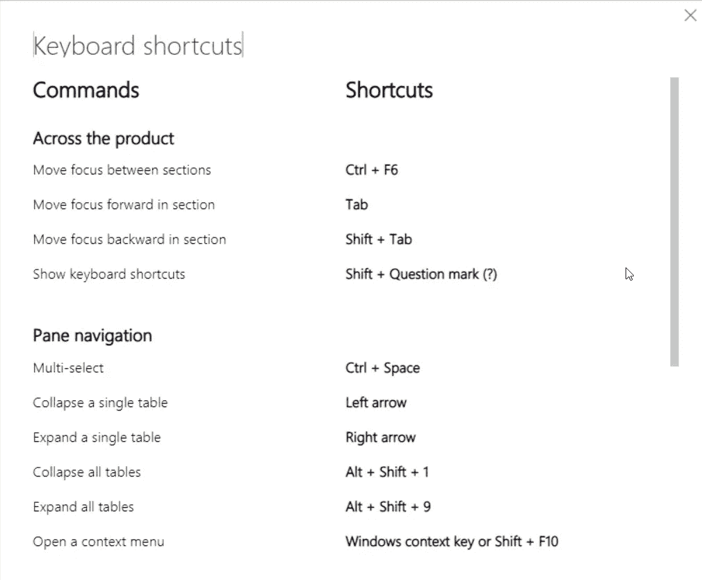
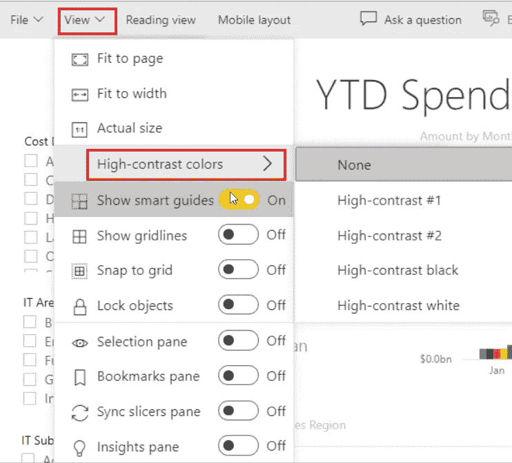
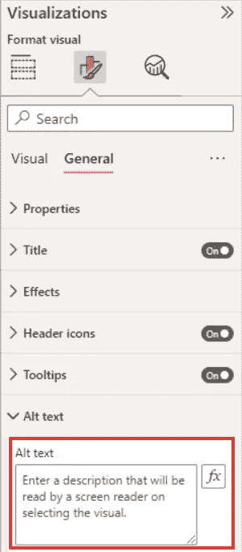
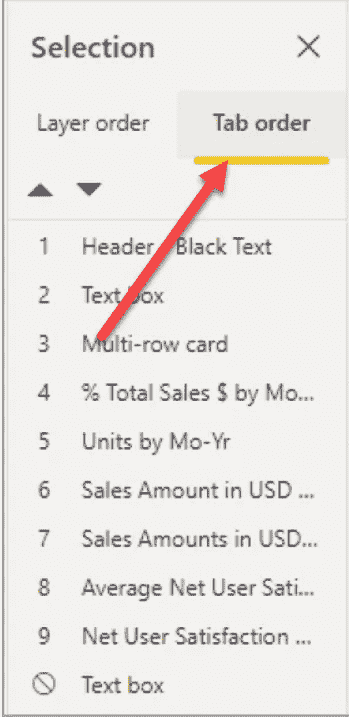
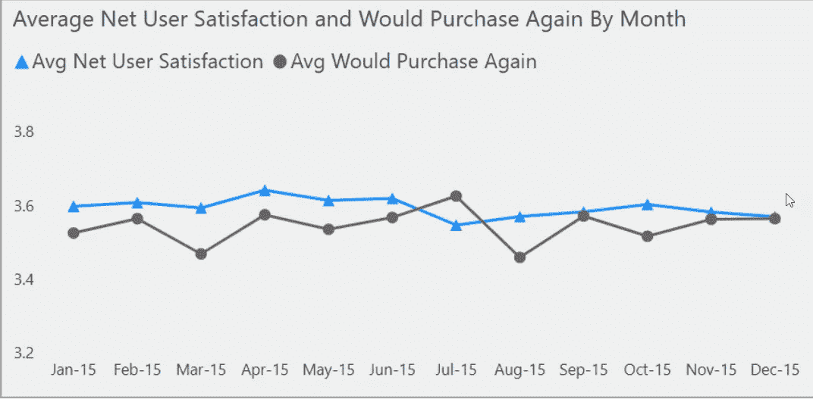

# 为可访问性设计电源 BI 报告

> 原文：<https://towardsdatascience.com/designing-power-bi-reports-for-accessibility-70a152df7d77>

## 设计 Power BI 报告是一回事，但设计可访问性需要完全不同的思维方式

作者图片

您可能知道，同一份报告在不同的设备上看起来可能完全不同。包含完全相同的数据点的 Power BI 报告，在桌面上看起来与在移动电话上看起来完全不同。

类似的情况适用于不同的人——你必须记住，你的用户可能有视觉、运动或认知障碍。因此，从有缺陷的用户的角度来看，同一个报告可能看起来不同。

# 为什么可访问性很重要？

如果你问自己:为什么可访问性很重要？让我给你看一个非常基本的例子。如果你是一个正常人，当我说正常时，我的意思是你没有任何视觉障碍，这就是你将如何看到这个漂亮的气球飞过绿色的田野:

作者图片

但是，如果你被诊断为“多盲症”,这是一种绿色盲障碍的医学名称，同样的图片看起来会非常不同，你不同意吗？

绿盲症

这同样适用于报告中使用的颜色。考虑到这一点，您应该始终将您的报告设计为尽可能多的用户可以访问。

# Power BI 中的辅助功能

幸运的是，Power BI 提供了一整套内置的辅助功能。其中有些甚至不需要额外的配置，下面就简单介绍一下:

## 内置功能

*   ***键盘导航*** —所有 Power BI 视觉效果都是“键盘友好的”，您可以在它们之间导航。您也可以单击问号来访问最常用的键盘快捷键

作者图片

*   ***屏幕阅读器*** —一般来说，每个 Power BI 对象都兼容屏幕阅读器
*   ***高对比度颜色*** —如果您在 Windows 中设置高对比度模式，Power BI 将自动检测 Windows 中使用的主题，并将相同的设置应用于您的报告。要在 Power BI 服务中手动设置主题，当您处于报告的编辑模式时，选择**视图** > **高对比度颜色**，并选择您想要应用的主题

作者图片

*   ***聚焦模式*** —使用户能够在屏幕上占据更多空间
*   ***显示数据表***——使用快捷键 Alt Shift F11，用户可以从视觉上切换到数据的表格视图

## 可配置功能

除了这些不需要任何额外配置的内置功能，Power BI 还提供了一组开箱即用的功能，但它们需要由报告作者进行配置。让我们来看看所有这些特性:

*   ***Alt text*** —允许您在报表页面上添加可视元素的文本描述。这样，即使用户看不到视觉效果本身，他们也能理解视觉效果所提供的信息

作者图片

*   ***Tab 键顺序*** —帮助平滑报表元素之间的键盘导航，匹配用户对相同元素的可视化处理方式。您可以启用视图选项卡下的选择窗格，并配置选项卡顺序:

作者图片

*   ***标题和标签*** 对你的视觉元素提供清晰度是极其重要的。因此，避免使用首字母缩写词和其他缩写词，因为这可能会给用户造成混淆
*   ***标记*** 是提高系列图像可读性的强大技术

作者图片

*   最后，仔细选择 ***报告主题、*和**颜色。不要忘记气球和绿色田野的照片，因为色觉缺陷的用户可能会对基于色盲不友好颜色的数据理解有问题。以下颜色组合对于色觉缺陷的用户来说尤其困难:
*   绿色和红色
*   绿色和棕色
*   蓝色和紫色
*   绿色和蓝色
*   浅绿色和黄色
*   蓝色和灰色
*   绿色和灰色
*   绿色和黑色

# 电源 BI 报告的可访问性清单

让我们快速重申一下设计具有可访问性的 Power BI 报告的最佳实践:

*   确保报告元素之间的颜色对比度至少为 4.5:1
*   尽量避免使用颜色作为传递信息的唯一方式。您可能想用文本或图标来补充颜色。
*   始终使用清晰的报告元素文本描述。
*   如果您在报告中使用非装饰性的视觉效果，请确保在其中添加替代文本
*   为报告选择调色板时要小心，并确保色觉障碍的用户也能理解数据
*   避免使用工具提示作为传递重要信息的方法。对于有运动障碍的用户或没有电脑鼠标的用户来说，很难使用它们

# 结论

设计报表是一回事，但是为可访问性而设计需要完全不同的思维方式。许多报表开发人员基于大多数没有视觉障碍或任何其他障碍的消费者来“校准”他们的解决方案和可视化。但是，无论何时创建整体解决方案，您都必须记住那些在使用数据时可能面临问题的用户。

请这样想:如果您在为移动设备设计报表时，需要相对于“常规”桌面体验调整您的方法，那么您也应该为具有不同需求的用户调整您的设计方法。

如果你想了解更多关于 Power BI 中的可访问性设计，我强烈推荐你阅读 Meagan Longoria 关于这个主题的文章。

感谢阅读！