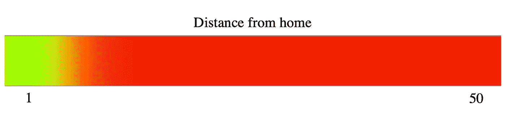
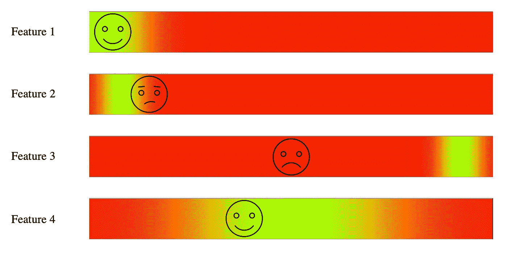

# 为人员数据设计 XAI

> 原文：<https://towardsdatascience.com/designing-xai-for-people-data-f41bc4cf1fc8>

## 使用人员数据的三个表格桩

人-数据是敏感的，我们的算法应该公正对待数据集中涉及的人。在这篇文章中，我将深入一个实际的例子，同时强调三个必须具备的条件，让你的见解变得有价值和有效。在 [Two Story](http://twostory.com) 我们的工作中融入了所有这些实践。

处理人员数据的风险很高，我们在 [Two Story](http://twostory.com) 了解到这一点。照片由[亚采克·迪拉格](https://unsplash.com/@dylu?utm_source=medium&utm_medium=referral)在 [Unsplash](https://unsplash.com?utm_source=medium&utm_medium=referral) 上拍摄

# **简介**

随着人工智能的进步，社会要求算法处理数据的方式更加透明。当仔细检查时，一种特定类型的数据比其他数据更突出，这就是*人员数据*。我们负责高度监控这类数据和算法处理。有意或无意滥用人的数据会产生后果。例如,@[Julien Lauret](https://medium.com/@julienlauret?source=post_page-----e3d14816d98e-----------------------------------)的[1]强调了偏见是如何发生在任何人身上的(即使是亚马逊)。虽然这只是一个例子，但在处理人们的数据时，还有更多偏见的情况，所以我们必须深刻理解我们的数据/人工智能的含义。

***免责声明:我坚信 XAI，所以这篇文章带有 XAI 式的偏见。***

我花了好几年时间研究“人工智能”和数据科学，我从事的项目很少对现实世界产生影响，因为它们从未离开过实验室。但是，毕业后，我进入了“工业”具体来说，是一个几乎专门处理人事数据的职位。在本文中，我将通过一个实际例子来说明我是如何构建 XAI 来容纳这些敏感数据的。我将使用合成的 IBM 流失[2]数据集来展示影响结果的洞察力。

# **全局解释**

> ***点:给模特所学的大图***

我开始走这条路，我们寻找不同的用例来应用数据科学工具。一个最明显的例子是根据心理测量数据预测员工的绩效/保留率。所以，我用我的数据科学工具来解决这个问题，我意识到它们是不够的。我的困惑矩阵看起来很棒；我的准确性是惊人的。但是，我的同事们并不在意。他们想明确地知道数据中的模式——关键特征是什么。这是个问题。我无法用大多数开源包中的基本分类算法给出他们想要的答案。所以，我回到绘图板，我有了一个灵感。他们在寻找一种工具来生成最重要的特征；这是一项功能选择任务。不幸的是，标准的特征选择工具不能提供所需的洞察力。以防你不知道，人们充满了不确定性。我是模糊逻辑[3]的忠实粉丝，我意识到人是模糊的。因此，模糊算法将是最合适的。有了这些信息，我学会了将人们与结果数据联系起来的隶属函数。例如，从 IBM 流失数据集获得的成员资格值如下:

图片由我来展示“甜蜜点”(绿色)，表示某人将留在公司的位置。

为什么这很重要？嗯，模糊的输出是可以被人类理解的。如果这些特征是可预测的，最终用户可以做出数据驱动的决策，定制他们的策略以获得更好的现实结果。例如，离家的距离是一个突出的特征，因此来自该数据点的可操作的见解将使公司能够改进其对那些离家较远的人的保留策略。

了解模型的全局可以为最终用户提供信息，以便做出更好的现实决策(即使有些决策没有内置到 AI 中)。使用模型，人类可以应用上下文。例如，如果这家公司正在考虑一个新的位置，他们可以考虑这种类型的洞察力，以确保他们在某个地方建立他们的新网站。

# **本地解释**

> p***point:给一个具体的例子以上下文***

全局解释提供了模型所学内容的大画面。再深入一点，终端用户也想了解为什么一个人工智能会做出一个特定的预测。像 LIME [4]这样的算法很好地解释了为什么一个人工智能会做出一个特定的决定，但是它们在处理“黑箱”时表现得更好。但是，所学的隶属函数也是可以解释的。我们可以显示“触发”了哪些规则，从而有效地回答了哪些特征对预测值产生了哪些影响。例如，我们学习了 IBM 数据集中一些不同特性的以下规则。

图片由我提供。突出显示数据集中由个人触发的规则(绿色表示好，红色表示有问题)

你可以想象，如果一个人明白“特征 3”是他们最有可能辞职的原因，这将如何为他提供如何留住人才的最佳视角。提供可操作的见解发生在多个层面。

# 准确(性)

> ***要点:精准驱动 XAI 关联***

如果你关注过我的任何一篇文章[5，6]，我通常会把重点放在对算法的解释上。然而，如果模型没有学到任何预测性的东西，那么任何解释都没有意义。如果模型只有 10%的准确性，那么学习到的规则只在 10%的时间里适用。必须注意 XAI 和分类优化算法之间的典型权衡。对于 IBM 数据集，我已经能够找到一个模糊规则库，它能够以 70/30 的训练/测试分割预测 80%的准确率。然而，我发现了一些例子，用户可以预测高达 90%的准确率。因此，重要的是要注意，伟大的解释将以降低准确性为代价。

# 包扎

总之，处理人们的数据是一个敏感的领域，典型的算法并不能解决这个问题，因为它们并没有针对处理这些数据进行优化。在尝试提供以人为本的可行见解时，我最大的收获是:

1.  **解释全球模式允许人类在其他情况下应用这些模式**
2.  **局部解释可以为数据集中的个体提供价值**
3.  **准确性为解释注入信心**

然而，我们知道得比这更好，我们通过创建全球和本地解释以及高度精确的模型来保持更高的标准。

# 参考

[1][https://becoming human . ai/amazons-sex ist-ai-recruiting-tool-how-do-it-go-so-wrong-e3d 14816 d98e](https://becominghuman.ai/amazons-sexist-ai-recruiting-tool-how-did-it-go-so-wrong-e3d14816d98e)

[2][https://www . ka ggle . com/drghulamhussain/IBM-HR-attachment-analytics/data](https://www.kaggle.com/drghulamhussain/ibm-hr-attrition-analytics/data)

[3][https://medium . com/forward-data-science/fuzzy-systems-life-between-the-1s-and-0s-949 de 445 f 58 e](https://medium.com/towards-data-science/fuzzy-systems-life-between-the-1s-and-0s-949de445f58e)

[https://homes.cs.washington.edu/~marcotcr/blog/lime/](https://homes.cs.washington.edu/~marcotcr/blog/lime/)

[5][https://medium . com/forward-data-science/the-most-the-important-types-of-xai-72 F5 be B9 e 77 e](https://medium.com/towards-data-science/the-most-important-types-of-xai-72f5beb9e77e)

[6][https://medium . com/forward-data-science/are-we-thinking-about-explability-backwards-c9a 719 CB 1250](https://medium.com/towards-data-science/are-we-thinking-about-explainability-backwards-c9a719cb1250)

B ryce Murray 博士是 [Two Story](http://twostory.com) 的应用人工智能科学家，他在那里构建算法来实现新兴技术和规模人员分析。他在可解释的人工智能数据融合方面的工作已经发表在 *IEEE 计算智能新兴主题汇刊*和其他地方。布莱斯的专业领域包括数据融合、深度学习、机器学习和模糊逻辑。他在密苏里大学获得了电子和计算机工程博士学位。