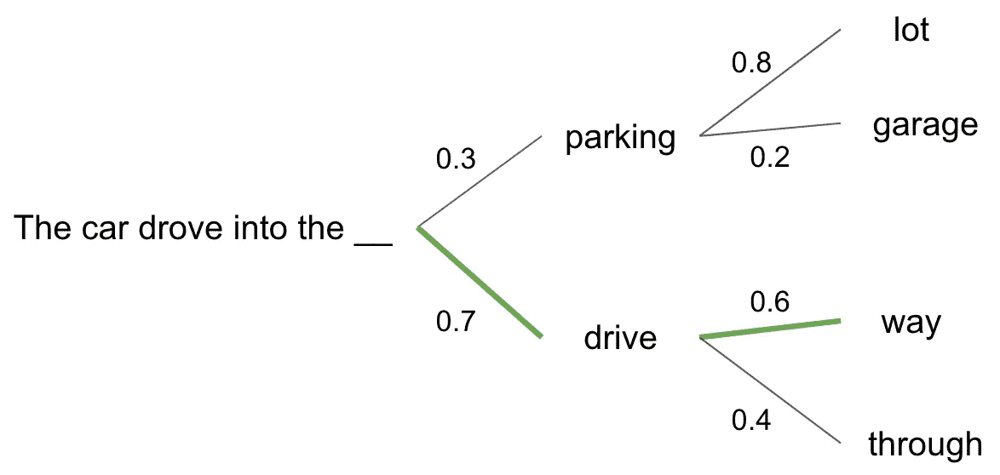
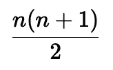
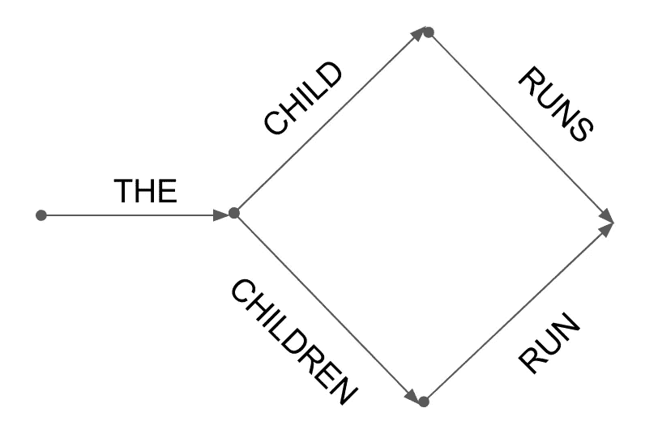
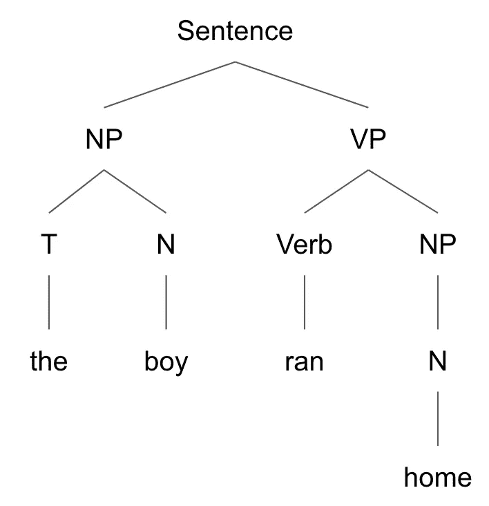

# 尽管取得了巨大成就，大型语言模型仍然没有对语言学做出贡献

> 原文：<https://towardsdatascience.com/despite-their-feats-large-language-models-still-havent-contributed-to-linguistics-657bea43a8a3>

## 乔姆斯基的语言学和语言学硕士观述评

照片由 [DeepMind](https://unsplash.com/@deepmind?utm_source=unsplash&utm_medium=referral&utm_content=creditCopyText) 在 [Unsplash](https://unsplash.com/s/photos/large-language-models?utm_source=unsplash&utm_medium=referral&utm_content=creditCopyText) 上拍摄

在你拿着干草叉和火把来找我讨论这个有争议的话题之前，请听我说完。在过去的几年里，我们已经看到了关于大型语言模型(BERT、GPT-3、LaMDA 等)的标题和例子。)可以做的事情—从情感分类、文本生成、问题回答等任务中的能力爆炸。

本文并没有质疑大型语言模型(LLM)在过去五年中取得的工程进展。更确切地说，这是一个关于语言学硕士对语言学科学贡献的评论。我将主要讨论诺姆·乔姆斯基教授对语言学的观点和看法，以及最近的法学硕士；我将引用以下来源:

*   乔姆斯基接受《机器学习街谈巷议》([开始于 2:34:34](https://www.youtube.com/watch?v=axuGfh4UR9Q&ab_channel=MachineLearningStreetTalk) )
*   乔姆斯基的著作"[句法结构](https://www.amazon.com/Syntactic-Structures-Noam-Chomsky/dp/1614278040/ref=sr_1_1?qid=1669226953&refinements=p_lbr_one_browse-bin%3ANoam+Chomsky&s=books&sr=1-1)

让我进一步指出，这并不意味着贬低工程的重要性，我对乔姆斯基的理论和观点的解释可能不是最好的——任何错误的论点都可能是由于我平庸的解释。我强烈建议你去看他的采访(也看看他的书)！

# 目录

*   ****理科 vs 工科****
*   ****乔姆斯基的 3 个模型****
*   *新的法律硕士真的“理解”语言吗？*
*   ****为什么更多的计算对相同的范例没有帮助****
*   ****决定论和自由意志问题****
*   ****从这里到哪里？****
*   ****这对我们意味着什么？****

# *对于那些不熟悉…*

## ***大型语言模型***

*语言模型是概率模型，试图映射单词序列(短语、句子等)的概率。)出现(即一个句子出现的可能性有多大)。他们在一组文本上接受训练，并从中得出概率分布。LLM 和普通语言模型之间的关键区别在于，LLM 是在数量大得多的文本上训练的，计算量也是指数级的。*

*在涉及文本生成的任务中(例如:摘要、问题回答、提示完成)，LLM 在尝试生成文本时会使用条件概率。换句话说，当决定挑选下一个单词时，LLMs 将查看序列中的前一个单词，并基于此选择最有可能匹配的单词。请参见下面的示例:*

**

*基于上下文的下一个单词的概率示例(图片由作者提供)*

*想要一个好的、高水平的解释，请听听斯坦福大学的克里斯托弗·曼宁博士的演讲。*

## *诺姆·乔姆斯基教授*

*乔姆斯基也许是上个世纪最著名的语言学教授。[自 20 世纪 50 年代](https://chomsky.info/2002____/)以来，他用他的[普遍语法](https://sbs.arizona.edu/chomsky/about)的概念和想法以及他对我们如何学习的传统观念的挑战，改变了语言学和认知科学的领域——争论有多少知识和行为是大脑/大脑与生俱来的。*

*至少可以说，他在麻省理工学院的大量工作很有影响力；他的谈话和采访提供了深刻的见解。在研究自然语言处理的现状与语言学的关系时，提到他是再合适不过了。*

# *科学 vs 工程*

*在“机器学习街谈”采访的开头，乔姆斯基明确区分了科学和工程:*

*   *科学需要质疑和 ***理解*** ***为什么*** 事物是自然的，为什么它们不以其他方式发生——它寻求 ***解释*** 我们在现实世界中目睹的潜在现象。*
*   *工程学是应用我们从科学中所知道的来解决问题。*

*然后他提出了一些来自自然科学的类比:*

*   *如果一名研究人员看到一个物体落在窗外，简单地记录事件并回放视频就能解释重力是如何工作的吗？*
*   *如果一名研究人员看到什么东西着火了，记录下来并回放视频会解释燃烧反应是如何进行的吗？*

*人们可以模仿上面的例子，但是仅仅模仿无助于我们理解 ***为什么*** 这些现象正在发生，以及 ***为什么*** 别的什么(在这些条件下)。*

*乔姆斯基接着指出，语言学硕士(像 GPT-3)没有帮助我们理解语言学背后的科学——他们没有解释语言/语法是如何或为什么以这种方式运作的。相反，因为这些 LLM 以概率的方式运行，它们只是尽最大努力模仿一个人在给定的上下文中会说/写什么。此外，由于 LLM 的概率性质，他们也有机会产生不合语法的句子。*

*最终，LLM 遵循一种“一切皆有可能”的方法——它们有时会产生无意义的东西，并且它们无法映射一种语言中所有可能的正确句子。在自然科学中，当我们有一个定理/定律(例如:牛顿万有引力定律、燃烧理论等。)，它需要解释和包含所有可能的情况。*

*   *[牛顿引力定律](https://en.wikipedia.org/wiki/Newton%27s_law_of_universal_gravitation)适用于任何 2 个有质量的物体，具有普适性。*
*   *[燃烧理论](https://en.wikipedia.org/wiki/Combustion)告诉我们，为了发生燃烧反应，氧气(更具体地说，是一种氧化剂)必须存在。*

*每个定律/理论的公式(在上面的链接中)在所有情况下都是一致的。*

> *一种语言可以产生无限多的句子。LLM 可能擅长产生最可能的句子，但这并不意味着它有一个公式或定理可以表示所有可能的语法句子，同时排除不可能的(不合语法的)句子。我们看到自然科学在这方面有所不同，如上所示。*

# *乔姆斯基的三个模型*

*为了更好地理解乔姆斯基的观点，让我们绕个弯子，看看他在《句法结构》(乔姆斯基，1957)一书中对语言结构模型的研究。*

*在这本书的核心，乔姆斯基说:“语言 L 的一个**语法**本质上是语言 L 的一个**理论**。任何科学理论都是基于有限数量的观察，并且它寻求联系观察到的现象，并通过根据假设的构造(例如在物理学中)“质量”和“电子”)来构建一般规律来预测新的现象。”(乔姆斯基，1957 年，第 49 页)。*

*这意味着，一种语言的正确的“T20”语法(一种理论/公式)将允许一个人从中推导出所有语法正确的句子，同时不会产生语法错误的句子。*

*   *打个比方，在数学中，我们有一个简单的公式，它允许我们映射从 1 到 n 的所有整数的和:*

**

*从 1 到 n 的所有整数的总和(图片由作者提供)*

*上面的公式适用于所有的 n 值，同样，一个合适的“语法”需要适用于一种语言的所有语法句子。*

*乔姆斯基涵盖了以下三种语言结构模型:*

## *有限状态*

*有限状态语法使用有限状态来表示句子。换句话说，它从一个词(某个状态)开始，从那里开始，有有限数量的下一个状态。*

**

*图 1:产生两个句子的有限状态语法(图片由作者提供，灵感来自乔姆斯基(1957))*

*图 1 显示了一个简单的有限状态语法，灵感来自书中的一个例子(Chomsky，1957，第 19 页)。我们可以看到，所有的句子都以单词“the”开头，只有两种可能的结果(“孩子跑了。”，“孩子们跑了。”).这种语法看起来非常类似于当前 LLM 的操作方式(**,它来自 20 世纪 50 年代！**)，但是没有考虑概率。我们在这个模型中有更多的控制权，因为我们可以显式地排除会导致不合语法的句子的状态(而 LLM 有时仍然可以产生它们)。*

*我们显然想要比图 1 中的语法更复杂、更广泛的东西，但即使这样，也不能产生英语中所有符合语法的句子，因为**英语(像许多语言一样)不是有限状态语言**！这是因为句子的语素结构不能以有限状态格式映射。我们有后缀、前缀、单词的不同形式/时态等。这取决于句子及其结构。正因为如此，有限状态语法对于语言来说不是合适的语法。*

## *短语结构*

*短语结构语法以不同的方式处理句子映射。它获取一个句子，将其分解成短语，更具体地说是一个名词短语(NP)和一个动词短语(VP)，然后进一步将每个短语分解成其部分(词类，如冠词、名词、动词等)。).*

**

*图 2:短语结构语法的一个例子(图片由作者提供，灵感来自乔姆斯基(1957))*

*图 2 显示了一个短语结构语法的例子，这个例子受到了书中(乔姆斯基，1957 年，第 27 页)产生句子“男孩跑回家”的启发这比有限状态语法更强大，因为它不局限于以严格的线性方式(从左到右，一次一个单词)在句子中生成单词。*

*然而，这种语言结构也是不完美的，因为它不能应用于某些自然语言(因此，不能产生所有的语法句子)。乔姆斯基提出了下面的两个句子的例子(乔姆斯基，1957 年，第 36 页):*

*   *“这部电影的场景是在芝加哥”*
*   *“我写的那个场景是在芝加哥”*

*这些简单的句子可以用短语结构语法产生，但是如果我们试图用相同的范例将它们组合成一个更复杂的句子，我们最终会得到不合语法的句子:*

*   *“我写的这部电影的场景是在芝加哥”*

*这是一个有点棘手的概念，但它的缺陷最好通过例子来展示，就像上面的例子。*

## *转换结构*

*转换结构语法采用短语结构范式，但结合了删除、插入和移动等转换以及形态音位规则。al)。所有这些转换都可以应用于短语结构语法中呈现的短语，使得转换结构语法更加强大。*

*在这种模式下，短语结构部分中的示例 2 句子可以组合成如下形式:*

*   *“我在电影中写的场景是在芝加哥”*

*在采访中，乔姆斯基说第三种语法开始变得有意义，因为它开始告诉我们一些关于语言的事情，而不是像其他两种那样简单地“描述”它。我个人不确定这个理论的缺点，但它看起来需要很多特定的转换规则才能工作，这使得它与自然科学中的普通理论相比不那么优雅。在映射所有可能的语法句子方面，它无疑显得更加灵活和通融。*

# *新的 LLM 真的“理解”语言吗？*

*关于 LLMs 能力*的新闻循环中充斥着令人不快的标题，这可能会给你一种印象，即它们“理解”人类语言。已经到了一些人声称像 LaMDA 这样的车型已经[实现了感知](https://www.wired.com/story/lamda-sentient-ai-bias-google-blake-lemoine/)的地步。**

*我认为有很多例子可以证明这种观点是错误的，比如 GPT-3 [在一些推理任务中无法产生可接受的输出](https://www.technologyreview.com/2020/08/22/1007539/gpt3-openai-language-generator-artificial-intelligence-ai-opinion/)。以下面的任务为例:*

*   *输入:“你正在举行一个小型晚宴。你想在客厅准备晚餐。餐桌比门口宽，所以要把它搬进客厅，你必须。”*
*   *输出:"**拆下门。你有一个台锯，所以你把门切成两半，去掉上半部分。**”*

*GPT-3 不仅不能解决让桌子通过门口的任务，还留给你一扇坏门！*

*还有一个有趣的例子，人工智能研究员贾内尔·谢恩向 GPT-3 展示了当被问及作为一只松鼠是什么感觉时的反应。*

*从本质上讲，LLM 非常擅长在正确的环境下模仿人类语言(他们知道如何以正确的方式回应)。此外，他们仍然可以通过产生语法错误的句子来违反语言原则(他们也可以产生无意义的句子)。*

*即使我们获得了更精确的 LLM，这也仅仅意味着产生“不可接受”输出的边缘情况会更少。假设这些模型满足 99.999999%的用例，以至于我们很难找到任何提示来混淆它们——它们仍然以概率的方式运行。*

# *为什么更多的计算无助于相同的范例*

*在采访中，乔姆斯基坚持认为，即使我们增加更多的计算来训练更大、更复杂的模型，最终，我们仍然不会有什么东西来产生合适的语言语法/理论，正如我们之前所描述的那样。同样，概率模型的本质阻止了这一点。他们将能够产生更多可接受的输出，在正确的场景中模仿正确的反应，但这并不意味着他们能够描绘出每一个可能的语法正确的句子。*

*区分语法正确的句子和有意义的句子是很重要的。一个句子可能是无意义的，但语法上是正确的。以乔姆斯基的经典例子为例:*

*   *"无色的绿色想法疯狂地沉睡."(乔姆斯基，1957 年，第 15 页)*

*这句话符合语言的原则，但绝对没有意义。而且因为没有意义，所以发生的概率很低。鉴于 LLM 的性质，他们不会产生这样的句子，因为它们不太可能发生。有无限多的语法正确，但同时又无意义的句子不能被 LLM 映射，不管它有多强大。*

# *决定论和自由意志问题*

*一些人认为，人类在给定的上下文中说出/写出最可能的回答，并暗示如果 LLM 真的擅长选择可能的回答(满足 99.999999%的用例)，那么他们将“理解”语言。这开始分支到人类是否以决定论的方式运作，以及我们是否有自由意志的争论。*

*我喜欢乔姆斯基的观点，那些认为人类以决定论的方式运作的人[通过这样做证明了自由意志的存在](https://www.youtube.com/watch?v=J3fhKRJNNTA&ab_channel=Chomsky%27sPhilosophy)。否则，他们为什么要被迫这样做？显而易见，人类不仅仅使用光束搜索来思考、说话和写作。*

# *从这里去哪里？*

*你们中的一些人可能会想，“这个乔姆斯基只是一个黛比·唐纳”。嗯，我们也可以看看深度学习领域的其他杰出人物，比如 Yann LeCun。LeCun 已经公开表示，为了在设计“理解”系统方面取得下一个飞跃，我们需要“[放弃概率模型](https://www.zdnet.com/article/metas-ai-luminary-lecun-explores-deep-learnings-energy-frontier/)”。*

*他提倡“基于能量的模型”，这种模型来源于统计物理学，可以克服概率模型的一些缺点。他还提出了一个新的[“世界模型”架构](https://ai.facebook.com/blog/yann-lecun-advances-in-ai-research/)，这可能有助于系统理解我们所看到的世界并与之互动。*

*我不知道这些新想法会有多有效，而且 LeCun 自己也说过这可能不是正确的方法，但最终，我们需要放弃这些[本质概率方法](https://twitter.com/ylecun/status/1496706591923617792?lang=en)。*

# *这对我们意味着什么？*

*可能没什么(有点虎头蛇尾，我知道)。作为数据科学家/机器学习工程师/无论你有什么头衔，在这个领域，我们只关心提供商业价值。如果 LLMs 可以作为一项满足我们需求的工程壮举，即使它们实际上并不“理解”，也没有关系。事实上，我认为这让我们的事情变得更容易，因为我们不必担心这些系统会像人类一样理解/变得“有知觉”并开始机器人起义。我们可以放心地知道，这些 LLM，不管它们有多好，本质上都将是很好的模仿工具。*

*这与我们过去几年在 LLM 崛起的过程中所看到的观点完全不同。我发现乔姆斯基的评论在 LLMs 收到的广泛宣传中非常发人深省，并作为评估我们在哪里的一个很好的思想练习！*

*作为一个喜欢和 LLM 一起工作的人，我认为这种批评是必要的，以便在 NLP 中开发下一个突破，而不是陷入困境。*

## *参考*

*[1] N .乔姆斯基，*句法结构* (1957)，马蒂诺*

*[2]k·达格尔，t·斯卡夫和 w·萨巴， [*#78 —诺姆·乔姆斯基教授(特别版)*【视频】](https://youtu.be/axuGfh4UR9Q) (2022)，机器学习街谈*

*[3] B. Duiganan，E. Hamp，J. Lyons 和 P. Ivi，[乔姆斯基语法](https://www.britannica.com/science/linguistics/Chomskys-grammar) (2012)，大英百科全书*

*[4] T. Ray， [Meta 的人工智能杰出人物 LeCun 探索深度学习的能量前沿](https://www.zdnet.com/article/metas-ai-luminary-lecun-explores-deep-learnings-energy-frontier/) (2022)，ZDNet*