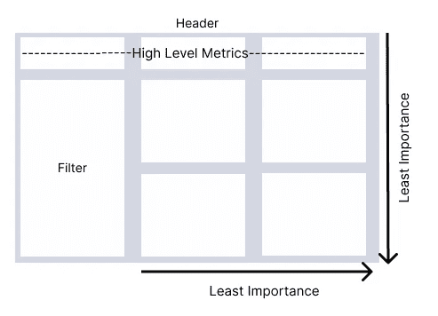
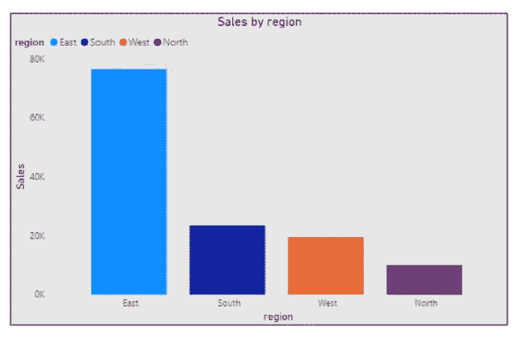
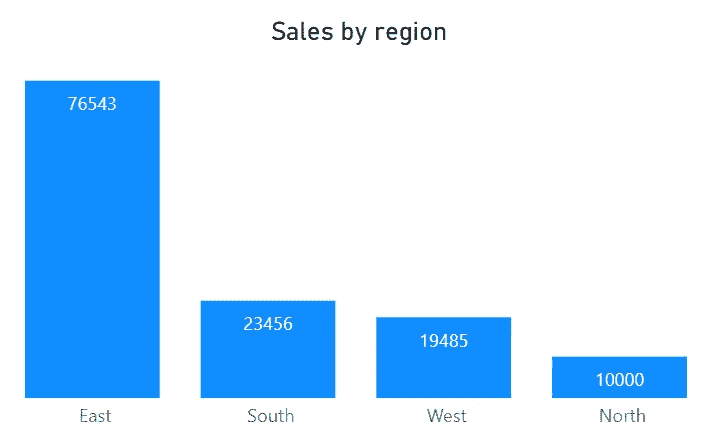
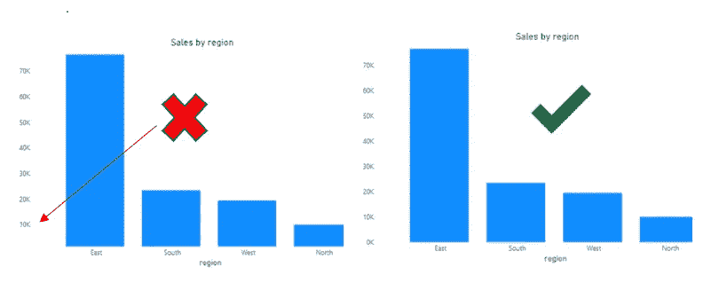
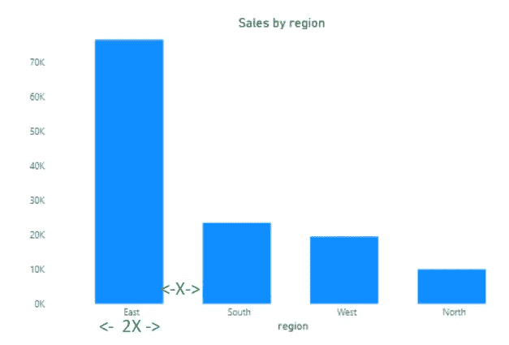
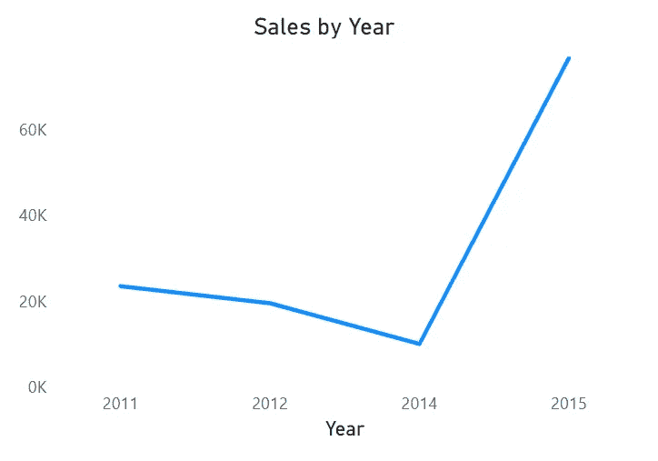
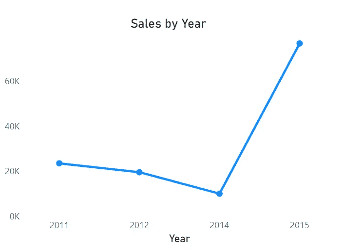
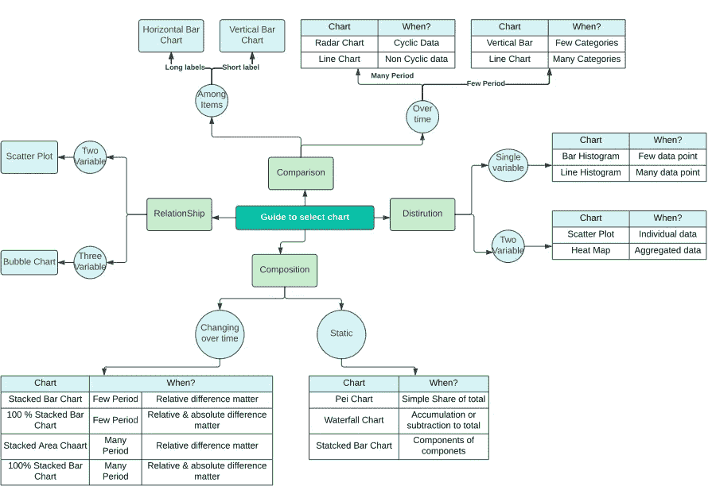

# 专业人士使用的详细仪表板设计指南

> 原文：<https://towardsdatascience.com/detailed-dashboard-design-guidelines-used-by-professionals-c4c612b6d92>

## 设计仪表板的技巧

在 [Unsplash](https://unsplash.com/?utm_source=medium&utm_medium=referral) 上由 [Carlos Muza](https://unsplash.com/@kmuza) 拍摄的照片

数据分析师通过获取原始数据并将其转化为数据驱动的可视化数据来赋予数据意义，从而帮助企业发展。所有这些看待事物的方式只有在布局和图表正确的情况下才有帮助。一致的布局和图表设计有助于确保外观上的小差异看起来不像大差异，并改变受众对数据的理解方式。

本文的目标是描述、定义并举例说明我公司的数据分析师在谈论数据时是如何使用样式元素的。这将确保所有图表部分看起来都一样，并且当团队成员必须决定如何正确和一致地使用图表部分时，这将为他们节省时间。

# 布图设计

**组织设计整个仪表盘**

在将数据放在仪表板上之前，您应该考虑如何组织数据，以便最终用户可以轻松理解。除了显示事实，仪表板还应该考虑信息的叙述性流动。

*   将最重要的信息放在故事的开头，然后是支持信息和细节。
*   仅呈现手头任务所需的最少数据。
*   建议将标题放在顶部，过滤器面板放在左侧，高级指标放在顶部，可视化放在内容体上。
*   重要的指标应该在顶部和左侧，当你移动到右侧时，你会发现更少的重要指标。

报告的布局设计(图片由作者提供)

*   永远不要忽视停车标志的颜色。红色表示警告和错误，绿色表示成功或完成。
*   保留特定的色调，比如你的组织的主色(对我来说，是橙色)，来表示用户必须执行的活动。

# 图表设计

## **关于如何选择和设计每个图表的建议**

> Alberto Cairo(视觉和数据记者)说“图表不仅仅是插图，也不仅仅是图画，它们承载着意义”。

选择正确的图表并确保它包含所有重要信息是非常重要的。因为图表不是数据；这是对数据的看法。

**主旨** : **去掉噪音**

数据可视化中的“更少，但更好”意味着去掉不必要的东西，而只保留、改进和突出支持或显示我们试图用数据表达的东西。

我们经常犯这样的错误，向数据可视化添加太多不必要的东西。

**最大化数据:油墨比**

数据:墨水比率是用于显示数据信息的墨水(即像素)的比例。换句话说，去掉图形中不添加新信息的部分，即使用较少的墨水，会使图形更有效、更有吸引力，对观众来说也更重要。

举个例子，

最大化数据:油墨比之前的条形图(图片由作者提供)

使用上面的图表作为指导，你不需要一个灰色的背景，网格，图例，或者条形阴影和不同的颜色。X 标题和 Y 标题都没有添加任何内容，因为我们可以将它们放在图表的标题中。添加数据点比添加 y 轴更好。在最大化数据:油墨比之后，

最大化数据:油墨比例后的条形图(图片由作者提供)

# **减少杂乱的步骤**

**极少使用网格线**

使用尽可能少的网格线和刻度，并且只查看数据的范围和上下文。默认情况下，不应有主要或次要网格线。如果网格线对于阅读数据很重要，那么在能够看到网格线的情况下，网格线要尽可能的轻。

**移除边框**

删除图表周围的边框，以便有更多的空间。

**最小化标签**

您应该尽可能不引人注目地标记您的轴，以留出空间来强调轴上或数据中的关键点。在所有图表中统一标注轴。避免使用不常见的缩写。

**尽量减少图例的使用**

应该尽可能使用标签而不是图例来帮助用户理解数据可视化。

**坐标轴样式格式**

轴线和刻度线不应该在图表上占据太多的空间，但是它们应该易于阅读。使用柔和的颜色、字体和线条，不要太粗。只有在没有其他视觉线索来帮助用户理解其含义时，才需要使用轴标题。

**去掉不必要的装饰和效果。**

删除表单周围任何不必要的关键线条、阴影和斜角效果。

**不要试图展示太多。**

如果需要显示大量数据，避免将一个图表制作得过于复杂；相反，可以考虑使用几个更简单的图表。

**尽量减少颜色的使用**

从数据中去掉颜色编码，这些数据只是为了给出上下文或进行比较。为上下文信息使用更亮/更细的灰色线条，便于以后使用颜色突出显示。

# 突出显示数据的步骤

**焦点**

关注范围，使数据尽可能清晰。除非它不会带走重要的东西。

**使用颜色/线条粗细。**

让重要的信息突出出来，给它一个一致的颜色，并使线条变粗。

**直接标注**

标注能立刻引起最终用户注意的重要信息。

**突出显示重要的阈值和上下文范围**

您可以通过添加强网格线或更改颜色来显示阈值周围的数据。例如，如果跨越阈值是一个指标，则选择红色。

**添加图表的标题。**

这将有助于你传达你的信息。保留一个标题，告诉他们将在图表中看到什么。

# 改进演示文稿布局的步骤

# 你对图表的了解

**条形图:**条形图用于显示数字数据，如计数或百分比，其中较大的条形表示较大的数字或较大的百分比。

条形图(图片由作者提供)

**在**时使用条形图

*   比较不同观察值的数值。即年龄组、产品类别、级别
*   当你想显示相对数量时。比如哪个类别是最高或最常见的，以及其他组与其他组相比如何

**专业人员使用条形图所遵循的标准**

*   避免使用三维条形图
*   y 轴应以 0 开始。但是在某些情况下，比如发现小的变化，如果 y 轴不是从零开始也没关系。

零值基线(图片由作者提供)

*   条的宽度应该是条间距宽度的大约两倍。

带宽度说明的条形图(图片由作者提供)

*   如果所有的条测量相同的变量，使他们都有相同的颜色。颜色不同与事实无关。也就是说，在我们的例子中，我们有每个地区的销售额，因为销售额只是一个度量，如果每个条形是不同的颜色，最终用户会感到困惑。
*   如果有十个以上的类别，使用水平网格线和一个 y 轴；否则，直接识别数据点。

**折线图**:折线图是一种图表，用于显示随时间变化的信息。折线图是通过绘制一系列点并在它们之间画一条直线来制作的。

折线图(图片由作者提供)

**在**时使用折线图

*   显示一个变量随时间的变化。所以，当你想展示某样东西的价值如何随时间而变化，或者几样东西的价值如何随时间而变化。
*   如果多个变量具有相同的刻度，您可以用多条线显示多个变量。

**专业人员使用折线图遵循的标准**

*   尝试将单个图表中的行数限制在三到四行。更多并不总是更好。在同一个图表上放太多的线会让人难以理解，也违背了初衷。
*   图例应横跨图表的顶部，其排列应与图表的排列相对应。
*   避免使用双轴。双轴图表具有任意的刻度，这可能会(有意地)误导读者两个数据系列之间的关系。
*   当要绘制的点很少时，考虑显示所有的数据标记，而不仅仅是线条。如果显示点会妨碍图表的可解释性，另一种方法是在线中加入一个间隙来指示缺少值的位置。

带数据标记的折线图(图片由作者提供)

**饼图:**饼图是数据的圆形图形表示，它被分段以展示数字比例。

饼图(图片由作者提供)

**使用饼状图时**

*   表示整体的某一部分不相称地小或大。
*   如果您希望读者对数据中部分与整体的关系有一个总体感觉，那么比较切片的具体大小就不那么重要了。

**专业人士使用饼状图所遵循的标准**

*   使用饼图有几个缺点，例如占用更多的空间，如果有许多类别，就很难阅读，所以总是选择一个替代方案，如表格或条形图。
*   如果你必须使用饼图，保持不超过五组。
*   利用适当的配色方案突出关键信息。
*   考虑标记图表外的区域。

# 选择正确图表的备忘单

备忘单(作者图片)

# 结论

本文讨论了数据分析师在为仪表板制作布局和图表时应该遵循的一些规则。我认为，如果我们遵循这些规则，我们可以制作出不仅好看而且有助于统一整个组织的设计过程的仪表板。我希望你喜欢这篇文章，并希望它对你的工作有所帮助。如果你认为我错过了一个标准的定义，请留下评论。

**形象学分**

所有图片，除非特别注明，均为作者所有。