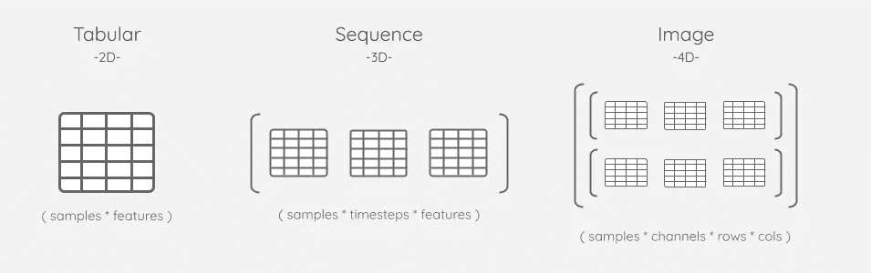

# 解缠结解码

> 原文：<https://towardsdatascience.com/detangling-decoding-7e8842edfa0a>

## 后处理是介于算法输出和洞察力之间的数据争论。


电唱机——图片来源:([unsplash.com/photos/-iKrBACW3lQ](https://unsplash.com/photos/-iKrBACW3lQ))

# 解码器模拟

如果你把一张黑胶唱片放在耳边，无论你吹掉多少灰尘，你都不会听到音乐。记录包含的信息以机器可读的格式编码。类似地，当机器学习算法返回预测时，它们通常以下列格式之一编码:

*   ***二进制****——*0(s)和 1(s)的组合。
*   ***按比例缩放*** —小数在-1:0:1 之间。

我们不能告诉我们的最终用户他们的服装尺寸是 *FloatTensor(-0.139374)* 或者他们的诊断是 *ndarray([0，0，0，1，0，0])* 。这些预测需要首先通过**解码**的过程变得可读。

[在之前的文章](/data-leakage-5dfc2e0127d4)中，我们简要地提到了 *fit()/transform()* 编码模式，其中 *inverse_transform()* 方法稍后用于解码。乍一看，解码过程似乎很容易，“只需运行 *inverse_transform()* 即可，对吗？”果然，当执行*监督的*分析时，解码预测相当简单，因为*标签*通常是与单个编码器相关联的单个列。

# 超越基础。



可视化阵列不断增加的维度(作者的[图片)](https://docs.google.com/drawings/d/1R6fae0-Os2Z1aEnlRAnl1T2VK46Y5tk0atQ_Qfx-mLw/edit?usp=sharing)

然而，当使用*生成*算法时，事情变得更加复杂。由于自我监督旨在再现原始*特征*的修改版本，解码这些预测需要跟踪许多适合混合列的编码器。让我们一步一步地了解在解码*(样本*时间步长*特征)*的 3D 形状预测时可能会遇到的挑战。随着这种情况的发生，我们将很快看到对解码数据的系统方法的需求——就像我们的唱机如何机械地翻译音乐一样。

与此同时，我们将看看[](https://github.com/aiqc/aiqc)**(这篇博文的作者开发的 MLOps 开源框架)如何应对这些挑战。**

> **[](https://github.com/aiqc/aiqc)**(别忘了⭐ )****

# ***事情变得支离破碎***

******

***使用混合编码方法的 3D 生成式预测的列[(作者图片)](https://docs.google.com/drawings/d/1m2YXR2pg5FqQw2BG23GGpK1q9WvDKbr2Bd0zNM7gWgc/edit?usp=sharing)***

## ***[💾](https://emojipedia.org/floppy-disk/) (1) **元数据要求。*****

*   ***如果我们一开始就没有坚持我们的 *fit()* ，那么我们基本上就不走运了。我们无法解码我们的预测，除非我们能以某种方式重现分裂/折叠，并重新*拟合()。*记录“哪个样本进入哪个分割”并不是常见的做法，因此这种变通办法不太可能。***
*   ***需要注意的一个主要缺陷是，一些编码器类根本没有 *inverse_transform()* 方法！最好在一开始就阻止它们的使用。***
*   ***由于一个 *fit()* 可以属于一个或多个列，我们需要一个“哪些列属于哪些编码器”的映射编码器通常不会保留这些元数据。***

```
***class FittedEncoderset():**
    fitted_encoders      = PickleField()
    job                  = ForeignKeyField(Job, ...)
    encoderset           = ForeignKeyField(Encoderset, ...) **class Featurecoder():**
    sklearn_preprocess   = PickleField()
    matching_columns     = JSONField()
    encoded_column_names = JSONField()
    leftover_columns     = JSONField()
    leftover_dtypes      = JSONField()
    original_filter      = JSONField()
    encoding_dimension   = CharField()
    only_fit_train       = BooleanField()
    is_categorical       = BooleanField()
    index                = IntegerField()
    encoderset           = ForeignKeyField(Encoderset, ...)*
```

***看一下 AIQC 数据库模式的源代码，我们可以看到每个 *Featurecoder* 都保留了在后处理期间对我们的预测进行反向工程所需的元数据。当*编码器集*适合分割/折叠时，一个*fitdencoderset*系统地捕获 *fit()* 。***

## ***🎶②**执行解码。*****

*   ***一旦我们知道我们需要做什么样的反变换，我们仍然会被卡住，因为编码器不支持高于 2 的维度。在应用 *inverse_transform()* 之前，我们需要将我们的宽 3D 阵列重新整形为一个高 2D 阵列。***
*   ***解码器不会就地覆盖列，而是生成独立的数据子集。所以我们需要在连接它们之前单独解码每个子集。***
*   ***如果使用了 OneHotEncoder() s，事情就会变得非常棘手。这类编码器根据其观察的类别数量产生 3+个编码列。它有一个 *categories_* 属性，包含 1+列名数组，这可以帮助我们确定我们的解码器应该切掉多少列。***

```
*import numpy as np
arr = np.array([[‘a’,1],[‘b’,2],[‘a’,4],[‘c’,3]])from sklearn.preprocessing import OneHotEncoder
OneHotEncoder().fit(arr).categories_"""
# Contains an array of discrete classes for each column.
[
    array(['a', 'b', 'c'], dtype='<U1'), 
    array(['1', '2', '3', '4'], dtype='<U1')
]
"""*
```

## ***📐(3) **对解码后的数据进行整形。*****

*   ***尽管已经执行了 *inverse_transform()* ，我们仍然需要将数据重新塑造成正确的形状。所以我们将把那个高大的 2D 阵列分成一个宽阔的三维阵列。***
*   ***由于编码器分别应用于子集，解码后的列顺序可能与原始数据中的列顺序不匹配。因此，在将列移回原位之前，我们必须对列映射进行逆向工程。***

> ***参考 [aiqc。Jobs.predict()](https://github.com/aiqc/AIQC/blob/main/aiqc/__init__.py#L6330) 方法来查看动态解码的效果。***

******

***计算尺—照片来源:([unsplash.com/photos/e6pPIcJ05Jg](https://unsplash.com/photos/e6pPIcJ05Jg))***

# ***自动化还是不自动化***

***对于评估的每个分裂/折叠以及数据集中包括的任何其他多模态特征，必须重复整个解码过程。***

> ****在实践中，解码具有挑战性，因为它需要关于原始样本的元数据，并且特征往往会在编码期间改变顺序并扩展。****

***向自动化 *MLOps* 迈进一步是不是很可怕？是的，尤其是对数据科学家来说；一个如此习惯于批判性思考他们对数据采取的每一个行动的含义的群体。然而，在面对上述问题并将其解决到 5D(彩色图像时间序列数据集或多站点多序列数据集)后，我可以向您保证这是一项乏味且容易出错的工作。最好用一个动态的、经过良好测试的系统一次性解决这类问题，而不是针对每个特定的分析从头开始解决它们。***

> ***机器学习是时候超越互联网代码片段的口述历史，进入一个定义良好的框架。***