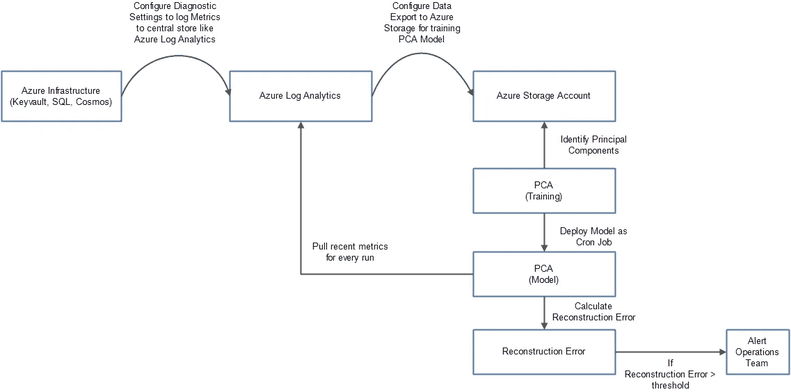
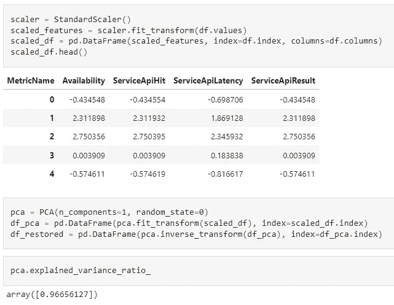
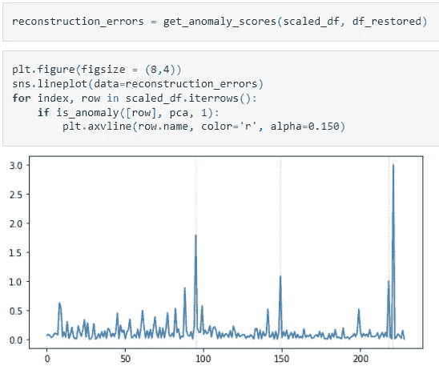

# 使用主成分分析检测遥测数据中的异常

> 原文：<https://towardsdatascience.com/detect-anomalies-in-telemetry-data-using-principal-component-analysis-98d6dc4bf843>

鲁珀特·布里顿在 [Unsplash](https://unsplash.com?utm_source=medium&utm_medium=referral) 上的照片

## 使用简单的方法主动识别遥测数据中的问题

异常检测在许多领域都扮演着重要角色，尤其是在金融和医疗保健领域。主动识别金融交易中的异常有助于避免巨额损失。同样，在医疗保健中，它有助于在诊断早期识别健康风险。这篇博客主要关注使用主成分分析(PCA)的异常检测(AD)的简单形式。我们将把该算法应用到一个众所周知的领域——应用遥测。我们将学习在更高的环境中识别罕见事件。这篇文章的要点是:

*   理解使用 PCA 的异常检测。
*   基于 PCA 的 AD 在云应用中的应用。
*   寻找异常的示例设计和代码。

在文章的最后，我们还学习了一些高级的异常检测方法。让我们开始吧。

# 什么是异常？

异常是指不规则的、意外的、罕见的数据，这些数据在很大程度上偏离了数据集中的其余记录。例如，如果有一个应用程序被 100 个用户访问，假设用户发出的每个唯一请求都会创建一个事件，该事件会向下游发送更多消息，从而消耗资源。在这种情况下，如果您注意到在很短的时间间隔内来自一个用户的数百万个请求，它可以被标记为罕见事件中最罕见的一个，一个异常。如果我是一名网站可靠性工程师，我希望有一个自动化系统，能够**检测-警告并阻止**此类事件不必要地消耗更多资源并导致其他地方的服务降级。理解异常并不总是坏事是至关重要的，某些罕见的事件，如采购订单的突然增加，对业务是有益的。没有适当的业务上下文，很难将数据项定性为异常。尽管如此，在管道的早期识别和检测它们通常是重要的。

# 用于异常检测的 PCA。

主成分分析主要是一种降维技术。它通过识别主要成分来工作。主成分是独立的特征向量，也称为给定数据的特征向量，其解释了数据中的最大方差。每个 PC 是现有相关特征的线性组合，并且与其他特征向量正交。使用主成分分析可以在不损失信息价值的情况下减少特征向量的数量。让我们看看如何为 IRIS 数据集找到 PC。

识别虹膜数据集的主成分

上面这段代码将一个数组输出为 array([0.92461872，0.05306648，0.01710261，0.00521218])。这意味着 92%的数据可以用第一个 PC 来解释，97% (92%+5%)的数据可以用第一个和第二个主成分来解释。因此，通过将特征维度从 4 个减少到 2 个，我仍然可以解释 97%的数据。这里的降维称为主分量。

异常检测依赖于重建误差。一旦 PC 被识别，通过选择所有的主成分，我们可以在没有数据丢失的情况下从变换的数据重建原始数据。类似地，通过只选择解释大部分方差的 PC，我们应该能够重建原始数据的近似值。生成原始数据时在重建期间产生的误差称为重建误差。对于数据中的异常，重建误差为**高**。

# 遥测数据中的异常检测。

Azure 允许您为云基础架构配置诊断，使用它我们可以详细捕获资源使用情况。除了资源使用情况，我们还可以将应用程序使用情况记录到一个名为 Log Analytics 的公共数据存储中。日志分析中的数据代表用户如何使用应用程序和基础架构。在下面的步骤中，我建议使用以下机制来使用日志分析数据识别异常。

使用遥测数据进行异常检测的逐步方法(图片由作者提供)

# 步骤 1:收集数据

使用诊断设置配置关键资源，并选择日志分析帐户目标。您可以设置连续导出或使用自定义查询下载所需的数据进行培训。例如，示例数据集[这里的](https://github.com/sriksmachi/sriksml/blob/main/data/pca_data.csv)包含每 1 分钟收集的 Azure Keyvault 指标。我只考虑了几个指标，但是您可以根据需要扩展它们。

# 第二步:PCA 培训

由于 PCA 是一个静态过程，在下面的步骤中，我们使用 PCA 对数据和训练进行归一化。在这里，我将特征尺寸从 4 个减少到 1 个。第一主成分足以解释 96%的数据方差。

PCA 培训(图片由作者提供)

# 步骤 3:重建错误

在该步骤中，我们确定重建误差阈值，该阈值将在将来用于识别异常。在这种情况下，我选择 1 作为重建误差的阈值。任何大于 1 的重建误差都被视为异常(下图中的红色垂直线)

重建错误(图片由作者提供)

您可以轻松地将这段代码转换为 cron 作业，该作业获取最新的 Azure 指标，使用 PCs 进行重构，如果任何数据点重构超过错误阈值，就会发出警报。helper 方法的源代码和完整的笔记本可以在[这里](https://github.com/sriksmachi/sriksml/blob/main/pca.ipynb)找到。

# 摘要

我们已经看到了使用主成分分析来自动检测和警告遥测数据中的异常的实用方法。我想提醒你，主成分分析并不是唯一用于异常检测的最大似然方法，其他方法有孤立树、一类 SVM 和局部异常 SVM。PCA 也有一些限制，主要是特征向量或主成分只能是现有特征的线性组合。如果数据不能用线性组合来解释，主成分分析就没那么有用了。在这些情况下，可以使用 t-SNE 等非线性方法。PCA 还降低了可解释性，因为实际特征被简化为线性组合，我们不再能够指出与目标向量高度相关的特定特征。