# 通过验证和通知尽早检测数据管道中的缺陷

> 原文：<https://towardsdatascience.com/detect-defects-in-a-data-pipeline-early-with-validation-and-notifications-83e9b652e65a>

## 使用深度检查和提督在 Python 中构建健壮的数据管道

# 动机

数据科学项目包括主要的组成部分，如获取数据、处理数据、训练 ML 模型，然后将其投入生产。

在将每个组件的输出提供给工作流中的下一个组件之前，验证每个组件的输出以确保每个组件正常工作是非常重要的。

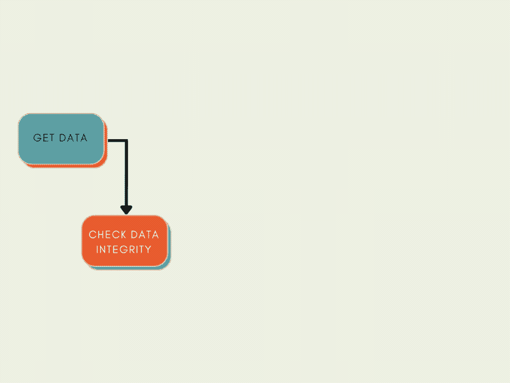

作者图片

在本文中，您将学习如何:

*   使用深度检查来验证数据科学管道研究阶段的组件
*   使用提督在验证失败时发送通知

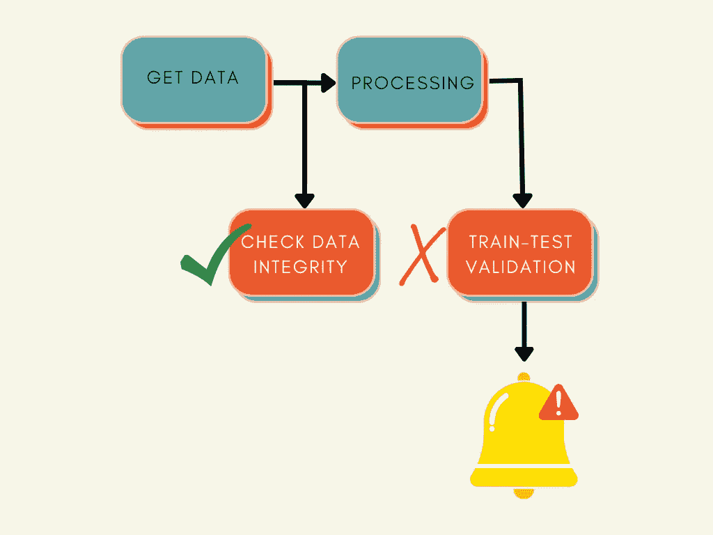

作者图片

# 建立

[Deepchecks](https://docs.deepchecks.com/en/stable) 是一个 Python 库，用于测试和验证你的机器学习模型和数据。

要安装 Deepchecks，请键入:

```
pip install deepchecks
```

Prefect 是一个 Python 库，可以监控、协调和编排应用程序之间的数据流。

要安装提督，请键入:

```
pip install -U prefect
```

本文中使用的提督版本是 2.0.2:

```
pip install prefect==2.0.2
```

# 创建验证套件

## 数据完整性套件

数据完整性套件允许您在拆分数据或使用数据进行处理之前验证数据。

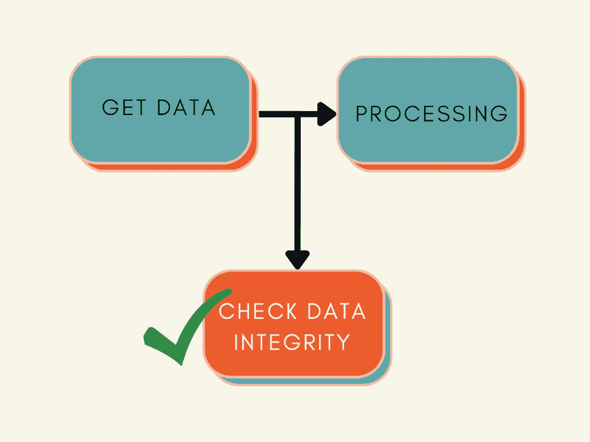

作者图片

创建带有深度检查的验证套件有两个步骤:

*   定义一个数据集对象，该对象保存关于数据集的相关元数据

*   运行深度检查套件。要运行数据完整性套件，请使用`data_integrity`。

要检查整个套件是否通过，请使用`result.passed()`

如果套件没有通过，上面的代码将引发一个错误。

现在我们已经熟悉了基本语法，让我们创建一个名为`check_data_integrity`的文件来加载配置和数据，然后运行 Deepcheck 套件。

运行该文件将在您的本地目录中创建一个 HTML 报告。您应该会看到类似以下 GIF 的报告。

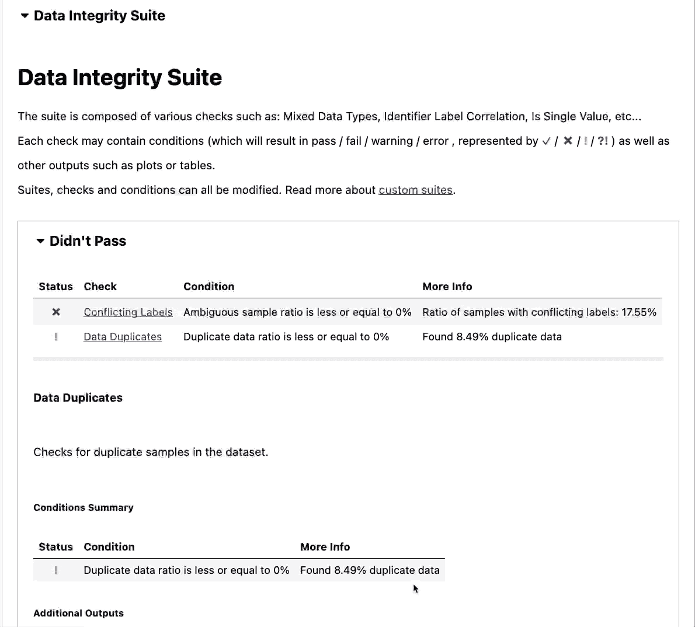

作者图片

> [查看完整报告。](https://khuyentran1401.github.io/prefect2-mlops-demo/data_integrity.html)

从报告中，我们可以看到数据集中存在冲突标签和数据重复。

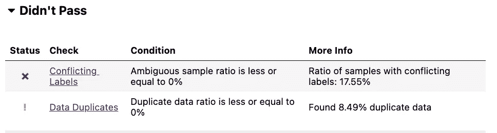

作者图片

但是，数据通过了其余的数据完整性检查。


作者图片

该报告还显示了每项检查的详细信息。下图显示了要素标注相关性检查的详细信息。

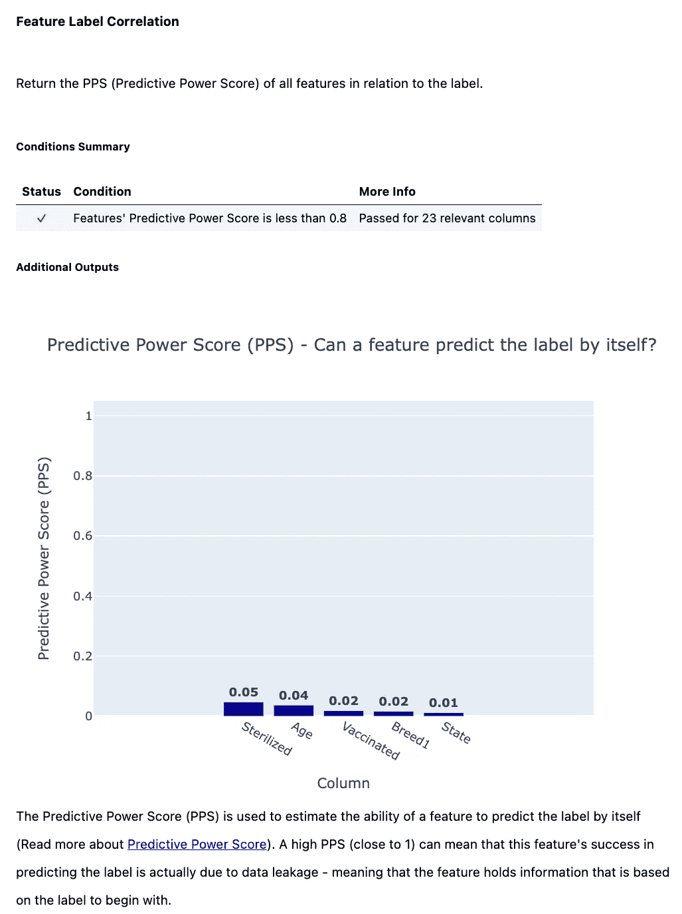

作者图片

## 列车测试验证套件

当您想要验证两个数据子集(如训练集和测试集)时，训练测试验证套件非常有用。

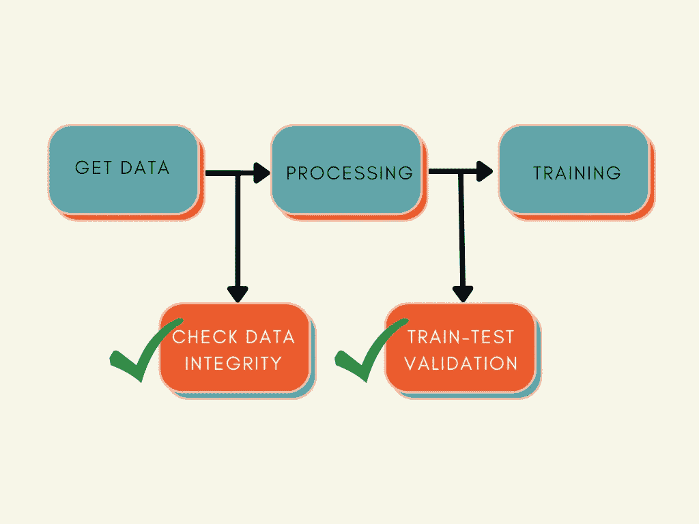

作者图片

下面的代码显示了以下功能:

*   用训练集和测试集初始化数据集对象
*   创建培训测试验证套件

[*全码*](https://github.com/khuyentran1401/prefect2-mlops-demo/blob/deepchecks/src/check_train_test.py)

运行上面的代码将生成另一个报告。以下是报告摘要。

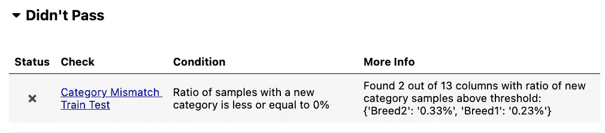

作者图片

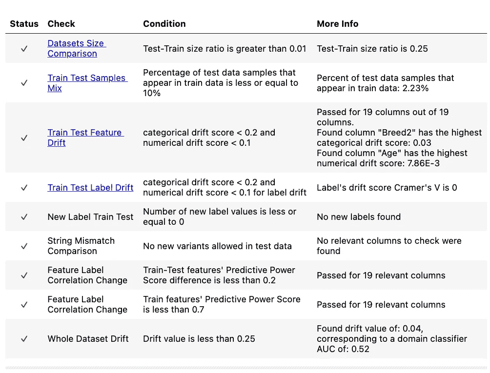

作者图片

> [查看完整报告。](https://khuyentran1401.github.io/prefect2-mlops-demo/train_test_validation.html)

## 模型评估套件

模型评估套件在训练模型之后或部署模型之前非常有用。

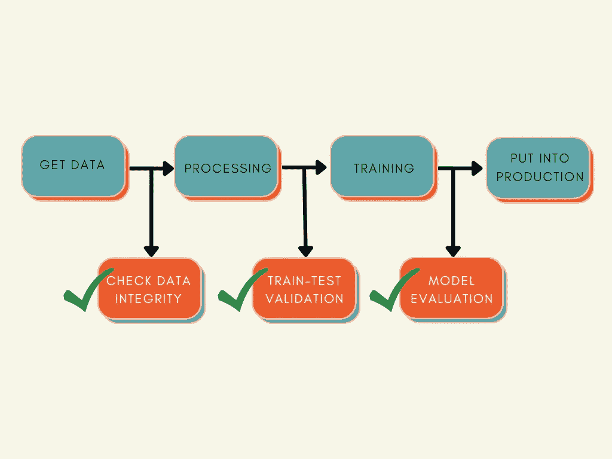

作者图片

要创建模型评估套件，请使用`model_evaluation`方法。

运行代码将创建一个报告。以下是我的模型评估套件报告摘要。

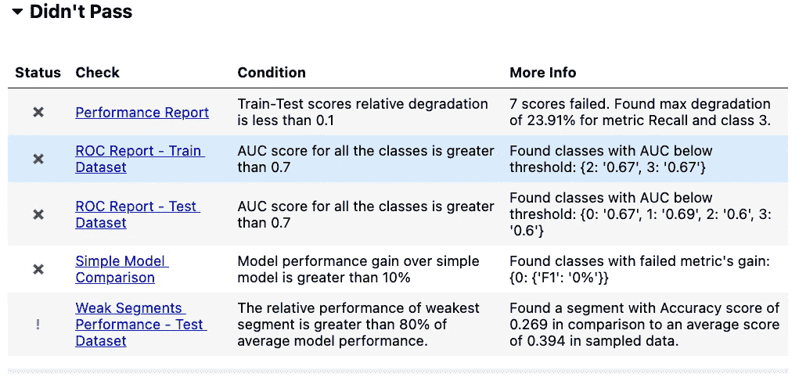

作者图片

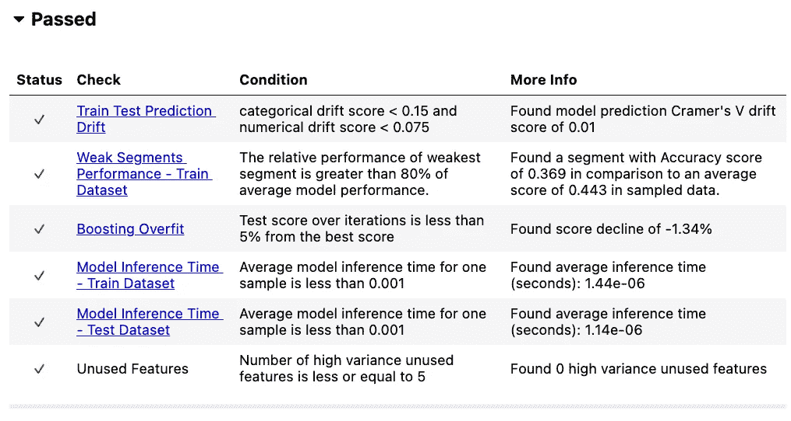

作者图片

下图显示了简单模型比较的结果。

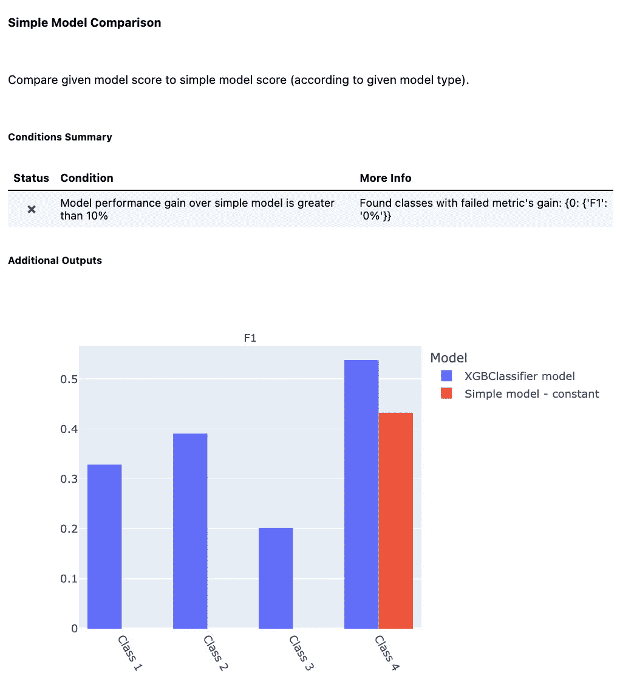

作者图片

> [查看完整报告。](https://khuyentran1401.github.io/prefect2-mlops-demo/model_evaluation.html)

# 当验证套件失败时发送通知

理想情况下，当验证套件失败时，我们希望:

*   停止执行管道中的下一个组件
*   向负责管道的团队发送通知
*   修复代码并再次运行管道


作者图片

概括地说，为了在代码到达某个状态时创建发送通知，我们将:

*   将 Python 函数转化为完美的流程
*   给那个流附加一个标签(例如，`dev`)

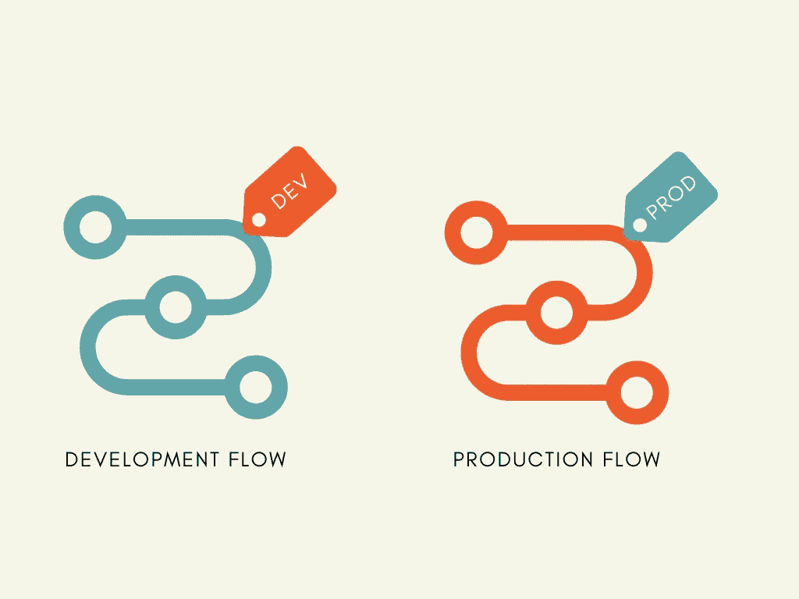

作者图片

*   创建发送通知的规则。具体来说，我们将设置规则，以便如果带有特定标签(即`dev`)的任何流的运行进入失败状态，提督将向 Slack 发送通知。

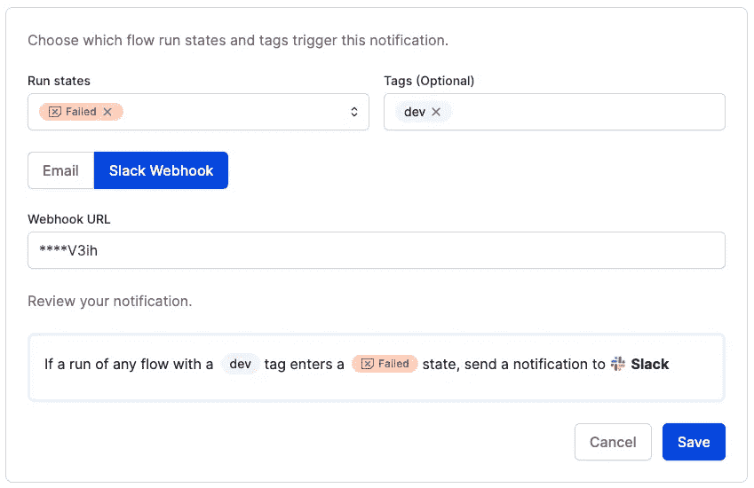

作者图片

## 创造完美的流程

为了了解如何创建一个完美的流，让我们从运行数据完整性套件的代码开始:

函数`check_data_integrity`包括创建数据完整性套件的函数。

要将这个函数变成一个完美的流程，只需在函数中添加装饰器`flow`。

将`flow`装饰器添加到管道中研究阶段的其他主要功能中，例如[过程数据](https://github.com/khuyentran1401/prefect2-mlops-demo/blob/0a345269e3e01b62d8934ccb39668ed365eebfd1/src/process_data.py#L109)、[列车模型](https://github.com/khuyentran1401/prefect2-mlops-demo/blob/0a345269e3e01b62d8934ccb39668ed365eebfd1/src/train_model.py#L52)、[创建列车测试套件](https://github.com/khuyentran1401/prefect2-mlops-demo/blob/0a345269e3e01b62d8934ccb39668ed365eebfd1/src/check_train_test.py#L68)，以及[创建模型评估套件](https://github.com/khuyentran1401/prefect2-mlops-demo/blob/0a345269e3e01b62d8934ccb39668ed365eebfd1/src/evaluate_model.py#L35)。

将所有这些流放在`development`流下。这将把它们变成子流。

流中的子流按顺序执行。如果一个子流程失败，下一个子流程将不会执行。例如，如果子流程`check_data_integrity`失败，子流程`prepare_for_training`将不会运行。

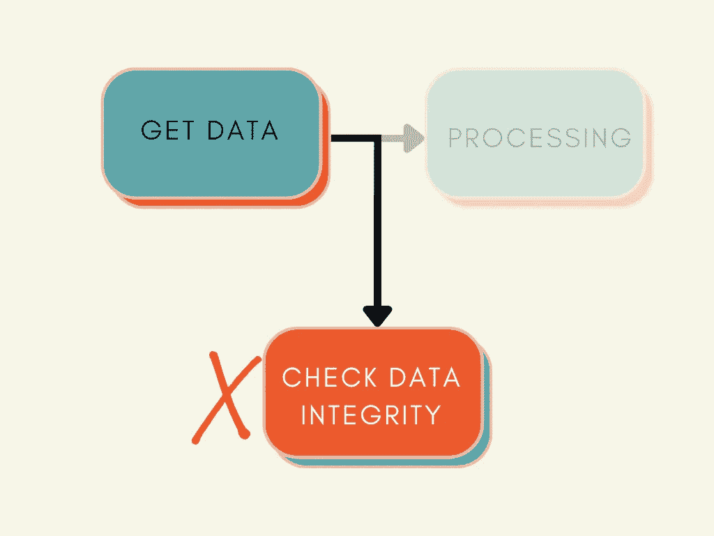

查看这篇文章，了解如何使用提督发送时差通知:

[](https://medium.com/the-prefect-blog/sending-slack-notifications-in-python-with-prefect-840a895f81c)  

设置通知后，当流失败时，您应该会在 Slack 通道中收到一条消息:


作者图片

# 结论

恭喜你！您刚刚学习了如何设置工作流来验证管道中每个组件的输出，并在验证失败时发送通知。

随意发挥，并在这里叉这篇文章的源代码:

[](https://github.com/khuyentran1401/prefect2-mlops-demo/tree/deepchecks)  

我喜欢写一些基本的数据科学概念，并尝试不同的数据科学工具。你可以在 LinkedIn 和 Twitter 上与我联系。

如果你想查看我写的所有文章的代码，请点击这里。在 Medium 上关注我，了解我的最新数据科学文章，例如:

[](https://medium.com/the-prefect-blog/orchestrate-your-data-science-project-with-prefect-2-0-4118418fd7ce)  [](https://pub.towardsai.net/github-actions-in-mlops-automatically-check-and-deploy-your-ml-model-9a281d7f3c84)  [](/how-to-structure-a-data-science-project-for-readability-and-transparency-360c6716800)  [](/bentoml-create-an-ml-powered-prediction-service-in-minutes-23d135d6ca76) 