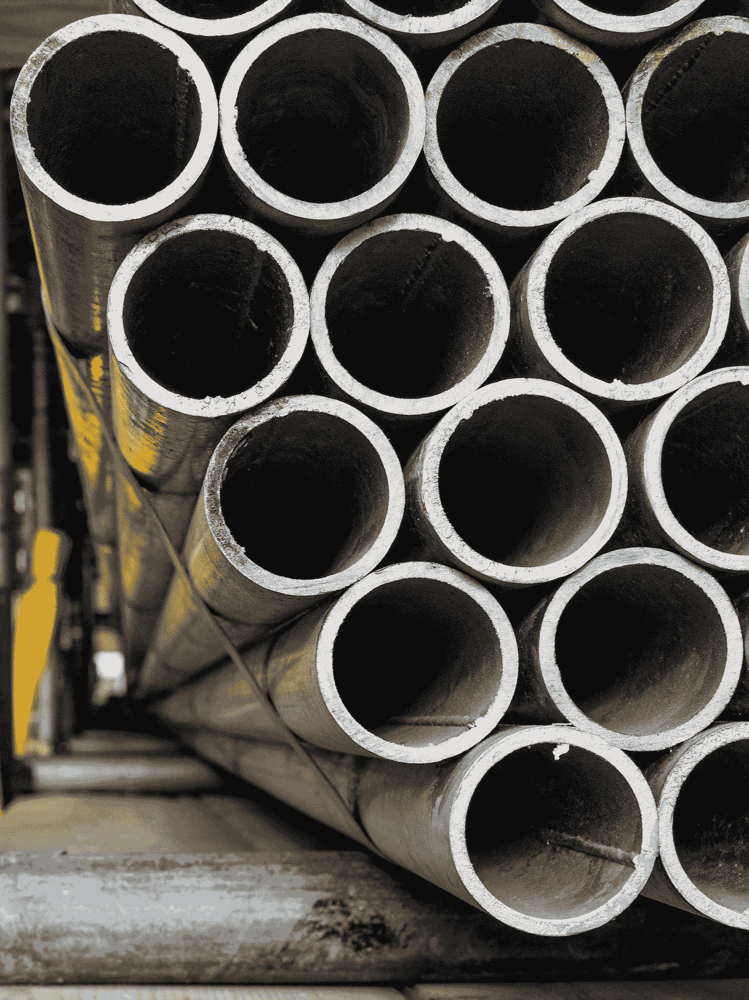

# 用卷积神经网络和迁移学习检测钢中的缺陷

> 原文：<https://towardsdatascience.com/detect-the-defects-in-steel-with-convoluted-neural-networks-cnns-and-transfer-learning-f761ca6c0d1f>

照片由[在](https://unsplash.com/@theblowup?utm_source=medium&utm_medium=referral) [Unsplash](https://unsplash.com?utm_source=medium&utm_medium=referral) 上放大

# 用卷积神经网络和迁移学习检测钢中的缺陷

## 在机器学习和数据科学的帮助下检测钢铁中的缺陷，以便为钢铁工程师和制造商提供见解。

**钢**用途广泛，如**修建铁路**、**建筑**、**道路**、**家电**、**其他基础设施。**像**体育场**和**桥梁**这样的东西，大多是借助钢铁打造出来的。通过观察钢的各种使用方式，我们发现钢在自然界中无处不在。

照片由 [Luca Upper](https://unsplash.com/@lucaupper?utm_source=medium&utm_medium=referral) 在 [Unsplash](https://unsplash.com?utm_source=medium&utm_medium=referral) 拍摄

**注:**数据集的所有者是 PAO Severstal([https://www.severstal.com/](https://www.severstal.com/))

然而，在钢的制造过程中，经常有缺陷被忽视的可能性。结果，最终的钢铁产品质量大打折扣。换句话说，我们得到的钢有缺陷，不能为我们建造桥梁和铁路的应用提供很多功能。除此之外，人类识别缺陷也相当困难，因为这通常是耗时且困难的过程。

尽管如此，在**卷积神经网络**的帮助下，随着**定位**检测并准确识别钢中的缺陷是可能的，因此对于**工程师**和**制造商**来说将会非常方便。这将大大减少生产优质钢的时间。当**定位**也被提供时，它将帮助**工程师**发现导致钢中这种缺陷的设计错误和材料问题。本文主要考虑钢的缺陷识别，不包括**定位**。

在这篇文章中，我重点介绍了我的 [**GitHub 项目的钢材缺陷检测**](https://github.com/suhasmaddali/Steel-Defect-Detection-Challenge) 并详细说明了预测缺陷所采取的步骤。因此，这减少了工程师和制造商在钢铁生产中的时间和精力。

## 阅读图书馆

现在是时候看看**卷积神经网络**如何工作，以及**转移学习**如何显著提高我们的准确性。下面是我们将在这个项目中使用的库。

这些是执行卷积神经网络计算必须导入的一些基本库。

**Numpy** 用于将列表转换为数组，计算等等。

Seaborn 用于帮助我们交互绘图。

**Pandas** 用于读写**中的数据。csv"** 文件在我们的案例中。

**cv2** 是一个高效的库，用于读取图像并将其转换为像素值或数学值进行卷积。

**Matplotlib** 用于绘制可视化图形，以便用户能够分别理解工作。

**Tensorflow** 库用于训练和计算我们将在项目中使用的图像。

## 指定训练和测试路径

我们还将为训练集和测试集指定文件的路径。也就是说，我们需要寻找包含我们钢铁图像的**目录**。在指定了这个路径之后，我们将以**数组**的形式读取图像，以便用它来执行计算。

## **迁移学习**

迁移学习大大减少了我们的训练时间，也提高了模型的准确性。在迁移学习中，已经为特定数据集训练的模型正在用于我们的应用程序。我们使用**预训练模型**和之前数据集中学习到的所有权重，而不是从零开始训练我们的模型，这需要很多时间，因此它为我们的钢分类任务产生了良好的结果。要了解更多关于迁移学习的知识，我建议查看这个博客。

[深度学习迁移学习温和介绍(machinelearningmastery.com)](https://machinelearningmastery.com/transfer-learning-for-deep-learning/)

## VGG19 网络

在上面的编码单元格中，我们看到 headmodel 变量考虑到了 **VGG19** 模型。预训练的权重取自 [**imagenet**](https://www.image-net.org/) 数据集。我们使用 **VGG19** 作为我们的头模型或起始模型。添加此架构后，我们从各层获取输出，并在二维空间中执行平均池化。后来，有一个层的展平，以便最后，它被转换成一个 1D 数组，分别用于我们的训练。我们使头模型(VGG19) **的所有层不可训练**，这意味着当我们使用 steel 数据集训练时，这些权重不会被修改。

## 编译模型

现在是时候编译模型，并为我们的最终模型选择正确的**损失**、**优化器**和**指标**。我们选择了**分类交叉熵**，因为它是一个多类分类问题。选择 Adam optimizer 是因为它在很大程度上减少了损失，并且没有太多噪声。将要显示的度量是**精度**。

## 定义检查点

**模型回调**当模型在训练模型的任务中达到特定结果时，在深度学习中使用。我们使用**检查点**变量来存储基于交叉验证准确性的最佳模型，如上所示。在拟合模型时，会给出 checkout 变量，以便启动回调。

拟合最终模型并采用 **fitted_model** 变量中的参数，使其可用于绘图和评估机器学习模型的性能。我们用更少的时期数(10)进行训练，同时打印交叉验证准确度。

## 评估模型

评估深度学习和卷积网络(CNN)模型性能的最佳方式之一是包括其训练误差和交叉验证误差的**图**。为了了解模型是**过拟合**还是**欠拟合**，最好看看误差值是如何随着时期数的增加而减小还是增加的。要了解更多关于过度拟合和欠拟合的信息，请随意参考我写在下面的文章。

[什么是机器学习中的过拟合和欠拟合？|作者 Suhas Maddali | mlearning . ai | Medium](https://medium.com/mlearning-ai/what-is-overfitting-and-underfitting-in-machine-learning-6817ba47e37a)

让我们也探索其他网络，为我们预测钢中缺陷的任务选择最佳网络。

## 高效网络

现在是时候使用**有效网络**来查看模型的表现如何，以及**最佳模型**是否会随着准确性的增加而减少交叉验证误差。值得注意的是，有效网络有多种变体，但我们使用 **EfficientNetB0** 作为起点。我们通常不改变网络的最后几层。我们再次将**预训练的** EfficientNet 模型用于 imagenet 数据。但是我们将训练我们网络的最后几层来完成检测钢中缺陷的任务。再次应用对 **VGG19** 型号采取的上述步骤。也就是说，我们将拟合模型并将最佳模型存储在**.【H5】**文件中，并且**评估**模型。让我们也来看看其他提高**交叉验证数据**准确性的网络。

## 例外网络

同样，借助于**例外**网络和 **imagenet** 上的预训练权重，我们将了解如何减少交叉验证误差或提高准确度。为了获得最佳性能，输入必须分别为 **(299，299，3)** 的形状。因此，输入的形状和尺寸是在启动网络时指定的。

为例外网络指定相同的优化器和损失，对于多类分类问题，度量为**准确度**。

我们拟合模型并将结果再次存储在 **fitted_model** 变量中，该变量稍后分别用于绘图。在执行训练后查看这些图有助于理解模型是否分别具有高方差或偏差。基于这些图，采取行动是增加时期的数量还是增加训练样本的数量。

## InceptionV3 网络

现在是时候为我们预测钢中缺陷的任务初始化网络了。 **InceptionV3** 是由**谷歌**开发的网络。它最初从较少数量的通道开始。当我们向前传播到网络深处时，很明显，信道的数量增加了，而卷积运算减少了激活单元的宽度和高度。我知道这听起来很过分。你可以看看下面的网站来更好地了解 InceptionV3 网络。

[盗梦空间高级指南 v3 |云 TPU |谷歌云](https://cloud.google.com/tpu/docs/inception-v3-advanced)

# 结论

在对模型进行训练和测试后，我发现 **InceptionV3** 网络与其他网络相比表现最佳。然而，这取决于我们所考虑的问题或任务。对于 imagenet 等其他任务，**高效网**表现最佳，同时也显著减少了训练时间。因此，可能有许多模型在特定的任务集上表现良好。在**部署**生产中的最佳型号之前，考虑所有型号是很重要的。希望这篇文章对你有所帮助。以下是您可以联系我或查看我的作品的详细信息。

**GitHub:** [苏哈斯马达利(Suhas Maddali)(github.com)](https://github.com/suhasmaddali)

**LinkedIn:** [(1)苏哈斯·马达利，东北大学，数据科学| LinkedIn](https://www.linkedin.com/in/suhas-maddali/)

**中等:** [苏哈斯·马达利—中等](https://suhas-maddali007.medium.com/)