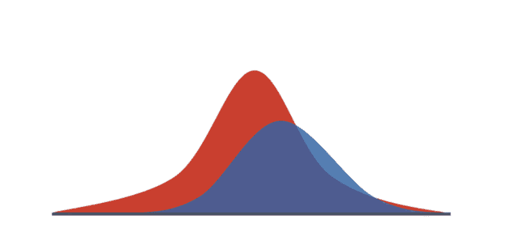
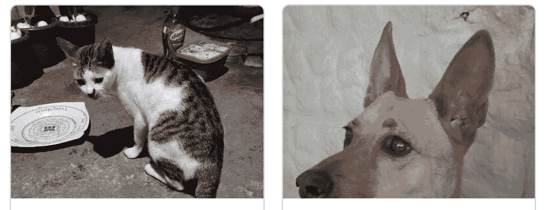
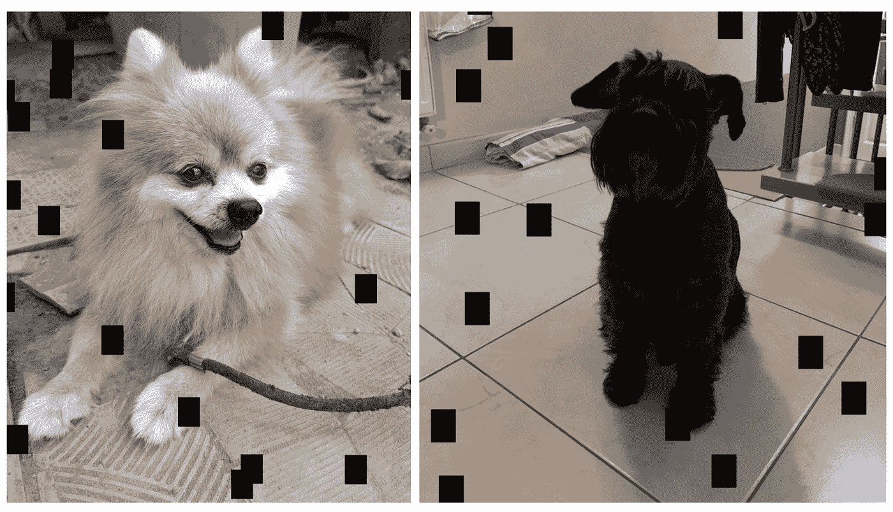
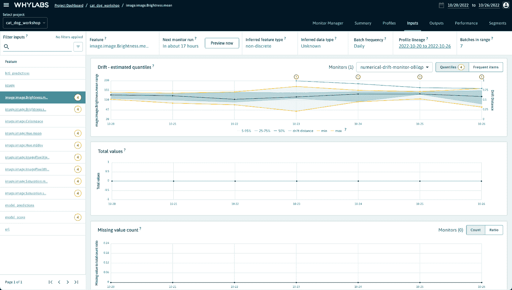
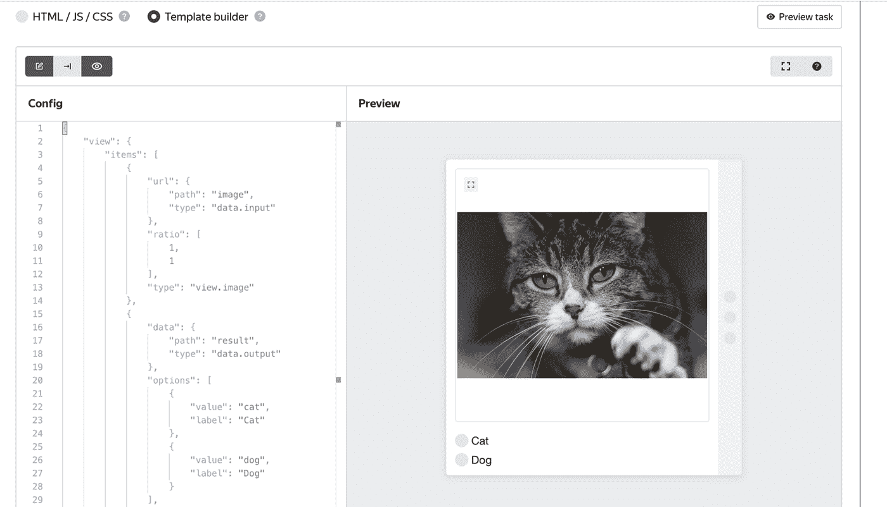
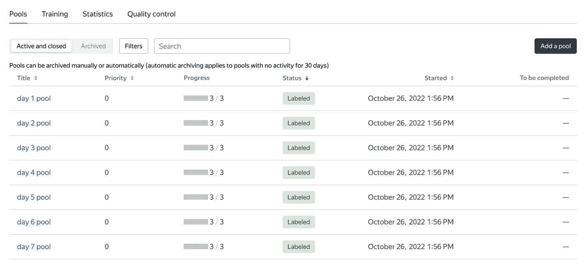
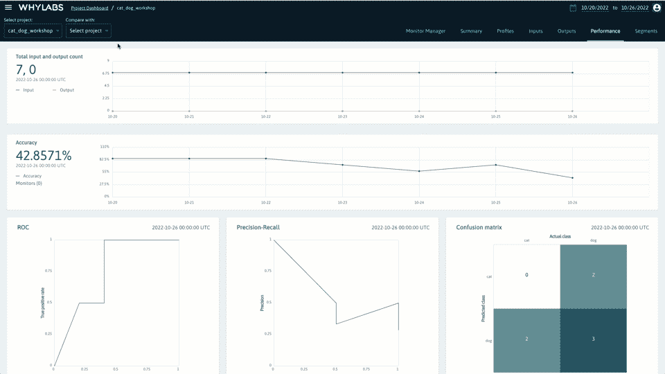

# 计算机视觉中数据漂移的检测和修复

> 原文：<https://towardsdatascience.com/detecting-and-fixing-data-drift-in-computer-vision-8d0853af1246>

## 带有可运行代码的实际案例研究

图片由来自 [Pixabay](https://pixabay.com//?utm_source=link-attribution&utm_medium=referral&utm_campaign=image&utm_content=2396992) 的 [Dimitris Vetsikas](https://pixabay.com/users/dimitrisvetsikas1969-1857980/?utm_source=link-attribution&utm_medium=referral&utm_campaign=image&utm_content=2396992) 拍摄

**简介**

如果您已经在数据科学和 ML 领域工作了一段时间，您会知道您所训练的模型在生产环境中的表现可能会出乎意料。这是因为生产数据往往不同于用于创建模型的封闭训练数据集。此外，生产数据会随着时间不断变化，因此即使最初表现良好的模型也会随着时间的推移而退化。

作者图片

上面所描述的就是所谓的数据漂移，它在 ML 中非常普遍。

有很多文章深入解释了这个概念，但在本教程中，我们将重点放在数据漂移检测的实际部分，并在一个计算机视觉示例中解决它。

我们将在这里向您全面解释我们创建的数据漂移监控系统，有关更多细节和完整代码，您可以查看这个 [colab 笔记本](https://colab.research.google.com/drive/1BnugKMNIChFugMafvgI0fE9SlAQ5EZ72?usp=sharing#scrollTo=n_84orsmBAYl)。

**问题陈述**

猫还是狗？—作者图片

在这个案例研究中，我们将监控一个经过训练可以区分猫和狗的计算机视觉分类器。我们使用的实际模型已经使用 Keras 进行了训练，它只是一个简单的 CNN。

将要监控的数据将模拟一周的生产性能，因此我们将图像分成几天一批(第 1 天、第 2 天、…、第 7 天)。

此外，我们在以后的日子里模拟了数据漂移，所以在第一批中，您将看到正常的猫和狗的图像…

然而后来的几天出现了一些相机问题，一些像素被破坏，图像看起来更像这样…

相机问题—图片由作者提供

让我们看看能否用漂移监测系统检测到它。

**如何检测数据漂移并获得早期警报**

我们将使用开源库 [whylogs](https://github.com/whylabs/whylogs) 来分析我们的数据，并将分析结果发送到 [WhyLabs](https://whylabs.ai/) 进行数据漂移和 ML 性能监控。

使用 whylogs 创建的配置文件是高效的、可合并的，并且只包含必要的摘要统计信息。这使得它们可以用于几乎任何应用，无论是需要批量或流处理数据，还是医疗保健和金融等敏感行业。在 GitHub 上阅读更多关于 whylogs 的内容。

WhyLabs 可以轻松存储和监控 whylogs 创建的配置文件，以检测机器学习管道中的异常，如数据漂移、数据质量问题和模型偏差。

在这篇文章中，我们在 [Colab 笔记本](https://colab.research.google.com/drive/1BnugKMNIChFugMafvgI0fE9SlAQ5EZ72)中介绍了监控我们的计算机视觉数据和模型的细节，但在下面，您可以看到 WhyLabs 仪表板的预览。

检测 WhyLabs 中的数据漂移—图片由作者提供

在它的左侧，您可以看到正在监控的不同特性(亮度、像素高度、像素宽度、饱和度等)。其中几个旁边有一个红色的感叹号。这表明我们的数据已经在这些维度上漂移了。您可以详细探索每个功能(仪表板的中心)。上面的屏幕截图显示了亮度值，您可以看到亮度值在漂移监测的第 4 天开始漂移，并在第 5、第 6 和第 7 天继续漂移。

这将是有意义的，记住，我们已经应用了一些像素的图像发送到以后的日子。

**带人工注释的模型漂移检测**

我们已经被告知，后面几天的一些数据看起来与我们的模型被训练的数据有些不同。但是模型的性能受到影响了吗？

为了检查它，需要人工注释。我们可以自己做，但这是非常不切实际和不可扩展的，所以我们将使用 [Toloka](https://toloka.ai/) 众包平台。

为了做到这一点，我们首先需要建立一个贴标项目，在那里我们为贴标机指定说明，并设计一个界面。后者可以使用 Toloka 中的 Template Builder 工具来完成，如下所示。

分类项目任务界面—作者图片

一旦我们建立了一个项目，我们可以上传所有需要注释的照片。我们可以使用 python 和 Toloka-Ki 库以编程的方式来实现。请记住，在本[笔记本](https://colab.research.google.com/drive/1BnugKMNIChFugMafvgI0fE9SlAQ5EZ72?usp=sharing#scrollTo=n_84orsmBAYl)中，您有设置该系统所需的全部代码。

一旦你的每日批次被上传，你应该让他们按照如下所示的日常方式进行组织。

作者图片

在标记开始之前，我们需要选择将参与项目的表演者。因为这是一个简单的任务，我们不需要做复杂的过滤技术。我们将允许说英语(因为这是编写说明的语言)的注释者参与进来。

此外，我们还设置了一些质量控制规则，如验证码和控制任务。这很重要，因为众包要成为有效的工具，需要严格的质量控制规则。我们还将相同的图像发送给三个不同的标注者进行标注，以便对每个标注有更多的信心。

当所有注释者完成工作后，我们可以将这些数据(我们的黄金标准)与模型预测一起发送，并使用 WhyLabs 对它们进行进一步分析。

**将模型预测与人工注释进行比较**

我们现在可以使用 WhyLabs，通过比较模型预测值和基本事实来监控机器学习性能指标。还可以配置监视器来检测这些指标是否发生变化。

下面你可以看到一个仪表盘，上面有我们案例研究的准确度、精确度、回忆、f 分数和混淆矩阵。请注意，模型的准确性在后来的日子里从大约 80%下降到 40%。看起来我们在本案例研究开始时从输入要素获得的初始警报是正确的，并且现在得到了地面事实的证实。我们的模型漂移了！

在 WhyLabs 中监控机器学习性能指标—图片由作者提供

一旦我们发现模型漂移，通常的程序是根据新的例子重新训练模型，以说明环境的变化。因为我们已经用 Toloka 注释了新数据，所以我们现在可以用它来重新训练模型。或者，如果我们认为新样本太小，我们将触发更大的数据标注管道来收集更多的训练样本。

**总结**

本教程教你如何为一个计算机视觉项目建立一个 ML 模型漂移监控系统。我们使用了一个简单的猫和狗的分类例子，但这个案例研究可以很容易地扩展到更复杂的项目。

记住你可以在这个[笔记本](https://colab.research.google.com/drive/1BnugKMNIChFugMafvgI0fE9SlAQ5EZ72?usp=sharing#scrollTo=ocxaBmVBRQsM)里查看完整的代码。此外，我们还举办了一个现场研讨会，一步一步地解释这个流程的每个阶段都发生了什么。这是一个很长的[录音](https://www.youtube.com/watch?v=hLXTaIO7Q8o)，但如果你对更详细的解释感兴趣，值得一看。

我还要感谢本文的合著者塞奇·艾略特(Sage Elliott)和与我们合著了最初的[笔记本](https://colab.research.google.com/drive/1BnugKMNIChFugMafvgI0fE9SlAQ5EZ72?usp=sharing#scrollTo=ocxaBmVBRQsM)的[丹尼尔·费杜洛夫(Daniil Fedulov)](https://www.linkedin.com/in/daniil-fedulov-17949479/)。

*PS:我正在 Medium 和*[***aboutdatablog.com***](https://www.aboutdatablog.com/)*上撰写以简单易懂的方式解释基本数据科学概念的文章。你可以订阅我的* [***邮件列表***](https://medium.com/subscribe/@konkiewicz.m) *在我每次写新文章的时候得到通知。如果你还不是中等会员，你可以在这里加入***。**

*下面还有一些你可能喜欢的帖子*

*       *