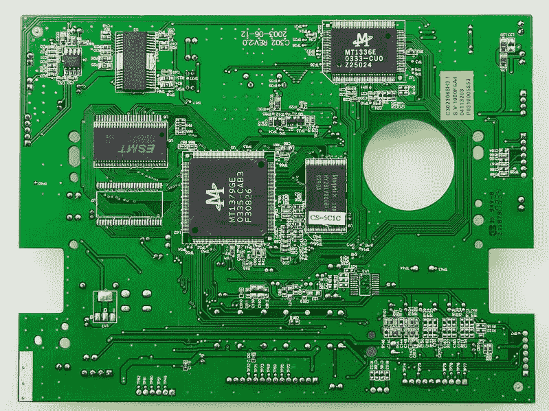
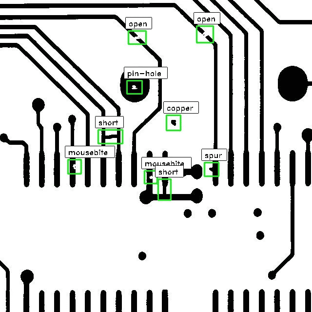
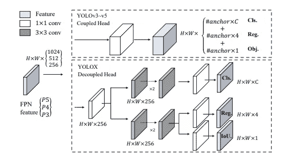
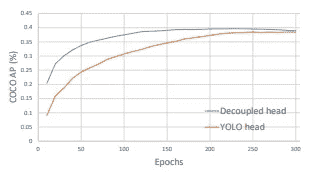
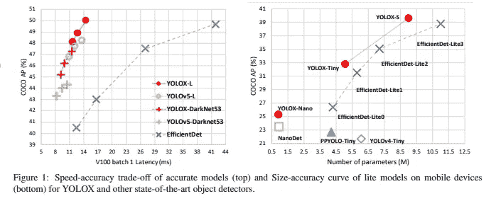
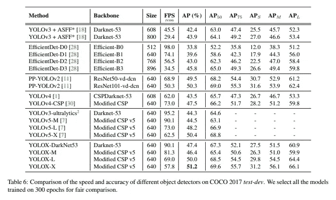
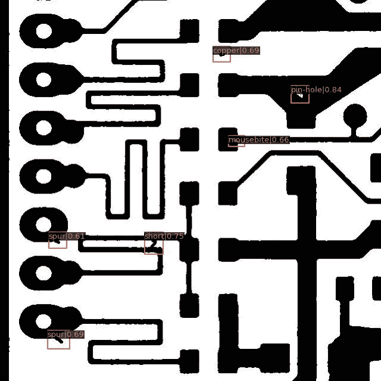

# 利用 OpenMMLab 用 YOLOX 检测 PCB 中的缺陷

> 原文：<https://towardsdatascience.com/detecting-defects-in-pcbs-with-yolox-using-openmmlab-91c1775ac884>

## 使用 OpenMMLab 和著名的 YOLO 系列中的新架构 YOLOX 进行对象检测。我们将尝试检测印刷电路板中的不同缺陷。


Alexandre Debiève 在 [Unsplash](https://unsplash.com?utm_source=medium&utm_medium=referral) 上的照片

# 印刷电路板

我知道我知道，你一定会问，什么是 PCB？你不是吗？嗯，对于不知道 PCB 是什么的人来说，这里有一个来自 [*维基百科*](https://en.wikipedia.org/wiki/Printed_circuit_board) 的定义:

> 一个**印刷电路板** ( **PCB** )是导电层和绝缘层的叠层夹层结构。PCB 有两个互补的功能。第一种是通过焊接将[电子元件](https://en.wikipedia.org/wiki/Electronic_component)固定在外层的指定位置。第二是以受控的方式在元件的端子之间提供可靠的电连接(以及可靠的开路),这通常被称为 PCB 设计。

我敢打赌，你一生中肯定至少见过一次 PCB，但可能懒得知道它是什么。你看过 DVD 阅读器的背面吗？这里有一张 DVD 阅读器上 PCB 的图片，来自 [*维基百科*](https://en.wikipedia.org/wiki/File:SEG_DVD_430_-_Printed_circuit_board-4276.jpg) *:*



来自[维基百科](https://upload.wikimedia.org/wikipedia/commons/a/a4/SEG_DVD_430_-_Printed_circuit_board-4276.jpg)的 PCB 示例

多氯联苯随处可见。几乎所有的电子设备都有一块 PCB 隐藏在其中。在许多情况下，这些多氯联苯在设计时或使用后都有缺陷。这里列出了一些常见的 PCB 缺陷，如互联网上所列的，还有一张来自⁴.的免费数据集的图片

1.  打开
2.  过量焊料
3.  组件移位
4.  冷接缝
5.  焊料桥
6.  网状和飞溅
7.  抬起的垫子



图 1:来自⁵[PCB 数据集 Github 知识库](https://github.com/tangsanli5201/DeepPCB)的示例图像

我们不会深究它们的确切含义，因为这不是这篇博客的内容。但是，从了解一点计算机视觉和深度学习的计算机工程师的角度来看，在 PCB 的数字图像中检测缺陷似乎是一个可以解决的问题。

我们将使用来自⁸的 [OpenMMLab](https://openmmlab.com/) 的 [mmdetection](https://github.com/open-mmlab/mmdetection) ⁶来检测 PCB 图像中的缺陷。OpenMMLab⁸是一个深度学习库，拥有计算机视觉领域大多数最新实现的预训练模型。它实现了几乎所有众所周知的视觉问题，如分类、对象检测&分割、姿态估计、图像生成、对象跟踪等等。

# YOLOX:超越 2021⁷yolo 系列

在这篇博客中，我们将使用 [YOLOX](https://arxiv.org/abs/2107.08430) ⁷，我们将用 [mmdetection](https://github.com/open-mmlab/mmdetection) ⁶.进行微调 [YOLOX](https://arxiv.org/abs/2107.08430) ⁷是 2021 年发布的最先进的车型，是 YOLO 系列的改进。作者做了一些重要的改进，列举如下。

1.  用于标签分配的 SimOTA 简介
2.  移除锚箱
3.  特别注意数据增强，如抖动混淆
4.  用于检测和分类的分离头



图二:从 [YOLOX 截取的建筑图:超越 202](https://arxiv.org/pdf/2107.08430.pdf) ⁷的 YOLO 系列

之前从 v3 到 v5 的 YOLO 系列都有一个单一的预测头，包括边界框预测、分类得分预测以及客观得分预测，如上图上半部分所示。

这在 YOLOX⁷系列中有所改变，作者选择使用一个分离的头，所有预测都使用单独的头。如上面图 2 的下半部分所示，检测头和分类头位于不同的头中。这有助于改善训练过程中的收敛时间(如图 3 所示),并略微提高模型精度。



图 3:从 [YOLOX 截取的训练指标图:超越 202 ⁷的 YOLO 系列](https://arxiv.org/abs/2107.08430)

由于这一点，模型的速度受到影响，因为参数的数量随着分成两个头而显著增加。正如我们在图 4 中看到的，YOLOX-L 比 YOLOv5-L 慢一点。它还有专门为参数低得多的边缘设备构建的纳米和微型版本。



图 4:从 [YOLOX 截取的速度和尺寸与精度的关系图:超越 202 ⁷的 YOLO 系列](https://arxiv.org/abs/2107.08430)

与之前最先进的对象检测模型相比，它们在平均精度方面有所提高，FPS 略有下降。



图 5:从 [YOLOX 截取的物体检测模型对比表:超越 202 ⁷的 YOLO 系列](https://arxiv.org/abs/2107.08430)

最后，正如伟大的[莱纳斯·托沃兹](https://en.wikipedia.org/wiki/Linus_Torvalds)曾经说过的，

> 空谈不值钱。给我看看代码。

让我们直接跳进来吧！

# 使用 mmdetection 微调 YOLOX

我们有一个开源的 PCB 缺陷数据集，称为 [DeepPCB⁵](https://github.com/tangsanli5201/DeepPCB) 。该数据集由 1500 个图像对组成，每个图像对具有无缺陷的模板图像和具有缺陷的图像，该图像具有 6 种常见缺陷类型的边界框注释，即。开路、鼠咬、短路、杂散、假铜和针孔。如果你需要的话，你可以从[数据集链接](https://github.com/tangsanli5201/DeepPCB) ⁵中获得更多关于它的信息。

这些图像的尺寸为 640×640，在我们的例子中是完美的，因为 YOLOX⁷是在相同的尺寸上训练的。

# OpenMMLab⁸

OpenMMLab 使得微调最先进的模型变得非常容易，只需很少的代码更改。它有一个针对特定用例的综合 API。我们将使用 [mmdetection⁶](https://github.com/open-mmlab/mmdetection) 对 DeepPCB⁵数据集上的 YOLOX⁷进行微调。

## 数据集格式

> 注意:PCB 缺陷数据集是从 [DeepPCB Github repo](https://github.com/tangsanli5201/DeepPCB) 中获取的开源数据集，带有 MIT 许可证，可在此处参考[。](https://github.com/tangsanli5201/DeepPCB/blob/master/LICENSE)

我们需要将数据集修改为 COCO 格式或 Pascal VOC 格式来重新训练模型。这是 mmdetection⁶加载我们的自定义数据集进行训练所必需的。出于培训目的，我们将采用 COCO 格式。你不需要麻烦地将数据集转换成 COCO 格式，因为它已经为你完成了。您可以从[这里](https://drive.google.com/file/d/1-VZgKcMrJ3BUtoKvCM3F5VC0udTX9E1Y/view?usp=sharing)直接下载转换后的数据集。整个数据集与 DeepPCB⁵的相同，只是增加了带有用于训练的 COCO 格式注释的训练和测试 JSON 文件。

我不会经历到 COCO 格式的转换，因为你可以找到许多文档经历这个过程，就像在 [mmdetection 文档](https://mmdetection.readthedocs.io/en/latest/2_new_data_model.html)中提到的一样。请随意浏览脚本，如果您需要任何帮助，不要介意留下评论。把这个数据集转换成 COCO 格式的脚本在这里[分享](https://gist.github.com/Praneet9/5c182383466308b5bbb8cceac7b3b95c#file-convert_to_coco-py)。

将 DeepPCB 数据集注释转换为 COCO 格式的脚本

## 数据集配置

下一步是修改数据集配置，以使用我们的自定义数据集。我们将需要添加/修改特定的东西，如`number of classes`、`annotation paths`、`dataset path`、`number of epochs`、`base config path`，以及一些数据加载器参数。

我们将复制预先编写的 YOLOX-s 配置，并针对我们的数据集对其进行修改。配置的其余部分，如增强、优化器和其他超参数将是相同的。

我们不会做太多改变，因为这篇博客的主要目的是熟悉手头的问题，尝试最先进的 YOLOX 架构，并试验 mmdetection 库。我们将把这个文件命名为`yolox_s_config.py`，并用于训练。

我们将为我们的预测头添加`class names`并改变`number of classes`。需要更改`base path`，因为配置将从根目录而不是`configs`目录加载。

```
_base_ = ['configs/_base_/schedules/schedule_1x.py', 'configs/_base_/default_runtime.py']classes = ('open', 'short', 'mousebite', 'spur', 'copper', 'pin-hole')bbox_head = dict(type='YOLOXHead', num_classes=6, in_channels=128, feat_channels=128)
```

我们需要稍微修改一下训练数据集加载器，以使用我们的`classes`和`annotations`路径。

```
train_dataset = dict(
    type='MultiImageMixDataset',
    dataset=dict(
        type=dataset_type,
        classes=classes,
        ann_file='train.json',
        img_prefix='',
        pipeline=[
            dict(type='LoadImageFromFile'),
            dict(type='LoadAnnotations', with_bbox=True)
        ],
        filter_empty_gt=False,
    ),
    pipeline=train_pipeline)
```

我们需要对这里的验证和测试集做同样的事情。我们不打算在这里使用一个单独的测试集，相反，我们将使用同一个测试集进行验证和测试。

```
data = dict(
    samples_per_gpu=8,
    workers_per_gpu=4,
    persistent_workers=True,
    train=train_dataset,
    val=dict(
        type=dataset_type,
        classes=classes,
        ann_file='test.json',
        img_prefix='',
        pipeline=test_pipeline),
    test=dict(
        type=dataset_type,
        classes=classes,
        ann_file='test.json',
        img_prefix='',
        pipeline=test_pipeline))
```

我们将只训练 20 个时期的模型，并且每 5 个时期得到验证结果。我们不需要再训练它了，因为我们在仅仅 20 个纪元内就获得了不错的结果。虽然这不是最好的模式，但为了博客，这是不错的。

```
max_epochs = 20
interval = 5
```

你也可以从要点[这里](https://gist.github.com/Praneet9/75f8bd9536455b99b942740b83423d24)复制整个编辑过的配置，并用它来训练模型。你可以以后再谢我！😉

## 培养

我们可以很好地处理数据集部分。接下来我们需要做的是训练模型。mmdetection⁶图书馆最好的一点是，所有与培训相关的事情都已经为你做好了。您需要做的就是从`tools`目录运行训练脚本，并将路径传递给我们上面创建的数据集配置。

```
python3 tools/train.py yolox_s_config.py
```

瞧啊！🔥

在 mmdetection⁶.的帮助下，您已经使用 DeepPCB⁵数据集成功训练了 YOLOX⁷模型来检测 PCB 缺陷

## 推理

让我们看看我们的模型在一些例子上的表现。你一定想知道，看着训练模型是多么容易，一定有一个命令来对图像进行推理？有！但是，不要让训练模型的简单过程宠坏了你。让我们写一些用于推理的代码，但是让你高兴的是，它不到 10 行代码。

```
from mmdet.apis import init_detector, inference_detector, show_result_pyplotconfig_file = 'yolox_s_config.py'checkpoint_file = 'best_bbox_mAP_epoch_20.pth'
device = 'cuda:0'# init a detector
model = init_detector(config_file, checkpoint_file, device=device)# inference the demo image
image_path = 'demo.jpg'op = inference_detector(model, image_path)
show_result_pyplot(model, image_path, op, score_thr=0.6)
```

这将显示一个图像，其上绘制了带有预测类名的边界框。这是一个包含模型预测的数据集的示例图像。



来自 DeepPCB 数据集的预测示例

我们做到了！🎊

你可以在谷歌实验室[这里](https://colab.research.google.com/drive/1cbXvQm29koR6MnX_f130NIapGhtw4wYR?usp=sharing)找到训练和推理的代码。你也可以尝试我们预先训练好的模型，并用它进行推理。预先训练好的模型可以在[这里](https://drive.google.com/file/d/19dTqDVHyoRmC3LJdJUypy-zcXb1BhqN0/view?usp=sharing)下载。请随意使用它，如果你遇到任何问题，请在评论中告诉我。乐意帮忙！😉

# 结论

今天，我们了解了现实世界中普遍存在的一个新问题，并尝试用像 YOLOX⁷.这样的艺术模型来解决这个问题

我们还使用深度学习社区中领先的开源库之一 mmdetection⁶来训练对象检测模型。如果我不提 mmdetection⁶是如何宠坏了我们，让我们几乎不用任何定制脚本就能如此快速轻松地解决问题，那将是不公平的。

我希望你今天学到了新东西！请随意运行代码。

在[深度学习分析](https://deeplearninganalytics.org/)，我们非常热衷于使用机器学习来解决现实世界的问题。我们已经帮助许多企业部署了创新的基于人工智能的解决方案。如果你看到合作的机会，请通过我们的网站[这里](https://deeplearninganalytics.org/contact-us/)联系我们。

## 参考

1.  PCB 定义:【https://en.wikipedia.org/wiki/Printed_circuit_board 
2.  PCB 图:[https://en . Wikipedia . org/wiki/File:SEG _ DVD _ 430 _-_ Printed _ circuit _ board-4276 . jpg](https://en.wikipedia.org/wiki/File:SEG_DVD_430_-_Printed_circuit_board-4276.jpg)
3.  常见 PCB 缺陷:[https://blog . matric . com/7-PCB 类型-焊接-缺陷-注意-for](https://blog.matric.com/7-types-of-pcb-soldering-defects-to-watch-out-for)
4.  PCB 缺陷数据集论文:[https://arxiv.org/abs/1902.06197](https://arxiv.org/abs/1902.06197)
5.  PCB 缺陷数据集:[https://github.com/tangsanli5201/DeepPCB](https://github.com/tangsanli5201/DeepPCB)
6.  mm detection:[https://github.com/open-mmlab/mmdetection](https://github.com/open-mmlab/mmdetection)
7.  YOLOX Paper:[https://arxiv.org/abs/2107.08430](https://arxiv.org/abs/2107.08430)
8.  OpenMMLab:[https://openmmlab.com/](https://openmmlab.com/)