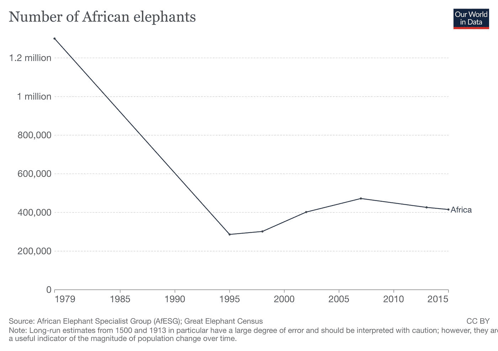
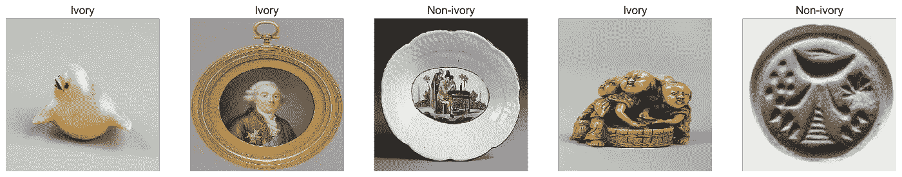
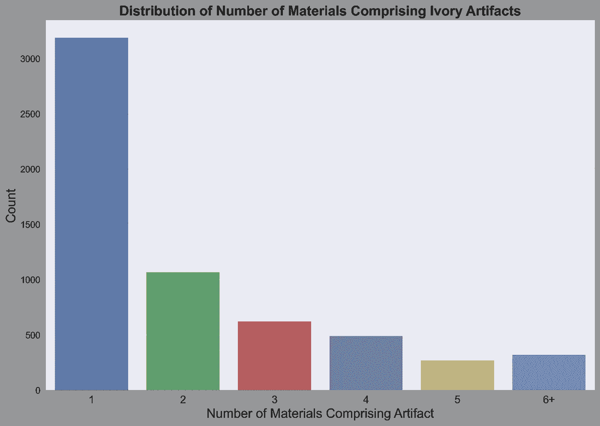
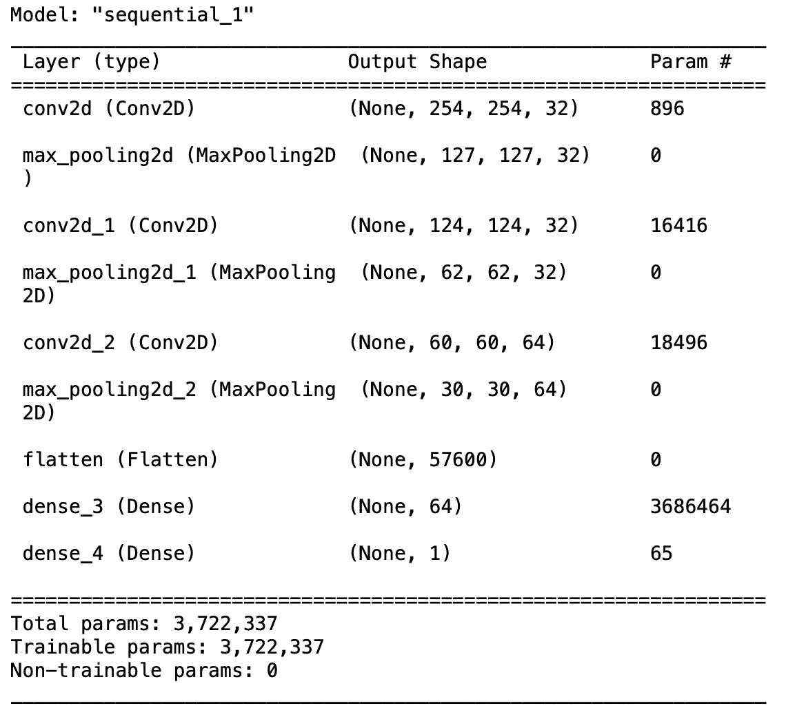
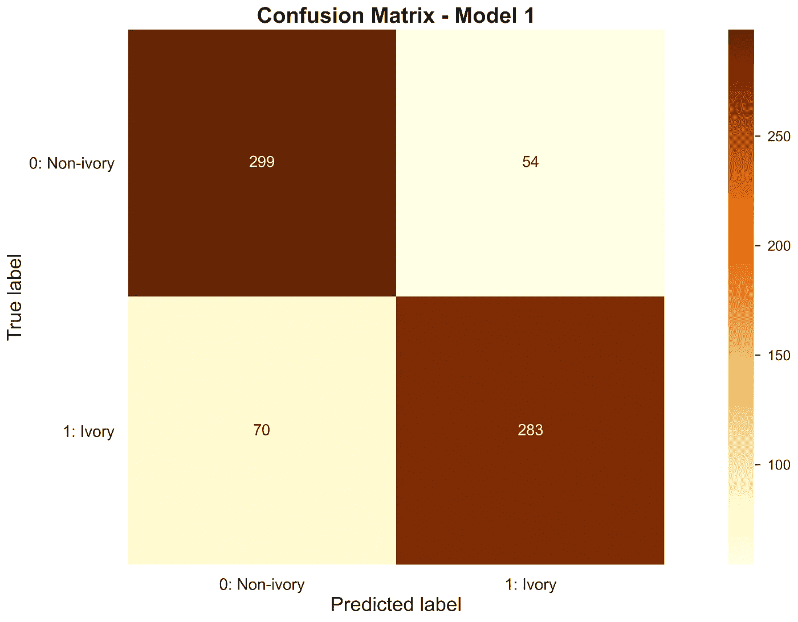
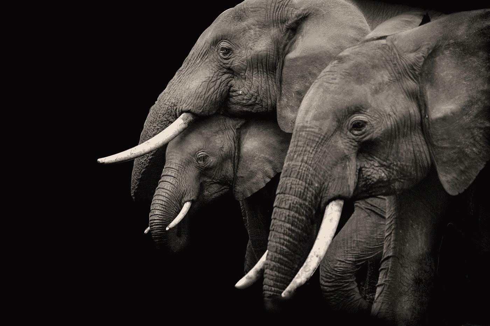

# 用深度学习检测象牙文物

> 原文：<https://towardsdatascience.com/detecting-ivory-artifacts-among-open-source-met-museum-data-with-cnn-based-deep-learning-481739b03298>

## 图像识别有助于打击非法网上象牙销售

米隆·奥利拉在 [Unsplash](https://unsplash.com?utm_source=medium&utm_medium=referral) 上的照片

## 介绍

迄今为止，野生动物保护团体和组织已经将外交和公众压力运动作为他们[对抗象牙市场继续存在的主要工具。虽然这种形式的行动肯定是值得的，并能带来巨大的成功(我将在下面进一步描述)，但它不必是唯一的工具。可以部署技术和机器学习来打击网上非法象牙销售，一旦象牙销售在一个国家成为非法，这是关键的下一步。本文将概述我们如何开发这样一个模型的概念证明，使用基于象牙的文物的开源数据来分类物体是否由象牙组成，准确率超过 80%。](https://www.wwf.org.uk/updates/fighting-end-elephant-ivory-trade)

## 背景

大象不仅是生物和文化的象征，也是生态系统中的基石生物。由三种主要物种组成——非洲森林象、非洲稀树草原象和亚洲象——每一种在各自的环境中都有无数的用途，如创造栖息地、传播种子、创造森林通道和灌木覆盖管理。1930 年，非洲大陆上估计有 1000 万头野生大象。但是经过几十年的偷猎、栖息地丧失和其他人类干预，这个数字在 2007 年下降到大约 496，000 只。在接下来的七年里，非洲的大象数量进一步减少了 30%,只有 352，000 头，这是有史以来最大的野生动物调查之一。

图表从[我们的世界中获得数据](https://ourworldindata.org/grapher/african-elephants?time=1979..latest)

世界野生动物基金会估计偷猎者每年杀死 20，000 头野生大象。这些杀戮中的绝大多数都是出于非法商业目的，主要包括大象的贵重象牙，也就是众所周知的象牙。由于大象数量如此之少，这种偷猎行为对地球上大象的持续生存构成了威胁。2016 年，包括美国、英国、新加坡和其他国家在内的许多国家几乎全面禁止进口和销售象牙和象牙制品。第二年，中国也采取了一个重大举措，结束了象牙在国内的合法销售，据[环境调查机构](https://eia-international.org/wildlife/protecting-elephants/saving-elephants-from-the-ivory-trade/)称，这一举措被广泛认为是“结束屠杀大象的最大一步”。史密森尼杂志估计禁令[消除了多达 70%的全球象牙市场。](https://www.smithsonianmag.com/science-nature/faking-elephant-ivory-180963226/)

尽管这是一个重大的进步，但仍有许多工作要做。中国仍然允许消费者从国外运输象牙，而在越南和泰国等国家，象牙销售名义上是非法的，很少或根本没有执行。这导致了一个完全不受监管的市场；《可持续发展时报》估计，2009 年至 2018 年间，超过 56 吨象牙进入越南黑市，另有 20 吨在运输途中被截获。

为了打击象牙贸易的持续存在，野生动物保护主义者正在不懈地敦促世界各国制定更严格的立法，但在线购物和点对点市场的出现带来了一个具有挑战性的路障。英国肯特郡杜雷尔保护与生态研究所(DICE)最近的一项研究发现，非法象牙贸易在网上点对点市场上蓬勃发展。虽然在大多数主要网站上可以通过关键词搜索特定的产品列表，但没有简单的方法来判断象牙产品是否以别名或假名出现在帖子中。

这个项目的目的是创建一个机器学习图像识别模型的概念证明，该模型处理三维对象和人工制品的图像数据，并将它们分类为包含或不包含象牙。这种概念验证可以作为一个模型的起点，该模型可以帮助在线 P2P 市场、拍卖网站、执法机构和野生动物非政府组织识别可能包含非法象牙产品的清单，并标记它们以供进一步调查。

## 数据来源

由于在线象牙销售在世界上大多数国家都是非法的，因此获得足够大规模和质量的数据集来训练神经网络并不是一项简单的任务。理想情况下，这样的数据集将从当代加工的象牙制品中获得，这些象牙制品在该模型打算部署的市场上出售。缺少了这些，我们决定走非当代路线，使用来自纽约大都会艺术博物馆的图像数据。该博物馆收藏了近 50 万幅跨越 5000 多年历史的油画、素描、雕塑和其他文物，并通过博物馆的[收藏 API](https://metmuseum.github.io/) 开源了几乎所有藏品的数据。该 API[可免费用于商业和非商业用途](https://www.metmuseum.org/about-the-met/policies-and-documents/open-access)，使用该服务不需要 API 密钥。

通过对象的“objectId”在 API 中搜索工件，objectId 是一个 5 或 6 位的识别码。搜索返回一个包含 57 项信息的字典，这些信息包括艺术品的部门、名称、艺术家姓名、艺术媒介、地区和尺寸，尽管大多数项目的许多字段都是空白的。博物馆通过返回字典中的特定键链接到包含 jpeg 图像的 URL，在 API 中提供大多数文物的图像。

对于这个项目，我们首先搜索在对象的媒介中列出单词“象牙”的工件。这些艺术品形成了最初的象牙艺术品收藏，我们用它们来训练我们的神经网络。这个查询总共返回了 5975 个包含单词“象牙”的工件，作为对象的媒介列出。对于训练神经网络的非象牙物体图像，我们搜索了包含介质中列出的“陶瓷”的物体，因为我们推断陶瓷人物的大小和形状与大多数象牙物体相似，因此很难与象牙文物进行比较，以便神经网络进行分类。为了感受一些物体的外观，下面是来自最终数据集的五幅图像，每个工件上方都显示了真实的标签。

图片来源于纽约[大都会艺术博物馆](https://www.metmuseum.org)

经过对数据的进一步探索，我们发现我们最初收集的象牙物品中的许多文物(所有文物都将象牙列为媒介)包含许多艺术品，其中象牙只是设计的一个次要组成部分。在许多这样的案例中，很明显象牙在艺术品的成分中是如此有限，以至于包含这样的物体会引入比信号更多的噪音。出于这个原因，我们决定将传递到模型中的象牙制品集合限制在象牙是唯一或主要组件的对象中。在我们最初的 API 调用中的 5，975 个象牙制品中，有 1，769 个在选择细化和预处理后仍然存在。这 1769 幅象牙图像与 1767 幅非象牙图像配对。

## 模型

在建模之前，数据被分成训练/验证/测试部分。在数据集中总共 3，536 幅图像中，2，265 幅用于训练，565 幅用于验证，706 幅用于测试。非象牙文物被指定为这个二元分类的正常状态，并给予 0 类标签。象牙制品被指定为异常状态，并被贴上 1 的标签。

作为该项目的一部分，总共测试了六个模型。我们的基线模型是在 Keras 中实现的全连接(密集)神经网络。基准模型在测试数据上获得了 72%的准确率——在数据集具有平衡的类权重的情况下，比虚拟分类器提高了 22%。

我们表现最好的模型实际上是我们第一次迭代的卷积神经网络(CNN)，在测试数据上的准确率为 82.4%。该模型的详细信息、参数和评估指标可以在下面找到。CNN 的后续迭代调整了优化器([自适应矩估计](https://ruder.io/optimizing-gradient-descent/index.html#stochasticgradientdescent)又名亚当)，使用了正则化( [L2](https://machinelearningmastery.com/weight-regularization-to-reduce-overfitting-of-deep-learning-models/) 又名岭正则化)，减少了批量大小，增加了滤波器的数量。尽管进行了调整和修补，但在测试数据准确性得分方面，这些模型都没有超过第一个 CNN 模型，尽管有些非常接近。

最佳表现者:V1 Keras 序列卷积神经网络

**神经网络模型架构:**
时序

*   输入层:Conv2D(层数:32，内核大小:(3，3)，激活:relu)
*   MaxPooling2D(池大小:(2，2))
*   Conv2D(层数:32，内核大小:(4，4)，激活:relu)
*   MaxPooling2D(池大小:(2，2))
*   Conv2D(层数:64，内核大小:(3，3)，激活:relu)
*   MaxPooling2D(池大小:(2，2))
*   展平()
*   密集(单位:64，激活:relu)
*   密集(单位:1，活化:乙状结肠)

**参数:**

*   损失:[二元交叉熵](https://gombru.github.io/2018/05/23/cross_entropy_loss/)
*   优化器:[随机梯度下降](https://ruder.io/optimizing-gradient-descent/index.html#stochasticgradientdescent)
*   提前停止
    -监视器:验证精度
    -最小增量:0.005
    -耐心:10 个周期
*   时代:30
*   批量:32

**评估指标(测试数据):**

*   精确度:0.824
*   损耗:0.444
*   精度:0.840
*   回忆:0.802

作为模型评估阶段的一部分，我们检查了一些被模型错误分类的工件。下图显示了五个这样的工件，标签再次表示每个对象的基本事实类(因此模型预测的是标签的反面)。

图片来源于纽约[大都会艺术博物馆](https://www.metmuseum.org)

你可能已经注意到，没有一件象牙制品具有象牙所特有的棕褐色或黄褐色。此外，第一件和最后一件物品看起来几乎类似于某种石头或岩石，当然也不是人们所期望的象牙艺术品的形状。第四个物体确实有一个更经典的图形和表现，人们可能会期望，但它实际上不是象牙。根据我们的分析，当物体的颜色和形状不符合象牙制品(淡黄色，雕刻成人类或动物雕像)的模型时，该模型最难出现假阴性；当制品符合这样一个物体的模型，但当然不符合时，该模型最难出现假阳性。

## 结论

虽然该数据集中的许多象牙制品很难分类，但我们的结果表明，成功分类象牙制品是可能的。82.4%的准确性分数可能太低，不足以部署，但我们能够构建一个性能远远好于机会的模型这一事实表明，我们的概念验证是成功的。此外，由于数据集的性质，很难在这些对象上获得非常高的准确度分数。我们数据集中的一些物品已经有数百或数千年的历史，这可能会导致褪色或变形，或者丢失部分原始艺术品。也有许多文物可能具有历史或艺术意义，但很可能不是今天在非法黑市上出售的象牙制品的代表。

尽管在测试数据的整体准确性方面，没有其他模型比第一个 CNN 得分更高，但在精确度-召回权衡方面，一些模型确实摇摆不定。从上面的评估指标和混淆矩阵中可以看出，我们的最佳模型在正确分类非象牙制品方面表现得更好(精度更高)。然而，我们的 Adam 优化模型恰恰相反，正确地分类了更多基于象牙的对象(更高的召回率)。使用这种模型的组织应该考虑精确召回的权衡，以及他们希望模型倾向于哪个方面。如果抓住每一个潜在的象牙销售是首要任务，那么高召回分数应该优先考虑。另一方面，如果组织希望限制在错误线索上浪费资源，并且只让模型标记很可能是象牙的图像，则他们应该优先考虑高精度分数。

如果有更多的时间和资源，可以采取多个后续步骤，这些步骤有可能产生更好的结果。首先也是最重要的是，获得额外的和更新的数据最有可能产生更准确和有用的模型。理想情况下，这些数据将由模型部署的在线市场上出售的象牙物品的真实发布所附带的图像组成。此外，其他神经网络的实验和进一步的超参数调整也可能证明是有益的。在这个项目中，我们只使用了密集和卷积神经网络，但也有其他形式的神经网络已经在图像识别任务中显示出有希望的结果。

照片由[比萨哈·达塔](https://unsplash.com/@bisakhadatta?utm_source=medium&utm_medium=referral)在 [Unsplash](https://unsplash.com?utm_source=medium&utm_medium=referral) 上拍摄

*我们连线吧！我鼓励你评论、分享或直接给我发消息，告诉我你对这里介绍的想法和技术的想法，或者对我应该继续研究的有趣主题或资源的建议。*

[LinkedIn](http://www.linkedin.com/in/ryanposternak/) | [项目 GitHub 资源库](https://github.com/rjpost20/Met-Ivory-Classification-Project)