# 用简单和先进的技术检测异常值

> 原文：<https://towardsdatascience.com/detecting-outliers-with-simple-and-advanced-techniques-cb3b2db60d03>

## 关于如何使用标准差、四分位数范围、隔离森林、DBSCAN 和局部异常值因子检测异常值的教程


由[本杰明·沃罗斯](https://unsplash.com/@vorosbenisop?utm_source=medium&utm_medium=referral)在 [Unsplash](https://unsplash.com?utm_source=medium&utm_medium=referral) 拍摄的照片

[离群值](https://en.wikipedia.org/wiki/Outlier)是远离数据集中大多数观察值的数据点。异常值的出现有多种原因，例如群体行为的自然偏差、欺诈活动以及人为或系统错误。然而，在运行任何统计分析或为训练机器学习模型准备数据之前，检测和识别异常值是必不可少的。

在本文中，我们将介绍单变量和多变量异常值，它们之间的区别，以及如何使用统计方法和自动化异常检测技术来识别它们。我们将看到用于检测单变量异常值和隔离森林的四分位距和标准差方法、用于检测多变量异常值的 DBSCAN(带噪声的基于密度的应用程序空间聚类)和 LOF(局部异常值因子)。

在阅读本文的同时，我鼓励您查看我的 GitHub 上的 [Jupyter 笔记本](https://github.com/Idilismiguzel/Machine-Learning/blob/master/Outlier%20Detection/Outlier_Detection.ipynb)以获得完整的分析和代码。

我们有很多要讲的，让我们开始吧！🚀

# 数据

在本文中，我们将使用来自 UCI 的[玻璃识别数据集，该数据集具有 8 个与玻璃含量和玻璃类型相关的属性(即“Na”)。](https://www.kaggle.com/uciml/glass)

```
import pandas as pdglass = pd.read_csv('glass.csv')
```

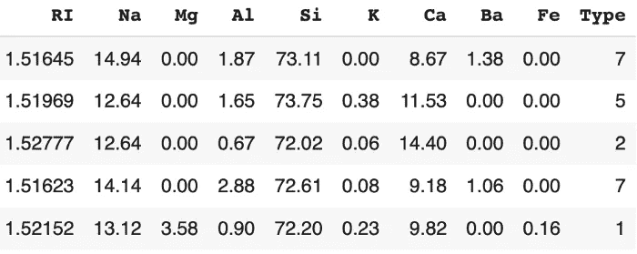

# 单变量和多变量异常值

通过使用`seaborn’s pairplot`,我们可以绘制玻璃含量之间的成对关系，通过这种视觉，我们可以看到我们的基础数据的分布情况。

```
import seaborn as snssns.pairplot(glass, diag_kws={'color':'red'})
```

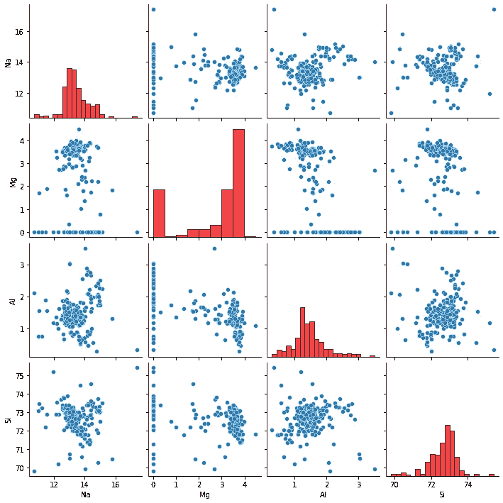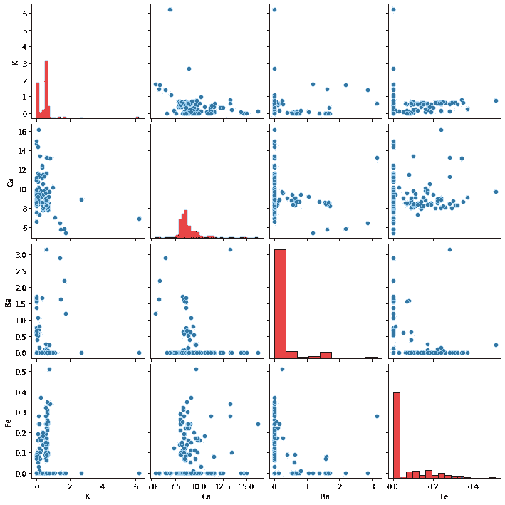

变量之间的成对关系

如果我们仔细观察上面的图，我们会发现玻璃属性位于 x 轴和 y 轴上。沿着红色的对角线，我们可以看到显示分布的直方图。

如您所见，并非所有属性都遵循钟形曲线的正态分布，但事实上，大多数属性都偏向较低值(如 Ba、Fe)或较高值(如 Mg)。为了检测**单变量异常值**，我们应该关注单个属性的分布，并找到远离该属性大部分数据的数据点。例如，如果我们选择“Na”并绘制一个箱线图，我们可以找到哪些数据点在胡须之外，可以标记为异常值。

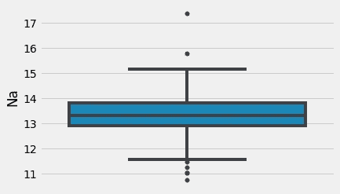

Na 的箱线图—显示晶须外部的数据点。

相反，为了检测多元异常值，我们应该关注 n 维空间中至少两个变量的组合。例如，在玻璃数据集中，我们可以使用玻璃的所有八个属性，并在 n 维空间中绘制它们，并通过检测哪些数据点落在远处来找到多元异常值。

由于绘制超过三个维度是不可能的，我们应该找到一种方法将八个维度转换到一个更低维度的空间。PCA —主成分分析是一种降维技术，它通过最大化低维表示中的方差来执行高维空间到低维空间的线性映射。我们可以通过用`n_components=3.`执行 PCA 将八个维度转换成三维空间

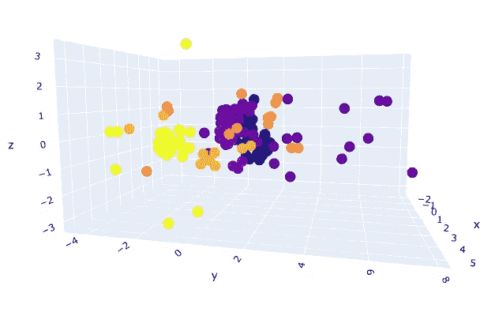

具有 3 种成分的 PCA 可视化(颜色代表玻璃的“类型”)

您可以在图中看到，有些数据点彼此靠近(构成密集区域)，有些远离，可能是*多元*异常值。

我们需要遵循不同的程序来检测单变量和多变量异常值。让我们从单变量异常值开始，学习标准差和四分位距方法来检测它们。

# 单变量异常检测

## 1.标准偏差法

假设一个变量(几乎)是正态分布的。在这种情况下，其直方图应遵循钟形曲线，68.3%的数据值位于平均值的一个标准偏差内，95.4%的数据值位于平均值的两个标准偏差内，99.7%的数据值位于平均值的三个标准偏差内。

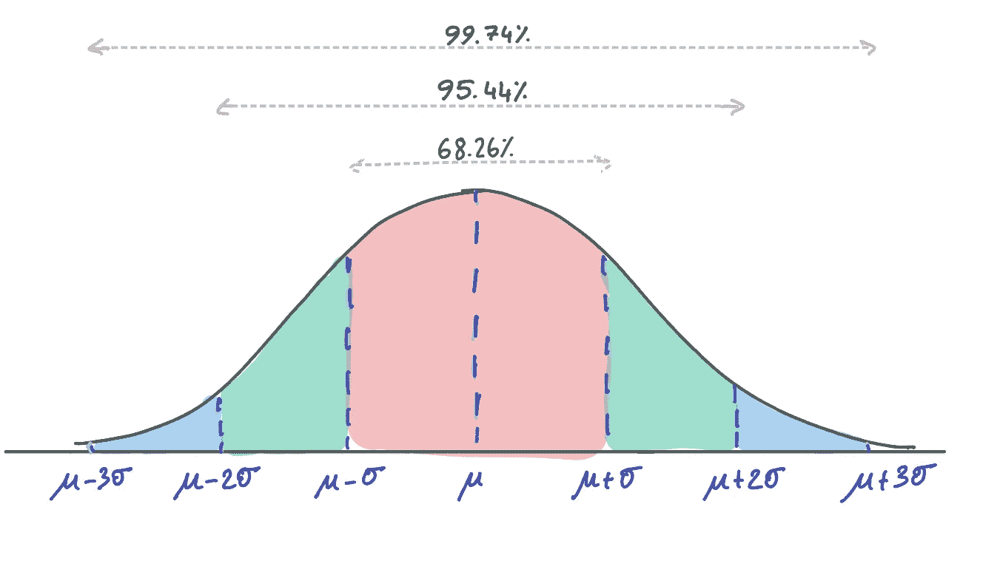

因此，如果数据点距离平均值超过三个标准差，我们就可以检测出异常值。

通过使用标准偏差技术，我们根据“Na”变量的分布(这是一个极值)删除了两个记录。您可以扩展并覆盖所有其他属性，以移除单变量异常值。

```
Shape of original dataset: (213, 9) 
Shape of dataset after removing outliers in Na column: (211, 9)
```

## 2.四分位极差法

四分位距方法(最好使用箱线图显示)通过定义三个点将数据分成四分位:

> 四分位数 1 (Q1)代表第 25 百分位
> 四分位数 2 (Q2)代表第 50 百分位
> 四分位数 3 (Q3)代表第 75 百分位

箱线图中的方框表示 IQR 范围，其被定义为 Q1 和 Q3 之间的范围；`IQR = Q3 — Q1`和低于`Q1 - 1.5*IQR`或高于`Q3 + 1.5*IQR`的数据点被定义为异常值。

在方框图中，`Q1 - 1.5*IQR`和`Q3 + 1.5*IQR`用触须表示，异常值用上方或下方的点表示。

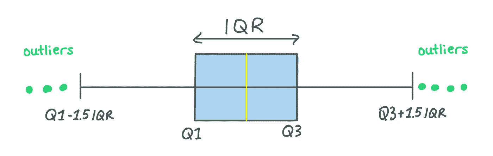

```
Shape of original dataset: (213, 9) 
Shape of dataset after removing outliers in Na column: (206, 9)
```

通过使用 IQR 技术，我们根据“Na”变量的分布删除了七个记录。正如你可以注意到的，标准差方法只能找到 2 个异常值，这是真正的极值点，但使用 IQR 方法，我们能够检测到更多(5 个不那么极端的记录)。由您和您的用例来决定哪种方法对数据集更好，以及您是否有空间丢弃更多的数据点。

让我们继续讨论多元异常值，了解隔离森林、DBSCAN(含噪声的基于密度的应用程序空间聚类)和 LOF(本地异常值因子)。

# 多元异常检测

## 1.隔离森林法

[隔离森林](https://scikit-learn.org/stable/modules/generated/sklearn.ensemble.IsolationForest.html)是一种基于随机森林的无监督机器学习算法。你可能知道，随机森林是一个[集成学习](https://medium.com/towards-data-science/practical-guide-to-ensemble-learning-d34c74e022a0)模型，它使用基本模型(比如 100 棵决策树)和在最终决策中权重较高的模型的集成。

> 如果你需要一个关于集合学习的复习，你可以看看这篇文章。

</practical-guide-to-ensemble-learning-d34c74e022a0>  

隔离林遵循随机林的方法，但相反，它检测(或换句话说隔离)异常数据点。为了做到这一点，它做了两个基本假设:离群值是少数，他们是不寻常的。

隔离林通过随机选择一个功能，然后随机选择一个拆分规则来分隔所选功能的值，从而创建决策树。这个过程一直持续到达到设定的超参数值。然后，隔离林考虑如果树更短并且分区更少，则相应的值是异常值(少数和不寻常)。

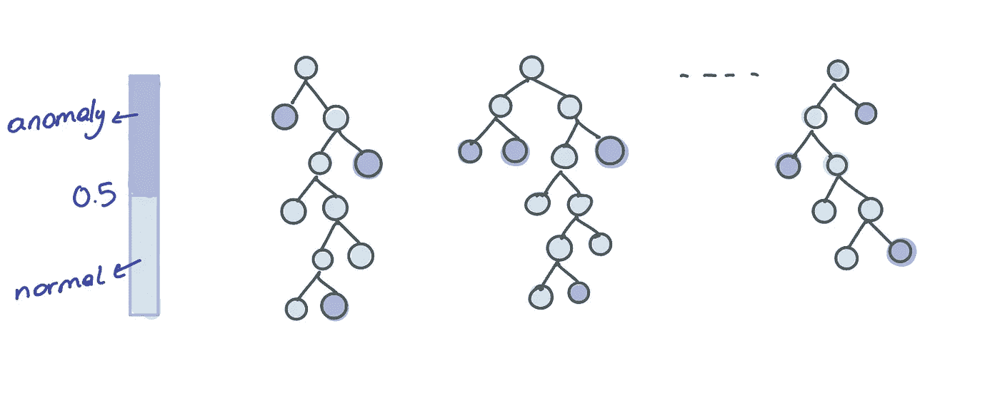

孤立森林异常检测图解

让我们看看使用来自 [scikit-learn](https://scikit-learn.org/stable/modules/generated/sklearn.ensemble.IsolationForest.html) 的`IsolationForest`类的实现。

```
from sklearn.ensemble import IsolationForestIsolationForest(*n_estimators=100*, *max_samples='auto'*, *contamination='auto'*, *max_features=1.0*, *bootstrap=False*, *n_jobs=None*, *random_state=None*, *verbose=0*, *warm_start=False*)
```

隔离森林算法有几个超参数，例如用于集成的基本估计量数量的 **n_estimators** 、用于训练模型的样本数量的 **max_samples** 、用于定义数据中异常值比例的 **contamination** 、用于从数据中提取用于训练的特征数量的 **max_features** 。其余的可以看[文档](https://scikit-learn.org/stable/modules/generated/sklearn.ensemble.IsolationForest.html)。

我们通过将基本模型的数量设置为 100，将最大特征的数量设置为特征的总数，将污染设置为`'auto'`来启动隔离林，该隔离林使用原始文件中确定的偏移和污染阈值。如果污染为 0.1，那么数据集的 10%将被定义为异常值。

通过调用`glass['outlier'].value_counts()`，我们可以看到有 19 条记录被标记为`-1`——异常值，其余 195 条记录被标记为`1`——非异常值。

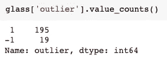

如前所述，我们可以通过主成分分析将特征数量减少到三个分量来可视化异常值。

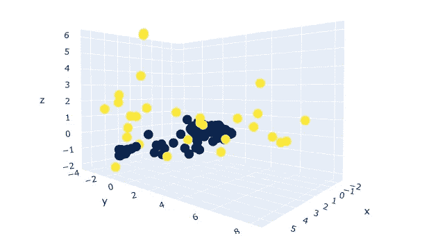

隔离林检测到异常值(黄色)(n 估计值=100，污染=“自动”)

> 为了保持内容的重点，我不会展示如何调优超参数，但是如果您感兴趣，可以查看本文。

## 2.基于密度的含噪声应用空间聚类(DBSCAN)方法

[DBSCAN](https://scikit-learn.org/stable/modules/generated/sklearn.cluster.DBSCAN.html?highlight=dbscan#sklearn.cluster.DBSCAN) 是一种流行的聚类算法，通常用作 K-means 的替代算法。它是*基于密度的*，这意味着它侧重于许多数据点所在的高密度区域。它通过测量数据之间的特征空间距离(即欧几里德距离)来执行*空间聚类*，以识别哪些可以被聚类在一起。它允许有噪声的应用，这意味着我们可以对有噪声的数据使用 DBSCAN。但这还不是全部，DBSCAN 的最大优势之一是我们不需要预先定义集群的数量。

让我们看看使用 [scikit-learn](https://scikit-learn.org/stable/modules/generated/sklearn.ensemble.IsolationForest.html) 中的`DBSCAN`类的实现。

```
from sklearn.cluster import DBSCANDBSCAN(*eps=0.5*, *min_samples=5*, *metric=’euclidean’*, *metric_params=None*, *algorithm=’auto’*, *leaf_size=30*, *p=None*, *n_jobs=None*)
```

DBSCAN 有几个超参数，例如用于在同一个聚类中考虑的两个数据点之间的最大距离的**EPS(ε)**、用于被认为是核心点的点的接近数据点的数量的 **min_samples** 、用于计算点之间距离的**度量**。其余的可以看[文档](https://scikit-learn.org/stable/modules/generated/sklearn.cluster.DBSCAN.html?highlight=dbscan#sklearn.cluster.DBSCAN)。

启动 DBSCAN 时，仔细选择超参数非常重要。例如，如果 eps 值选择得太小，那么大多数数据可以被归类为异常值，因为邻域面积被定义为更小。相反，如果 eps 值选择得太大，则大多数点可以聚集在一起，因为它们可能位于相同的邻域中。这里，我们使用[k-距离图选择 eps 为 0.4。](https://stackoverflow.com/questions/43160240/how-to-plot-a-k-distance-graph-in-python)

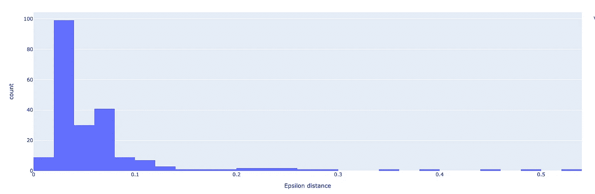

k-距离图，其中大部分数据距离第 10 个最近的邻居不超过 0.4 个单位

此外，min_samples 是一个重要的超参数，通常等于或大于 3，大多数情况下选择为 D+1，其中 D 是数据集的维数。在我们的示例中，我们将 min_samples 设置为 10。

因为 DBSCAN 通过密度来识别聚类，所以高密度区域是聚类发生的地方，低密度区域是异常值发生的地方。通过调用`glass['outlier'].value_counts()`，我们可以看到有 22 条记录被标记为`-1`——异常值，其余 192 条记录被标记为`1`——非异常值。

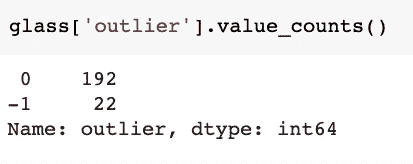

我们可以使用主成分分析来可视化异常值。

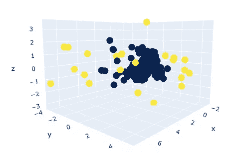

DBSCAN 检测到异常值(黄色)(eps=0.4，min_samples=10)

## 3.本地异常因素(LOF)

[LOF](https://scikit-learn.org/stable/auto_examples/neighbors/plot_lof_outlier_detection.html#sphx-glr-auto-examples-neighbors-plot-lof-outlier-detection-py) 是一种流行的无监督异常检测算法，它计算数据点相对于其邻居的局部密度偏差。计算后，密度较低的点被视为异常值。

让我们看看使用来自 [scikit-learn](https://scikit-learn.org/stable/modules/generated/sklearn.neighbors.LocalOutlierFactor.html) 的`LOF`类的实现。

```
from sklearn.neighbors import LocalOutlierFactor*LocalOutlierFactor(n_neighbors=20, algorithm='auto', leaf_size=30, metric='minkowski', p=2, metric_params=None, contamination='auto', novelty=False, n_jobs=None)*
```

LOF 有几个超参数，如 **n_neighbors** 用于选择默认等于 20 的邻域数，以及**contaminance**用于定义异常值的比例，它可以等于(0，0.5)范围内的`'float'`或使用原始论文中确定的偏移和污染阈值的`'auto'`。

通过调用`glass['outlier'].value_counts()`，我们可以看到有 34 条记录被标记为`-1`——异常值，其余 180 条记录被标记为`1`——非异常值。

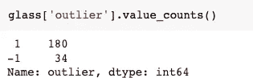

最后，我们可以使用主成分分析来可视化这些异常值。


LOF 检测到异常值(黄色)(n_neighbors=20，污染=“自动”)

# 结论

在本文中，我们探索了不同的方法来检测数据集中的异常值。我们从单变量异常值检测技术开始，涵盖了标准差和四分位间距方法。我们对玻璃鉴定数据集中的“Na”列执行了这些方法。然后，我们转向多元异常检测技术，涵盖了隔离森林、DBSCAN 和局部异常因素。通过这些方法，我们学会了如何使用特征空间中的所有维度来检测异常值。除了异常值检测，我们还学习了如何使用 PCA——一种降维技术来可视化 n 维数据。

在介绍这些方法时，我们没有花太多时间调优超参数。然而，超参数调整是 ML 模型开发中的一个重要步骤。如果你想学习或者刷新一下知识，可以看看下面这篇文章。

</hyperparameter-tuning-with-grid-search-and-random-search-6e1b5e175144>  

我希望您喜欢阅读异常值检测，并发现这篇文章对您的工作有用！

*如果你喜欢这篇文章，你可以**[***在这里阅读我的其他文章***](https://medium.com/@idilismiguzel)**和* [***关注我上媒***](http://medium.com/@idilismiguzel/follow)*如果您有任何问题或建议，请告诉我。✨***

***喜欢这篇文章吗？ [**成为会员求更！**](https://idilismiguzel.medium.com/membership)***

***参考***

1.  ***[隔离森林由 Scikit-Learn](https://scikit-learn.org/stable/modules/generated/sklearn.ensemble.IsolationForest.html)***
2.  ***[通过 Scikit-Learn 进行数据库扫描](https://scikit-learn.org/stable/modules/generated/sklearn.cluster.DBSCAN.html?highlight=dbscan#sklearn.cluster.DBSCAN)***
3.  ***[sci kit-Learn 的局部异常因子](https://scikit-learn.org/stable/auto_examples/neighbors/plot_lof_outlier_detection.html#sphx-glr-auto-examples-neighbors-plot-lof-outlier-detection-py)***
4.  ***由[本杰明·沃罗斯](https://unsplash.com/@vorosbenisop?utm_source=medium&utm_medium=referral)在 [Unsplash](https://unsplash.com?utm_source=medium&utm_medium=referral) 拍摄的标题照片***
5.  ***所有其他图片均由作者提供***
6.  ***[来自 Kaggle](https://www.kaggle.com/datasets/uciml/glass) 的玻璃鉴定数据集作者:Dua，d .和 Graff，C. (2019)。UCI 机器学习知识库[http://archive . ics . UCI . edu/ml]。加州欧文:加州大学信息与计算机科学学院。***