# 使用图像散列函数检测重复图像

> 原文：<https://towardsdatascience.com/detection-of-duplicate-images-using-image-hash-functions-4d9c53f04a75>

# 使用图像散列函数检测重复图像

## 使用 Python 库 undouble 自动搜索(几乎)相同的照片

在整个系统中搜索(几乎)相同的照片可能是一项繁琐的工作；你需要在成千上万的照片中点击，然后决定每张照片是否是一张*【相似】*的照片。检测重复的最直接的方法是根据文件大小或文件名。然而，照片通常来自不同的来源，如移动设备、社交媒体应用程序，这导致了文件大小、名称以及分辨率、缩放比例、压缩和亮度的差异。 ***哈希函数*** 由于对微小变化的鲁棒性，是检测(接近)相同照片的理想选择。我将总结一下*散列函数*的概念，随后是一个实践教程，演示在最小化误报冲突的同时检测重复的步骤。所有结果都是使用 [*Python 库 undouble*](https://erdogant.github.io/undouble) *导出的。*

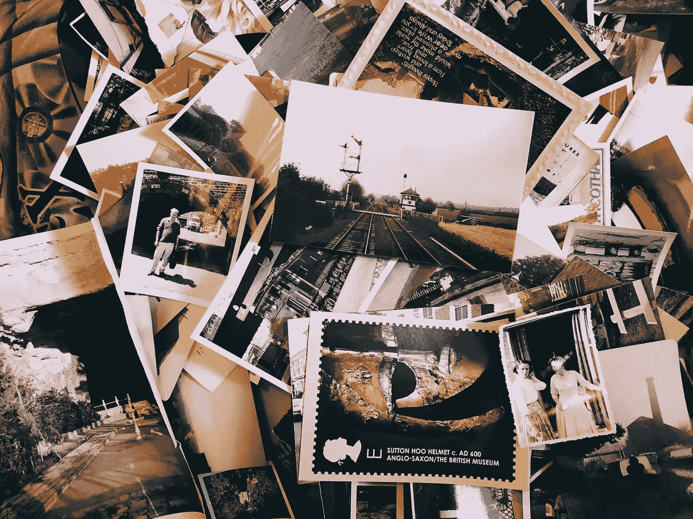

乔恩·泰森在 [Unsplash](https://unsplash.com/s/photos/photos?utm_source=unsplash&utm_medium=referral&utm_content=creditCopyText) 上的照片

*如果你觉得这篇文章很有帮助，可以使用我的* [*推荐链接*](https://medium.com/@erdogant/membership) *继续无限制学习，并注册成为中级会员。另外，* [*关注我*](http://erdogant.medium.com) *关注我的最新内容！*

# 视觉相似但数值不同。

两幅图像可能在视觉上相似，但在数字上不同。数字差异可能由各种原因造成，例如使用社交媒体应用程序可能会改变*亮度、对比度、伽马校正、压缩、分辨率和/或缩放比例。*例如，使用 Whatsapp 发送图像会导致分辨率降低(图 1)。请注意，减少量可能因设备和用户定义的设置而异。

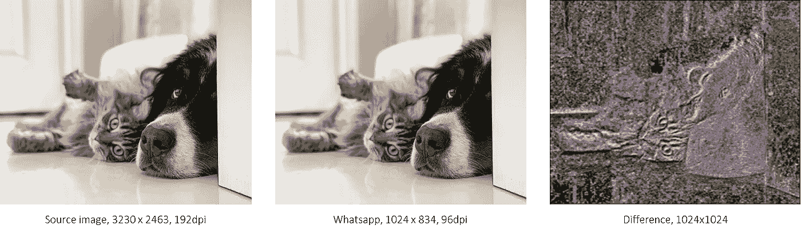

图一。视觉上相似但数字不同的照片。a .最左边是源图像。b .中间是用 Whatsapp 发完之后。c .右图像是两个图像之间的差异。*路易·菲利浦·波伊特拉斯在 Unsplash 上拍摄的照片*

从视觉角度来看，很难看出*源*和 *Whatsapp* 图像之间的任何变化，但是当我们减去这两幅图像时，差异就变得很明显了(图 1C)。如果你的磁盘上只有几幅图像需要确认的话，选择分辨率最好的图像是很容易的。然而，当你偶尔或者可能每年将你所有的图像转储到磁盘时，这就成了一项耗时的任务，当家人/朋友/同事也与你分享他们*几乎相似的*时刻时，这就更具挑战性了。

> 问题不是你有没有重复的照片，而是它们在哪里。

像按文件大小排序或图像相减这样的方法就会失败。尽管有解决方案； ***哈希函数！*** *哈希函数*对亮度、对比度、伽马校正、压缩、缩放和/或分辨率的微小变化具有鲁棒性，因此非常适合检测(接近)相同的图像。散列函数的使用有很多应用，例如在*数字取证*、*版权强制*中，以及更一般的用于*磁盘空间减少并因此取消发布。*

# 可撤销库搜索重复的图像。

[*可撤销*库](https://erdogant.github.io/undouble)可用于检测整个系统或任何输入目录中的相同图像。给定输入数据，对图像执行预处理，计算散列，并基于图像散列对图像进行分组。为了在不执行手动操作的情况下组织磁盘上的图像，*移动功能*将移动相同的图像，但分辨率最大的图像除外(该图像被复制)。所采取步骤的示意图如下所示。

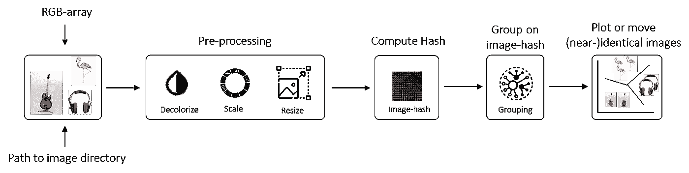

在 undouble 中根据图像哈希对图像进行分组所采取的步骤的示意图。*图片来自作者*。

在接下来的部分中，我将更详细地描述预处理步骤、散列函数、分组结果和绘图功能，比如图像散列。

# 图像哈希函数。

哈希函数将输入数据转换或映射为固定长度的字符串，可以看作输入数据的“*指纹“*或*“签名”*；*图像哈希*。因此，一个好的散列函数应该完全由输入数据决定，或者在我们的例子中，由图像决定。哈希函数有很多种，比如；*平均哈希、感知哈希、差分哈希、Haar 小波哈希、Daubechies 小波哈希、HSV 颜色哈希、抗裁剪哈希。*每个哈希函数都有特定的属性，使其能够抵抗某些变化，如*亮度、对比度、伽马、校正、水印、压缩、缩放和灰度变化*。

> 图像哈希函数将图像映射到称为图像哈希的短字符串，可用于图像认证或用作数字指纹。

然而，两个视觉上不同的图像 得到相同的图像散列，这被称为 ***碰撞*** ，这是可能发生的。使用 101 objects 数据集展示了不止一个示例，但是让我们开始评估最著名的哈希函数的健壮性。通过改变单幅图像的*亮度(-50%、-20%、+20% +50%)、对比度(-50%、-20%、+20% +50%)、缩放和压缩(png、jpg)* 来评估鲁棒性。总共为“*猫和狗”*图像(图 2)创建了 10 种不同的变化。请注意，这不会评估*冲突*，而是评估不同哈希函数的亮度和对比度的影响。所有哈希函数都使用 python [***库 undo double***](https://erdogant.github.io/undouble)进行评估，该库依次使用图像哈希库[*image hash*](https://github.com/JohannesBuchner/imagehash)*【3】*的功能。

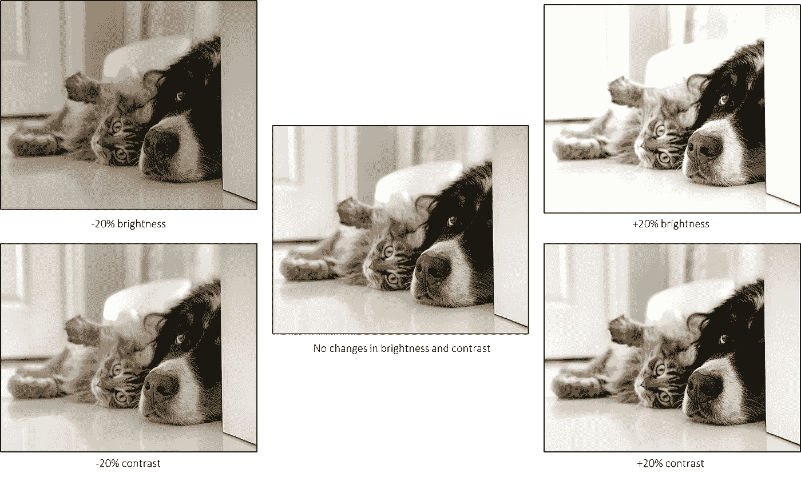

图二。亮度和对比度变化的四个例子。*路易·菲利浦·波伊特拉斯在 Unsplash 上拍摄的照片*

# 计算哈希之前的预处理。

在我们能够确定图像散列之前，需要预处理步骤； *1。脱色，2。归一化像素值，以及 3 .缩放图像*。脱色的原因是“识别”图像所需的信息很容易出现在灰度通道中。此外，从 RGB 的每像素 24 位减少到每像素 8 位在计算上更有吸引力；在时间和记忆方面。下一步是将图像向下采样/缩放到更小的尺寸。大多数情况下，选择 64 位哈希，这仅仅意味着图像被下采样为 8 x 8 像素。下面是一个示例，展示了如何使用 Python 为各种哈希函数导出图像哈希。

```
pip install undouble
```

演示计算图像散列和创建绘图的示例。

# 平均哈希。

在脱色和缩放步骤*、*之后，将每个像素块与图像的所有像素值的平均值(顾名思义)进行比较。在下面的例子中，我们将生成一个 64 位散列，这意味着图像被缩放到 8×8 像素。如果像素块中的值大于平均值，则得到值 1(白色)，否则得到值 0(黑色)。图像散列是通过将二进制数组展平成向量来创建的。

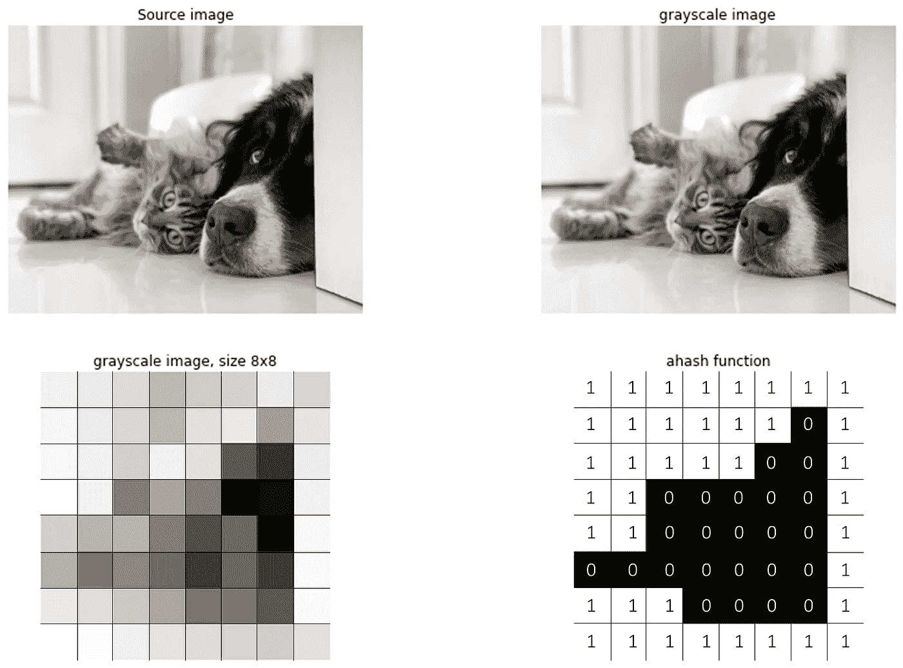

图二。镜像哈希二进制:11111111111101111110011100000011000000011111000011111111111。图片由作者提供。

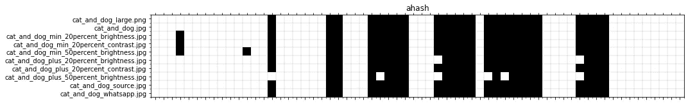

图 3。10 个更改图像的平均哈希。

如果我们对 10 个被修改的图像运行*平均哈希函数*，我们可以看到*图像哈希*非常稳定，只有微小的差异(图 3)。只有在亮度增加 50%的情况下，图像哈希才开始出现偏差。在所有组合中，图像散列平均有 2.1 个变化。

# 感性杂凑。

感知散列函数仅从图像脱色开始，然后应用离散余弦变换(DCT );首先是每行，然后是每列。高频像素现在被裁剪为 8 x 8 像素。然后将每个像素块与图像的所有灰度值的中值进行比较。如果像素块中的值大于中值，则得到值 1，否则为 0。最终图像散列之后是将二进制数组展平成向量。

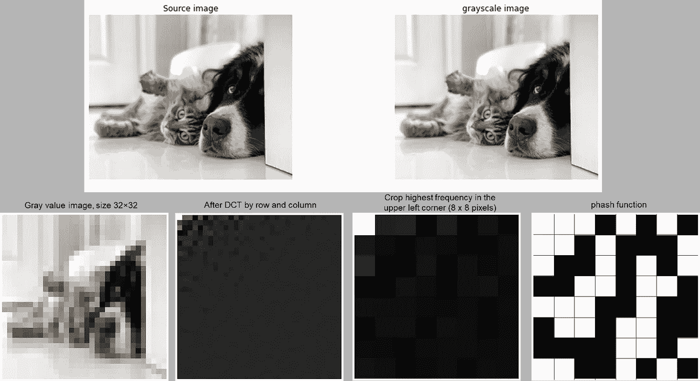

图 4。*感性*-哈希:111010101100011010100110110111011001000110110000011011011000001010。图片由作者提供。

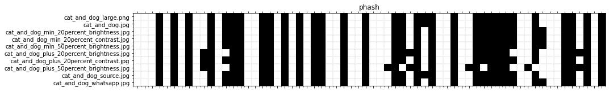

图 5。*感知*对于 10 个被改变的图像。图片由作者提供。

如果我们对 10 张图像运行*感知哈希函数*并进行一些修改，就可以检测到图像哈希中的各种微小差异(图 5)。在亮度增加 50%的情况下，图像散列开始更加偏离。在所有组合中，图像散列平均有 4 次变化。

# 差异哈希。

在脱色和缩放*、*步骤之后，像素被连续地(每行从左到右)与其右边的相邻像素进行比较。如果位置 x 处的字节小于位置(x+1)处的字节，则得到值 1，否则为 0。最终图像散列之后是将二进制数组展平成向量。

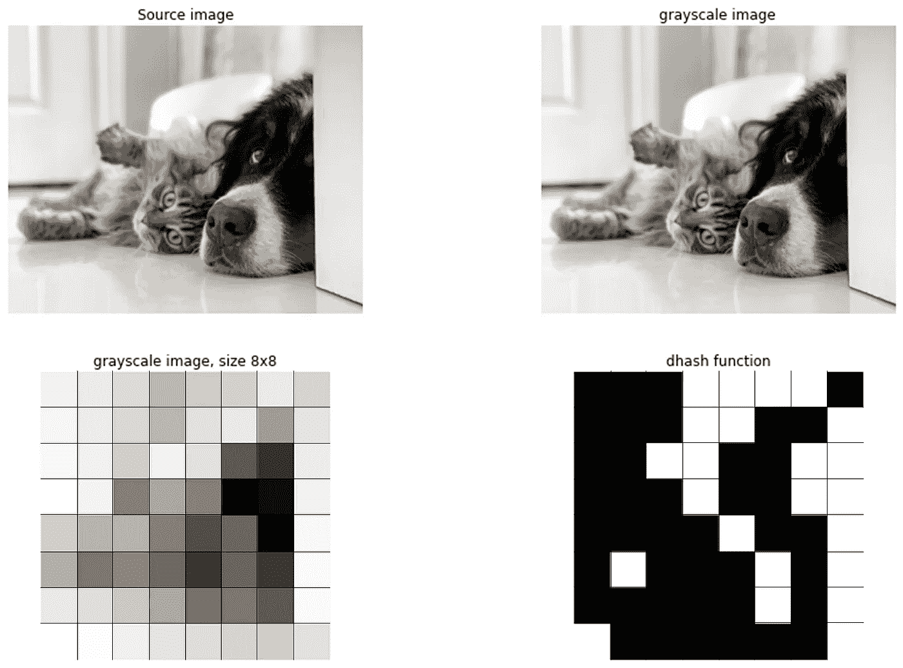

图 6。镜像哈希:000111100001100110011001100011000010010100010001000010110000001。图片由作者提供。

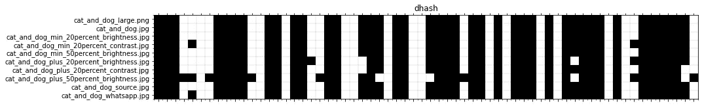

图 7。*10 张更改图像的差异哈希*。图片由作者提供。

如果我们对 10 张图像运行*差异哈希函数*，并做一些修改，图像哈希会产生一些小的变化(图 7)。50%亮度的增加显示了最大的差异。在所有组合中，图像散列平均有 3.8 次变化。

# 哈尔小波哈希。

在脱色和缩放步骤*、*之后，对图像应用二维小波变换。然后将每个像素块与图像的所有灰度值的中值进行比较。如果像素块中的值大于中值，则得到值 1，否则为 0。最终的图像散列之后是将数组展平成向量。

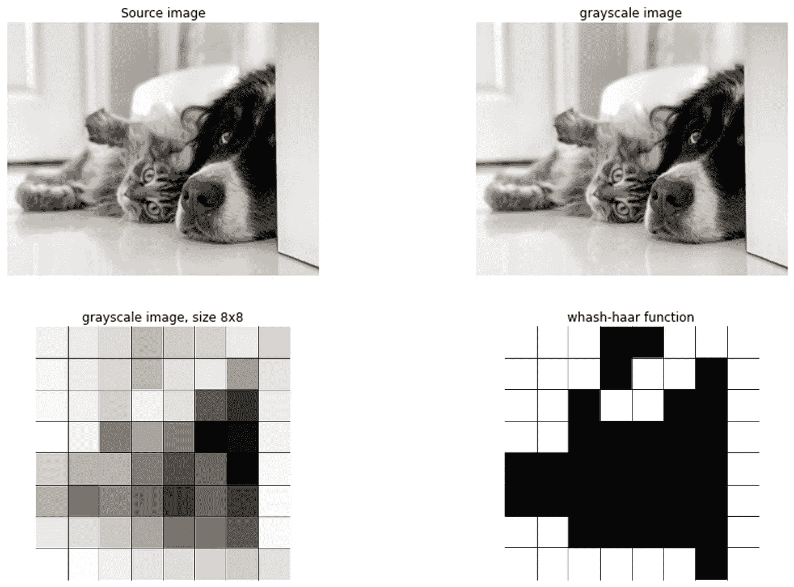

图 8。镜像哈希:111001111110110111001110000001000000010000001110000011111111101。图片由作者提供。

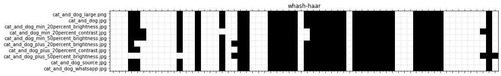

图 9。 *haar 小波哈希*用于 10 幅修改后的图像。图片由作者提供。

如果我们比较 10 个被改变的图像的图像散列，我们可以看到 *haar 小波散列*是相当稳定的，尽管在被改变的图像上有一些微小的变化。在所有组合中，图像散列平均有 2.5 个变化。

# 在真实数据集中查找相同的图像。

为了演示各种散列函数在真实数据集上的性能，我使用了 [*加州理工学院 101*](http://www.vision.caltech.edu/Image_Datasets/Caltech101/101_ObjectCategories.tar.gz)*【2】数据集，并将其保存到我的本地磁盘。针对 *aHash、pHash、dHash、*和*小波哈希检查重复的检测。**加州理工*数据集包含 9144 张属于 101 个类别的真实世界图像。大约 40 至 800 每类图像。每个图像的大小大约为 300 x 200 像素。 [*可撤销库*](https://erdogant.github.io/undouble) 的输入可以简单地是存储所有图像的*目录位置*。所有子目录也将被递归分析。请注意，该数据集不包含相同图像的地面实况标签。因此，我将直观地检查分组的所有结果，并描述每个散列函数的结果。*

```
*pip install undouble*
```

*在 101 对象数据集中检测具有相同图像散列的图像的示例。*

****平均哈希*** 功能检测到 135 个组，这些组可以链接到具有相同哈希(阈值=0)的 335 个图像，基于输入哈希大小 8 (64 位)。尽管检测到相同的图像，但大多数组显示了碰撞，如左上角和左下角，和/或几乎相同的图像，如摩托车(图 11)。通过将散列大小增加到 16 (256 位)，检测到 64 个图像的 28 个组。 ***没有碰撞出现，但是检测到近乎相同的图像*** ，比如摩托车。*

*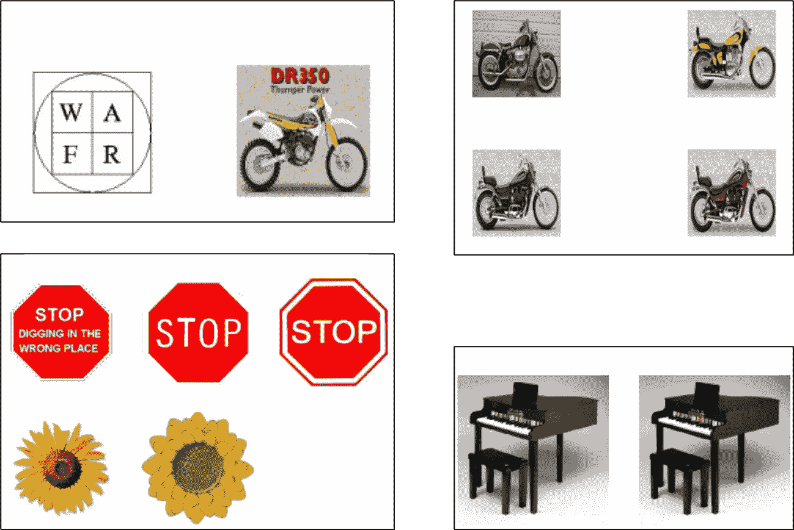*

*图 11。平均哈希在 335 个具有相同哈希的图像中检测到 135 个组。碰撞和几乎相同的图像出现在几乎所有的组中。图片由作者提供。*

****小波哈希*** 功能检测到 141 个组，根据输入哈希大小 8 (64 位)，这些组可以链接到具有相同哈希(阈值=0)的 513 个图像。目测显示，几乎所有组都包含碰撞或几乎相同的图像(图 12)。谁知道草莓会有和摩托车相似的图片呢？通过将散列大小增加到 16 (256 位)，检测到 51 个图像的 25 个组。 ***未出现碰撞，但检测到近乎相同的图像*** ，如摩托车。*

*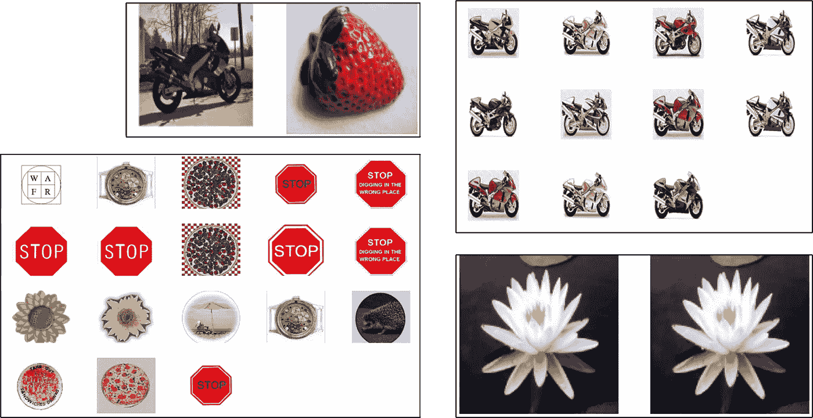*

*图 12。小波哈希检测到 513 个具有相同哈希的图像的 141 组。几乎每一组都包含了一幅几乎完全相同的图像。图片由作者提供。*

****差分哈希*** 功能检测到 28 个图像可以链接到具有相同哈希(阈值=0)的 31 个图像。视觉检查显示没有碰撞，但检测到几乎相同的图像(两辆摩托车)。通过将散列大小增加到 16 (256 位)，检测到 16 个图像的 8 个组。没有碰撞出现，但只有一些几乎相同的图像，如摩托车。通过将散列大小增加到 16 (256 位)，检测到 16 个图像的 8 个组。 ***没有碰撞，也没有检测到近似相同的图像*** ，所有图像在视觉上都是相似的。*

*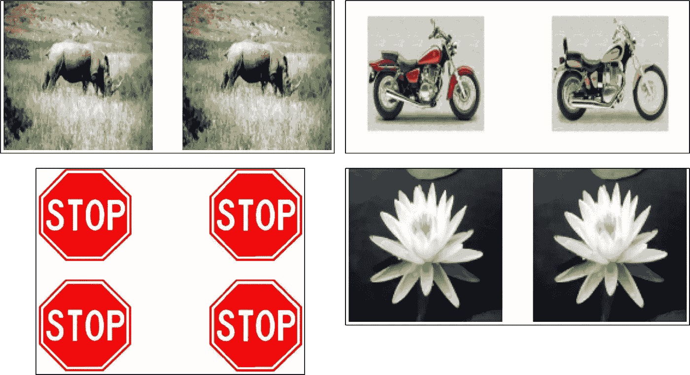*

*图 13。差分哈希检测到 28 组 31 个图像具有相同的哈希。没有观察到碰撞，只有一个图像几乎相同(摩托车)。图片由作者提供。*

****感知哈希*** 功能检测到 38 个组，这些组可以链接到具有相同哈希(阈值=0)的 41 个图像。视觉检查显示没有碰撞，但是检测到几乎相同的图像，例如摩托车，如图 14 所示。通过将散列大小增加到 16 (256 位)，检测到 20 个图像的 10 个组。 ***没有检测到碰撞和几乎相同的图像*** ，所有图像在视觉上都是相似的。*

**

*图 14。感知散列检测到具有相同散列的 41 个图像的 38 个组。没有观察到碰撞，但是在 4 组中出现了几乎相同的图像。图片由作者提供。*

## *结论。*

*在*猫和狗图像*实验的情况下，每个哈希函数的结果都相当稳定。然而，当我们使用真实世界的数据集时，很明显，散列大小为 8 (64 位)会导致*平均散列*和*小波散列的许多冲突。*此外，它还集合了许多近乎相同的图像。*差分散列*的结果是准确的，但也是最保守的。另一方面，**的*感知哈希*也显示了准确的结果，但不那么保守。**当哈希大小增加到 16 (256 位)时，没有哈希函数导致冲突，但是对于*平均哈希*和*小波哈希*检测到几乎相同的图像。*感知哈希*和*差分哈希*都没有显示冲突或几乎相同的图像。这里再次说明，*感知哈希*不那么保守。*

> *感知哈希对于重复图像的检测最为准确*。**

*此外，结果还可能取决于输入图像的类型。当图像有一个坚实的背景，如摩托车和交通标志，碰撞会更经常发生。原因之一是二进制像素信息表征了图像，并且形成的图像散列变得不那么唯一。例如，使用*平均哈希*和*小波哈希*可以很容易地得到一个相同的图像哈希。*

# *哈希函数还是聚类？*

*哈希函数和聚类方法旨在对相似的图像进行分组，但还是有区别的。哈希函数将创建图像的“*指纹“*或“*”签名“*”；图像哈希。两个相同的图像散列应该代表两个相同的图像。在聚类的情况下，提取特征，选择距离度量和链接类型，最后，图像被聚类。采取不同的步骤和/或方法将产生不同的分组，因为它隐含地对数据施加了结构，从而对样本进行了划分。或者换句话说，有更多的自由度来定义“相似”图像。*

> *哈希函数旨在创建可用于检测相同图像的唯一签名，而聚类方法旨在检测相似图像组。*

*为了比较散列函数和聚类得出的结果，我将使用相同的 *101 对象*数据集并执行聚类方法。 [***clustimage 库***【5】](https://erdogant.github.io/clustimage)用于对仅给出路径位置作为输入的图像进行聚类。子目录中的所有图像都被递归收集。使用默认设置和 PCA 方法，检测到 63 个最佳聚类(图 15 ),其中显示了聚类的质心图像。尽管一些聚类包含具有高相似性的图像(图 15D)，但是图像不一定是相同的或接近相同的。如果你想了解更多关于图像聚类的知识，请阅读这篇博客。*

*对 101 对象数据集进行聚类的示例。*

*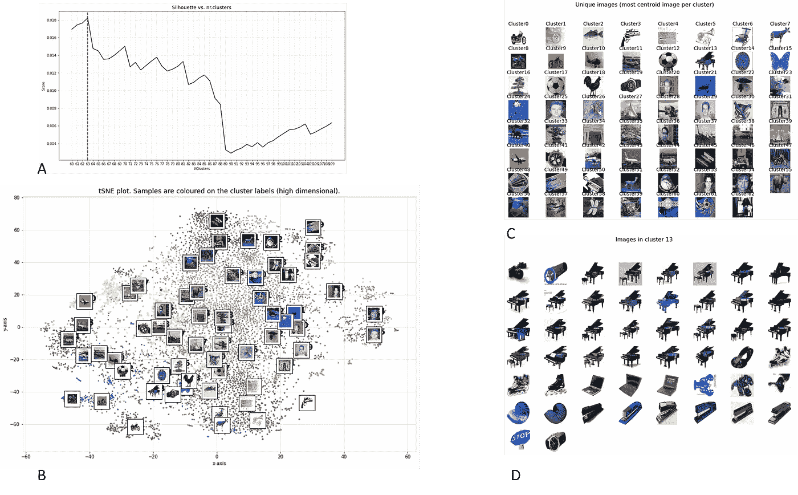*

*图 15。Caltech101 数据集[2] [下载链接](http://www.vision.caltech.edu/Image_Datasets/Caltech101/101_ObjectCategories.tar.gz)。a .轮廓分数在 63 个聚类处检测到最佳值。b .使用检测到的聚类标签对样本进行着色的 tSNE 嵌入。c .并非所有聚类都产生高度相似的图像。在群集 13 中检测到的图像主要是钢琴的图像。图片由作者提供。*

# *最后的话。*

*我提到了用于检测(几乎)相同图像的*散列函数*的概念。 ***建议使用感知哈希函数*** 检测重复图像。使用 [*undouble* 库](https://erdogant.github.io/undouble)可以相对简单地检测整个系统或目录中(几乎)相同的映像。它管道化了图像预处理(灰度化、归一化和缩放)、计算图像散列以及基于图像散列差异对图像进行分组的过程(图 10)。阈值为 0 将对具有相同图像哈希的图像进行分组。然而，当取消发布我的个人照片库时，阈值 10 显示了最佳结果，因为照片(如连拍的照片)也被分组。使用绘图功能可以轻松查看结果，使用*移动*功能可以显示图像。在移动图像的情况下，具有最高分辨率的组中的图像将被复制，并且所有其他图像被移动到“undouble”子目录中。如果您需要更多关于图像分组的灵活性和自由度，我推荐您阅读这篇关于图像聚类的[博客](/a-step-by-step-guide-for-clustering-images-4b45f9906128)【4】，它描述了使用 [clustimage 库](https://erdogant.github.io/clustimage)【5】进行图像聚类。*

**注意安全。保持冷静。**

****欢呼 e .****

**如果你觉得这篇文章很有帮助，可以使用我的* [*推荐链接*](https://medium.com/@erdogant/membership) *继续无限制学习，并注册成为中级会员。另外，* [*关注我*](http://erdogant.medium.com) *保持我的最新内容！**

# *软件*

*   *[不可置疑的 Github/文档](https://erdogant.github.io/undouble)*
*   *[Clustimage Github/文档](https://erdogant.github.io/clustimage)*

## *我们连线吧！*

*   *[我们在 LinkedIn 上连线](https://www.linkedin.com/in/erdogant/)*
*   *[在 Github 上关注我](https://github.com/erdogant)*
*   *[在 Medium 上跟随我](https://erdogant.medium.com/)*

# *参考*

1.  *Taskesen，E. (2022)。检测(接近)相同图像的 Python 库。【电脑软件】。*
2.  *长度飞飞，r .弗格斯和 p .佩罗娜。[*从少数训练实例中学习生成视觉模型
    :在
    101 个对象类别*上测试的增量贝叶斯方法。](http://www.vision.caltech.edu/Image_Datasets/Caltech101/#Download) IEEE。CVPR 2004，基于生成模型
    的视觉研讨会。2004*
3.  *[https://github.com/JohannesBuchner/imagehash](https://github.com/JohannesBuchner/imagehash)*
4.  *Taskesen，E. [*图像聚类的分步指南。*](/a-step-by-step-guide-for-clustering-images-4b45f9906128) 走向数据科学，2021。*
5.  *Taskesen，E. (2021)。 [Python 包 clustimage 用于图像的无监督聚类。](https://erdogant.github.io/clustimage)【电脑软件】。[https://towards data science . com/a-step-by-step-step-guide-for-clustering-images-4b 45 f 9906128](/a-step-by-step-guide-for-clustering-images-4b45f9906128)*