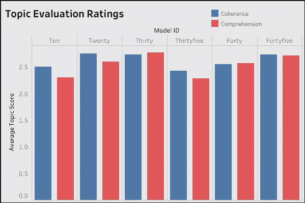
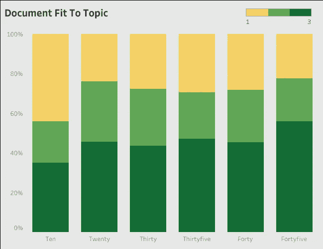
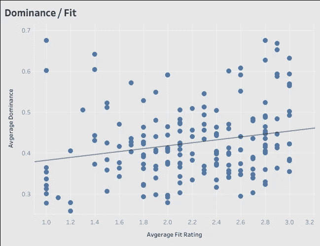
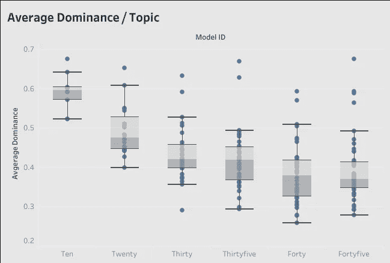

# 确定正确的 LDA 主题模型大小，第二部分

> 原文：<https://towardsdatascience.com/determining-the-right-lda-topic-model-size-part-ii-ff4312e9fd9>

在 [Unsplash](https://unsplash.com?utm_source=medium&utm_medium=referral) 上 [Kier In Sight](https://unsplash.com/@kierinsight?utm_source=medium&utm_medium=referral) 的照片

D 尽管有大量关于 LDA 主题模型实现的博客帖子和文章，但很少有人深入研究开发人员必须做出的最重要、最神秘的决策:选择要建模的主题数量。本文及其配套文章 [*使用指标来确定正确的 LDA 主题模型大小*](/use-metrics-to-determine-lda-topic-model-size-1a1feaa1ff3c) ，提供了一个深入的示例，说明如何系统地使用指标来确定典型项目的最佳主题模型大小。

## 迄今为止我们的英雄…

总结第一篇文章:手头的任务是创建一个 LDA 主题模型，普通读者可以使用它将 30，000 篇新闻文章分类到大致有意义的类别中。在练习的第一部分，我们评估了 30 个题目，从 5 个到 150 个，每 5 个一步。每个模型运行三次(以平均出 LDA 算法的随机特征中固有的统计噪声),并且每次运行运行九个度量:两个基于 PMI 的度量，CV 和 NPMI，以及评估每个模型的顶部主题模型词的七个度量。那些对语料库的细节感兴趣的人——从 Kaggle 上提供的新闻文章的更大集合[中随机选择的](https://www.kaggle.com/harishcscode/all-news-articles-from-home-page-media-house) [30，000 篇文章子集](https://www.kaggle.com/datasets/danrobinson707/newsdf),以及评估的第一步和其他技术细节，应该回顾一下旧的文章。本文继续从那里开始的过程，用主题和文本本身的样本来补充基于度量的方法。

在第一步中，使用九个指标来确定一组候选的主题大小——5、10、20、35、50 和 80。对结果模型的粗略检查导致了 5、50 和 80 主题模型的快速移除。上一篇文章到此结束。在这里，我们将继续评估并添加三个模型尺寸，以更清楚地了解不同模型尺寸的分步效果。以下评估的型号适用于 10、20、30、35、40 和 45 号尺码。

## 主题和拟合采样

为了进行语义分析，180 个主题中的每一个都用 1-3 的标准进行了评级，包括两个标准:内聚性和可理解性。内聚性是对单词如何一起工作的判断，可理解性是衡量前十个单词是否一起工作以形成容易理解的想法、主题或描述。得分为“1”的主题群被认为是不连贯的或可理解的。得分为“2”的主题被认为“有些”连贯或可理解，得分为“3”的主题似乎“大部分”或更好地代表了各自的标准。一个相似的尺度被应用到 1800 个随机选择的文档中，六个模型中的每一个从每个主题中选择 10 个。

在每个模型中，主题连贯性和可理解性的平均得分是接近的。在这里，正如我们将在下面看到的，20 和 45 模型得分很高。主题评估是 30 模型与 20 和 45 模型竞争的唯一量度。

图片作者。

虽然测量话题的衔接性和可理解性是评估话题模型输出的一种常用方法，但在这种情况下，小样本量和模型之间的相对差异导致作者不愿意根据这些结果得出明确的结论。

评估的下一个度量是特定主题词簇代表单个样本文档的语义的程度。这里 24 和 45 型号做得最好。

图片作者。

为了获得这一指标，总共对 1800 份文件进行了单独审查和评分。在这个指标中，十个主题的模型表现最差，大概是因为它的主题太少，不足以将大量的文档分组。虽然这些结果总体上，像主题模型衔接/可理解性测量，似乎有很小的差异，但样本量要大得多。

## 分布可以提供线索

该数据的另一个视图是一个箱线图，它将给出按主题的平均分数分布的某种意义。该图显示了 20 个模型主题的分布更加均匀，即使其平均分数略低于 45 个模型的平均分数。

图片作者。

虽然每个文档的评估是主题模型评估的黄金标准，尽管事实上 45 个主题模型比 20 个主题模型得分更高，但我们必须考虑到这个分数可能在统计上有偏差。这与最初决定如何选择样本有关。每个文档的评估不仅是为了测量整体的模型性能，也是为了更深入地了解每个主题是如何表现的。因此，通过选择从每个主题中抽取 10 个文档，文档总数(45 个主题模型为 450 个，20 个主题模型为 200 个)在统计上并不相等。虽然在较大的模型中采样了 1.5%的文档，但在较小的模型中采样了不到 0.7%的语料库。此外，因为主题本身并不是均匀地分布在文档中(在 45 模型中的一些主题群非常大/小)，所以结果可能在统计上进一步受到影响。

## 支配和适应

可以通过将拟合分数与我们知道在统计上更可信的数据相关联来利用拟合分数，并从抽样问题中恢复。由于我们有 30，000 个文档中每个文档的主要贡献值(给定文档的单个最可能的主题),因此可以对每个主题的这些值进行平均，然后将它们与每个主题的平均文档适合度评级进行比较:

图片作者。

该图显示了对于语料库中 30，000 个文档中的每一个，文档适合度分数和 LDA 生成的主导主题值之间的正相关。在该图中，每个主题的平均适合度与平均优势可能性进行了比较。趋势线显示正相关。

这种观点暗示了主导主题值在决定模型的语义方面是很重要的。因为我们对 30，000 个文档中的每一个都有值，所以抽样问题不重要。虽然此图显示 Ten 模型的表现比其他模型好得多，但我们已经知道它测量的是过度拟合数据，可以将其排除。通过按主题绘制总体优势值，我们可以看到 20 个主题的模型比更大的模型有明显的优势:

作者图片

将这些数据考虑在内，并与所有其他指标进行权衡，Twenty 模型似乎最适合我们的目的。

## 结论

这项工作已经完成了一个完整的循环，并返回到由两个基于 PMI 的指标确定的 20 个主题模型。这些度量标准越来越受欢迎，因为它们被认为收敛于与人类主题模型判断相匹配的主题大小。有趣的是，在这种情况下，主导主题值和模型的语义之间似乎存在关联。十主题模型在这方面是一个异常值——它有很高的优势值，但不是一个好的主题大小。我们可能会猜测，只要主题本身有意义，优势值就是相关的。百分之百确定文档中存在无意义的主题簇不是一个好的结果。另一方面，如果我们有一个有很好语义的主题聚类，我们会期望优势值会与语义相关。有趣的是，至少在这种情况下，基于非 PMI 的指标在确定最佳主题大小方面表现不佳。希望这里描述的过程增加了您对确定特定项目的最佳主题模型大小所涉及的问题的理解，并为您提供了可以用来改进您自己工作的想法。