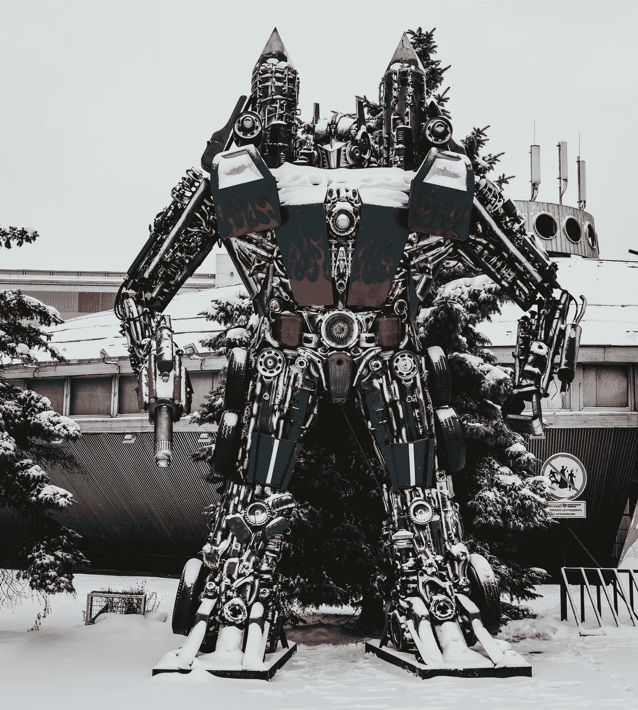
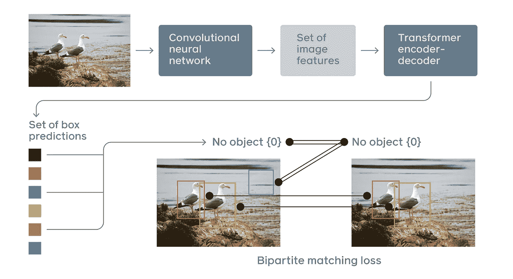
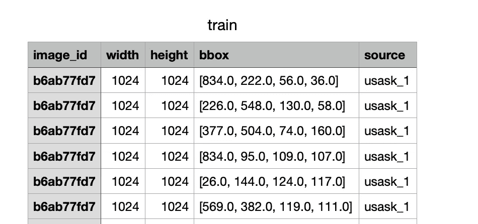
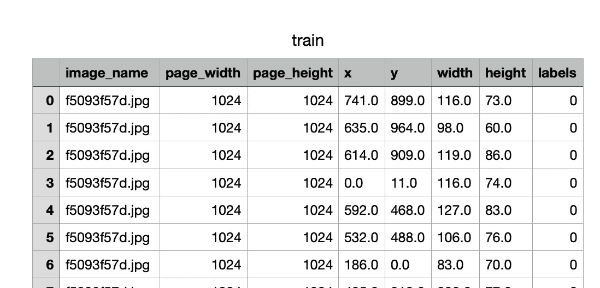
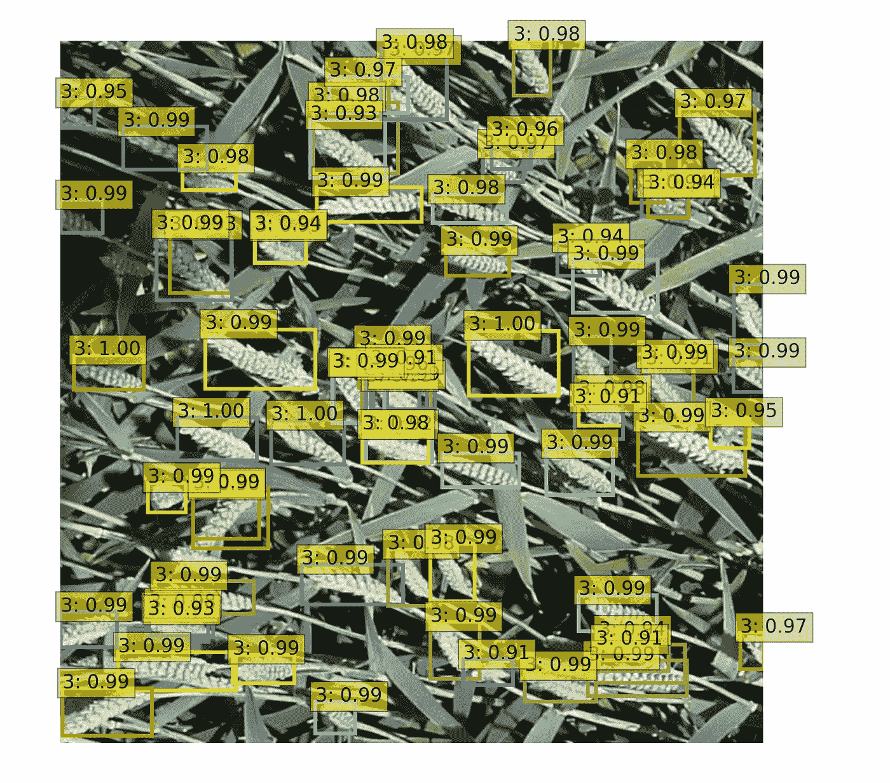

# DETR:使用变压器的端到端对象检测和 Python 实现

> 原文：<https://towardsdatascience.com/detr-end-to-end-object-detection-with-transformers-and-implementation-of-python-8f195015c94d>

## 变压器架构的使用不仅在速度方面提供了优势，而且在一些特定类型的对象检测问题方面也提供了优势

在脸书的研究团队发表的“DETR:用变形金刚进行端到端的物体检测”论文中，最新的变形金刚技术被用于物体检测问题。这种算法比传统的目标识别技术有许多优点。通过使用这种算法，在本文的后面阶段已经用 python 解决了一个示例对象检测问题。



[托古列夫的 Unsplash](https://unsplash.com/photos/4YoINz4XvnQ)

通过在目标检测问题中使用不同的方法，已经产生了许多解决方法。在第一种方法中，存在由用于检测目标对象的分类和回归阶段组成的两阶段架构。在第一阶段，使用选择性搜索或区域提议网(RPN)来生成区域提议。之后，执行分类和回归过程。R-CNN、快速 R-CNN 和更快 R-CNN 是该架构最知名的算法。虽然这些算法的准确率很高(特别是对于微小的物体)，但在速度上并没有达到理想的水平。在另一种方法中，目标检测在单个阶段中完成。这种方法不使用选择性搜索或 RPN。存在用于对象检测过程的单个神经网络模型。虽然这是一种比第一种方法快得多的技术，但它在检测小尺寸物体方面的性能相对较差。

2020 年，脸书研究团队在一篇名为“利用变压器进行端到端物体检测”的文章中介绍了一种新技术。据宣布，一种新的对象检测模型是使用变压器架构创建的，变压器架构通常用于 NLP(自然语言处理)解决方案。



图一。DETR 模式— [来源](https://arxiv.org/abs/2005.12872)

DETR 架构基本上由三层组成(图 1)。

*   CNN 层用于从图像(主干)中提取特征
*   变压器中的编码器-解码器结构
*   涉及在预测对象和真实对象之间执行二分匹配的集合损失函数

在第一阶段，通过主干层从图像中提取特征图。可以使用许多不同的模型，例如 RestNet-50 或 ResNet-101。以这种方式，二维结构信息被保留。在接下来的阶段中，数据被展平，因此我们得到一个一维结构。在位置编码之后，它被传送到编码器-解码器机制。最后，每个输出被转发到前馈网络。最后一层由 3 个节点组成。在使用 Relu 激活函数的情况下，获得预测对象的归一化中心坐标以及对象的预测高度和宽度值。当在节点中使用 softmax 激活函数时，预测相关对象的类别。因此，不需要非最大抑制(NMS)。

*抑制(NMS):它是物体识别算法的基本课题之一。在模型的预测期间，可以用多于一帧来估计目标对象。这些框架有些可能是倾斜的，有些可能太大。对于 NMS，在这些类型的帧中选择最合适的一个。联合值的交集用于此过程。*


图 2 算法中使用的变压器架构— [来源](https://arxiv.org/pdf/2005.12872.pdf)

在位置编码部分，根据元素在数组中的位置重新创建每个元素(或 NLP 世界中的标记)的向量。因此，同一个字在数组中的不同位置可以有不同的向量。

在编码器层，执行高维特征矩阵到低维特征矩阵的缩减。它由每个编码器层中的多头自关注、规格化器和前馈网络模块组成。

在解码器层，有多头自关注，规范和前馈网络模块一样，编码器。n 个对象查询被转换为输出嵌入。在下一阶段，使用前馈网络执行最终估计过程。

*注:由于将对变压器架构进行更全面的研究，因此这些章节很短。然而，如果您想获得有关变压器的更多详细信息，您可以访问相关文章*<https://arxiv.org/abs/1706.03762>**。**

*变压器架构的使用不仅在速度方面，而且在对象检测问题的某些特定类型的问题方面提供了很大的优势。通过这种架构，根据对象检测算法的图像内容进行预测。因此，在图像中上下文很重要的情况下，使用这种方法可以获得更高的成功。当递归神经网络用于对象检测项目时，已经看到精度较低并且模型运行较慢。因为操作是连续的。由于这些操作是从变压器架构中并行执行的，因此我们得到了一个更快的模型。*

# *Python 项目*

*项目中使用的数据集已经从 Kaggle 下载。这里可以访问[。数据集在 Kaggle 上获得了麻省理工学院的许可。如果你想得到详细的信息，你可以使用](https://www.kaggle.com/c/global-wheat-detection)[这个链接](https://en.wikipedia.org/wiki/MIT_License)。*

**

*图三。来自 Kaggle 的样本数据集— [来源](https://www.kaggle.com/c/global-wheat-detection)*

*在这个数据集中有不同类型的小麦(图 3)。本项目旨在正确检测这些小麦类型。存储库用于轻松完成训练和预测过程([https://github.com/ademakdogan/plant_detector](https://github.com/ademakdogan/plant_detector))。下载数据集时，可以在图 4 中看到原始的标记数据。*

**

*图 4。原始标记数据*

*首先，这种标记结构应该根据存储库进行更改。由于这种改变，csv 文件中的列名应该分别为 ***image_name、page_width、page_height、x、y、width、height、labels*** 。csv 文件的转换版本可以在图 5 中看到。*

**

*图五。转换的数据*

*这里应该注意的是，图像名称及其扩展名被写在*图像名称*列中。事实上，这个存储库可以很容易地用于所有对象检测项目，其中可用数据可以以这种格式进行更改。编写一个只将数据转换为上述格式的转换器就足够了。*

## *1-数据准备*

*获得的数据必须适应 DETR 算法。以下代码可用于此目的。*

*对于培训:*

```
*python data_preparation.py -c /Users/.../converted_train.csv -i True*
```

*用于测试:*

```
*python data_preparation.py -c /Users/.../converted_test.csv -i False*
```

*运行名为 data_preparation 的 python 脚本后，在名为 */data/json_files* 的文件夹下创建了 *custom_train.json* 和 *custom_test.json* 文件。如果在文件的创建中没有问题，则开始训练阶段。*

## *2-培训*

*训练也可以简单地用下面的代码来完成。在开始训练之前，可以根据需要更改 config.json 文件中的参数。*

```
*python train.py -n <train_image_folder_path> -t <test_image_folder_path>*
```

*作为训练过程的结果，获得了以下结果。*

> *平均精度(AP)@[IoU = 0.50:0.95 | area = all | maxDets = 100]= 0.326
> 平均精度(AP)@[IoU = 0.50 | area = all | maxDets = 100]= 0.766
> 平均精度(AP)@[IoU = 0.75 | area = all | maxDets = 100]= 0.229
> 平均精度(AP)@[IoU = 0.56 = 0.410
> 平均召回率(AR)@[IoU = 0.50:0.95 | area = all | maxDets = 1]= 0.020
> 平均召回率(AR)@[IoU = 0.50:0.95 | area = all | maxDets = 10]= 0.161
> 平均召回率(AR)@[IoU = 0.50:0.95 | area = all | maxDets = 100]= 0.465*

*当分析结果时，可以清楚地看到，由于 epoch 低，成功率不是很高。很明显，当 config.json 中的 max_steps 参数增加时，将获得更高的精度。但是，根据硬件功率的不同，训练时间将会增加。培训也可以通过 docker 完成。*

```
*make docker*
```

*使用上面的命令在项目的主目录中创建了一个新的 docker 映像。默认情况下，这个 docker 图像的名称是“detr”。如果希望更改图像名称，可以使用 makefile。自动完成必要的安装后，使用以下命令开始培训过程。*

```
*make docker_run v=<full_path_of_the_project> n=<train_image_folder_path> t=<test_image_folder_path>*
```

*这个过程的结果是，在 model 文件夹下创建了一个名为 model.ckpt 的模型文件。之后，使用该模型执行预测过程。*

## *3-预测*

*使用作为训练结果获得的模型，可以创建许多不同的预测场景。以下命令可用于项目中的预测用法示例。*

```
*python prediction.py -p /Users/..../test/sample.jpg*
```

*结果如下图所示。*

**

*图六。示例图像预测*

# *结论*

*本文分析了基于变压器(DETR)的端到端目标检测方法，并与其他目标检测方法进行了比较。给出了关于构成该体系结构的各层的一般信息。第一阶段使用 ResNet 架构提取特征。在第二层中，在使用二分匹配技术计算损失值之后，将变换层用于编解码机制。DETR 速度很快，因为它具有并行处理能力，并且不使用锚盒和 NMS 等限制性技术。此外，在图像中的内容很重要的情况下，它比其他对象检测架构更强大。为了给这种情况树立一个榜样，用[全球小麦检测](https://www.kaggle.com/c/global-wheat-detection)数据集做了一个样本项目。要检测的对象通常是相互关联的；因此，尽管历元数量很少，该模型也能够进行检测。*

*示例项目使用了 Python。代码是共享的，因此这个架构可以更容易地使用。这些代码可在 https://github.com/ademakdogan/plant_detector 的<https://github.com/ademakdogan/plant_detector>****获得。从 Kaggle 下载的[数据集](https://www.kaggle.com/c/global-wheat-detection) (MIT-licensed)用于我们的示例项目。本项目对数据预处理、训练和预测阶段进行了详细说明。*****

*****不同的对象检测算法将在以后的文章中详细讨论。*****

*******Github:**[https://github.com/ademakdogan](https://github.com/ademakdogan)*****

*******领英:**[https://www.linkedin.com/in/adem-akdo%C4%9Fan-948334177/](https://www.linkedin.com/in/adem-akdo%C4%9Fan-948334177/)*****

# *****参考*****

*****[1]尼古拉·卡里翁、弗朗西斯科·马萨、加布里埃尔·西纳伊夫、尼古拉·乌苏尼尔、亚历山大·基里洛夫、谢尔盖·扎戈鲁科。利用变压器进行端到端目标检测。2020*****

*****[2][https://github.com/facebookresearch/detr](https://github.com/facebookresearch/detr)*****

*****[3]曹希鹏，彭远，，冯，牛昆.CF-DETR:用于端到端物体检测的粗到细转换器。2022*****