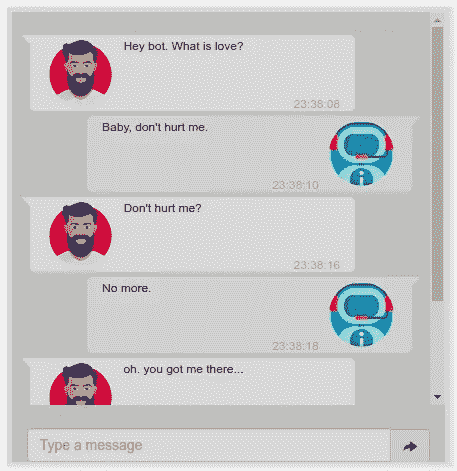
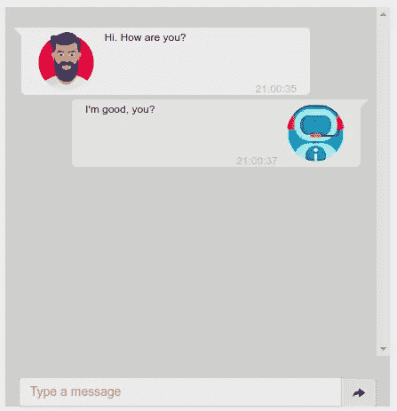

# 用 4 个简单的步骤开发一个对话式人工智能机器人

> 原文：<https://towardsdatascience.com/develop-a-conversational-ai-bot-in-4-simple-steps-1b57e98372e2>

# 用 4 个简单的步骤开发一个对话式人工智能机器人

## 了解如何使用 PyTorch transformers、FastAPI 和 Docker 创建聊天机器人



图片由作者提供。

# 目录

1.  介绍
2.  步骤 1:利用预先训练的模型
3.  步骤 2:构建后端
4.  步骤 3:构建前端
5.  第四步:用 Docker 打包 app
6.  结论
7.  参考

# 介绍

对话式 AI 聊天机器人无疑是目前最先进的聊天机器人。这种聊天机器人混合使用自然语言处理(NLP)和人工智能(AI)来理解用户的意图，并提供个性化的响应。

使用专有数据训练(或微调)这种模型，使公司能够直接通过聊天窗口向客户提供提交保险索赔、升级数据计划、更改航班等多种方式。

在本帖中，我们将讨论:

1.  如何使用预先训练好的 PyTorch 模型构建聊天机器人；
2.  如何使用 FastAPI 和 Jinja 与模型对话；
3.  如何使用 Docker 部署我们的定制模型？

# 步骤 1:利用预先训练的模型

让我们首先安装必要的 Python 包来构建和测试我们的新聊天机器人。

```
pip install --no-cache-dir transformers[torch] uvicorn fastapi jinja2 python-multipart
```

对于我们的聊天机器人，我们将使用来自微软的预先训练好的`DialoGPT-large`模型。为了加载这个模型，我们可以简单地对`transformers`中的`AutoTokenizer`和`AutoModelForCausalLM`类使用`from_pretrained`方法。

要调用模型，我们需要:
1。`encode`用户消息使用`tokenizer`；
2。`generate`使用`model`对象的机器人响应；
3。`decode`使用`tokenizer`的响应。

将下面的片段复制并粘贴到终端或笔记本电池上进行测试。

如果上面所有的库都安装正确，那么这段代码应该运行时不会出现错误或警告。如果是这样，应该会返回以下消息:

```
I'm good, you?
```

现在我们知道模型工作得很好，让我们将这两个片段包装在一个可重用的类中。

上面的代码片段有两个方法，一个用于加载模型(`load_model`)，另一个用于在用户给定消息的情况下从机器人那里获得回复(`get_reply`)。注意，我们扩展了`get_reply`方法来考虑过去的聊天历史。此外，为了提高对话的一致性，我们调整了模型的`top_k`、`top_p`和`temperature`。

你可以在这里找到完整的文件: [chatbot/app/model.py](https://github.com/andreRibeiro1989/medium/blob/main/chatbot/app/model.py)

# 步骤 2:构建后端

既然我们已经理清了 chatbot 模型，下一步就是通过标准的 HTTP 方法使这个模型可用。为此，我们将在 FastAPI 应用程序中包装模型。

因为我们只对给定用户消息的模型的响应感兴趣，所以我们只需要实现一个端点(`/`)来获得来自聊天机器人的回复。

注意，我们在上面的 FastAPI 端点中使用了`Form`语法。当我们实现前端时，使用`Form`类型的理由将变得更加明显。要测试上面的代码片段，请运行以下代码:

如果一切顺利，您应该会得到下面的 JSON。

```
{'message': "I'm good, you?"}
```

你可以在这里找到完整的文件: [chatbot/app/main.py](https://github.com/andreRibeiro1989/medium/blob/main/chatbot/app/main.py)

# 步骤 3:构建前端

我们的前端将由用户和机器人之间的简单对话组成，类似于 WhatsApp 或 Messenger。

我们将根据麻省理工学院的许可改编 bootsnipp.com 大学提供的 pablocorezzola 的原创作品，而不是从头开始构建对话。这里使用的用户和机器人头像图标是从 flaticon.com 免费获得的(在代码中的图标旁边和这个 post)⁴⁵.的末尾提供了对作者的鸣谢

对于这个应用程序，请确保您下载了`CSS`文件。你将不需要`HTML`或`JS`文件。在下面的结构中添加`CSS`文件，一个空的`index.html`和头像图标。

```
static/
  styles.css
  avatar_user.png
  avatar_bot.pngtemplates/
  index.html
```

在编辑模式下打开`index.html`文件，粘贴以下内容。这里有两条重要的线:

*   第 8 行:将`styles.css`文件添加到 FastAPI 应用程序中；
*   第 15 行:允许我们使用`jinja` `TemplateResponse`注入用户和机器人生成的必要对话框。

为此，我们还需要将下面的代码片段添加到我们的 FastAPI 应用程序中。

*   第 5 行:允许 FastAPI 应用程序显示`/static`文件夹中的任何文件；
*   第 9 行:告诉 Jinja 模板`index.html`文件在哪里。

最后，我们需要修改 FastAPI 端点来呈现对话框 HTML，而不是之前的 JSON 消息。该对话框将用于使用 Jinja 替换`templates/index.html`中的`{{ chat|safe }}`占位符。

为此，用下面的代码片段替换前面的端点(`/`)。

注意`build_html_chat()`函数还没有定义。该函数接受 3 个参数:

*   `is_me`:布尔定义给定消息是来自用户还是机器人；
*   `text`:用户/机器人消息；
*   `time`:处理消息的时间。

因为这个函数只是一个标准的 HTML 代码块，所以我不会在本文中涉及它。而是可以从以下链接(以及完整的前端脚本)获取:[chatbot/app/html _ utils . py](https://github.com/andreRibeiro1989/medium/blob/main/chatbot/app/html_utils.py)；[聊天机器人/app/templates/index.html](https://github.com/andreRibeiro1989/medium/blob/main/chatbot/app/templates/index.html)

# 第四步:用 Docker 打包 app

最后一步是用 Docker 打包我们的新应用。这一步将允许我们在本地、专用服务器或云上部署我们的应用程序，而不需要任何额外的工作。

让我们从定义最终的应用程序结构开始，如下所示。因为我们还没有定义`Dockerfile`，所以简单地创建一个空白文件。

```
app/
  static/
    styles.css
    avatar_user.png
    avatar_bot.png
  templates/
    index.html
  main.py
  model.py
  html_utils.py
Dockerfile
```

`Dockerfile`必须包括:

*   我们在步骤 1 *中安装的 Python 库；*
*   上面列出的后端和前端`app/`文件；
*   启动容器时将调用的入口点文件(`main.py`)。

要构建和运行容器，只需在终端上键入以下内容:

```
docker build . -t chatbot && \
  docker run -p 8000:8000 chatbot
```

如果 Docker `build`和`run`命令按预期执行，以下输出应该是清楚的:

```
INFO:     Waiting for application startup.
INFO:     Application startup complete.
INFO:     Uvicorn running on http://0.0.0.0:8000 (Press CTRL+C to quit)
```

要测试 Docker 容器，请在您最喜欢的浏览器中打开一个新标签，并键入 [http://0.0.0.0:8000/](http://0.0.0.0:8000/) 。然后，键入“嗨”。“你好吗，”在文本框中。

交叉手指，希望几秒钟后，您会看到两条消息。第一个是你刚刚输入的，第二个是机器人的回复。



用户输入“嗨”后，聊天机器人应用程序完成的例子。“你好吗，”

构建和运行这个应用程序所需的所有文件都可以在这里找到 [main/chatbot/app](https://github.com/andreRibeiro1989/medium/tree/main/chatbot/app)

# 结论

智能聊天机器人的革命已经到来。这种高度复杂和强大的模型允许多个公司以方便和可扩展的方式提供不同的服务。

在这篇文章中，我介绍了构建你自己的聊天机器人的基本思想，从模型创建到后端和前端。请注意，这只是一个简单的例子，说明了如何实现一个简单的对话机器人，而不应该被用于任何超过说明。

如果你想知道更多关于如何以无服务器的方式部署这样的应用，看看我过去的文章"[用 Amazon Lambda 和 API Gateway 构建无服务器 API](/build-a-serverless-api-with-amazon-lambda-and-api-gateway-dfd688510436)"⁶"和"[使用 AWS Lambda 和 EventBridge 部署" remindme " Reddit bot](https://betterprogramming.pub/deploy-a-reddit-bot-using-aws-lambda-and-eventbridge-7df793b979b2)" ⁷.

[**加入我的邮件列表，我一发布新内容，你就能收到新内容！**](https://andrefsr.medium.com/subscribe)

如果你喜欢阅读这样的故事，并想支持我成为一名作家，可以考虑报名成为一名媒体成员。每月 5 美元，让你可以无限制地访问 Python、机器学习和数据科学文章。如果你使用[我的链接](https://andrefsr.medium.com/membership)注册，我会赚一小笔佣金，不需要你额外付费。

[](https://andrefsr.medium.com/membership) [## 通过我的推荐链接加入 Medium-andréRibeiro

### 作为一个媒体会员，你的会员费的一部分会给你阅读的作家，你可以完全接触到每一个故事…

andrefsr.medium.com](https://andrefsr.medium.com/membership) 

# 参考

[1]张等著《*对话:会话回应生成的大规模生成性预训练*》(2020)，arXiv
[，](https://arxiv.org/abs/1911.00536)

[2]拥抱脸团队，“一个最先进的大规模预训练反应生成模型(dialog pt)”
[https://huggingface.co/microsoft/DialoGPT-large](https://huggingface.co/microsoft/DialoGPT-large)

[3]pablocrezzola，“简单聊天”:Bootstrap 3.0 片段——在麻省理工学院许可下发布[https://bootsnipp.com/snippets/y8e4W](https://bootsnipp.com/snippets/y8e4W)

[4] Freepick， *Bot 免费图标【https://www.flaticon.com/free-icon/bot_1786548?】
[term = bot % 20 avatar&page = 1&position = 1&page = 1&position = 1&related _ id = 1786548&origin = search](https://www.flaticon.com/free-icon/bot_1786548?term=bot%20avatar&page=1&position=1&page=1&position=1&related_id=1786548&origin=search)*

【5】自由选择，*男人自由图标*【https://www.flaticon.com/premium-icon/man_2202112?】
[term =头像&page = 1&position = 2&page = 1&position = 2&related _ id = 2202112&origin = search](https://www.flaticon.com/premium-icon/man_2202112?term=avatar&page=1&position=2&page=1&position=2&related_id=2202112&origin=search)

6 a .里贝罗。"*用亚马逊 Lambda 和 API 网关构建无服务器 API*"
[https://towardsdatascience . com/Build-a-server less-API-with-Amazon-Lambda-and-API-Gateway-DFD 688510436](/build-a-serverless-api-with-amazon-lambda-and-api-gateway-dfd688510436)

7 a .里贝罗。"*使用 AWS Lambda 和 EventBridge 部署一个“RemindMe”Reddit Bot*"
[https://towardsdatascience . com/build-a-q-a-app-with-py torch-CB 599480 e29](/build-a-q-a-app-with-pytorch-cb599480e29)