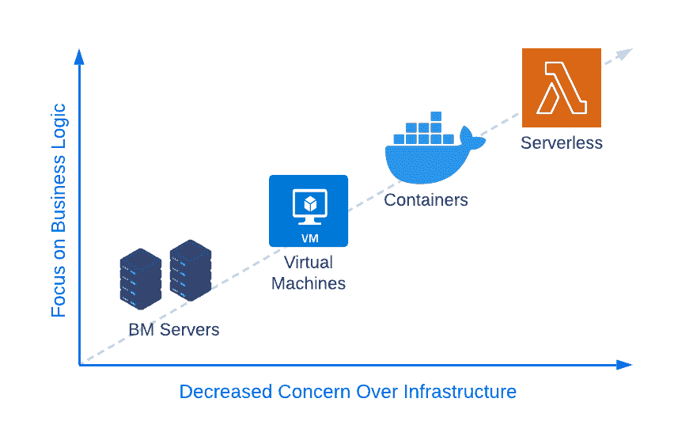
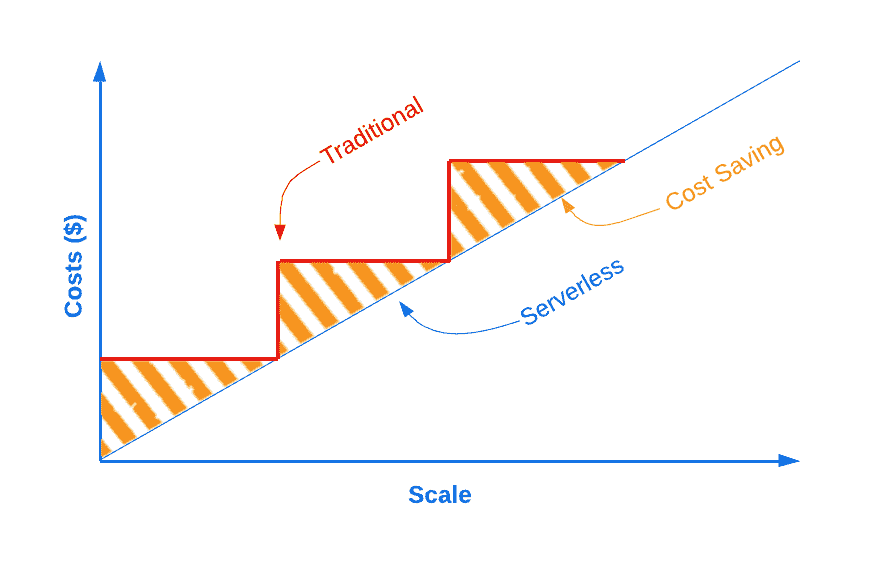
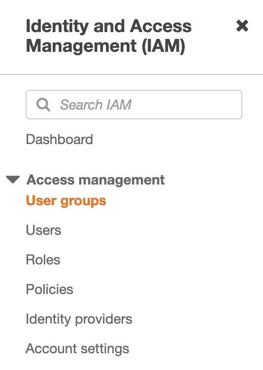
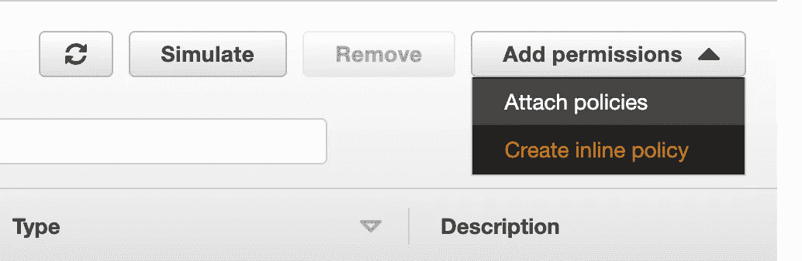
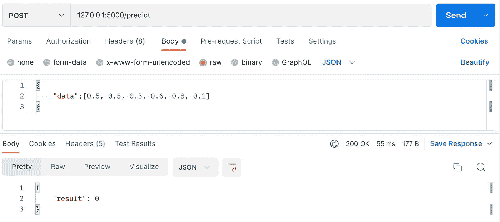
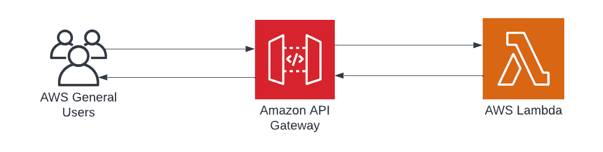
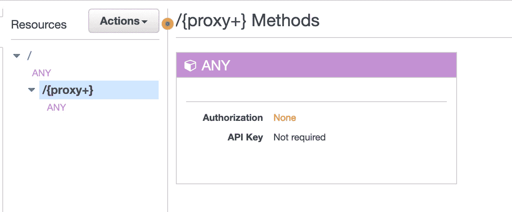
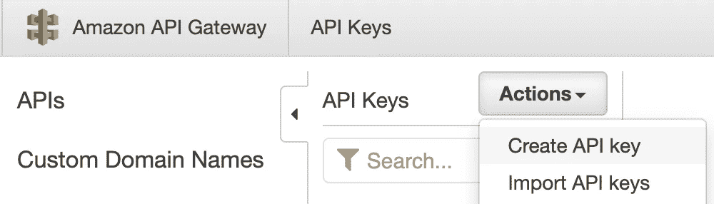
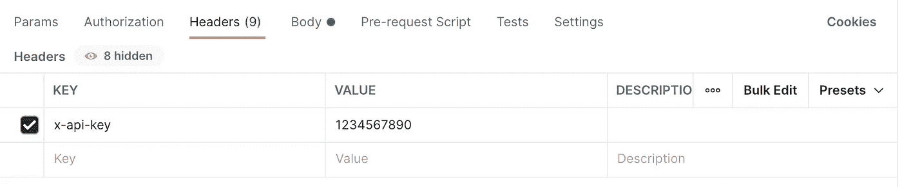

# 开发和部署无服务器事件驱动的机器学习应用程序

> 原文：<https://towardsdatascience.com/develop-and-deploy-serverless-event-driven-applications-using-zappa-flask-and-aws-f39b817a9937>

## 如何使用 Zappa、Python、Flask 和 AWS 创建托管机器学习模型的应用编程接口(API)

## 目录:

## 1.无服务器介绍
2。AWS
3 上的 IAM 权限。开发烧瓶应用程序
4。用 Zappa
5 展开。用密钥保护 API

# 1.介绍

随着全球各地的公司开始扩大其数据科学和机器学习能力，通过无服务器计算部署端点的过程在最近几个月出现了大幅增长。根据最近一篇关于 DataDog [1]的文章，大多数云提供商(AWS、GCP 等)的无服务器架构正在被超过 50%的客户主流采用。尽管这种适应性的重大变化有多种驱动因素和原因，但在本文开始时，有一点很重要，即虽然无服务器计算可能是许多应用程序的最佳解决方案，但它肯定不是所有应用程序的最佳解决方案。记住这一点，让我们仔细看看无服务器方法的一些关键优势。

## 关注业务逻辑——“关注什么，而不是如何”

随着数据科学家开始处理他们的项目，他们经常面临如何将他们的应用程序部署到云的难题，这迫使他们有时更多地关注部署过程，而不是模型本身的开发。无服务器计算的最大优势之一是它的易用性，我们将在本章后面看到。



图 1——该图显示了对业务逻辑的关注增加，而对架构的关注减少的趋势。(图片由作者提供)

## 高效、可扩展且强大—“可扩展性始终是关键”

无服务器基础架构的另一个巨大优势是能够以“随用随付”的方式按需扩展和缩减。提供商处理几乎所有与可伸缩性相关的项目，并管理所需的资源。然而，这是以限制对特定运行时设置的访问为代价的。如图 2 所示，根据需要扩展和缩减的能力也大大有助于节省成本。我们在这里可以看到，传统的可伸缩性是逐步增加的，而无服务器的可伸缩性更加线性。



图 2 —展示无服务器计算相对于传统方法的可扩展性的图表(图片由作者提供)

## 方便且易于部署

相对于全服务器架构，无服务器架构提供了许多优势。最大的优势之一是在部署基础架构和之后进行管理时的易用性。Zappa 可以使用 CloudFormation 来处理这两个项目，cloud formation 本质上是 IaC(基础设施即代码)。记住这一点，让我们开始吧！

# 2.AWS 上的 IAM 权限

在开始使用 Zappa 之前，让我们先在 AWS 中按顺序获取权限。首先，在 AWS 中导航到 IAM，单击用户组，并创建一个新组。我们可以称这个群为“zappa_group”。



图 AWS 的 IAM 菜单。(作者截图)

创建组后，单击“添加权限”，然后单击“创建内联策略”。



图 AWS 的 IAM 下拉菜单。(作者截图)

单击 JSON 选项卡，并向其中添加以下策略:

这个策略将使 Zappa 能够创建基础设施，并相应地为您标记它。请注意，您需要将 AWS_ACCOUNT_NUMBER 更改为您各自的号码。您可以通过单击屏幕右上角的用户名在下拉选项卡中找到它。

现在导航到“用户”并创建一个新用户。我们可以称这个用户为“zappa_user”。如果你觉得更有创意，请随意更改名称！将用户添加到您创建的组中，以赋予用户适当的权限。完成后，请务必记下访问密钥和密码。

导航到您的终端命令行，并添加您的密钥。您可以使用 vim 在本地编辑 aws 密钥文件:

```
vim ~/.aws/credentials
```

进入编辑器后，单击“I”插入新内容，并添加您的密钥。如果您已经有一个名为 default 的配置文件，我建议您创建一个名为“zappa”的新配置文件:

```
[zappa] 
aws_access_key_id = ADD_KEY_HERE 
aws_secret_access_key = ADD_SECRET_HERE
```

至此，我们已经完成了 AWS 上的权限，现在可以把注意力转移到 Zappa 上了。

# 3.开发烧瓶应用程序

现在我们有了一些关于无服务器方法的背景知识，让我们继续准备一个 Flask 应用程序。我们的目标是使用 scikit-learn 训练一个简单的机器学习模型，保存工件，并将其加载到 Flask API 中。

我们可以从创建一个新目录开始，输入目录:

```
mkdir sklearn-zappa-ml-with-preprocessingcd sklearn-zappa-ml-with-preprocessing
```

现在让我们创建一个名为“venv”的新虚拟环境并激活它:

```
virtualenv venvsource venv/bin/activate
```

现在让我们继续安装感兴趣的库。对于本教程，我们当然需要 zappa 来进行部署，flask 来构建应用程序，scikit-learn 来管理我们的模型，joblib 来保存和加载我们的模型:

```
pip install zappa scikit-learn flask joblib
```

安装完我们的库后，让我们再次激活虚拟环境:

```
source venv/bin/activate
```

让我们继续创建一个名为 train 的新目录和另一个名为 models 的目录，在 train 目录中，我们将创建一个名为 *train.py* 的文件:

```
mkdir train
mkdir models
cd train
vim train.py
```

在 train.py 文件中，我们将添加以下代码:

回想一下，我们在这里的目标是训练一个样本模型，并演示我们可以加载分类器本身，以及预处理工件。如果您检查 models 目录，您现在应该看到两个 joblib 文件。

回到主目录，我们现在创建一个名为 app.py 的新文件:

```
vim app.py
```

在这个文件中，我们将准备我们的 API 框架。我们将导入我们的库，加载模型，并准备两条路径:一条路径到主目录“/”，另一条路径到“/predict”:

到目前为止，我们应该有以下目录结构:

```
sklearn-zappa-ml-with-preprocessing
    |__ venv |__ models
        |__ rfc.joblib
        |__ scaler.joblib |__ train
        |__ train.py |__ app.y
```

我们可以通过运行 Flask 服务器来测试我们的模型:

```
python3 app.py
```

使用 Postman [2]，您可以通过创建针对本地服务器的 POST 请求来测试 API:



图 5—显示 POST 请求的 Postman 应用程序的屏幕截图，带有示例输入数据(作者的屏幕截图)

# 4.使用 Zappa 部署

既然我们已经确认了我们的应用程序可以在本地工作，现在让我们开始配置 Zappa。我们可以从使用 Zappa 中的 init 函数开始:

```
zappa init
```

当您完成初始化过程时，会要求您提供一些项目:

*   **环境**:您可以指定感兴趣的环境，比如 dev、test 或 prod。出于本教程的目的，请输入“dev”
*   **应用程序路径**:这里你需要设置主应用程序的路径。我们可以使用默认值“app.app”
*   **桶名**:您可以在这里指定感兴趣的 AWS S3 桶。我建议您保留默认值，让 Zappa 为您处理这个问题。
*   全局:你可以使用这个特性来优化分配。出于本教程的目的，输入“n ”,这是跳过此功能的默认值。

完成此过程后，Zappa 将在您的当前目录中生成一个名为 zappa_settings.json 的文件。继续操作并打开该文件以检查设置。打开文件，继续添加两个新的键值对:“slim_handler”和“tags”。slim_handler 配置将用于优化部署过程，因为我们使用的是 scikit-learn——一个相对较大的库。此外,“标签”将用于确保我们创建的基础架构被适当标记，以用于组织和计费目的。

```
{
“dev”: {
    “app_function”: “app.app”,
    “profile_name”: “zappa”,
    “project_name”: “sklearn-zappa-m”,
    “runtime”: “python3.8”,
    “s3_bucket”: “zappa-123456789”,
    “slim_handler”: true,
    “tags”: {
        “Project”: “ZappaProject”,
        “Stage”: “dev”
        }
    }
}
```

确认设置正确后，现在可以使用以下命令部署 API 了:

```
zappa deploy dev
```

这将继续并准备您的基础设施，以服务于我们之前准备的 Flask 端点。最后，需要了解两个主要组件:管理 API 外部流量的 API Gateway，以及包含应用程序逻辑的脚本 AWS Lambda。



图 AWS 架构的表示(图片由作者提供)

完成部署过程后，Zappa 将向您返回一个 URL，其结构如下所示:

[https://123456789.execute-api.us-east-2.amazonaws.com/dev](https://xg7dv0vv93.execute-api.us-east-2.amazonaws.com/dev)

您可以使用 postman 再次测试应用程序的部署，并在上面的 URL 末尾添加“/predict”。您应该会收到一个状态为 200 的成功响应，与我们之前看到的类似。

# 5.用密钥保护 API

既然已经成功部署了 API，现在全世界都可以看到和使用它了。在许多情况下，我们的 API 端点可能是保密的，我们只想授予特定用户或应用程序访问权限。我们可以使用两种方法之一来实现这一点:API 密钥和 IAM 权限。让我们看一个使用 API 键实现这一点的例子。

继续操作，在您的 AWS 帐户上导航到 API Gateway。您应该能够看到刚刚部署的应用程序列在该页面中。如果没有，请确保选择了正确的区域。

点击 API，然后点击左侧的 Resources。单击名为{proxy+}的资源，您将看到类似下图的内容:



图 7 —来自 AWS API 网关的屏幕截图。(作者截图)

您可以看到 API 键当前被设置为“不需要”。继续点击下面的“任何”和“方法请求”。将“需要 API 密钥”更改为 True。注意，为了使用它，我们需要**和**都生成一个密钥，并将其添加到一个使用计划中。

您可以通过单击屏幕左侧的 API 密钥来生成密钥。单击“操作”，然后单击“创建 API 密钥”。



图 8—显示 AWS 上 API 键下拉菜单的屏幕截图(作者截图)

接下来，继续创建新的使用计划。为计划命名和描述，然后根据需要设置限制和配额设置。单击 next，然后将 API 密钥添加到使用计划中。

这样，你现在应该都准备好了。您可以在 Postman 上测试密钥，方法是将密钥添加到您的请求的标头中。密钥应该是“x-api-key”，值应该是您生成的密钥。



图 9 —添加了 api 键的 postman 请求(作者截图)

这样，您现在就有了一个在 AWS 上部署和保护的无服务器机器学习模型！概括地说，这种模型部署方法的主要优点之一是，您将使用“随用随付”模型，确保您不会收到无意义的账单，即使在不活动时也是如此。

参考资料:

[1][https://www . prnewswire . com/news-releases/data dogs-2022-state-of-server less-report-finds-server less-reaching-mainstream-adoption-301560418 . html](https://www.prnewswire.com/news-releases/datadogs-2022-state-of-serverless-report-finds-serverless-reaching-mainstream-adoption-301560418.html)

[2]https://www.postman.com/