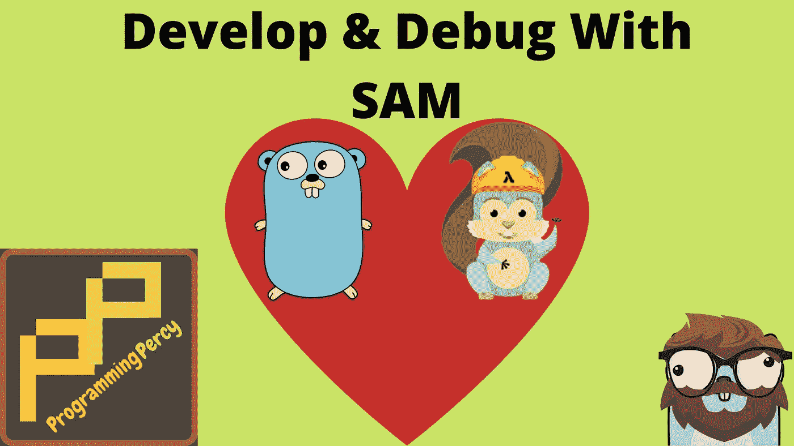
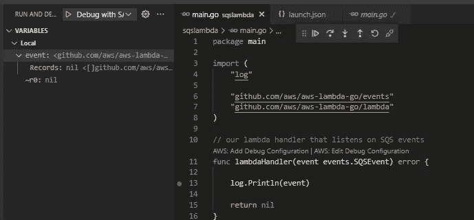
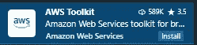
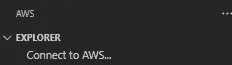
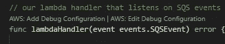

# 使用 SAM 开发 Lambdas 并在本地调试它们

> 原文：<https://towardsdatascience.com/develop-lambdas-and-debug-them-locally-using-sam-8f367793cc1a>

## 开发无服务器应用程序有其挑战性，SAM 为这些挑战提供了一个解决方案。了解如何使用 SAM 开发 lambdas 并在本地调试它们。



图片由珀西·博尔梅尔提供。Gopher 由拓也·上田提供，原始 Go Gopher 由勒内·弗伦奇提供(CC BY 3.0)

无服务器应用程序很棒，我们可以在生产中以超快的速度启动并运行一个功能，正常运行时间非常长，而且几乎没有成本。

Lambda 是一项 AWS 服务，它允许您部署可运行的小段代码。例如，我们可以部署一个小型的 Go 二进制程序来执行一个任务，并通过一个 API 来触发它，调度它，或者让它基于其他几个事件来执行。

然而，调试这些服务可能很难，因为它们运行在云上。我过去构建函数的方式可以很容易地在本地运行它们，并且简单地用 lambda 处理程序包装那个函数。这是可行的，但是有时我们想要调试整个流程以及我们使用的服务。

我经常鼓吹软件需要在本地运行，SAM 帮助我们在本地运行我们的云应用。

在本教程中，我希望你已经有了一些要求，否则就没有理由阅读如何本地调试 lambda 了。

*   拥有足够 IAM 权限的 AWS 帐户
*   安装和配置 AWS CLI

如果您没有 AWS 帐户或 AWS CLI，请按照官方[文档](https://docs.aws.amazon.com/cli/latest/userguide/getting-started-prereqs.html)安装。

如果你更喜欢视频格式，你可以在我的 [Youtube](https://www.youtube.com/watch?v=QWfuA5SrmW8&t=1693s) 上找到这篇文章。

本文的视频版本

你可以在 [GitHub](https://github.com/percybolmer/sam-go-lambda-demo) 找到视频中使用的完整代码。

## 山姆是谁？

Sam(无服务器应用模型)是一个帮助我们构建云应用的 AWS 框架。Sam 有一个模板语言，我们可以用它来编写云架构的结构，我们可以利用该模板在本地部署和运行它。Sam 正在幕后使用 [CloudFormation](https://docs.aws.amazon.com/AWSCloudFormation/latest/UserGuide/Welcome.html) ，你现在不需要了解 CF。

在本文中，我们将创建几个简单的 lambda，并使用 SAM 对它们进行测试，我们还将尝试通过附加远程调试器来调试 lambda。SAM 允许我们使用 docker 在本地运行 lambdas 或 lambdas 的 API。

使用 SAM 与 IDE 无关，您可以使用任何 IDE 来利用 SAM。据我所知，大多数人确实倾向于使用 VS 代码，因为他们有很棒的插件，我们将在最后介绍。

我们从安装 SAM 开始，你可以找到关于如何在 [AWS](https://docs.aws.amazon.com/serverless-application-model/latest/developerguide/serverless-sam-cli-install.html) 上安装的官方文档。

我使用的是 Linux，所以下面是我安装 SAM 的方法。

用于安装 SAM 的安装脚本

您可以通过运行 version 命令进行验证

```
sam --version
```

## 创建 Lambda

让我们创建第一个简单的 lambda。我将在本教程中使用 Go 来演示，但是你应该能够使用任何你想要的支持 lambdas 的语言。您可以在 [AWS 文档](https://docs.aws.amazon.com/lambda/latest/dg/welcome.html)中找到关于您的语言的代码示例，每种支持的语言都有一个名为`Working with $LANGUAGENAME`的章节。

创建一个新文件夹并初始化一个 go 模块，创建一个名为`main.go`的文件和一个名为`template.yml`的文件。暂时忘记模板文件，让它保持空白，我们稍后会谈到它。

```
touch sam-lambda-demo
cd sam-lambda-demo
go mod init programmingpercy.tech/sam-demo
touch main.go
touch template.yml
```

让我们用整个宇宙中存在的最简单的λ来填充`main.go`，我们将接受一个包含名称的输入事件，我们将打印`Hello $name`。

你猜对了，这是一个 Hello World Lambda！

main . go—gopher 历史上最简单的 lambda。

`Event`结构定义了我们的 lambda 输入应该是什么样子，我们将输出一个`string,error`。您可以返回您想要的任何结构，或者任何 AWS 定义的事件。稍后，当我们尝试在 lambda 前面使用 API 网关时，我们将介绍 AWS 事件。

## 使用 Sam 模板

在我们开始调试之前，我将介绍 SAM 的一些简单方面，以便我们理解正在发生的事情。

Sam 打包了一系列功能，它甚至可以将您的应用程序部署到 AWS 中。现在，让我们慢慢来，构建 lambda 并尝试调用它。

> 当我说应用程序时，我指的是整个云资源集，而不是您的单个 Go 二进制文件——资源集构成了我们的无服务器应用程序

为了构建我们的应用程序，我们首先需要定义应用程序拥有哪些云资源。这是在`template.yml`中使用特定的格式完成的。

我们将从我能想象到的最简单的模板开始，并经历一切是什么。

template.yml —单个 lambda 的简单 SAM 模板文件

在文件的开头，你会看到一些我从未见过改变的默认设置。我们定义要使用的模板版本。事实上，根据[文档](https://docs.aws.amazon.com/AWSCloudFormation/latest/UserGuide/format-version-structure.html)只有一个有效版本。

我们将重点关注`Resources`部分。在其中，我们可以定义整个 SAM 应用程序将拥有哪些资源。

语法非常简单，您以资源的名称开始 yml，我们创建一个名为`HelloGopher`的 lambda。这可以是你喜欢的任何东西，重要的是你可以用这个名字来引用其他资源，当你需要一个特定的 arn 时，这很重要。

所有资源都接受一个`Type`输入，类型可以是 cloudformation 允许的任何东西，通常是`AWS::Serverless:RESOURCETYPE`。如你所见，我们将类型设置为`AWS::Serverless::Function`，这告诉 cloudformation 为我们生成一个 lambda。

每种类型都有自己的一组可用属性，可以在文档中找到。要找到函数的可用属性，请查看它们的[文档](https://docs.aws.amazon.com/serverless-application-model/latest/developerguide/sam-resource-function.html)。

`CodeUri`非常重要，这是包含我们代码的 ZIP 文件的本地路径或 S3 路径。在这个例子中，我使用了同一个文件夹，在一个真实的项目中，你可能有 lambdas，你可以创建一个类似于`lambdas/hello-gopher/`的文件夹结构，并将 codeuri 更改为一个更具可伸缩性的解决方案。

`Handler`用于设置一旦执行 lambda 就会调用的某个二进制文件，让我们试着用 SAM 来解释这个。

如果您现在尝试通过运行`sam local invoke`来运行 Lambda，您应该会看到一个崩溃报告，说没有这样的文件。

由于没有这样的文件，Sam 崩溃

这只是因为我们将`Handler`设置为指向尚不存在的`hello-gopher`二进制文件。让我们开始利用山姆来帮助我们。

## Sam 构建和调用

我们可以使用 SAM 来打包我们的应用程序，build 命令带有许多参数标志。例如，您可以构建并将其发送到 S3。

使用 SAM build 很好，因为它将利用您的模板文件，并通过使用`runtime`属性来使用 go 的正确版本。

它非常容易使用，在与您的`template.yml`相同的文件夹中运行以下命令

```
sam build
```

您应该会看到一个`.aws`文件夹出现，打开该文件夹会显示 lambda 和名为`hello-gopher`的二进制文件。

通过本地调用 lambda 重试运行项目的时间。

```
sam local invoke
```

你应该看到它打印，你好，但没有给出名称。这是因为我们需要添加输入事件。这是通过使用`-e`或`--event`选项来完成的，它们可以指向一个文件或一个 JSON 字符串。我更喜欢使用文件，因为这也可以作为 lambda 的示例文档。

在名为`event.json`的文件夹中创建一个文件，并粘贴到与 lambda 中的事件结构相匹配的 JSON 中。

event . JSON——我们期望 lambda 中的有效负载。

现在，再次调用 lambda，但是这次我们添加了指向`event-json`文件的`-e`标志。

Sam 使用有效负载调用

令人惊讶的是，它现在打印了我们在有效载荷中使用的名称。AWS SDK 中有大量的自定义 lambda 事件可以使用，但是我们将在特定于 lambda 的教程中介绍这些事件。

有一个`-d`标志允许我们传入一个远程调试端口，记住这一点非常重要。这是允许我们将调试器附加到 lambda 的特性。

请注意，我们只有一个 lambda，但是如果您有多个 lambda，您可以通过在命令中添加 lambda 的名称来指定要运行的 lambda。

```
sam local invoke hello-gopher # Runs a specific lambda
```

如果你想运行一个 lambda 并将其作为一个服务公开，就像它在真实的云上运行一样，你可以使用`start-lambda`命令来模拟。

让我们尝试运行以下命令

```
sam local start-lambda
```

这应该会打印出 lambda 公开的 URL，我们可以将它添加到 AWS cli 来调用 lambda。默认的网址是 [http://127.0.0.1:3001](http://127.0.0.1:3001/) 。

您可以使用 URL 作为 AWS CLI 的端点，通过以下命令调用它。

```
aws lambda invoke --function-name HelloGopher --endpoint "[http://127.0.0.1:3001](http://127.0.0.1:3001)" --payload '{ "name": "percy"}' response.json
```

这个命令将调用 lambda，插入有效负载并将响应输出到`response.json`。

## Sam API 网关

很多时候，您希望在运行 Lambda 时，前面有一个 API 网关。API 网关将把 Lambda 作为 HTTP API 公开。

与 SAM 一起管理和设置非常简单。我们需要创建 lambda 资源监听的`Events`，这不一定是 HTTP，它可以是 SQS 或许多其他 AWS 服务事件。使用类型`API`会让 Sam 知道这是一个 API 网关。

我们将修改`template.yml`来添加 API 端点作为 POST。

template.yml —添加 API 事件

我们还需要修改 lambda 来接受 API 网关事件，这些事件的结构有点不同。它们用一些元数据(如请求标识符)包装原始请求。

main . go——修改了我们的 lambda，使其作为 API 端点运行

要打开 API 并在本地公开端点，这在您开发具有许多端点的 API 并希望在本地尝试您的系统时非常方便，我们可以再次使用 SAM。

让我们构建新的 Lambda 并用`sam local start-api`运行 API。

```
sam build
sam local start-api
```

您应该看到一个输出，它指定了 API 在哪个端口上运行，对我来说，输出如下。

```
Mounting HelloGopher at [http://127.0.0.1:3000/api/hellogopher](http://127.0.0.1:3000/api/hellogopher) [POST]
```

我们可以用 CURL 来尝试，并发送预期的数据负载。

```
curl -X POST localhost:3000/api/hellogopher -d '{"name": "percy"}'
```

## Sam 环境变量

大多数时候，你的 lambda 需要配置。很多时候这是通过使用环境变量来完成的。

我建议在`template.yml`中指定期望的变量，这提供了使用 CLI 修改变量的能力，我们将很快介绍这一点。

为了添加环境，我们修改了模板并添加了一个简单的`Environment`属性。

下面是我的`template.yml`和一个名为`my-cool-variable`的环境变量的片段。

template.yml —将环境变量添加到我们的 lambda 中

接下来，我们需要开始使用 lambda 中的环境变量，我将只把它的值添加到输出中，修改`main.go`中的第 31 行如下。

main.go:31 —添加了环境变量

这看起来似乎微不足道，但是您现在可以在 SAM CLI 中非常灵活地利用它来设置新的变量。我们可以使用`-n`参数修改调用之间的变量。记住，在 API 中可以有多个 lambda 端点，每个 lambda 可以需要自己的一组环境变量。

您可以创建一个特殊的环境 JSON 文件来控制每个 lambdas 环境。您必须使用来自`template.yml`的资源名称，并且只有在`template.yml`中指定的环境是可修改的。如果你试图设置一个没有在模板中声明的变量，它将不会被添加。

创建一个名为`environments.json`的新文件，我们将用它来修改每个 lambda resources 环境变量。

environments.json —我们要修改的变量

尝试使用`-n`标志重新构建并执行 API 来指出环境文件，您现在应该会看到打印出的新值。

```
sam local start-api -n environments.json
```

还有一些参数，它们与环境变量不同，但它们与云的形成有更大的关系，我们在这里不讨论细节。

## Sam 生成事件

并不是所有的 lambda 都被公开为 API，例如，一些 lambda 监听 SQS 事件或 S3 事件来触发它们。

一种非常常见的方法是用 lambda 监听 SQS 事件，遗憾的是这很难测试。没有办法将 Sam 连接到 SQS 队列来测试它，相反，测试它的方法是生成一个 SQS 有效负载并使用该有效负载调用 lambda。这将模拟一个被发射到 lambda 中的现场事件。

现在你可能想知道，SQS 事件看起来如何？我不知道，我们也不需要知道，因为 Sam 可以帮助我们为通常与 lambdas 相关的已知 AWS 服务生成虚假的有效载荷。

让我们从更新`template.yml`并添加一个新的 lambda 开始，这个 lambda 将在一个名为`my-awesome-queue`的队列上监听 SQS 事件。现在，正如我所说的，我们不能让萨姆在本地监听`my-awesome-queue`，但是我们可以伪造有效载荷。以下要点显示了如何告诉山姆关于 SQS 的事情，`template.yml`中唯一的新部分是新的 lambda，它会触发 SQS 事件。

yml——我们添加了一个 lambda 函数，它在 SQS 队列上触发

在`CodeUri`中，我们指定了`./sqslambda`的位置，所以我们可以从创建那个文件夹开始，并用我们的 lambda 在其中添加一个`main.go`。

```
mkdir ./sqslambda
touch main.go
```

我们新的 lambda 将非常简单，只将输入事件打印到日志中。我们将使用来自 AWS SDK 的相同的`events`包，并指定该事件是一个`SQSEvent`。我们可以进入 SDK，尝试使用 JSON 标签复制 SQSEvent 结构，但这将是一项繁重的工作。

。/sqslambda/main.go —接受 SQS 负载的简单 lambda

现在，在我们触发这个 lambda 之前，我们需要一个 SQSEvent。我们可以使用 [Generate-Event](https://docs.aws.amazon.com/serverless-application-model/latest/developerguide/sam-cli-command-reference-sam-local-generate-event.html) 命令为我们创建一个`event.json`文件，我们可以将它作为有效载荷传入。

语法非常简单，使用`generate-event`后跟服务名和`receive-message`子命令。目前实际上只有一个子命令，即 receive-message。谁知道也许他们已经计划好了`send-message`？

我们将在`--body`中传递一个参数，用于修改 SQS 有效载荷的主体，主体是用户特定的有效载荷。

```
sam local generate-event sqs receive-message --body 'My Own Event Payload'
```

运行它，您将看到一个生成的 JSON 有效负载，它模拟了一个 SQS 事件。您可以将这个有效负载写入一个名为`event.json`的文件，并像以前一样使用`-e`标志将该有效负载传递给调用。

对于`-e`标志有一个很好的技巧，但是，如果你传递一个`-`作为输入，它将从标准输入中读取值。这意味着我们可以将生成事件命令与调用链接在一起。

```
sam local generate-event sqs receive-message --body 'My Own Event Payload' | sam local invoke -e - SQSLambda
```

运行该命令应该会打印出整个事件并调用 lambda。

太好了，我们现在可以测试任何 lambda，不管是什么服务触发了它。

## 附加远程调试器

在开发服务时，调试是一个非常重要的方面，附加一个调试器来查看运行时发生了什么是解决问题的最有用的方法之一。

为此，我们可以在 Sam 命令中添加`-d`标志来打开远程调试器端口，您可以将端口指定为-d 的参数。这适用于所有调用，`start-lambda`和`start-api`也接受调试器标志。

> Sam 需要安装 Linux Delve 调试器，如果您没有运行 Linux，您仍然可以使用“GOOS = Linux go arch = amd64 go install github.com/go-delve/delve/cmd/dlv@latest"”来安装它们

记住调试器应该安装在您的主机上，我们可以使用`--debugger-path=hostURL/to/debugger`参数指定调试器的位置。我还需要使用 delveAPI 版本 2 来让调试器顺利运行。

让我们运行 SQS 事件来调试 lambda。我将添加它所需的调试标志，以便在调试模式下公开 lambda。请注意，当您使用`-d`调用时，它会在开始时暂停 lambda 并等待调试器连接。

```
sam local invoke SQSLambda -d 8099 --debugger-path=/home/percy/go/bin --debug-args="-delveAPI=2"
```

接下来，我们需要附加一个调试器，如何做取决于你是使用 VS 代码还是 Goland 等等。我正在使用 VS 代码，所以我将在我的`.vscode/launch.json`中添加一个新的配置。如果你用的是 Goland，请看这里如何附加调试器[。](https://www.jetbrains.com/help/go/attach-to-running-go-processes-with-debugger.html)

。vscode/launch.json —这是我们的调试附件

基本上我们所做的是创建一个新的附加请求到一个远程调试器，在 localhost:8099 上。确保您使用的端口与您给`-d`命令的端口相同。

保存文件并在第 13 行的`sqslambda/main.go`中放置一个调试器。然后运行调试配置。您应该看到它在您放置的断点处中断。



我们在调试时附加了一个断点

现在，让它运行需要一点工作，有一些技巧可以自动运行调试器命令，比如在 launch.json 中使用预启动效果。但是，如果您使用 VS 代码，我将很快介绍如何使用 AWS 插件，这将使调试更加容易。他们不再需要使用任何 CLI 命令，这非常方便。

## 在 SAM 中使用 VS 代码

如果你正在使用 VS 代码，我建议你下载 AWS 工具包，如果你还没有的话。

进入扩展，搜索`AWS toolkit`并安装它。



使用 AWS 云资源的 VS 代码扩展

下载后打开扩展并登录您想要的配置文件，只需按下`Connect to AWS`按钮。



用插件连接到 AWS

这个过程应该很简单，它会要求您进行一些配置，如默认区域、要使用的配置文件等。选择您想要的选项。之后，您应该会看到一堆云服务出现。

在本教程中，除了本地部署，我们不会部署任何 SAM 应用程序，但是您可以这样做(即使没有插件)。

该插件现在将添加许多 SAM 内置功能，以取代需要运行命令行。最好的特性是现在每个 lambda 上面都会有一个文本，询问你是否想要创建一个调试配置。



AWS 插件可以为我们生成调试处理程序。

点击`Add Debug Configuration`，你的`launch.json`应该会更新。

launch.json — AWS 插件为我们生成了一个全新的调试器。

现在，这看起来和我们之前创建的有很大不同。这是这个插件很酷的一点，它创建了一个独特的调试类型，叫做`aws-sam`，允许我们调用 lambdas。还有一种 API 调用的请求类型，可以通过访问 API lambda 并为其生成一个调试调用来生成。

如您所见，您可以指定调用目标、环境变量和有效负载。这些都非常方便，所以我们可以跳过使用 API，而只使用一个简单的 launch.json。

您应该熟悉所有您可以更改的内容，因为这正是我们在本文中讨论的内容。

那么，为什么我们不从一开始就使用插件呢？因为那样会有太多的魔法，我们也不明白插件在为我们做什么。我相信，从长远来看，学习工具的基础是最好的，而且你不一定要使用 VS 代码，而是任何你想要的 IDE，因为我们知道如何附加调试器，以及为什么我们需要这样做。

## 设置本地堆栈和 SAM 网络

如果您的 lambdas 使用其他 AWS 资源，您可以模拟那些使用 Localstack 的资源。在本教程中，我不会讨论 localstack，但是我们将看看如何强制 SAM 资源与 localstack 实例在同一个网络上运行。

如果您使用 localstack 并通过 docker 运行它，请确保您还指定了 docker 网络。如果您在名为`mock-aws-network`的 docker 网络上运行 localstack，您可以通过在大多数命令上使用输入标志`docker-network mock-aws-network`来让 Sam 使用相同的网络。

```
sam local invoke --docker-network mock-aws-network
sam local start-api --docker-network mock-aws-network
```

这很方便，因为 lambdas 倾向于使用其他需要通信的 AWS 服务，这样我们也可以调试它。

如果你使用的是 VS 代码插件，你可以把这一行添加到`launch.json`

launch.json —指定用于 Sam 的 docker 网络

## 结论

在本教程中，我们学习了如何使用 SAM 开发 lambdas，以及如何在本地调试它们。我认为 SAM 在开发 lambdas 时提供了帮助，消除了我在开始开发无服务器应用程序时遇到的许多挫折。调试之类的事情很难，但现在不再是了。

SAM 中还有更多我没有在这里介绍的特性，比如创建其他 AWS 资源(SQS 队列等)以及在 lambda 中直接引用它们的 ARN。

您应该开始试用 SAM，并找出它提供的所有令人惊奇的工具。

感谢您的阅读，一如既往，我喜欢反馈和讨论。