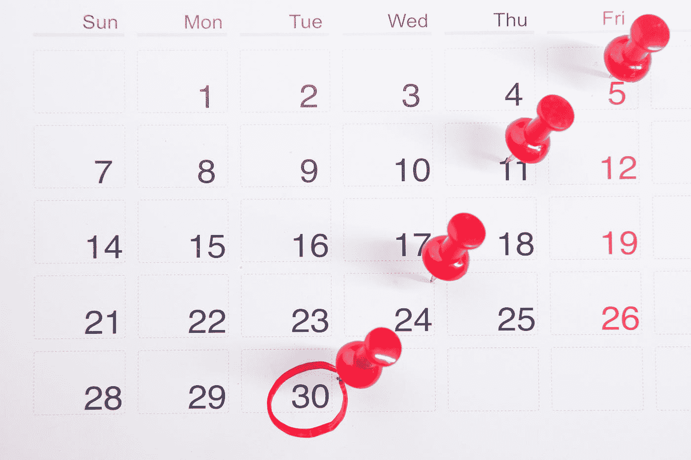
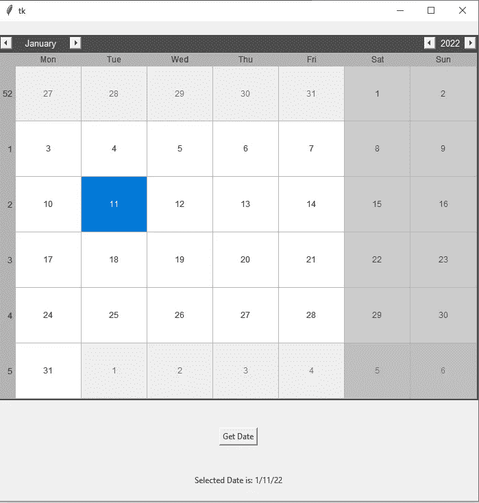

# 使用 Python 开发您自己的日历来跟踪重要日期

> 原文：<https://towardsdatascience.com/develop-your-own-calendar-to-track-important-dates-with-python-c1af9e98ffc3>

## 开发一个日历 GUI 界面来管理您 2022 年及以后的计划



在 [Unsplash](https://unsplash.com?utm_source=medium&utm_medium=referral) 上由[Towfiqu barb huya](https://unsplash.com/@towfiqu999999?utm_source=medium&utm_medium=referral)拍摄的照片

时间是至关重要的。时间不等人。关于时间的重要性，还可以引用几百句话。因此，如果你计划掌握数据科学或编程，你将需要一个简明的计划来获得这一整年的最佳知识。

随着新的一年已经开始，跟踪你的效率和生产力变得很重要。有什么比借助你自己的日历更好的方法来有效地跟踪这一进程呢？这将有助于你为今年剩下的时间创造一个清晰的、有指导意义的视角和方向。

在本文中，我们将着重于构建一个日历，通过它我们可以查看必要的数据并相应地分析我们的计划。我们还将关注您可以对该项目进行的一些关键更新和改进，这样您就可以不断地提醒自己这一年中还有很多重要的事情要做。

在我们开始用 Python 构建我们的日历 GUI 界面之前，如果您刚刚开始学习数据科学，并希望在今年内掌握它，我有一篇文章非常详细地介绍了这一点。查看我以前的一篇博客，通过下面提供的链接中的 12 个关键步骤，你可以在 12 个月内掌握数据科学。

[](/12-steps-for-beginner-to-pro-in-data-science-in-12-months-c6f6ba01f96e) [## 12 个月内数据科学从初学者到专业人士的 12 个步骤！

### 每月遵循一步，到第二年年底掌握数据科学！

towardsdatascience.com](/12-steps-for-beginner-to-pro-in-data-science-in-12-months-c6f6ba01f96e) 

# 开发您的日历:



作者截图

从上图中我们可以注意到，这个项目需要我们使用图形用户界面(GUI)来构建一个视觉上吸引人的日历。我们将利用 python 中可用的 Tkinter 库来构建这样一个用户界面。要了解更多关于这些 GUI 工具的知识，我建议查看我以前的一篇文章，这篇文章解释了其中的七个工具，并附有入门代码，可以帮助您快速入门。

[](/7-best-ui-graphics-tools-for-python-developers-with-starter-codes-2e46c248b47c) [## 7 款面向 Python 开发人员的最佳 UI 图形工具，带入门代码

### Python 中用于开发酷用户界面技术的七个最佳 UI 图形工具

towardsdatascience.com](/7-best-ui-graphics-tools-for-python-developers-with-starter-codes-2e46c248b47c) 

除了 Tkinter GUI 模块之外，我们还需要安装一个额外的 tkcalendar，它为 Tkinter 界面提供了日历和日期输入小部件。它允许用户对不同的窗口小部件进行定制控制，从而按照用户的要求相应地操纵日期和时间。下面的命令应该允许您轻松安装下面的模块。

```
pip install tkcalendar
```

一旦我们成功安装了必要的库，我们现在就可以相应地导入它们了。进行导入时的星号(' * ')表示我们正在导入 Tkinter 模块的所有类，因为我们将需要其中的一些类来成功计算这个项目。从 Tkinter 日历库中，我们将只需要日历模块，通过它我们可以显示交互式日历及其相应的小部件。

```
# Importing The Essential Libraries
from tkinter import *
from tkcalendar import Calendar
```

一旦我们完成了所需库的导入，我们将继续创建 GUI 对象作为显示界面的根。然后，我们可以根据用户的选择相应地选择我们的几何设置。我将界面尺寸设置为 700 x 700，因为我喜欢在大多数任务中使用更大的可交互屏幕。然后，我们将添加我们最近安装的日历模块，作为 Tkinter GUI 的附加小部件。

使用这个日历模块，我们可以根据需要设置根路径、特定的日、月和年。在打包这个变量时，我将在 y 轴上应用填充，这样，从交互式屏幕的顶部到我们创建按钮、标签或任何其他类型的交互式小部件的地方，距离为 20 个像素。我们将填充两边并将变量扩展到屏幕的末端，这样我们就可以有一个更丰富的日历视图。这个过程的代码如下面的代码片段所示。

```
# Create The Gui Object
tk = Tk()

# Set the geometry of the GUI Interface
tk.geometry("700x700")

# Add the Calendar module
cal = Calendar(tk, selectmode = 'day',
               year = 2022, month = 1,
               day = 11)

cal.pack(pady = 20, fill="both", expand=True)
```

在下一个代码片段中，我们将创建一个函数，通过它我们可以获取用户需要的特定日期。grad date 函数包含的文本将在我们单击其中一个按钮部件时显示。如果您想在下面的函数中添加更多的命令，那么您可以随意地进一步探索它。

```
# Function to grab the selected date
def grad_date():
    date.config(text = "Selected Date is: " + cal.get_date())
```

最后，我们将为我们的项目创建一些需求来选择合适的日期和时间。首先，我们将创建一个按钮，通过我们的函数来获取我们用鼠标光标选择的特定日期。然后，我们将添加一个标签，当单击按钮时，该标签将在屏幕上显示带有特定日期的文本。应用 20 像素的填充操作来保持标签和按钮的相等距离。然后，我们将为日历项目执行 Tkinter 循环。

```
# Adding the Button and Label
Button(tk, text = "Get Date",
       command = grad_date).pack(pady = 20)

date = Label(tk, text = "")
date.pack(pady = 20)

# Execute Tkinter
tk.mainloop()
```

一旦您完美地执行了以下代码片段，您就可以继续运行 Python 程序来接收类似于上面显示的图像的结果。让我们转到下一节，探索完整的代码，并讨论一些我们可以添加的改进，使这个项目变得更好。

# 更新和改进:

下面提供了用 Python 构建日历 GUI 界面项目的完整代码。通过添加更多的函数和其他创新来开发这个日历项目的各种独特的应用程序，您可以随意试验代码。

我建议添加到日历中的一个主要改进是将所选日期保存在文本文件中的能力，以便您可以在不同的 Python 项目中使用这些保存的日期来构建待办事项提醒列表，该列表将提醒您某人的生日、特定事件、重要日期等等。我建议检查一个以前的提醒应用程序项目，为这些日期创建一个提醒提醒。

[](/python-project-to-improve-your-productivity-for-the-new-year-1956824eddb1) [## Python 项目，提高您新一年的工作效率！

### 这是一个简单、有趣且有用的 Python 项目，旨在为即将到来的新年提高您的工作效率！

towardsdatascience.com](/python-project-to-improve-your-productivity-for-the-new-year-1956824eddb1) 

另一个绝妙的主意是将你的日历与特定的日期联系起来，使你的电子邮件自动化，或者将信息转发给你想接收信息的人。我们将讨论如何实现这些目标的未来项目。在此之前，请继续探索您刚刚创建的日历的众多隐藏可能性！

# 结论:


由[este 扬森斯](https://unsplash.com/@esteejanssens?utm_source=medium&utm_medium=referral)在 [Unsplash](https://unsplash.com?utm_source=medium&utm_medium=referral) 上拍摄

> “时间是免费的，但它是无价的。你不能拥有它，但你可以使用它。你不能留着它，但你可以花它。一旦你失去了它，就再也找不回来了。”
> ***—哈维·麦凯***

日历是生活中必不可少的一部分，因为它帮助我们管理一年中的日程、计划和其他任务。它们帮助我们很好地记录时间，但显示在墙上的项目或手机上的日历应用程序有时会很无聊。你不能添加额外的功能到它们里面，这些功能完全是你自己构建的。因此，构建自己的日历 GUI 是一个好主意！

在本文中，我们讨论了时间的重要性，并使用 Tkinter GUI 界面构建了一个日历项目。我们能够从图形界面中选择日期，并单击界面上的一个按钮，向我们返回一个存储所选日期、日期和年份的标签。我们还研究了通过额外的更新和集成可以对此项目进行的一些改进。

如果你想在我的文章发表后第一时间得到通知，请点击下面的[链接](https://bharath-k1297.medium.com/subscribe)订阅邮件推荐。如果你希望支持其他作者和我，请订阅下面的链接。

[](https://bharath-k1297.medium.com/membership) [## 通过我的推荐链接加入媒体

### 作为一个媒体会员，你的会员费的一部分会给你阅读的作家，你可以完全接触到每一个故事…

bharath-k1297.medium.com](https://bharath-k1297.medium.com/membership) 

如果你对这篇文章中提到的各点有任何疑问，请在下面的评论中告诉我。我会尽快给你回复。

看看我的一些与本文主题相关的文章，你可能也会喜欢阅读！

[](/develop-your-weather-application-with-python-in-less-than-10-lines-6d092c6dcbc9) [## 用 Python 开发不到 10 行的天气应用程序

### 使用 Python 构建我们的天气电视广播应用程序，以接收所需位置的更新

towardsdatascience.com](/develop-your-weather-application-with-python-in-less-than-10-lines-6d092c6dcbc9) [](/complete-python-starter-guide-for-data-science-for-2022-c1f880fa249d) [## 2022 年数据科学完整 Python 入门指南

### 涵盖了用代码启动数据科学所需的所有 Python 基础和基本概念…

towardsdatascience.com](/complete-python-starter-guide-for-data-science-for-2022-c1f880fa249d) [](/generating-qr-codes-with-python-in-less-than-10-lines-f6e398df6c8b) [## 用 Python 生成二维码，不到 10 行

### 构建一个简单的 Python 项目，用 QR 码加密您的信息

towardsdatascience.com](/generating-qr-codes-with-python-in-less-than-10-lines-f6e398df6c8b) 

谢谢你们坚持到最后。我希望你们都喜欢这篇文章。祝大家有美好的一天！