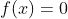
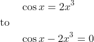
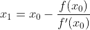
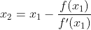
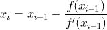
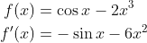
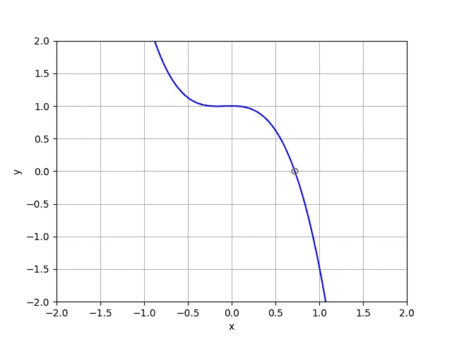

# 用 Python 开发自己的牛顿-拉夫森算法

> 原文：<https://towardsdatascience.com/develop-your-own-newton-raphson-algorithm-in-python-a20a5b68c7dd>

## 求解最优解、平衡点等。使用 NR 方法


戴维·克洛德在 [Unsplash](https://unsplash.com?utm_source=medium&utm_medium=referral) 上的照片

牛顿-拉夫森方法是一种迭代方法，用于逼近函数的根或零点。由于许多原因，确定根可能是重要的；它们可以用来优化金融问题，解决物理学中的平衡点，模拟计算流体动力学等。正如你所看到的，它的用途远远超出了任何一个主题。一般来说，在复杂的方程中，根是不能明确求解的，所以它们必须是近似的；这就是牛顿-拉夫森方法发挥作用的地方。

牛顿-拉夫森方法(或算法)是计算根的最流行的方法之一，因为它简单而快速。结合计算机，该算法可以在不到一秒的时间内求解根。该方法要求函数符合以下形式。在大多数情况下，这可以通过简单的加法或减法来实现。



以下面的例子为例。简单的减法就是将方程转换成上面的形式所需要的。等式的左边将是函数， *f(x)* 。我们稍后会用到这个等式，所以请记住它。



该方法的第一步采用初始猜测，并使用函数和函数导数来计算下一个猜测。然后，以类似的方式使用该猜测来计算下一个猜测，依此类推，直到满足容差或迭代限制。如下面的动画所示，导数*f’(x)*(红线)被用作斜率，以帮助计算 *x* 的下一个猜测值。


牛顿-拉夫森方法可视化【由[拉尔夫·普费菲](https://de.wikipedia.org/wiki/Benutzer:Ralf_Pfeifer)创造】

让我们把方程中发生的事情写出来，这样更有意义一点。第一次迭代如下所示:



第二次迭代:



后续迭代，直到达到 *f(xᵢ)* 值的某个容差(或迭代极限):



如果你(或者一个代码)可以计算出 *f(x)* 的导数，那么你就可以用这个算法迭代计算一个方程的根。你最初的猜测可能非常重要。根据问题的不同，如果你从一个糟糕的猜测开始，它会让你的收敛需要一段时间或者根本不收敛。然而，如果猜测正确，牛顿-拉夫森算法将在几次迭代内相对快速地收敛到一个解。如果你有一个多重根的方程，你最初的猜测也很重要。根据你的第一个猜测，你可以收敛到任何一个根。这些问题可以通过使用有根据的初步猜测来缓解。

牛顿-拉夫森算法可以使用 Python 或任何编码语言相对容易地实现。正如你在例子中看到的，当最初的猜测是合理的时候，计算机可以很快得出想要的答案。我们还会看到当你最初的猜测很糟糕时会发生什么。让我们开始编码:

## 导入包

我通常通过从 *Matplotlib* 导入 N *umPy* 和 *pyplot* 来开始我所有的 Python 代码。 *NumPy* (为便于调用，定义为 *np* )用于数组操作和基本数学函数，如余弦、正弦、指数和对数函数。 *Pyplot* (为便于调用，定义为 *plt* )用于创建图形和可视化数据。这两个软件包都很棒，比我在这里展示的功能多得多。

```
# Importing Packages
import numpy as np
import matplotlib.pyplot as plt
```

## 定义函数

在这部分代码中，我们将定义一个方程，我们试图找到它的根和它的导数。这两个方程将被定义为 Python 函数，所以我们可以为它们提供一个输入值， ***x*** ，它们将返回方程的值及其在该值处的导数。作为参考，我们将使用本文前面的等式。



```
# Defining Equation and Derivative
def f(x):
    res = np.cos(x)-2*x**3
    return res

def dfdx(x):
    res = -np.sin(x)-6*x**2
    return res
```

## 牛顿-拉夫逊回路

本节提供了确定目标方程的根所需的迭代循环。在迭代 *while* 循环之前，最好包含一个最大迭代次数变量 ***max_iter*** 。这很重要，因为如果算法不能收敛到一个解，它将防止 *while* 循环无限期运行。公差 ***tol*** ，用于确保我们得到我们想要的精度。在开始我们的迭代之前，我们还包括最初的猜测，*【x₀】。*

*现在，在 while 循环中，我们使用牛顿-拉夫森通用方程来获得我们的下一个猜测，***【Xi】***，根据上一个猜测，***【Xi _ 1***(***x₀***用于第一次迭代)。然后将 ***xi*** 值输入到原始方程中，以对照所选公差进行检查。这里，我们正在确定我们的新猜测是否使原始方程接近于零。当等式的绝对值小于我们的容差或者我们已经达到最大迭代次数时，将会中断 *while* 循环。如果它没有被破坏，循环继续更新对根的值的猜测。*

```
*# Newton-Raphson Algorithm
max_iter = 20  # Max iterations
tol = 1E-15  # Tolerance
i = 0  # Iteration counter
x0 = 1  # Initial guess
xi_1 = x0
print(‘Iteration ‘ + str(i) + ‘: x = ‘ + str(x0) + ‘, f(x) = ‘ + 
      str(f(x0)))# Iterating until either the tolerance or max iterations is met
while abs(f(xi_1)) > tol or i > max_iter:
    i = i + 1
    xi = xi_1-f(xi_1)/dfdx(xi_1)  # Newton-Raphson equation
    print(‘Iteration ‘ + str(i) + ‘: x = ‘ + str(xi) + ‘, f(x) = ‘ +    
          str(f(xi)))
    xi_1 = xi*
```

*你可能已经注意到，我们在每次迭代中打印了***【Xi】***和 ***f(xi)*** 的值，以及它们发生在什么迭代中。这有助于我们跟踪算法的执行情况。该代码将输出以下内容:*

```
*Iteration 0: x = 1, f(x) = -1.4596976941318602
Iteration 1: x = 0.7866397888154096, f(x) = -0.2673205221391448
Iteration 2: x = 0.7261709381607133, f(x) = -0.018132645287873284
Iteration 3: x = 0.7214340390454733, f(x) = -0.0001059518195203335
Iteration 4: x = 0.7214060336500903, f(x) = -3.6893424981698786e-09
Iteration 5: x = 0.721406032674848, f(x) = -1.1102230246251565e-16*
```

*在查看我们的输出后，看起来牛顿-拉夫森算法在 5 次迭代内收敛。相当快。它也接近我们非常小的公差的解决方案。这意味着我们成功实现了融合！*

## *绘制方程和结果*

*您可以通过绘制包含最终根结果的范围的方程来检查您的结果。您也可以绘制您的根值，以查看您的结果如何与直线匹配。*

```
*# Creating Data for the Line
x_plot = np.linspace(-2, 2, 1000)
y_plot = f(x_plot)

# Plotting Function
fig = plt.figure()
plt.plot(x_plot, y_plot, c=’blue’)
plt.plot(xi, f(xi), c=’red’, marker=’o’, fillstyle=’none’)
plt.xlim([-2, 2])
plt.ylim([-2, 2])
plt.xlabel(‘x’)
plt.ylabel(‘y’)
plt.grid()
plt.show()*
```

*这将创建下面的情节。正如你所看到的，牛顿-拉夫森算法的结果与 x 轴交叉处非常吻合。这意味着我们计算了这个例子方程的根的一个很好的近似值。*

**

*牛顿-拉夫森示例[由作者创建]*

*让我们尝试一个不好的猜测，看看牛顿-拉夫森方法有多好。如果我们不知道零可能在哪里，我们可能会猜测根在 100 左右。这将导致算法花费 17 次迭代来达到最终结果，但是它仍然以期望的容差达到最终结果。这就是算法的力量。以下是这次试验的结果，以供参考:*

```
*Iteration 0: x = 100, f(x) = -1999999.1376811278
Iteration 1: x = 66.66639972214995, f(x) = -592586.2434629743
Iteration 2: x = 44.44370527065607, f(x) = -175573.33453879558
Iteration 3: x = 29.629768898508654, f(x) = -52025.53704873974
Iteration 4: x = 19.751306671606308, f(x) = -15409.906816284196
Iteration 5: x = 13.170008297565373, f(x) = -4567.829385058682
Iteration 6: x = 8.783189380524185, f(x) = -1355.9491714365759
Iteration 7: x = 5.857511541738072, f(x) = -401.03685300814516
Iteration 8: x = 3.9055163566277287, f(x) = -119.86426242296075
Iteration 9: x = 2.585811794335439, f(x) = -35.42914973938403
Iteration 10: x = 1.7141632818943917, f(x) = -10.216519425753903
Iteration 11: x = 1.1654743473093252, f(x) = -2.7718839271038136
Iteration 12: x = 0.859829105239771, f(x) = -0.6187868181406497
Iteration 13: x = 0.7406842579217826, f(x) = -0.07469127827436395
Iteration 14: x = 0.7218536001388265, f(x) = -0.0016940906277266299
Iteration 15: x = 0.7214062815658834, f(x) = -9.415553438030244e-07
Iteration 16: x = 0.721406032674925, f(x) = -2.9121149935917856e-13
Iteration 17: x = 0.721406032674848, f(x) = -1.1102230246251565e-16*
```

*正如你所看到的，这是一个非常强大的方法来获得一个方程的零点的非常接近的近似值。根的求解可以不用基于图的猜测，也不用代数求解(如果可能的话)。这可以应用于许多不同的领域，所以你自己试试吧！*

*感谢您阅读文章！如果您对代码有任何问题或者想了解更多关于这种方法的信息，请告诉我。如果你有兴趣，可以看看我关于 Python、轨道力学和物理学的其他文章！*