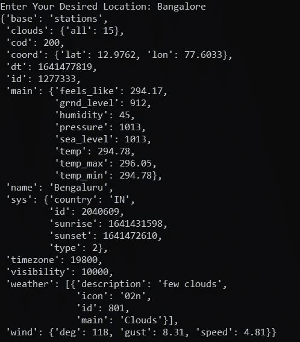

# 用 Python 开发不到 10 行的天气应用程序

> 原文：<https://towardsdatascience.com/develop-your-weather-application-with-python-in-less-than-10-lines-6d092c6dcbc9>

## 使用 Python 构建我们的天气电视广播应用程序，以接收所需位置的更新


美国国家海洋和大气管理局在 [Unsplash](https://unsplash.com?utm_source=medium&utm_medium=referral) 拍摄的照片

天气是我们生活中最重要的方面之一。它规定了我们想要在一天、一周或一个月中计划的不同种类的活动。解读天气模式的一种古老方法是观察天空，预测天气是晴朗、下雨还是潮湿。

如果你不像我一样精通气候，并且总是以预测错误告终，这种方法可能不是最有效的。另一种方法包括等待和观看新闻频道的每日报道来分析天气。然而，这些方式对于我们今天生活的现代来说似乎有点过时了。

有不同的设备和工具可以让你从卫星报告和众多的科学研究中解读当前的天气状况。在本文中，我们将利用 Python 中的 API 技术，用不到十行代码创建您自己的天气预报应用程序。所以，事不宜迟，让我们开始完成这个项目。

# 发展我们的天气电视广播:


照片由[唐纳德·詹纳蒂](https://unsplash.com/@wizwow?utm_source=medium&utm_medium=referral)在 [Unsplash](https://unsplash.com?utm_source=medium&utm_medium=referral) 上拍摄

对于这个项目，我们将利用 Python 和一个天气报告服务，该服务为我们提供一个 API 密钥来解释任何特定地方的每日天气情况。这个项目需要的少数几个库需求之一是 Python 中可用的请求模块。如果您还没有它，可以用一个简单的 pip install 命令安装下面的模块，并导入如下所示的库。这个工具将允许我们直接访问所需天气 API 应用程序的 HTTP 链接。

```
import requests
```

现在，我们将需要一个网站的 API 键，该网站存储有关天气的信息，并预测它们的准确结果。 [Open Weather Map](https://openweathermap.org/) 网站提供了一种科学而简单的方法，在我们的 Python 代码中利用他们的技术来快速生成天气预报的预期结果。要生成您自己的 API 密钥，只需登录以下网站并创建一个完全免费的帐户。您可以使用他们建议的 API 密钥之一，也可以自己生成一个。将这个生成的 API 键粘贴到您选择的变量中，如下所示。

```
API_Key = ""
```

我们的下一步是允许用户输入他们想要分析或查看天气状况的位置。我们可以使用输入命令执行以下操作，允许用户在所需的位置键入内容。请注意，只允许您键入实际存在的位置。如果您键入了错误的位置名称或不存在的位置名称，将会显示一条错误消息。

我们现在将创建一个变量来存储天气访问网站的默认 URL 位置。对于最终的 URL，我们将把打开的天气地图网站的默认路径与我们之前生成并存储在 API_Key 变量中的 API 键结合起来。最后，在天气数据变量中，我们将使用请求库来获取天气数据并相应地存储信息。

```
location = input("Enter Your Desired Location: ")weather_url = f"http://api.openweathermap.org/data/2.5/weather?q={location}&appid="
final_url = weather_url + API_Keyweather_data = requests.get(final_url).json()
```

现在，我们已经成功地在各自的变量中收集了天气信息，我们可以继续向用户显示所需的数据。下面的操作可以用 print 语句来完成，如下面的代码片段所示。

```
print(weather_data)
```

您可能会注意到，print 语句中显示的信息并不像您预期的那样漂亮，因为收集和显示的数据是原始格式的。因此，我们可以利用 Data pretty 打印机模块，以一种对用户来说更可展示、更可读的方式打印有用的信息。

```
from pprint import pprintpprint(weather_data)
```

在本文的下一部分，我们将查看构建天气应用程序的完整代码，并分析我们可以对该项目进行的大量改进和提高。

# 最终代码和进一步改进:

通过对上一节中所有基本代码片段的讨论，我们可以将它们组合在一起，为这个项目构建最终的代码块。请随意使用下面提供的代码来试验不同的位置。下面是一个结果，显示了这个项目的有效运作。

```
import requests
from pprint import pprintAPI_Key = ""location = input("Enter Your Desired Location: ")weather_url = f"[http://api.openweathermap.org/data/2.5/weather?q={location}&appid=](http://api.openweathermap.org/data/2.5/weather?q={location}&appid=)"
final_url = weather_url + API_Keyweather_data = requests.get(final_url).json()pprint(weather_data)
```



作者截图

```
Enter Your Desired Location: Bangalore
{'base': 'stations',
 'clouds': {'all': 15},
 'cod': 200,
 'coord': {'lat': 12.9762, 'lon': 77.6033},
 'dt': 1641477819,
 'id': 1277333,
 'main': {'feels_like': 294.17,
          'grnd_level': 912,
          'humidity': 45,
          'pressure': 1013,
          'sea_level': 1013,
          'temp': 294.78,
          'temp_max': 296.05,
          'temp_min': 294.78},
 'name': 'Bengaluru',
 'sys': {'country': 'IN',
         'id': 2040609,
         'sunrise': 1641431598,
         'sunset': 1641472610,
         'type': 2},
 'timezone': 19800,
 'visibility': 10000,
 'weather': [{'description': 'few clouds',
              'icon': '02n',
              'id': 801,
              'main': 'Clouds'}],
 'wind': {'deg': 118, 'gust': 8.31, 'speed': 4.81}}
```

用户可以试用这个项目的一个独特的变化是，每当你启动这个程序时，显示你所在位置的天气报告。并且每隔几个小时继续显示一次，以便快速检查气候变化，从而相应地计划您的日程。您可以按照代码中的要求设置您想要的位置，并以类似于我在以前的一篇文章中提到的提醒应用程序的方式构造项目。请随意从下面提供的链接中查看。

[](/python-project-to-improve-your-productivity-for-the-new-year-1956824eddb1)  

用户可以做出的另一个额外改进是构建一个 GUI 应用程序来相应地显示天气状况。如果你不太熟悉 Python 的图形工具，你可以看看我以前的一篇文章，了解更多关于 7 个最好的 GUI 的入门代码。

[](/7-best-ui-graphics-tools-for-python-developers-with-starter-codes-2e46c248b47c)  

# 结论:


NOAA 在 [Unsplash](https://unsplash.com?utm_source=medium&utm_medium=referral) 上拍摄的照片

> "无论你去哪里，无论天气如何，都要带上自己的阳光."安东尼·j·德安杰洛

如前所述，天气在我们的日常生活中起着至关重要的作用。因此，开发一个天气应用程序来帮助我们成功地跟踪自然的这一不可或缺的元素是非常有益的，这样我们就可以相应地计划我们的时间表，并选择我们日常生活中的最佳行动路线。

在本文中，我们学习了如何用大约十行 Python 代码构建一个天气预报应用程序。我们研究了简单的 API 密钥生成，并使用请求模块来访问显示特定位置的准确天气报告所需的信息。我们还分析了一些额外的改进，我们可以习惯于这个项目，使它更有吸引力和有用。

如果你想在我的文章发表后第一时间得到通知，请点击下面的[链接](https://bharath-k1297.medium.com/membership)订阅邮件推荐。如果你希望支持其他作者和我，请订阅下面的链接。

[](https://bharath-k1297.medium.com/membership)  

如果你对这篇文章中提到的各点有任何疑问，请在下面的评论中告诉我。我会尽快给你回复。

看看我的一些与本文主题相关的文章，你可能也会喜欢阅读！

[](/complete-python-starter-guide-for-data-science-for-2022-c1f880fa249d)  [](/generating-qr-codes-with-python-in-less-than-10-lines-f6e398df6c8b)  [](/how-to-write-code-effectively-in-python-105dc5f2d293)  

谢谢你们坚持到最后。我希望你们都喜欢这篇文章。祝大家有美好的一天！