# 使用 Streamlit 快速开发基于 Web 的实时视频/音频处理应用

> 原文：<https://towardsdatascience.com/developing-web-based-real-time-video-audio-processing-apps-quickly-with-streamlit-7c7bcd0bc5a8>

## 在本文中，我们将了解如何使用 Streamlit 创建浏览器就绪的实时视频/音频处理应用。

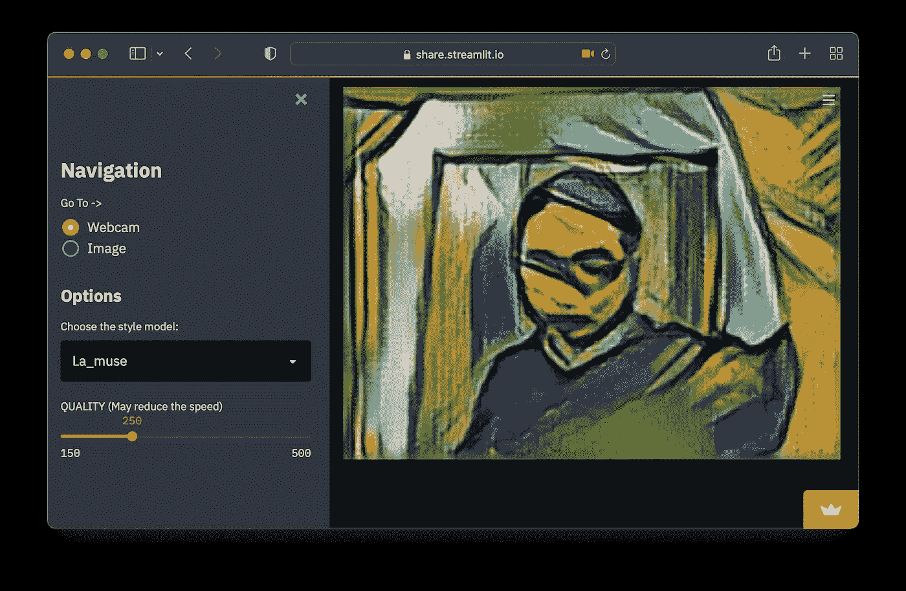

作者图片

Streamlit 是一个 Python 框架，开发人员可以使用它快速构建 web 应用程序，而无需前端编码。在此基础上，开发人员可以开发实时视频/音频处理应用程序，从用户的媒体设备接收视频/音频流，在最简单的例子中，只需大约 10 行代码。

由于这类应用程序是基于网络的，它们可以被部署到云上，与用户轻松共享，并拥有现代化和用户友好的用户界面。

这个技术堆栈对于创建视频/音频应用程序的演示和原型设计非常有用，例如人体或物体检测、风格转换、图像过滤器、语音识别、视频聊天应用程序等。

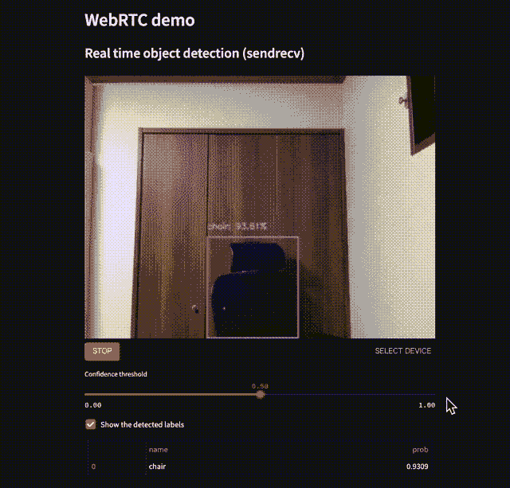

一个简单的基于网络的物体检测应用程序。用户可以在执行过程中交互更改阈值。 [*在线试玩🎈*](https://share.streamlit.io/whitphx/streamlit-webrtc-example/main/app.py)

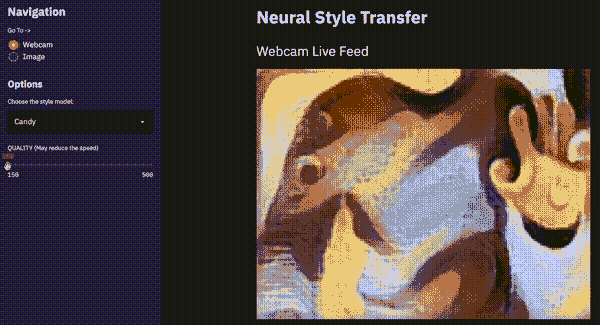

*一个基于 web 的风格转移应用程序示例。用户可以在执行过程中交互更改模型类型和模型参数。* [*在线演示🎈*](https://share.streamlit.io/whitphx/style-transfer-web-app/main/app.py)

您可以在下面的*示例*部分看到更多示例。

**注**:这些样本应用托管在公共云上( [Streamlit Cloud](https://streamlit.io/cloud) )，视频和音频流传输到云服务器上进行处理。虽然这些数据只在内存中处理，不会保存到任何存储中，但是，如果您担心，请不要使用它们。至于本文中的以下内容，我们可以在本地全部执行。此外，您可以按照下面的*示例*部分的说明，在本地尝试上述示例。

**注:**我在[europhon 2022](https://ep2022.europython.eu/)上做了一个关于这个主题的演讲，题目是[“使用 Streamlit 的实时浏览器计算机视觉应用”](https://ep2022.europython.eu/session/real-time-browser-ready-computer-vision-apps-with-streamlit)演讲视频如下:

**更新:**本文已于 2022/09/02 更新，使用的是从 [v0.40.0](https://github.com/whitphx/streamlit-webrtc/blob/main/CHANGELOG.md#0400---2022-06-07) 开始可用的`streamlit-webrtc`新引入的 API。

# 基于网络的应用程序的优势

我们通常使用 OpenCV 来构建图像或视频处理的实时演示应用。你们中的一些人(尤其是这类领域的开发人员或研究人员)可能已经多次看到下面的代码或类似的代码。

```
import cv2

cap = cv2.VideoCapture(0)

while True:
    ret, frame = cap.read()

    img = cv2.Canny(frame, 100, 200)  # Some image processing

    cv2.imshow('frame', img)
    if cv2.waitKey(1) & 0xFF == ord('q'):
        break

cap.release()
cv2.destroyAllWindows()
```

与上面使用运行在本地环境的`cv2.VideoCapture`和`cv2.imshow`的 GUI 应用程序相比，基于网络的应用程序有如下优势。

易于共享和运行:

*   如果我们在云上部署应用程序，我们可以通过发送 URL 与用户分享应用程序。
*   用户只有通过网络浏览器才能使用这些应用程序。它不需要任何设置或外部依赖。

可在智能手机上使用:

*   因为用户只需要网络浏览器，所以他们可以在智能手机上使用这些应用。如果我们能在这样的便携设备上展示演示，那就太方便了。

用户友好的用户界面:

*   开发人员可以使用文本输入、滑块或其他基于 web 的组件来接受用户输入或显示数据。近来，这种基于网络的用户界面比桌面图形用户界面对用户更友好。

# 辅导的

我们将创建一个简单的基于 web 的实时视频处理应用程序，其 LoC 约为 10 或 20。请在有网络摄像头和麦克风的环境中尝试本教程。

你可以在[这个资源库](https://github.com/whitphx/streamlit-webrtc-article-tutorial-sample)里查看这个教程的最终结果。此处是部署的在线演示[🎈](https://share.streamlit.io/whitphx/streamlit-webrtc-article-tutorial-sample/main/app.py)

在本教程中，我们将在`app.py`中编写代码。请先创建一个空的`app.py`。

```
$ touch app.py
```

## 安装必要的软件包

接下来，我们必须安装本教程所需的软件包。

```
$ pip install -U streamlit streamlit-webrtc opencv-python-headless
```

*   `streamlit`:Streamlit 主包。
*   `streamlit-webrtc`:Streamlit 的定制组件，处理实时视频和音频流。
*   `opencv-python-headless` : OpenCV。我们在这里选择 headless 版本，因为我们将使用 Streamlit 构建 UI。

## 第一次接触 Streamlit

注意:如果您有使用 Streamlit 的经验，请跳过这一部分。

首先，用下面的命令启动 Streamlit。请运行与`app.py`相同目录下的命令。

```
$ streamlit run app.py
```

过一会儿，Streamlit 服务器进程将启动。然后访问 [http://localhost:8501](http://localhost:8501) 看到如下图的页面(或者默认会在浏览器中自动打开)。这里的截图是在黑暗模式下，如果你使用的是光明模式，看起来会有所不同。

这时，网页上没有内容，因为`app.py`是空的。我们将在 Streamlit 应用程序的`app.py`中添加代码行。

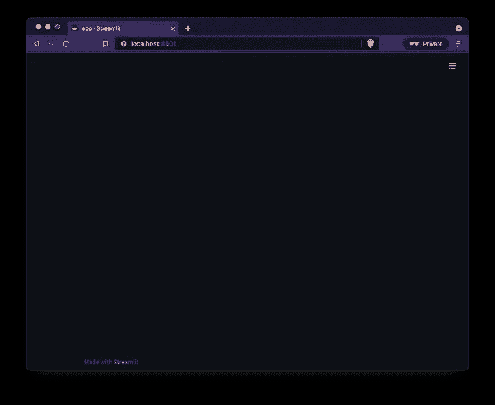

用你的编辑器打开`app.py`，写下下面的代码。

```
import streamlit as st

st.title("My first Streamlit app")
st.write("Hello, world")
```

当您保存文件时，Streamlit 将检测文件更改，并在屏幕右上角显示“重新运行”和“总是重新运行”按钮。

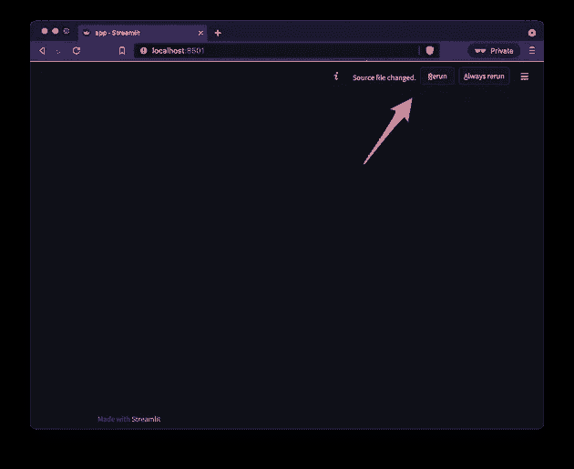

单击“重新运行”按钮。然后网页被重新加载，页面内容如下所示。网页内容基于`app.py`代码生成。


如果你点击了“总是重新运行”按钮，每次文件改变时，页面会自动重新加载。

请注意，在更新`app.py`时，您必须按照下面的说明重新加载页面。

现在，我们已经了解了 Streamlit 应用的基本开发流程。你用像`st.title()`和`st.write()`这样的 Streamlit 组件编写 Python 代码并传递给`streamlit run`命令，然后 Streamlit 在网页上生成相应的前端内容。

在下一节中，我们将看到如何在 Streamlit 之上开发一个实时视频处理应用程序。除此之外，Streamlit 本身涵盖了更多的用例，如机器学习、数据科学或更通用的用途。此类用例请参见[官方 Streamlit 教程](https://docs.streamlit.io/library/get-started/create-an-app)举例。

## 引入实时视频/音频流组件

如下更新`app.py`。

```
import streamlit as st
from streamlit_webrtc import webrtc_streamer

st.title("My first Streamlit app")
st.write("Hello, world")

webrtc_streamer(key="example")
```

我们用`webrtc_streamer()`添加了一行。web 应用程序将类似于下面的屏幕截图。

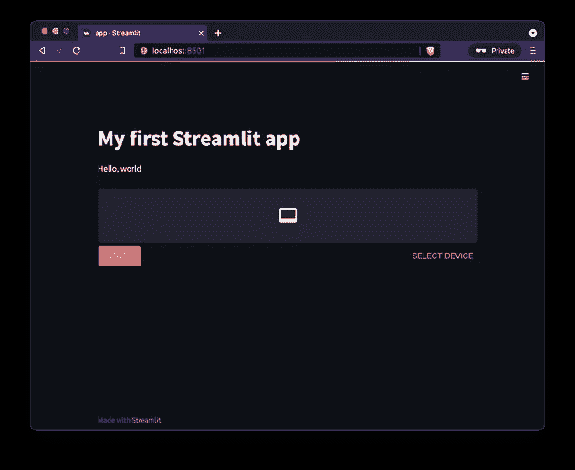

在第一次试用时，可能需要一些时间来编译软件包，以便在单击“重新运行”按钮后，页面在一段时间内保持显示“正在运行”的消息。在这种情况下，请等待该过程完成。

单击“开始”按钮开始视频和音频流。第一次试用时，可能会要求您允许使用网络摄像头和麦克风。在这种情况下，请给予许可。

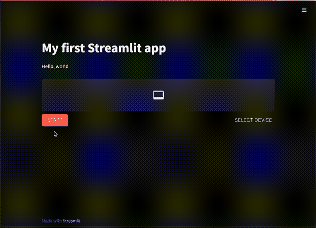

上面的`webrtc_streamer(key="example")`是一个 Streamlit 组件，它通过 web 浏览器处理视频和音频实时 I/O。`key`参数是脚本中标识组件实例的唯一 ID。我们在这里将其设置为`"example"`，但是您可以使用任何字符串。该示例中的组件仅接收来自客户端网络摄像头和麦克风的视频和音频，并输出原始流。这是组件的最基本版本。我们将通过在以下部分添加其他选项来增强它的功能。

## 实时视频处理应用程序的开发

如下更新`app.py`。

```
import streamlit as st
from streamlit_webrtc import webrtc_streamer
import av
import cv2

st.title("My first Streamlit app")
st.write("Hello, world")

def callback(frame):
    img = frame.to_ndarray(format="bgr24")

    img = cv2.cvtColor(cv2.Canny(img, 100, 200), cv2.COLOR_GRAY2BGR)

    return av.VideoFrame.from_ndarray(img, format="bgr24")

webrtc_streamer(key="example", video_frame_callback=callback)
```

像上一节一样，通过单击“开始”按钮来尝试一下。在这个新示例中，您可以发现图像过滤器被应用于视频流。

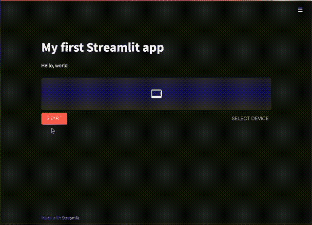

我们已经定义了一个接收输入帧并返回输出帧的回调。我们还将图像处理(本例中是边缘检测)代码放在回调函数中。于是，我们通过回调把图像处理代码注入到实时视频 app 中。

关于代码的详细解释如下。

*   `webrtc_streamer()`可以通过`video_frame_callback`自变量取一个函数对象作为回调。
*   回调接收并返回输入和输出图像帧。这些是来自`[PyAV](https://github.com/PyAV-Org/PyAV)`的`[VideoFrame](https://pyav.org/docs/develop/api/video.html#av.video.frame.VideoFrame)`类的实例。`PyAV`库是`ffmpeg`的 Python 绑定，提供视频和音频功能。它作为`streamlit-webrtc`的依赖项安装。
*   回调的参数是来自网络摄像头的输入视频流中的图像帧。可以用`frame.to_ndarray()`转换成 NumPy 数组。
*   回调的返回值显示在屏幕上。在上面的示例中，要返回的新的`VideoFrame`对象是从一个 NumPy 数组中生成的，带有`av.VideoFrame.from_ndarray(img, format="bgr24")`。
*   任何代码都可以放在回调函数中。在上面的例子中，我们使用了边缘检测滤波器`cv2.Canny(img, 100, 200)`(和灰度转换器`cv2.cvtColor(img, cv2.COLOR_GRAY2BGR)`)作为例子。

现在，我们已经创建了一个浏览器就绪的实时视频处理应用程序！在这个例子中，我们使用了一个简单的 Canny 边缘检测器，您可以在您的原始应用程序中用任何图像处理代码替换它。

如果我们对该部分使用对象检测或样式转换，该应用程序将类似于本文开头的截图。

## 接收用户输入

如下更新`app.py`。

```
import streamlit as st
from streamlit_webrtc import webrtc_streamer
import av
import cv2

st.title("My first Streamlit app")
st.write("Hello, world")

threshold1 = st.slider("Threshold1", min_value=0, max_value=1000, step=1, value=100)
threshold2 = st.slider("Threshold2", min_value=0, max_value=1000, step=1, value=200)

def callback(frame):
    img = frame.to_ndarray(format="bgr24")

    img = cv2.cvtColor(cv2.Canny(img, threshold1, threshold2), cv2.COLOR_GRAY2BGR)

    return av.VideoFrame.from_ndarray(img, format="bgr24")

webrtc_streamer(key="example", video_frame_callback=callback)
```

然后点击“开始”按钮。你会发现在这个例子中有 2 个滑块。您可以通过滑块修改`cv2.Canny()`的参数，即使是在实时执行期间。

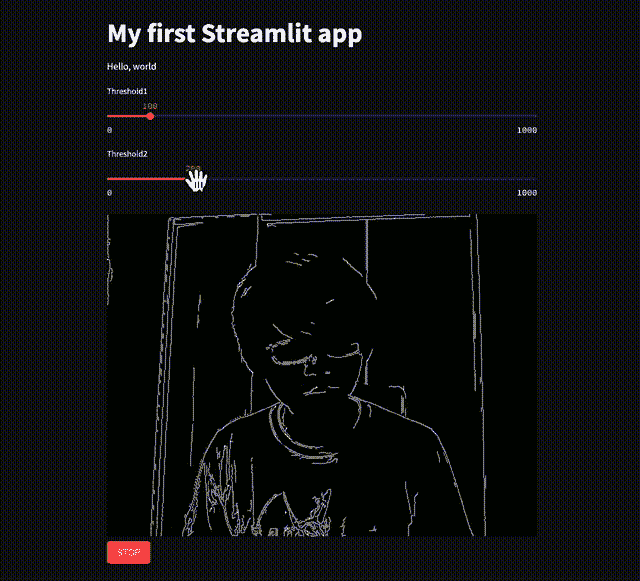

有了这次更新，

*   我们添加了`threshold1`和`threshold2`变量。
*   我们添加了两个带有`st.slider()`的滑块组件，并将它们的值赋给这些变量。`st.slider()`是 Streamlit 的内置组件。它的官方 API 参考是[https://docs . streamlit . io/library/API-reference/widgets/ST . slider](https://docs.streamlit.io/library/api-reference/widgets/st.slider)。
*   然后我们将这些变量作为参数传递给回调函数中的`cv2.Canny()`。

现在我们有交互式输入来控制实时视频过滤器！

## 回调的执行模式和重要注意事项

与 OpenCV 不同，`streamlit-webrtc`需要回调来处理图像和音频帧。这种基于回调的设计是 OpenCV GUI 和`streamlit-webrtc`之间的一个主要区别，关于它有一些事情你必须知道。

请注意，回调是在一个分叉线程中执行的，该线程不同于运行 Streamlit 应用程序代码的主线程。它做了如下一些限制。

*   `global`关键字在回调中没有像预期的那样工作。
*   诸如`st.write()`之类的 Streamlit 方法不能在回调中使用。
*   回调内部和外部之间的通信必须是线程安全的。

# 将应用部署到云

我们将把 web 应用程序部署到云中，让每个人都可以使用它。

## 配置 WebRTC

要将应用程序部署到云中，我们必须将`rtc_configuration`参数添加到`webrtc_streamer()`中。

```
webrtc_streamer(
    key="example",
    video_frame_callback=callback,
    rtc_configuration={  # Add this line
        "iceServers": [{"urls": ["stun:stun.l.google.com:19302"]}]
    }
)
```

当服务器在远程主机上时，此配置是建立媒体流连接所必需的。

`streamlit_webrtc`使用 WebRTC 进行视频和音频流传输。它必须访问全局网络中的“STUN 服务器”,以便远程对等点(确切地说，是 NAT 上的对等点)建立 WebRTC 连接。虽然我们在本文中没有看到关于 STUN 服务器的细节，但是如果感兴趣的话，请使用关键字如 STUN、TURN 或 NAT traversal 来搜索它。

在上面的例子中，我们将代码配置为使用 Google 提供的免费 STUN 服务器。您也可以使用任何其他可用的 STUN 服务器。

参数`rtc_configuration`的值将被传递给前端的`[RTCPeerConnection](https://developer.mozilla.org/en-US/docs/Web/API/RTCPeerConnection/RTCPeerConnection)`构造函数。

## HTTPS

我们必须通过 HTTPS 在远程主机上提供网络应用程序，以使用网络摄像头或麦克风。

不仅我们在这里使用的`webrtc_streamer()`组件，而且任何访问客户端网络摄像头或麦克风的前端应用程序都使用`[MediaDevices.getUserMedia()](https://developer.mozilla.org/ja/docs/Web/API/MediaDevices/getUserMedia)` API。这个 API 不能在“不安全的上下文”中工作

文件[说](https://developer.mozilla.org/en-US/docs/Web/API/MediaDevices/getUserMedia#privacy_and_security)

> *简而言之，安全上下文是使用 HTTPS 或* `*file:///*` *URL 方案加载的页面，或者从* `*localhost*` *加载的页面。*
> 
> [*media devices . getuser media()-隐私和安全*](https://developer.mozilla.org/en-US/docs/Web/API/MediaDevices/getUserMedia#privacy_and_security)

因此，我们需要 HTTPS 在访问客户端网络摄像头或麦克风的远程主机上提供网络应用。

## 流线云

我推荐使用 [Streamlit Cloud](https://streamlit.io/cloud) 托管 Streamlit 应用。只需点击几下鼠标，你就可以从 GitHub 库部署应用程序，它会通过 HTTPS 自动提供应用程序。而且 Streamlit Cloud 似乎提供了比 Heroku free-tier 更好的运行时，而 Streamlit Cloud 免费提供了大部署容量。

其用法请参考[公文](https://docs.streamlit.io/streamlit-cloud)。

我在 Streamlit Cloud 上实际部署了我们在本文中看到的 app:[https://share . Streamlit . io/whit phx/Streamlit-webrtc-article-tutorial-sample/main/app . py](https://share.streamlit.io/whitphx/streamlit-webrtc-article-tutorial-sample/main/app.py)。

它的 GitHub 资源库是[https://GitHub . com/whit phx/streamlit-webrtc-article-tutorial-sample](https://github.com/whitphx/streamlit-webrtc-article-tutorial-sample)。

注意添加了`requirements.txt`来在 Streamlit 云环境中安装必要的依赖项(`streamlit-webrtc`和`opencv-python-headless`):[https://github . com/whit phx/Streamlit-webrtc-article-tutorial-sample/blob/main/requirements . txt](https://github.com/whitphx/streamlit-webrtc-article-tutorial-sample/blob/main/requirements.txt)

# 通知；注意

如上所述，源自客户端设备的视频和音频流被传输到服务器并在服务器处被处理。

因此，这个库是不可扩展的，并且依赖于网络连接。您可能认为它主要用于原型制作或演示目的。

如果担心将媒体传输到远程云服务器，你还必须考虑将应用托管在本地网络中。

# 例子

本部分是在[https://github.com/whitphx/streamlit-webrtc](https://github.com/whitphx/streamlit-webrtc)的样品清单的副本。

## 展示包括以下例子和更多

[⚡️Repository](https://github.com/whitphx/streamlit-webrtc-example) ，[🎈在线演示](https://share.streamlit.io/whitphx/streamlit-webrtc-example/main/app.py)

*   对象检测(这是本文开头的样例应用程序的截图)
*   OpenCV 过滤器
*   单向视频流
*   音频处理

您可以在您的本地 env 上使用以下命令来试用这个示例应用程序。

```
$ pip install streamlit-webrtc opencv-python-headless matplotlib pydub
$ streamlit run https://raw.githubusercontent.com/whitphx/streamlit-webrtc-example/main/app.py
```

## 实时语音转文本

[⚡️Repository](https://github.com/whitphx/streamlit-stt-app) ，[🎈在线演示](https://share.streamlit.io/whitphx/streamlit-stt-app/main/app_deepspeech.py)

它能实时将你的声音转换成文本。这个 app 是自带的；它不依赖于任何外部 API。

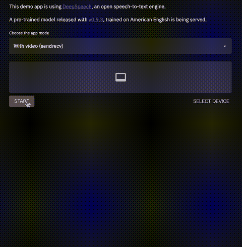

## 实时视频风格传输

[⚡️Repository](https://github.com/whitphx/style-transfer-web-app) ，[🎈在线演示](https://share.streamlit.io/whitphx/style-transfer-web-app/main/app.py)

它将各种各样的风格转换过滤器应用于实时视频流。


## 视频聊天

[⚡️Repository](https://github.com/whitphx/streamlit-video-chat-example) (不提供在线演示)

你可以用大约 100 行 Python 代码创建视频聊天应用。

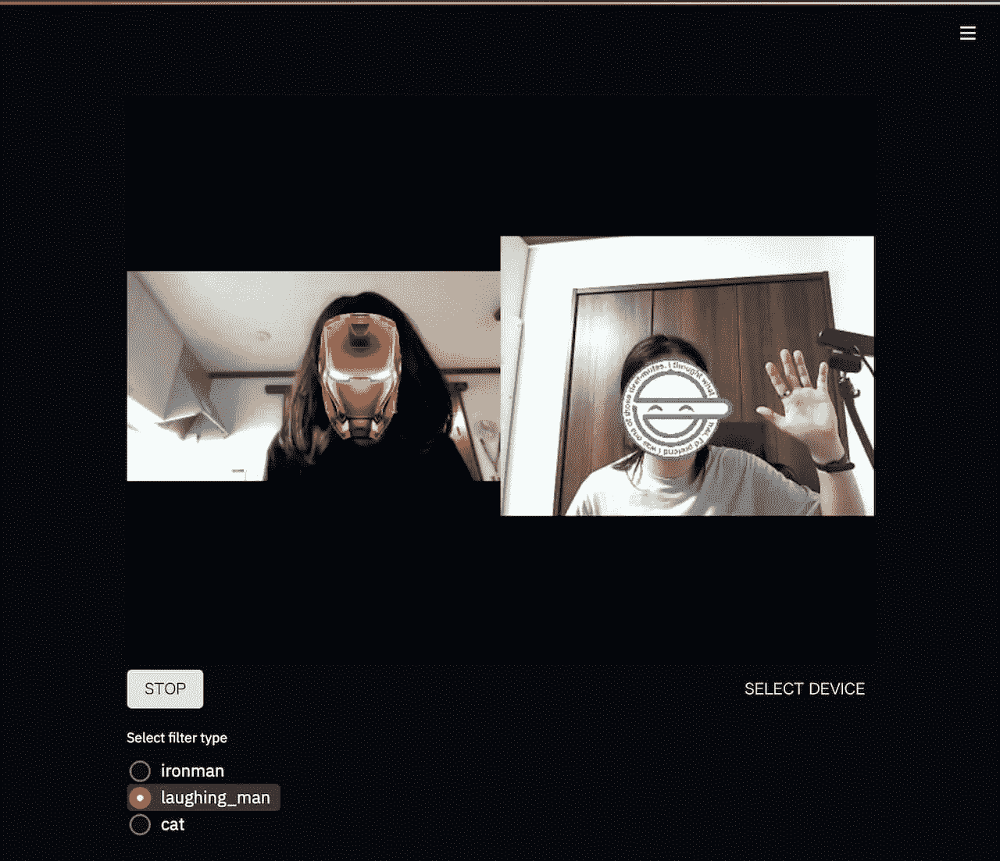

## 东京 2020 象形图

[⚡️Repository](https://github.com/whitphx/Tokyo2020-Pictogram-using-MediaPipe) : [🎈在线演示](https://share.streamlit.io/whitphx/tokyo2020-pictogram-using-mediapipe/streamlit-app)

[MediaPipe](https://google.github.io/mediapipe/) 用于姿态估计。

# 音频呢？

您可以像处理视频一样处理音频流。如果您定义了一个回调函数并将其传递给`audio_frame_callback`参数，那么回调将会在音频帧中执行。在音频的情况下，回调的输入参数和返回值是`[AudioFrame](https://pyav.org/docs/develop/api/audio.html#module-av.audio.frame)`[类](https://pyav.org/docs/develop/api/audio.html#module-av.audio.frame)的实例。

请参见上面示例中的[更改音频增益的示例应用程序](https://github.com/whitphx/streamlit-webrtc/blob/c172483efd4566b18d3500e914285079117b5b35/pages/audio_filter.py)或语音转文本应用程序的源代码。

*原载于*[*https://www . whit phx . info*](https://www.whitphx.info/posts/20211231-streamlit-webrtc-video-app-tutorial/)*。*