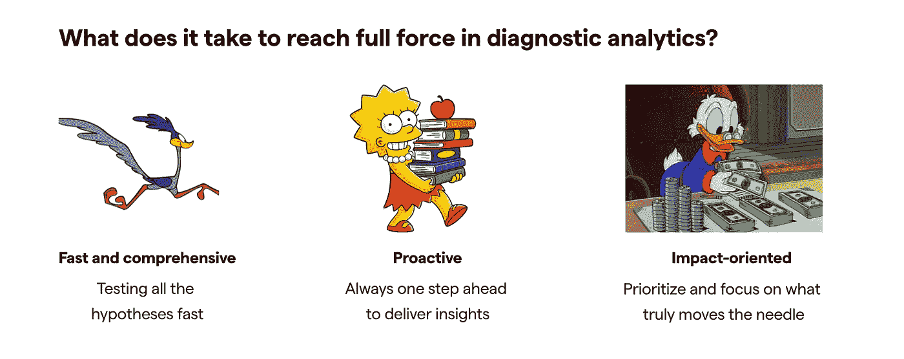
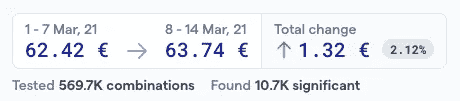
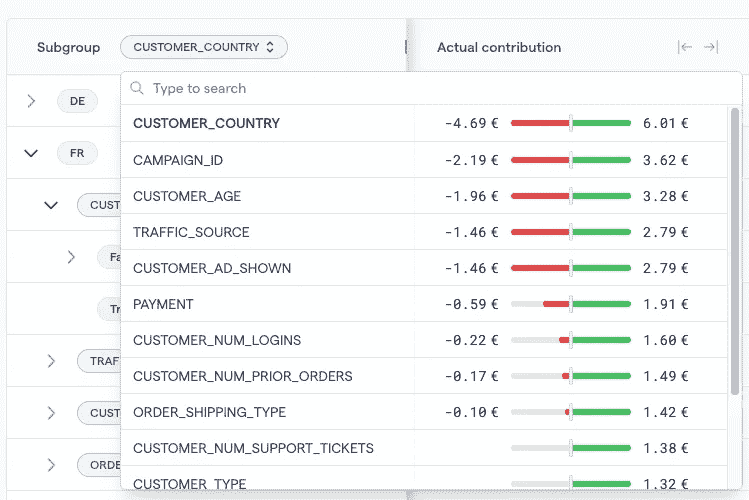
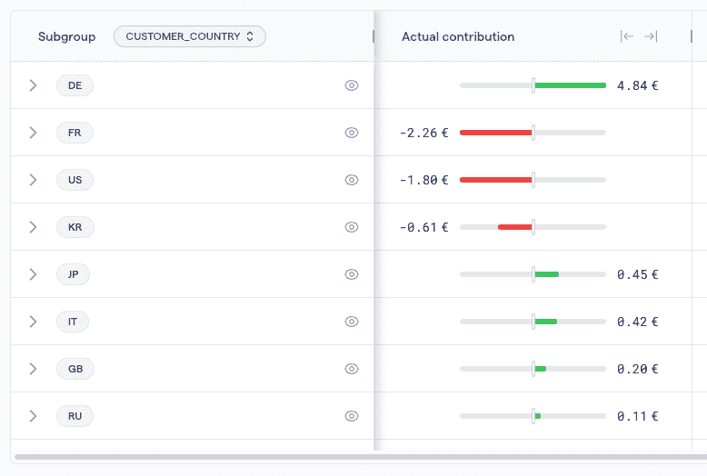
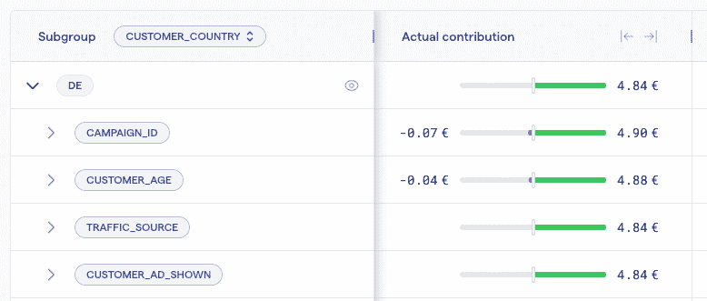
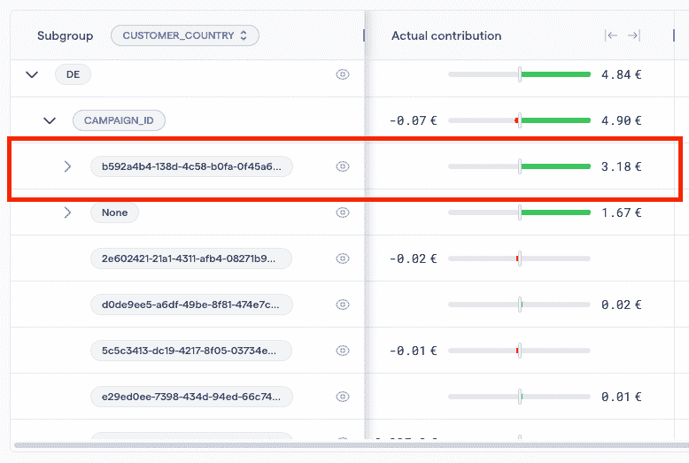
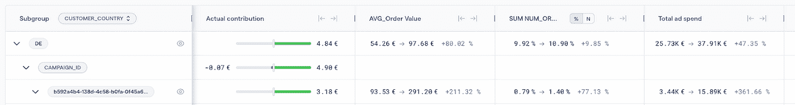
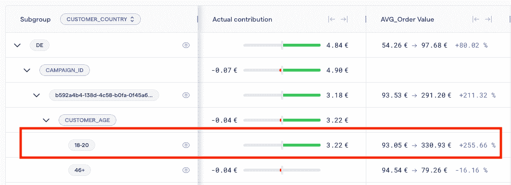

# 诊断分析—如何进行根本原因分析

> 原文：<https://towardsdatascience.com/diagnostic-analytics-how-to-conduct-a-root-cause-analysis-4e92583cf008>

## 主动提供对指标变化的真实见解

*注意:术语根本原因分析通常在 IT 和数据工程中用作识别故障或问题根本原因的过程。本文重点关注诊断分析，以理解业务指标变化的驱动因素。*

rawpixel.com 在 Freepik 上的图片

为什么收入下降了？为什么转化率会飙升？为什么平均订单值持平？

根据您的行业和业务目标，您的关键指标可能会有所不同。但是如果你关心回答“我如何改进我的关键指标？”，你需要先了解他们为什么先改变。

我看到许多团队努力回答，以确定业务度量变化背后的根本原因。根据他们的诊断分析成熟度，原因会有所不同(参见[诊断分析差距](/the-diagnostic-analytics-gap-3f9d0a44e8f8))。

# 这有什么关系？

为了能够提出改进性能的建议，团队首先需要理解他们的度量标准中发生的变化。如果不深入观察，就不可能找到真正的洞察——不仅仅是观察——供团队采取行动(参见文章“[如何交付真正的数据驱动洞察](/how-to-deliver-real-data-driven-insights-e94f2b386c18)”)。

理想情况下，他们应该定期这样做，而不是在观察到指标急剧下降或上升时进行调查。否则，团队将陷入被动的分析循环，这可能会由于延迟的见解和行动而代价高昂。

# 现状

根据与数十个数据和业务团队的对话和协作，人们可以根据诊断分析的方法、分析彻底性和洞察时间，将诊断分析成熟度分为 4 种状态。

(诊断分析的状态—图片由 Kausa 提供)

## **卡在什么里面**

团队主要描述正在发生的事情(例如，指标正在下降)，并将点与高层次的定性事实(例如，业务中发生的事件，如网站更新)联系起来。该流程是非结构化的，不是数据驱动的。他们大多处于救火模式，调查来自业务团队的特别请求。

*结果*:团队甚至没有意识到的未开发的潜力，削弱的数据文化

## 常见的疑点(即“业务主导”的方法)

团队非常倾向于只测试通常的怀疑或业务团队提出的假设。虽然从业务单元接收上下文和方向是有用的，但是团队应该不仅仅是测试这些假设。这可能会引入明显的偏见，并使团队忽略宝贵的机会。

*结果*:决策过程中的重大偏差，导致错失良机。缺乏真正的洞察力。

## 速度的需求

团队处于诊断分析的更成熟状态，他们认识到深入探究原因的价值。虽然他们有更结构化的方法，但使用现有工作流执行全面的根本原因分析过于复杂和耗时。他们通常不能像业务要求的那样快速获得洞察力。

*结果*:洞察力发现得太慢，无法产生真正的商业影响和改善决策。

# 理想状态——全部力量

全面的诊断分析需要基于面向影响的全面根本原因分析的主动方法。

(作者的幻灯片—在诊断分析中发挥全部力量)

## **快速而全面**

团队使用机器学习来增强诊断分析。通过这种方式，他们可以在几分钟内测试变化背后所有可能的驱动因素，而不会牺牲速度或全面性，也不会消除人为偏见。

## 积极主动的

团队不仅关注剧烈的/令人惊讶的变化，而且根据业务的发展速度，每天/每周保持他们度量的脉搏。他们参加绩效会议时，已经准备好了推动对话的潜在变革驱动因素。每天/每周主动分享这些见解，而不是对业务问题做出反应。

## 面向影响

在一个最大的市场中，一个小的变化可能仍然很大，但在一个小群体中的重大变化可能会显得更加突出，除非你将真正的影响/实际贡献考虑在内。([此处查看更多](/why-analytics-needs-an-impact-driven-approach-43179f3bec4e))。

当观察一个特定的子群时，它对全局指标变化的贡献必须来源于两个影响:

*   此子组的给定度量的变化
*   亚组数量的变化(该亚组在全球人口中的份额)

假设*其他条件相同*(所有其他条件相同)，这两种效应可以单独计算。通过将两种效应相加，你可以得到这个子群对全局度量变化的贡献。

让我们假设您正在查看每周的平均订单价值(AOV)变化。

全球平均订单价值从 50€增加到 52€。

你想了解每个国家对全球变化的贡献。让我们以法国为例:

*   ***公制变更:*** 法兰西的 AOV 从 60€增加到 70€
*   数量/体积法国订单的份额一直保持在 10%
*   *实际影响:由两种影响之和得出*
*   ***指标变化:**法国 AOV 订单的增加对全球 AOV 有积极贡献。假设*其他条件不变*(即法兰西的规模将保持 10%)，效果是(70 个€-60 个€)*10% = 1 个€*
*   ***体积变化:** 0(假定尺寸保持不变)*
*   *考虑到这两种影响，如果其他因素保持不变，全球 AOV 将上移 1 个€(即，这是法国对全球 AOV 变化的贡献)*

# *进行根本原因分析的最佳方法*

*最佳实践方法包括 3 个关键步骤:将变更缩小到最具影响力的子群体，分析相关/依赖指标，以及将点与所采取的行动、交互和外部事件联系起来。然后，关键是要确保这些见解得到适当的传达和呈现，以推动行动。*

## *1)将变更缩小到最具影响力的子群体*

*在测试了所有潜在的相关因素以避免人为偏见之后，将变更缩小到驱动大部分变更的子群体。这是人力资源无法完成的部分。即使你花了几天/几周的时间在一个改变上，你也不太可能调查所有的因素并根据影响给它们打分。*

*使用机器学习/增强分析，可以在几分钟内检查数千甚至数百万个组合，并且只有重要的组合可以根据前面解释的实际影响进行评分。*

## *2)分析相关/依赖指标*

*在将变更缩小到最有影响力的子群体之后，查看这些子群体的相关/依赖指标是如何演变的。通常，一个指标是其他指标的函数(例如，游戏中的 ROAS 是预期收入、成本和安装的函数)。在这些情况下，记住这个度量树有助于进一步理解事情为什么会发生变化(例如，由于成本激增，ROAS 下降)*

## *3)把这些点连接起来*

*与业务团队协作，将点点滴滴联系起来，并推动可操作的见解。集体讨论采取了哪些行动，以及交互、事件和可能影响您正在研究的业务指标的外部因素。相关事实可分为 3 组:*

*   ***内部**(即公司采取的行动)*
*   ***外部和行业特定** —竞争对手采取的行动(例如，新的营销活动)或行业的总体趋势(例如，夏季季节性)会影响您正在寻找的业务指标*
*   ***外部和特定地理区域** —影响特定区域的更广泛行动(如巴西的选举)*

## *4)有效地展示和交流见解*

*提前解释关键事实和驱动因素，陈述你的假设并量化影响。开发一致的方法来展示结果(例如，瀑布图、如下所示的备忘录)*

***例子***

*让我们回到平均订单价值的例子——AOV*

*AOV 追踪顾客每次在网站或手机应用上下单时的平均消费金额。产品/市场团队旨在通过测试不同的活动，并随着时间的推移对网站/应用程序进行更改，从而最大化 AOV。*

*在这种情况下，AOV 从 62.4€增加到 63.7€哇。增长了 2.1%。*

**

*(图片由 Kausa 提供—公制变化快照)*

*由于这不是一个大的峰值或下降，许多团队很可能会忽略这一点。在全员层面，每周都要对 AOV 等关键业务指标进行检查，以发现每一个机会并最大化业务影响。*

*那么，这 2%从何而来？*

*通过扩大工作流程，您可以测试影响 AOV 的所有因素——在这个案例中有超过 500，000 种组合——并查看哪些驱动因素具有最大的影响。*

**

*(图片由 Kausa 提供—主要驱动因素的优先顺序)*

*几秒钟之内，我就能看出国家、活动和客户年龄是最大的影响驱动因素。有趣的是，从高层次来看，有相当多的因素相互影响，相互抵消。*

*让我们看看哪些国家做出了消极和积极的贡献。*

**

*(图片由 Kausa 提供——各国的实际贡献)*

*有趣的是，德国的表现非常好，而法国、美国和韩国表现不佳。*

*你很好奇为什么德国的表现比其他国家更好。因此，您需要进一步挖掘，以确定活动 ID 是导致德国 AOV 增长的子因素。但是哪一个或哪些活动？*

**

*(图片由 Kausa 提供——根据实际贡献优先考虑德国的主要驱动因素)*

*在德国有一个活动为整个 AOV 贡献了 3.18€。有意思…*

**

*(图片由 Kausa 提供——德国的活动根据实际贡献进行优先排序)*

*现在，您可以查看相关的指标以获得更多的上下文信息。看起来营销团队增加了此次活动的广告支出，从而推动了订单价值和订单量的增长。子群的体积相当小。你可能想要通知我们也可以在其他部分测试的团队。*

**

*(图片由 Kausa 提供—查看相关指标)*

*在你联系营销团队之前，你想看看你是否能收集到任何其他见解。年龄似乎是一个重要的次要因素。该运动在 18-20 岁年龄组中表现尤为突出。*

**

*(图片由 Kausa 提供——一起看三维)*

*太好了！现在，您已经准备好与营销团队交流这些发现，以获得更多的业务背景。*

*快速签到后，你发现他们正在为这次活动测试新的创意视觉效果。有了这些信息，营销团队开始在其他地区测试该活动，数据团队将密切关注是否在其他国家观察到相同的趋势。您可以将时间分配给更有趣的数据分析项目，而不是花费数小时/数天进行深入研究。*

*双赢。*

# *底线:影响驱动的方法*

*从现状来看，提高诊断分析和实现商业价值最大化的机会很大。目前，处理诊断分析的方式有时会让人感觉像是故意伤害(从持续救火到错过最后期限等等)。但这种疯狂是有可能带来逻辑和结构的。从哪里开始？取决于您的起点，但请考虑以下几点:*

*   *发展您的现代数据堆栈，使其包含决策智能/诊断分析平台，从而能够扩展工作流*
*   *开始测试手头的所有假设，发现被忽视的机会*
*   *根据影响指标的驱动因素的实际影响对其进行评分，以便能够关注真正重要的因素*
*   *主动与相关利益相关方交流调查结果*

*—*

**想法？伸出手去* [*若昂索萨*](https://www.linkedin.com/in/joaoantoniosousa/)*处长成长处* [*考萨*](https://www.linkedin.com/company/kausa-ai/) *。敬请关注更多关于如何确定诊断分析和增加数据价值的帖子&分析。**