# Dickey Fuller 直接评估—测试统计计算速度提高 50 倍

> 原文：<https://towardsdatascience.com/dickey-fuller-direct-estimation-speed-up-to-50x-test-statistic-computation-af3cb28b9803>

## 通过相关系数直接估计 Dickey-Fuller 检验统计量，避免不必要的回归和矩阵求逆。

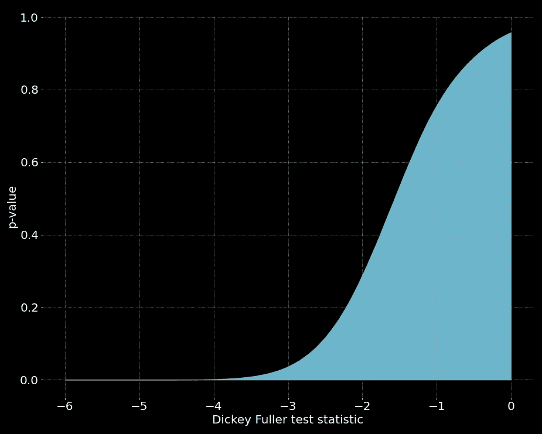

图片作者。

Dickey-Fuller 检验可能是时间序列分析中最著名的平稳性(单位根)检验。测试的计算程序依赖于具体统计公式的线性回归结果。然而，线性回归需要矩阵求逆，这可能是计算密集型的，甚至是数值不稳定的。

在这个故事中，我们将探索 OLS(普通最小二乘法)背后的数学，并使用这样的分析来推导 Dickey-Fuller 检验统计量的闭合形式表达式(使用 1 个时滞和一个常数)。所得表达式仅使用相关系数，没有矩阵求逆或计算密集型操作。这可以将计算速度提高 50 倍。

## 目录

*   封闭形式表达式推导
*   封闭形式的表达式结果
*   健全性检查
*   转速试验
*   p 值
*   最后的话

## 封闭形式表达式推导

如果你想跳过数学细节，滚动到下一节，没有伤害。

对于那些还在这里的人，让我们首先正式阐明这个问题。最多一个滞后和一个常数的 Dickey-Fuller 检验(非扩充)自回归模型规格为:

使用ε i.i.d，该等式可以转换为时间序列增量显式的形式:

通过 OLS 估计α、β及其方差。

迪基-富勒检验统计量定义为:

我们可以用数值方法进行 OLS 回归，得到β和它的方差，然后就到此为止。这将涉及计算量很大的矩阵求逆和矩阵乘法。所以我们不会这么做。

我们可以走的另一条路是做数学。似乎现在我大部分时间都在电脑上捣鼓数字，几乎没有时间在黑板上做实际的数学运算。在这种情况下，做数学确实会有回报。

首先，我们将用矩阵和向量来表示我们的回归

其中 *S* _d 是由 *S* 的差组成的维度为 *T* 的向量，

并且 *X* 是一个 *T* x2 矩阵

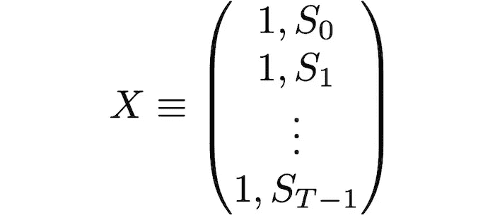

设 *S* _L 为滞后时间序列 *S* 的 *T* 维向量，则以下关系成立:

*   *S* _L 的含义:

*   *S* _L 的方差:

*   *S*d 的意思是:

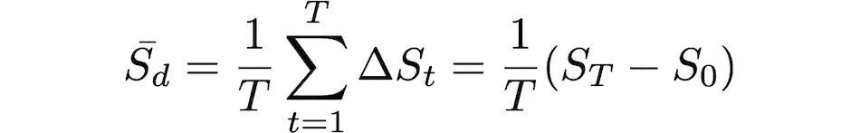

*   *S* _d 的方差:

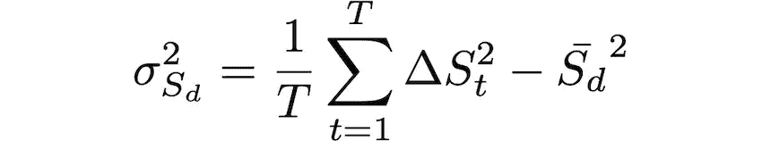

*   *S* _L 和 *S* _d 的协方差:

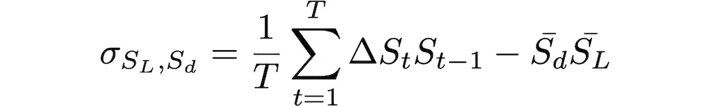

请注意，我们不使用贝塞尔校正，因为由此产生的方程会有更多的项。当有疑问时，就去寻找能产生最佳数学表达式的结果。你可以自己试试，按照下面的步骤使用贝塞尔的方差修正。

矩阵形式的 OLS 估计量为:

其中 T 上标表示矩阵转置。我们有

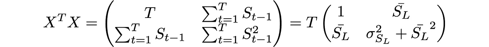

它的反义词:

和

因此，

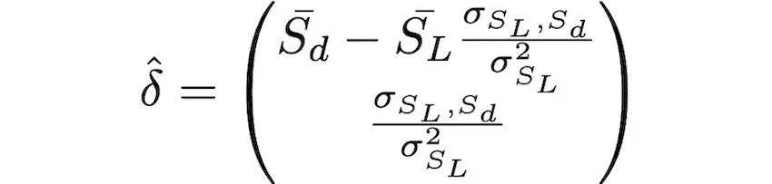

即

其中，ρ是滞后序列和差异序列之间的皮尔逊相关系数，以及

请注意，即使我们对方差使用贝塞尔校正，α和β的结果也将保持不变。

现在我们需要得到β的方差。根据 OLS，我们得到δ的协方差矩阵为:

那么β的方差为:

在哪里

是回归残差的方差。注意，我们在分母中使用了 *T* -2，而不是 *T* ，因为在 OLS，残差只有 *T* -2 个自由度，因为这两个约束成立:

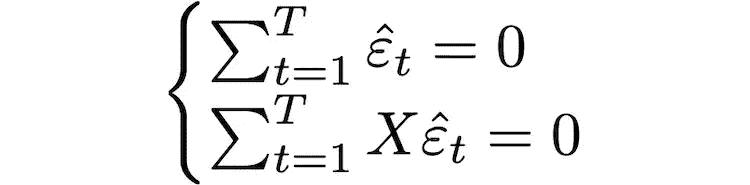

即，通过构造，残差的平均值为零，回归量和残差之间的协方差为零。

然后，展开残差方差的等式，注意时间序列差异的估计为:

我们知道:

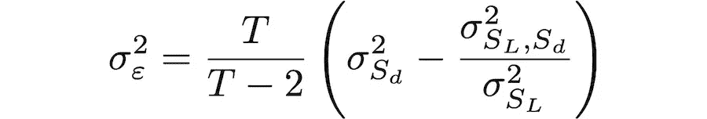

如果我们使用贝塞尔对方差的修正，这个结果会更混乱。

那么我们可以将β的方差表示为

最后，经过我们所有的努力，我们可以写出 Dickey-Fuller 检验统计量的封闭形式:

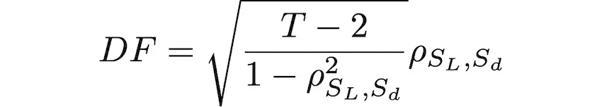

## 封闭形式的表达式结果

Dickey-Fuller 检验统计量的封闭表达式的结果是:

其中 *T* +1 是我们数据的样本量，ρ是滞后时间序列(样本量 *T* )和差分时间序列(样本量 *T* )之间的相关系数。

我们唯一需要计算的是相关系数，这比计算 OLS 更有效。这在优化例程和时间序列的实时分析中变得很方便，因为每一毫秒都很重要。

## 健全性检查

在本节中，我们将把我们的结果与从 Statsmodels (Python)库中获得的结果进行比较。让我们为 Dickey-Fuller 检验统计量定义我们的函数:

我们将使用带有标准正态增量(布朗运动)的 AR(1)单位根过程进行测试:

现在，我们得到我们的直接 Dickey-Fuller 估计和 OLS 方法(Statsmodels)的相对平均误差的估计，即| DF _ stat models—DF _ direct |/| DF _ direct |。这正是下一个函数要完成的。它用随机布朗运动运行“n_tests ”,并返回一个有差异的数组。

运行测试和绘图:

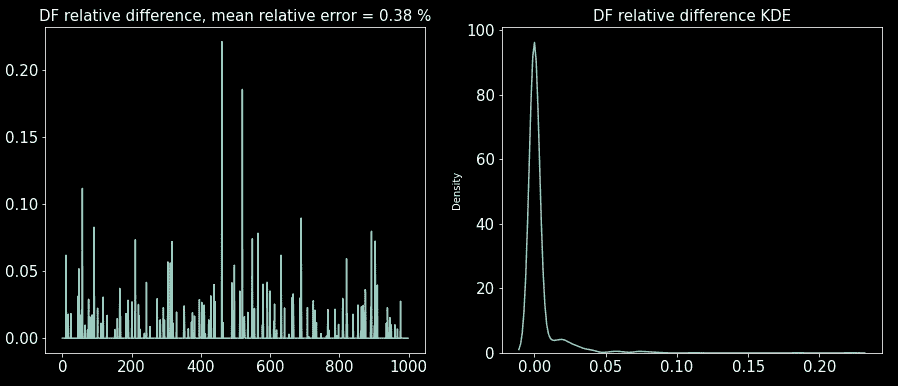

请注意，您的结果会有所不同，因为这个测试是随机的。但对于样本量为 10，000 的时间序列，相对平均误差约为 1%。所以我们的理智检查确实是成功的。然而，在某些试验中，这两种估计方法之间存在微小的差异，这是由于估计方法中的单位根过程引起的数值不稳定性。然而，考虑到计算效率的提高，这是我们可以忍受的。

## 速度测试

现在是最精彩的部分。在本节中，我们将比较 OLS 方法(Statsmodels)和 Dickey-Fuller 检验的直接估计的速度。下面的代码对这两个函数(方法)中的任何一个进行时间测试。

对 100 到 100，000 的样本大小范围进行测试，并绘制:

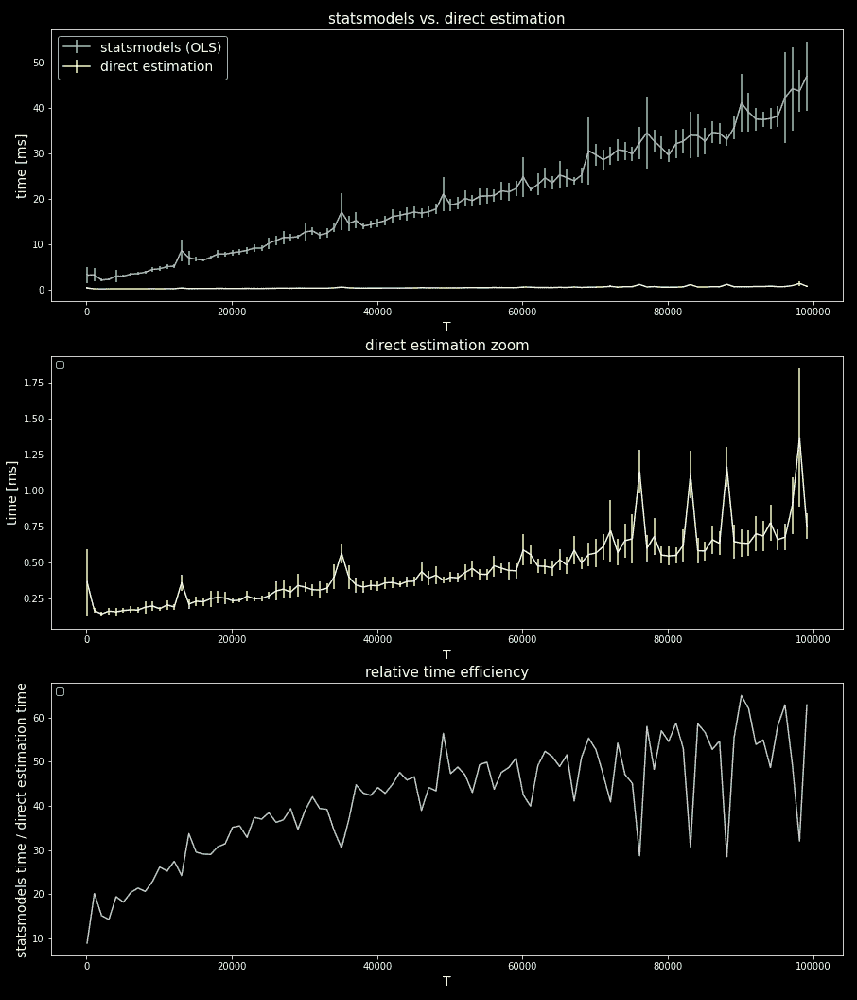

我们可以看到，对于大样本量的时间序列，速度提高了约 50 倍，但即使对于较小的样本量，速度也提高了约 10 倍。所以，的确，做数学得到了回报。

## p 值

在本节中，我们将编写一个类来获取 Dickey-Fuller 测试直接估计的 p 值。没有 p 值的统计工具是不完整的。我们将使用上面描述(和编码)的 AR(1)单位根过程进行蒙特卡罗模拟。

注意，在这个类中，我们使用了前面章节中的“get_DF”函数和“get_unit_root_proc”。

例如，我们使用 DFProbTable 对象来获得 T=500 的 P 值:

## 最后的话

至少可以说，这个故事中的数学有点长，但最终，我们得到了一个值得的结果。这里提出的 Dickey-Fuller 统计量公式不仅有助于优化计算效率，而且有助于以另一种方式理解统计量。

还有一个教训需要吸取:有时作为数据科学家，在没有太多底层数学知识的情况下，使用库和建模一切是非常容易的。然而，深入研究数学是一个好主意，不仅仅是作为学习练习，也是获得新的不同见解的一种方式。一知半解是一件危险的事情。

## 参考

[1] M. L. de Prado，D. Leinweber，[协整和子集相关套期保值方法的进展](http://...) (2012)，《投资策略杂志》，第 1 卷第 2 期，第 67–115 页

[2][https://web . Stanford . edu/~ mrosenfe/SOC _ meth _ proj 3/matrix _ OLS _ NYU _ notes . pdf](https://web.stanford.edu/~mrosenfe/soc_meth_proj3/matrix_OLS_NYU_notes.pdf)

[3][http://web . vu . lt/MIF/a . buteikis/WP-content/uploads/PE _ Book/3-2-ols . html](http://web.vu.lt/mif/a.buteikis/wp-content/uploads/PE_Book/3-2-OLS.html)

我希望这个故事对你有用。如果我错过了什么，请让我知道。如果你想知道更多这样的故事，请关注我。

 [## 每当迭戈·巴尔巴出版时，就收到一封电子邮件。

### 每当迭戈·巴尔巴出版时，就收到一封电子邮件。通过注册，您将创建一个中型帐户，如果您还没有…

medium.com](https://medium.com/subscribe/@diego-barba) 

喜欢这个故事吗？通过我的推荐链接成为媒体会员，可以无限制地访问我的故事和许多其他内容。

 [## 通过我的推荐链接加入 Medium-Diego Barba

### 作为一个媒体会员，你的会员费的一部分会给你阅读的作家，你可以完全接触到每一个故事…

medium.com](https://medium.com/@diego-barba/membership)