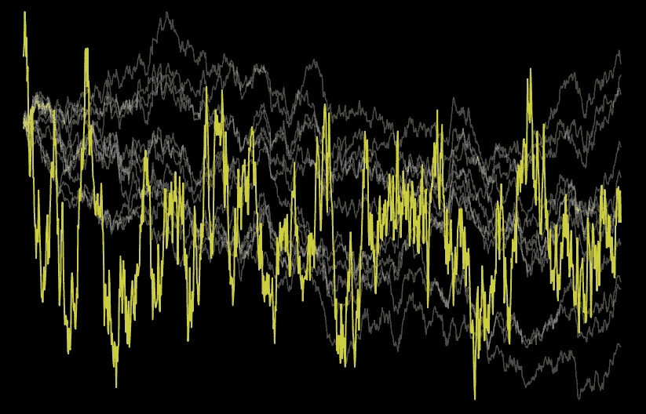
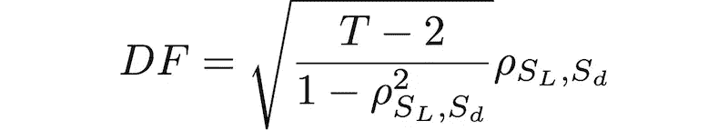
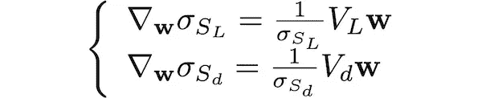
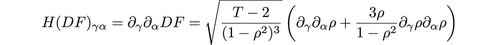
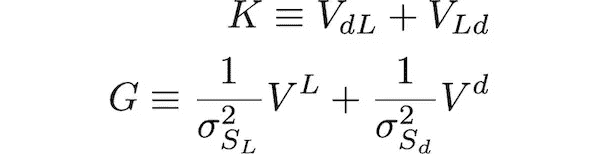
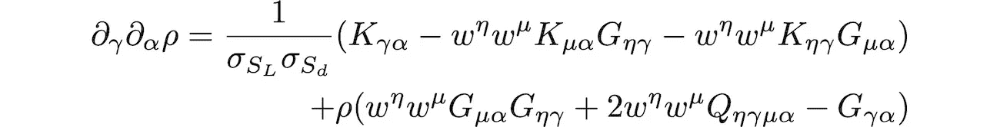
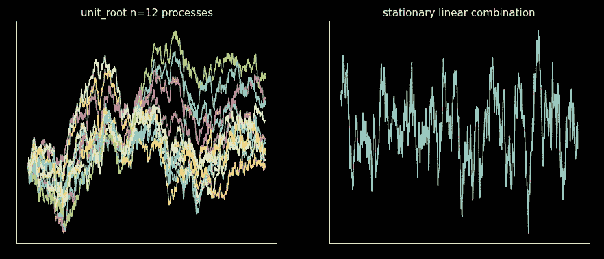

# Dickey-Fuller 优化:正面解决时间序列协整问题

> 原文：<https://towardsdatascience.com/dickey-fuller-optimization-tackle-time-series-cointegration-head-on-f924f7c51477>

## 不要介意演习；直接最小化 Dickey-Fuller 统计量以获得平稳的时间序列。完整的 Python 代码。

图片作者。

有许多方法可以找到协整向量。一些方法利用 OLS，其他矩阵特征分解。不管采用哪种方法，通常都要对结果时间序列进行平稳性测试，以此来进行健全性检查。

工作流程是这样的:

1.  找到协整向量(你选择的方法)
2.  对步骤 1 的向量生成的时间序列进行平稳性测试，并丢弃虚假结果

参加迪基-富勒测试。通常情况下，我们将在步骤 2 中使用的平稳性检验正是 Dickey-Fuller 检验统计量。

如果我们最终检查 Dickey-Fuller 统计量是否足够小，以说明我们的协整方法是否成功，为什么不首先简单地最小化 Dickey-Fuller 统计量？

本文将通过直接最小化 Dickey-Fuller 检验统计量来解决协整问题。通常，在使用普通函数优化作为算法的主要驱动力之前，我会三思而行。当然，我们可以将 Python 中许多可用库中的任何函数扔给优化器，看看会发生什么。我以前做过很多次了。这通常不是一个好主意。

函数优化可能会出错，尤其是在函数相对未知的情况下；其中包括:

*   函数调用可能很昂贵
*   该函数可能有噪声
*   该函数可以是非凸的

即使优化效果很好，也可能会非常慢。

在这个故事中，我们将解决所有这些问题。我们将编写一个在速度上与约翰森方法和 [BTCD](https://medium.com/towards-data-science/canonical-decomposition-a-forgotten-method-for-time-series-cointegration-and-beyond-4d1213396da1) 相当的方法，并且具有相同甚至更高的可靠性。然而，会涉及到一些数学问题，所以要小心。为了成功地优化函数(而不是永远这样)，我们将计算 Dickey-Fuller 检验统计量的梯度和 Hessian 矩阵。

## 故事结构

*   协整，问题设置
*   迪基-富勒统计，直接估计
*   梯度
*   黑森矩阵
*   轻视
*   代码摘要
*   最后的话

如果你想跳过数学，跳过故事的渐变和粗麻布部分。完整的代码将出现在代码摘要部分。

## 协整，问题设置

实际上，协整是指多个时间序列(过程)的一阶整合。也就是说，这些时间序列(另一个时间序列)的线性组合是平稳的。谁不喜欢平稳的时间序列？

数学上，给定 N 个时间序列 *P_i，i=1，2，.., .n，样本大小为**T+1，*我们试图找到一个向量 ***w*** 与分量 *w_i* 这样的线性组合:

是静止的。

给定向量***w***(“w _ vec”)和进程 *P_i* ，编码为矩阵(“p_mat”)，每列一个进程，得到 *S* 非常简单:

## 迪基-富勒统计，直接估计

我们要解决的第一件事是优化函数调用速度。通常，为了计算迪基-富勒检验，我们会做 OLS 回归。那是昂贵的。相反，我们对测试统计数据使用[直接估计:](https://medium.com/towards-data-science/dickey-fuller-direct-estimation-speed-up-to-50x-test-statistic-computation-af3cb28b9803)

其中 *ρ_SL，Sd 是*滞后 *S* 序列( *S_L* )和差分 *S* 序列(S_d)的相关性(Pearson)。注意 *S_L* 和 *S_d* 的样本量都是 *T* 。

如果你想知道更多关于上述结果的细节，请查看我的[之前的故事](https://medium.com/towards-data-science/dickey-fuller-direct-estimation-speed-up-to-50x-test-statistic-computation-af3cb28b9803)和数学证明。

使用这种形式的 Dickey-Fuller 统计更快，因为计算相关系数在计算上比 OLS 矩阵求逆和乘法更有效。此外，它还有另一个优点；统计量对向量 ***w*** 的依赖性是清楚的。因为相关性是:

并且 *S_L* 和 *S_d* 的协方差和方差可以使用协方差矩阵和 ***w*** 向量写成二次型，即

和

其中 *V_L* 为滞后 *P_i* 时间序列的协方差矩阵， *V_d* 为差分 *P_i* 时间序列的协方差矩阵， *V_L，d* 和 *V_d，L* 为滞后差分时间序列的互协方差矩阵，定义为:

具有以下属性:

上标表示矩阵转置。

对谈话进行编码时，我们用计算中需要的基本变量初始化“_SInit”对象:

然后是另一个对象“_ PCovMatrices”，它包含我们需要的协方差矩阵:

最后，滞后和差异 *S* 系列的标准偏差对象:

有了编码的初始对象，我们现在可以陈述我们的目标函数，Dickey-Fuller 统计直接估计:

## 梯度

*DF* (迪基-富勒)相对于 ***w*** 的梯度为:

相关性的梯度是:

使用二次型的梯度，标准差和协方差的梯度为:

和

因此，

编码渐变:

## 黑森矩阵

为了得到 Hessian 矩阵，我们将使用张量微积分，因为我们需要处理矩阵对向量的导数，以及这类有趣的数学，所以张量微积分是最适合的。

我们将使用爱因斯坦的重复指数求和约定；因为我们有许多指数，所以求和符号会使一切变得更加复杂。此外，我们将使用以下简化:

在协方差矩阵中，我们将下标字段用于索引:

索引将用希腊字母书写，以区别于其他下标和上标。

黑森是:

在哪里

是相关的梯度，用向量微积分符号表示

假设梯度是列向量。

我们需要计算ρ的海森数。也就是说，让我们定义我们将使用的两个矩阵:

和一个 4 张量:

那么ρ的梯度(在前面的部分中已经在向量微积分符号中)在张量微积分符号中是:

很难不喜欢张量微积分的优雅。

最后，ρ的黑森式是:

虽然它看起来像广义相对论中坍缩黑洞的方程(开玩笑)，但用 Python 编写这个非常简单，这要感谢 NumPy 的“einsum”:

## 轻视

一旦我们有了目标函数、梯度和 Hessian，最小化代码块就非常简单了。本质上，我们用协整问题的参数来包装 SciPy 的最小化函数:

*   “p_mat”是 *P_i* 过程矩阵。
*   “w_vec_init”是对 w_vec 的初始猜测。不供一个也不用担心；将生成一个随机猜测。
*   “方法”只能取两个值，要么是“信任-克雷洛夫”，要么是“信任-精确”。

注意:这不是一个全局优化器，所以给定一个初始的 ***w*** 向量对于收敛是必不可少的。在某些问题中，随机选取的向量足以收敛。但是，最好是针对您的特定情况生成一个更好的初始猜测。

我们将生成离散采样的相关布朗运动(单位根过程)，并使用该矩阵作为“p_mat”来测试算法。如果你不知道布朗运动或如何产生它们，不要担心；看看我之前关于这个话题的报道。我们将使用那个故事中的代码来生成“p_mat ”,因此将来自[布朗运动故事](/stochastic-processes-simulation-brownian-motion-the-basics-c1d71585d9f9)的代码保存为“brownian_motion.py ”,并将其放在运行以下代码的同一个目录中。

最小化并绘图:

图片作者。

一切都按计划进行。

## 代码摘要

为了完整起见，这里是故事中开发的所有代码。通过最小化 Dickey-Fuller 检验统计量来获得协整向量所需的代码:

## 最后的话

开发的优化算法按预期工作。速度不如特征分解算法，但不相上下。它非常健壮和可靠。

然而，唯一的缺点是协整向量的初始猜测的选择。我已经看到该方法对于初始猜测的错误选择是非常宽容的；大多数时候，随机的初始猜测非常有效。然而，做出好的选择可以提高解决方案的速度和可靠性。记住，这是局部优化器，不是全局优化器。

最后，使用梯度和 hessian，很容易将此代码扩展为约束优化，这更适合于现实世界的问题。可以很容易地将约束添加到该方法中。特征分解方法必须重写以适应约束。

## 参考

[1] M. L. de Prado，D. Leinweber，[协整和子集相关套期保值方法的进展](http://.../) (2012)，《投资策略杂志》，第 1 卷第 2 期，第 67–115 页

我希望这个故事对你有用。在 [Medium](https://medium.com/@diego-barba) 上关注我，如果你想要更多这样的故事，请订阅。

  

如果我错过了什么，请让我知道。对于任何质疑、批评等。，留言评论。

喜欢这个故事吗？通过我的推荐链接成为媒体会员，可以无限制地访问我的故事和许多其他内容。

 