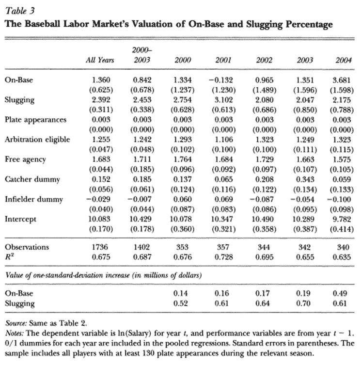
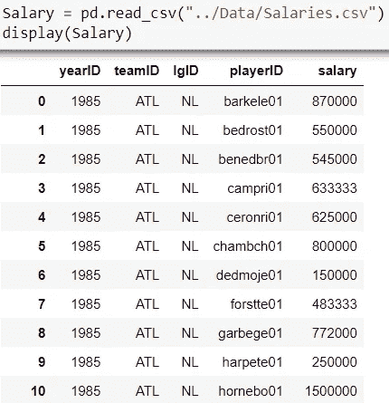
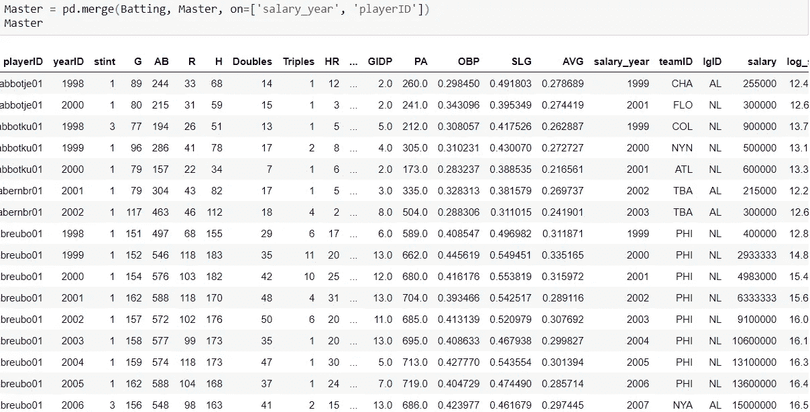
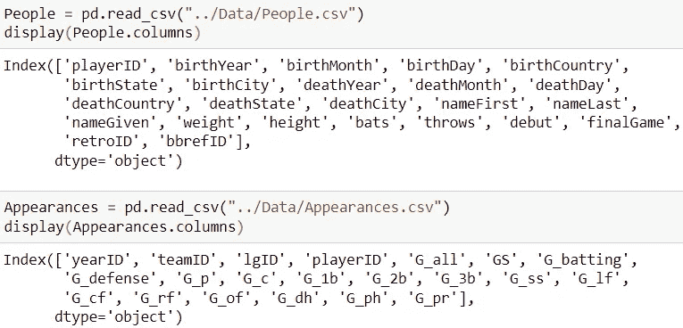
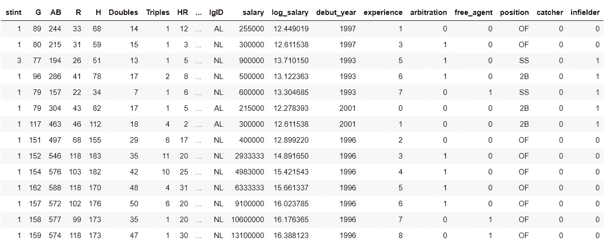
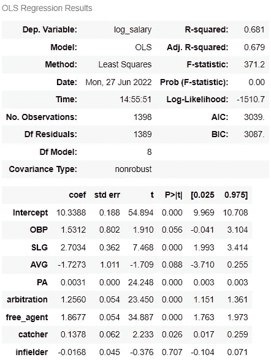
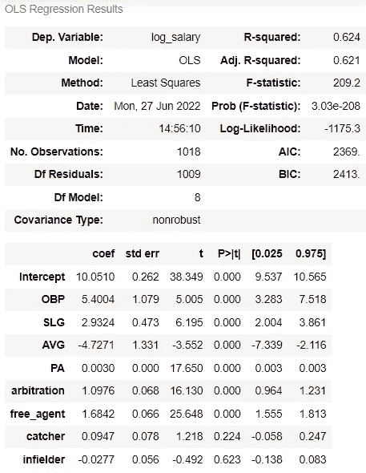
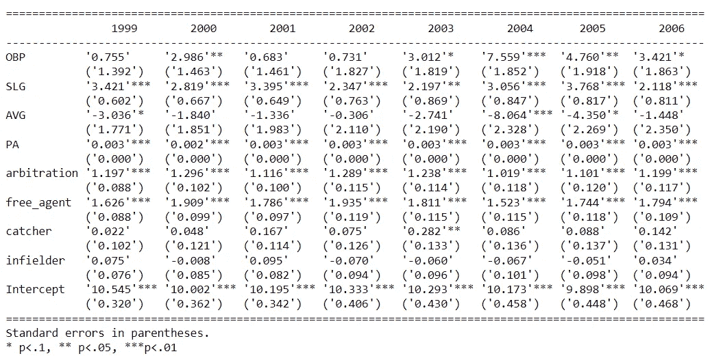

# 金钱跟着球走了吗:分析金钱球前后棒球击球统计的重要性

> 原文：<https://towardsdatascience.com/did-the-money-follow-the-ball-analyzing-the-importance-of-baseball-batting-statistics-pre-144d7d452e1f>

## 在这篇文章中，我们探讨了击球统计数据的重要性，如 OBP，SLG 和 AVG 是如何随着球员工资的变化而变化的


图片由吉米·科诺弗在 [Unsplash](https://unsplash.com/photos/SEQ2VI0KI6A) 上拍摄

# 介绍

在迈克尔·刘易斯*的《金钱球:赢得不公平比赛的艺术》中，*奥克兰运动家队总经理比利·比恩因发现了棒球运动员市场的低效而受到赞誉。这本获奖的书中反复出现的一个故事是关于棒球中的保送。

传统上，棒球教练、球探和评论家主要根据击球手的击球能力，即击球率(SLG)来识别击球天赋。然而，比恩和他的团队，通过各种数据和性能分析技术，意识到画保送的能力是一项被其他棒球组织严重低估的技能。当 Beane 领导下的奥克兰运动家队开始雇佣基于保送能力的球员时，他们踏上了未知的领域，因为这是一项通常被棒球界低估的技能。比利·比恩和他的统计学家能够更准确地识别击球人才，并设法形成一个获胜的团队，尽管资金紧张。

《Moneyball》的出版分散了整个棒球圈的这种明显的低效率，并对球队策略和球员招募产生了广泛的影响。钱球的故事中有一个微妙的经济基础，它与市场的运作有关，两位经济学家 Jahn K. Hakes 和 Raymond D. Sauer 强调了这一点。他们指出，如果畅销故事确实是正确的，那么以下两个论点应该成立:

1.  在 *Moneyball 之前，*保送的能力(由 OBP 的上垒率反映)应该对球队的输赢率有影响，但球员的工资不应受到影响，因为在 *Moneyball 之前，保送被认为是一项被低估的技能。*
2.  有能力获得更多保送(更高的 OBP)的球员应该有更高的薪水，因为在这本书出版后，球队应该改变他们的策略来掩盖他们早期方法中的低效率。

Hakes 和 Sauer 决定看看他们是否真的能证明这个假设。在一篇名为 [*对钱球假说*](https://www.jstor.org/stable/30033672) (2006)的经济评估的研究论文中，他们实际上证明了书中提出的论点确实站得住脚，并得到了数据的支持。

因此，在这篇文章中，我们将着手重现 Hakes 和 Sauer 论文中的*表 3* (附后),两位作者在论文中测试并展示了假设的结果，即我们应该预期观察到工资与 OBP 的强相关，而不是与 SLG 的强相关。他们通过对 OBP、SLG 和他们认为可能影响球员工资的其他因素运行击球手工资的回归模型来实现这一点:本垒板出场次数、仲裁资格和自由代理权，以及击球手是担任捕手还是内野手。除了这些因素，我们还将把击球率纳入我们的回归分析。



作者图片

# 定义

**SLG:** (单打+ 2x 双打+ 3x 三垒+ 4 x 全垒打)/ At bats
**OBP:** (安打+保送+被投球击中)/(At bats +保送+被投球击中+牺牲飞人)
**log(薪水)**= B0+B1 * OBP+B2 * SLG+B3 * PA+B4 * Arb+b5 *自由人+B6 *捕手+B7 *内野手

# 数据

为了在本文中进行分析，我们将使用肖恩·拉赫曼的[棒球数据库](https://www.seanlahman.com/baseball-archive/statistics/)来收集球员的工资和击球数据，并使用数据库中的*人*和*出场*文件为仲裁/自由代理和防守位置创建数据。

## 薪资数据



作者图片

一旦导入了所有需要的包，我们就将薪水数据加载到一个名为 *Salary 的数据框架中。我们有 26，428 行关于每支球队球员个人工资的数据，这些数据从 1985 年持续到 2016 年。*

```
Salary = Salary[Salary['salary'] > 0]
Salary['log_salary'] = np.log(Salary['salary'])
Salary = Salary.rename(columns = {'yearID':'salary_year'})
Master = Salary
```

然后，我们检查薪水栏中缺失的值，以确保在特定赛季没有薪水记录的球员从数据框中删除。接下来，考虑到我们可以支配的工资范围很广，我们将通过取其对数来转换工资变量。这样做是为了确保非常大的工资值不会最终扭曲预测模型。我们还将把 yearID 变量重命名为 salary_year。这将有助于我们稍后的分析，那时我们将在这个专栏上合并不同的数据框架，并且我们将分析球员在特定年份的表现和他们在相应年份的工资。最后，我们将把*薪水*数据帧复制到*主*数据帧中，这将是我们的核心数据帧，我们将在整个分析过程中从这里进行操作。

## 击球数据


作者图片

**注:**拉赫曼数据库中的击球档案涵盖了自 1871 年以来的所有大联盟球员，并且每年更新一次。

在*击球*数据帧中有 102816 行，由每个球员的原始棒球统计信息组成。此外，在一个赛季中转换球队并为不止一个球队打球的球员将为他的第一队获得一个名额以及相应的击球次数，为第二队获得两个名额以及该队的相应统计数据。因此，为了考虑球员在整个赛季中的表现，我们通过按球员和年份分组来汇总各阶段的数据。

```
Batting = Batting.groupby(['playerID','yearID']).sum()
Batting.reset_index(inplace=True)
Batting = Batting[(Batting.yearID >= 1998) & (Batting.yearID <= 2006) & (Batting.AB >= 130)]
```

我们还将我们的数据限制在 1998 年到 2006 年之间，以便充分分析金钱球年前后的年份。此外，我们只包括那些在职业棒球赛中至少有 130 次击球的球员。分数低于这个数字的玩家被认为是新手。

**注:**在拉赫曼击球数据框架中，单打和板的外观没有单独给出，但它们可以定义如下:

**单打:**安打——全垒打——三垒打——双打
**板出场:**击球+保送+投球+安打+牺牲安打+牺牲飞人

```
Batting['PA'] = Batting['AB'] + Batting['BB'] + Batting['HBP'] + Batting['SH'] + Batting['SF']Batting['OBP'] = (Batting['H'] + Batting['BB'] + Batting['HBP'])/(Batting['AB'] + Batting['BB'] + Batting['HBP'] + Batting['SF'])Batting['SLG'] = ((Batting['H'] - Batting['Doubles'] - Batting['Triples'] - Batting['HR']) + 2*Batting['Doubles'] + 3*Batting['Triples'] + 4*Batting['HR'])/Batting['AB']Batting['AVG'] = Batting['H']/Batting['AB']Batting['salary_year'] = Batting['yearID'] + 1
```

为了结束这一小节，我们将使用现有的*击球*数据计算击球出场数(PA)、上垒率(OBP)、击球率(SLG)和击球率(AVG)。我们还创建了一个 salary_year 变量，方法是在 yearID 变量上加 1，以便将今年的薪水与去年的击球统计数据相匹配——逻辑是薪水是基于击球表现的，因此球员的表现应该是可以观察到的。

和以前一样，我们将把我们的*击球*数据帧复制到*主*数据帧中，这是我们正在维护的核心数据集。这里是在击球统计数据被复制后的一瞥。



作者图片

## **球员数据**



继续，我们现在创建另外两个数据帧:*人*和*外表。*我们希望考虑球员在工资谈判方面的地位，通常有三种球员类别:新秀(0-2 年的经验，他们讨价还价的能力有限，他们没有谈判能力)，符合仲裁条件(如果球员有 2-6 年的经验，并且对他们的工资不满意，他们可以向独立仲裁人提出争议，仲裁人将为球员决定公平的工资)， 和自由代理(如果玩家的经验超过 6 年，他们实质上成为自由的，可以向最高出价者出售他们的服务/与最高出价者签订合同)。

```
Debut = People[['playerID','debut']].copy()
Debut['debut_year'] = Debut['debut'].astype(str).str[0:4]
Debut = Debut[['playerID','debut_year']]
```

为了将每个玩家归入这些类别中的一个，我们首先要找出每个玩家的经验。我们可以通过找出每个球员首次亮相的年份，然后计算从那以后的年份来做到这一点。

```
Master = pd.merge(Master, Debut, on=['playerID'], how = 'left')
Master['experience'] = Master['yearID'] - Master['debut_year'].astype(int)
Master['arbitration'] = np.where((Master['experience'] <= 6) & (Master['experience'] >= 3),1,0)
Master['free_agent'] = np.where(Master['experience'] > 6, 1, 0)
```

现在，我们将出道年份变量合并到我们的*主数据框架中，并为三个玩家状态类别中的每一个创建三个二进制变量。*

为回归分析准备数据的最后一步是确定每个球员的防守位置。虽然在棒球中有 8 个守备位置，Hakes 和 Sauer 使用了两个类别:接球手和内野手被他们定义为二垒、三垒或短停，默认类别被给予剩余的守备位置。出场的防守位置如下:

(G_c):接球手
(G_1b):一垒
(G_2b):二垒
(G_3b):三垒
(G_ss):短停
(G_of):外场手
(G_dh):指定击球手

```
def Position(df):
    if (df['max_games'] == df['G_c']): return "C"
    elif (df['max_games'] == df['G_1b']): return "1B"
    elif (df['max_games'] == df['G_2b']): return "2B"
    elif (df['max_games'] == df['G_3b']): return "3B"
    elif (df['max_games'] == df['G_ss']): return "SS"
    elif (df['max_games'] == df['G_of']): return "OF"
    elif (df['max_games'] == df['G_dh']): return "DH"Appearances = Appearances.groupby(['playerID','yearID'])['G_c','G_1b','G_2b','G_3b','G_ss','G_of','G_dh'].sum()                                       
Appearances.reset_index(inplace=True)
Appearances['max_games'] = Appearances[["G_c","G_1b","G_2b","G_3b","G_ss","G_of","G_dh"]].max(axis=1)
Appearances['position'] = Appearances.apply(Position, axis = 1)
```

再说一次，我们必须注意限制，因为一个球员可能在一个赛季中为不止一个球队效力，因此，他在两个球队的上场次数都需要考虑。因此，我们通过对球员和年份 id 进行分组来计算每个位置的总和。

这里要注意的另一件重要的事情是，虽然大多数球员主要在一个位置上比赛，但也有一些球员在一个赛季中在不止一个位置上比赛。因此，为了“定义”一个特定球员的防守位置，我们将假设该球员在整个赛季中的位置是他参加比赛次数最多的位置。因此，我们需要将*出场*中的数据转换成 Hakes 和 Sauer 在他们的研究论文中使用的格式。

```
Appearances = Appearances[Appearances['max_games'] > 0] 
Appearances = Appearances[['playerID','yearID','position']]
Appearances['catcher'] = np.where(Appearances['position'] == "C", 1, 0)
Appearances['infielder'] = np.where((Appearances['position'] == "2B") | (Appearances['position'] == "3B") | (Appearances['position'] == "SS"), 1, 0)Master = pd.merge(Master, Appearances, on=['playerID','yearID'], how = 'left')
```

最后，我们将排除非位置球员，只保留必要的变量用于演示。我们还将为我们的数据帧定义捕手和内野手虚拟变量，使用与 Hakes 和 Sauer 在将其合并到*主*数据帧之前使用的相同定义，现在看起来是这样的:



作者图片

# 回归分析

在将我们所掌握的数据组织成一个统一的数据框架后，我们现在能够像 Hakes 和 Sauer 在他们的研究论文中所做的那样定义和运行我们的回归模型。如上所述，我们将使用以下公式作为回归方程:

**日志(工资)**= B0+B1 * OBP+B2 * SLG+B3 * PA+B4 * Arb+b5 *自由人+B6 *捕手+B7 *内场手

首先，我们将把我们的*主*数据帧分成数据集: *MB_Data_1* 和 *MB_Data_2。前者包括《Moneyball》出版前(2000-2003 年)的季节性数据，后者涵盖该书出版后的三年(2004-2006 年)。*

```
MB_Data_1 = Master[(Master.salary_year >= 2000) & (Master.salary_year <= 2003)]
reg1 = smf.ols(formula = 'log_salary ~ OBP + SLG + AVG + PA + arbitration + free_agent + catcher + infielder', data=MB_Data_1).fit()
reg1.summary()
```



作者图片

如果我们现在将回归模型返回的系数与 Hakes 和 Sauer 论文的*表 3* 中给出的系数进行比较，我们可以观察到，总的来说，这些系数非常相似。即使是标准误，表 3*括号中的数字*也和我们回归模型返回的数字差不多。根据 R 平方值，69.1%的对数工资方差由自变量解释。我们还可以看到，在《金钱球》出版之前的几年里，OBP 和 AVG 在统计上并不显著。

```
MB_Data_2 = Master[(Master.salary_year >= 2004) & (Master.salary_year <= 2006)]
reg2 = smf.ols(formula = 'log_salary ~ OBP + SLG + AVG + PA + arbitration + free_agent + catcher + infielder', data=MB_Data_2).fit()
reg2.summary()
```



作者图片

在《Moneyball》出版后的三年里，观察回归模型的结果，第一个值得注意的事情是，OBP 和 AVG 现在在统计上是显著的。不仅如此，OBP 系数已经飙升至 5.4004，几乎是 SLG 系数的两倍。这反过来表明，在后金钱球时代(2004 年至 2006 年)，OBP 在决定球员薪酬方面变得更加重要了约 45%。

SLG 在 Moneyball 之前和之后仍然具有统计意义，但它没有 OBP 在 2004 年之后那么重要。另一件要注意的事情是，在这本书出版之前和之后，这两个守备位置在决定球员工资方面都没有统计学意义。最后，有趣的是，在后金钱球时代，球队并不看重平均击球率来决定球员的薪水，这似乎与传统的平均击球率观点相反。

```
MB_Data_2000 = Master[(Master.salary_year == 2000)]
MB_Data_2001 = Master[(Master.salary_year == 2001)]
MB_Data_2002 = Master[(Master.salary_year == 2002)]
MB_Data_2003 = Master[(Master.salary_year == 2003)]
MB_Data_2004 = Master[(Master.salary_year == 2004)]
MB_Data_2005 = Master[(Master.salary_year == 2005)]
MB_Data_2006 = Master[(Master.salary_year == 2006)]reg_2000 = smf.ols(formula = 'log_salary ~ OBP + SLG + AVG + PA + arbitration + free_agent + catcher + infielder', data=MB_Data_2000).fit()
reg_2001 = smf.ols(formula = 'log_salary ~ OBP + SLG + AVG + PA + arbitration + free_agent + catcher + infielder', data=MB_Data_2001).fit()
reg_2002 = smf.ols(formula = 'log_salary ~ OBP + SLG + AVG + PA + arbitration + free_agent + catcher + infielder', data=MB_Data_2002).fit()
reg_2003 = smf.ols(formula = 'log_salary ~ OBP + SLG + AVG + PA + arbitration + free_agent + catcher + infielder', data=MB_Data_2003).fit()
reg_2004 = smf.ols(formula = 'log_salary ~ OBP + SLG + AVG + PA + arbitration + free_agent + catcher + infielder', data=MB_Data_2004).fit()
reg_2005 = smf.ols(formula = 'log_salary ~ OBP + SLG + AVG + PA + arbitration + free_agent + catcher + infielder', data=MB_Data_2005).fit()
reg_2006 = smf.ols(formula = 'log_salary ~ OBP + SLG + AVG + PA + arbitration + free_agent + catcher + infielder', data=MB_Data_2006).fit()Header = ['2000','2001','2002','2003','2004','2005','2006']
Table_3 = summary_col([reg_2000,reg_2001,reg_2002,reg_2003,reg_2004,reg_2005,reg_2006,],regressor_order =['OBP','SLG','AVG','PA','arbitration','free_agent','catcher','infielder'],stars=True,float_format="'%.3f'",model_names = Header)
print(Table_3)
```

我们可以格式化和呈现我们的回归结果的另一种方式是如何在*表 3* 中完成的。为此，我们需要有一个每年(2000-2006)的回归模型。使用 statsmodels 的 summary_col 功能，我们能够说明每个季节中每个变量的系数和标准误差。因此，下面所附的表格实质上是我们对 Hakes 和 Sauer *表 3 的复制。*



作者图片

因此，我们能够重申 Moneyball 故事中的关键叙述，并得到 Hakes 和 Sauer 出版物的证实:在 Moneyball 之前的时期(2000-2003 年)，slugging 百分比对工资的影响几乎是 on-base 百分比的两倍，而后者在那个时期是微不足道的。然而，在 Moneyball 之后(2004-2006)，上垒率不仅在统计上变得显著，而且在决定球员工资方面，它几乎是击球率的两倍重要，这是比利·比恩和他的统计学家支持的观点。

# 关于这个话题的更多信息

[体育分析中的毕达哥拉斯期望，以及不同体育项目的例子](/pythagorean-expectation-in-sports-analytics-with-examples-from-different-sports-f5e599530a6c)

[英超(EPL)毕达哥拉斯预测者](https://medium.com/mlearning-ai/english-premier-league-epl-pythagorean-predictor-4e809e105e25)

# **参考文献**

1.  [由 *Jahn K. Hakes 和 Raymond D. Sauer* 对钱球假说](https://www.jstor.org/stable/30033672)的经济评估
2.  [金钱球和超越](https://www.coursera.org/learn/moneyball-and-beyond?specialization=sports-analytics)由*密歇根大学*
3.  [肖恩·拉赫曼的数据库许可证](https://www.seanlahman.com/baseball-archive/statistics/)