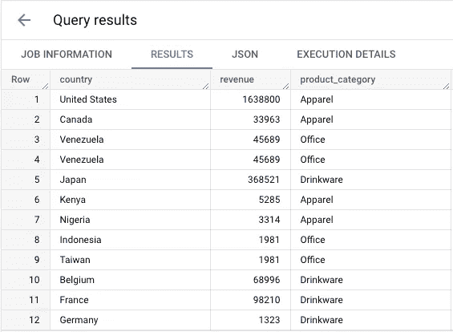
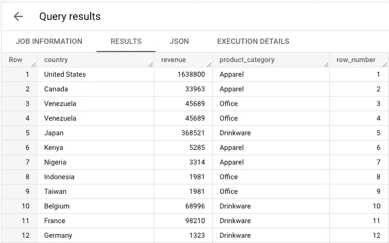
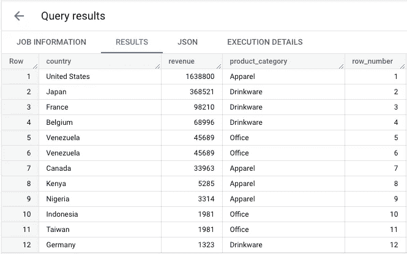
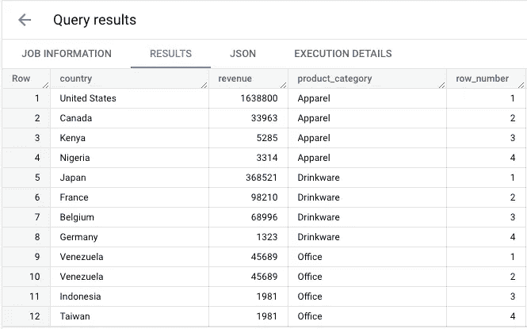
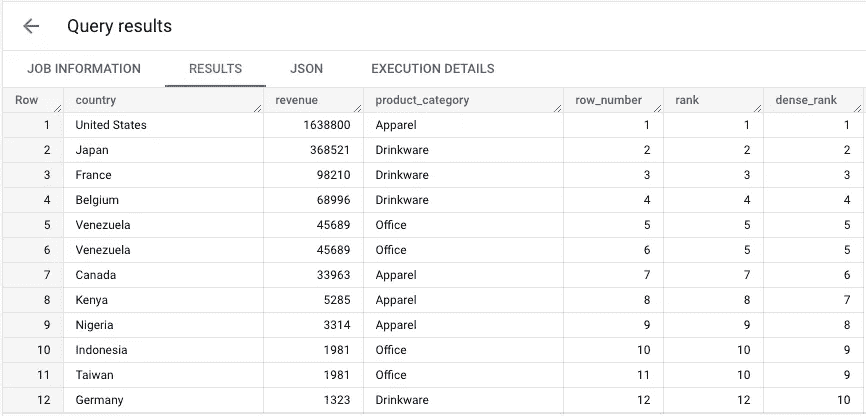
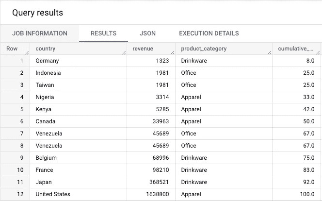
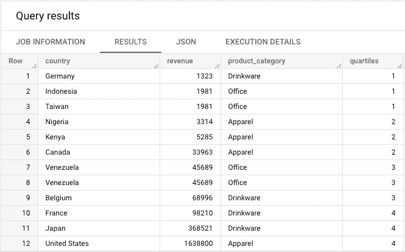
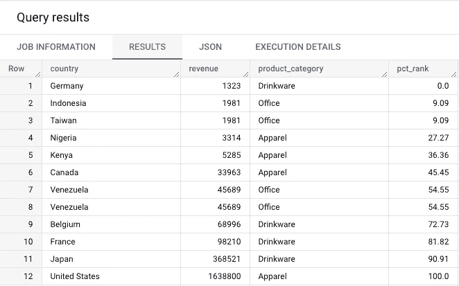

# 使用 SQL 的 BigQuery 中编号函数之间的差异

> 原文：<https://towardsdatascience.com/differences-between-numbering-functions-in-bigquery-using-sql-658fb7c9af65>

## 了解如何使用等级、密集等级、行号、累积分布、百分位数等级、四分位数、百分位数等等

澳大利亚摄影师[在](https://unsplash.com/@austris_a?utm_source=medium&utm_medium=referral) [Unsplash](https://unsplash.com?utm_source=medium&utm_medium=referral) 上拍摄的照片

# 什么是编号功能？

编号功能为表中的每条记录分配一个数字(或小数)。它们主要用于对数据进行排序或分配序号，以便进一步处理(重复数据删除、过滤、分组)。

它们通常需要按特定维度排序(日期、收入、薪水、ID 等)。

它们可用于回答以下问题:

*   **收入最高的国家有哪些？**
*   **我如何按赛区和工资给排球运动员排名？**
*   **按产品类别划分，表现最佳的国家有哪些？**
*   **根据摄取日期复制了哪些行？**

本文将分为**两节。**第一部分将介绍`RANK()`、`DENSE_RANK()`和`ROW_NUMBER()`的机制，因为它们的目的非常相似，但输出和机制略有不同。

第二部分将涵盖`PERCENT_RANK`、`CUME_DIST`和`NTILE`，它们具有不同的目的、机制和输出。

我还建议阅读伟大的谷歌文档。

  

为了更好地理解这些函数之间的区别，我们将查询以下数据集，该数据集包含来自[谷歌商品商店](https://shop.googlemerchandisestore.com/)的不同国家和产品类别的销售额。

我们简单分析用例的基础表。(图片由[作者](https://medium.com/@romaingranger)提供)

## 行数

函数`ROW_NUMBER()`将总是返回一个唯一的数字，从 1 开始按顺序递增(1，2，3，4…，8，9…)。不需要指定顺序，即使行或值相似，输出编号也总是唯一的。

如果没有使用`ORDER BY`子句，结果将是**不确定的**，这意味着即使输入数据相同，结果也会不同。

让我们看两个例子:

ROW_NUMBER()返回一个连续且唯一的数字。(图片由[作者](https://medium.com/@romaingranger)提供)

在本例中，我们使用一个空的`OVER()`子句，这意味着函数将遍历表并为每一行随机分配一个数字(即使 BigQuery 如何分配它可能有一些逻辑)。

让我们看看在我们的第二个例子中，当我们向 revenue 字段添加一个`ORDER BY`子句时会发生什么。

ROW_NUMBER()返回一个按收入排序的连续且唯一的数字。(图片由[作者](https://medium.com/@romaingranger)提供)

行号现在按收入排序，我们希望结果按降序排列，这就是为什么我们添加了一个`DESC`命令(默认情况下，它是升序)。

对于具有相同值、`Indonesia`和`Taiwan`的**两行，功能输出数保持递增。**

隐含地，还有一个字母顺序，这可以通过手动添加另一个排序参数来改变。

> `ROW_NUMBER() OVER(ORDER BY revenue DESC, country DESC)`

假设我们想要分解每个产品类别的**行号。为此，我们可以使用一个`PARTITION BY`子句，并按收入值降序排序。**

ROW_NUMBER()为每个分区返回一个从 1 开始的连续且唯一的数字。(图片由[作者](https://medium.com/@romaingranger)提供)

这对于在数据集中可用的不同组或类别中排列/分配顺序非常有益。

## 秩和稠密 _ 秩

函数`RANK()`和`DENSE_RANK()`的行为与`ROW_NUMBER()`相同，但有两个例外:它们如何**序列号**以及它们如何**管理相似的值**。

对于`RANK()`，相似的行将获得相同的等级号，但是函数将在两个或更多相同的行之后留下一个间隙。

对于`DENSE_RANK()`，相似的行将接收相同的等级编号，但是等级编号总是递增 1，并且在我们的编号序列中不会有间隔。

让我们举例说明**一个查询中的三个功能**:

这三个功能按收入排序。(图片由[作者](https://medium.com/@romaingranger)提供)

这是我们不同函数的输出。您可以关注国家/地区`Venezuela`(重复)的第 5 行和第 6 行上的函数如何工作，以及之后:

*   `ROW_ NUMBER()`保持其递增顺序(1，2，3， **4，5，6，7**
*   `RANK()`给出相同的输出值(5，5)，但随后丢失其增量序列(1，2，3， **4，5，5，7** )
*   `DENSE_RANK()`给出相同的输出值(5，5)，但保持其递增顺序(1，2，3， **4，5，5，6**

第 10 行和第 11 行的机制相同，因为我们是按收入排序的，它们的收入相同。这种增量序列机制对于任意数量的对等值都是一样的。

**为什么不用 ROW_NUMBER 代替 RANK 或者 DENSE_RANK？**

您可以使用`ROW_NUMBER()`作为排名函数，但是有时为所有相似/对等行保持相同的排名值是很有趣的。

对于某些用例，用`DENSE_RANK()`保持数字序列总是递增 1 可能是一个好的选择。

## **CUME_DIST**

函数`CUME_DIST()`计算数据集或分区内值的累积分布。它返回从 0 到 1 的值(> 0 且≤1)。

这个函数需要一个`ORDER BY`子句来对值进行排序。

根据 Google 的文档，它是使用公式计算的: **NP/NR。我们可以这样来解释它:**

*   `NP`位于当前行之前或与当前行相似的行数
*   `NR`是(整个数据集或一个分区的)总行数

它将向您展示数据集中的值是如何分布的。例如，基于收入的数据集行分布:

按收入排序的所有行的累积分布。(图片由[作者](https://medium.com/@romaingranger)提供)

我们使用`ROUND()`函数和乘法`*100`将数据转换成可读性更好的百分比格式。

让我们手动计算。对于我们的第一行，只有 1 个值，并且没有低于 **1323 的收入。**这给了我们 **1/12 = 8%** (我们的数据集中有 12 行)。

现在，让我们看看第 4 行，`Nigeria`，有 3 行的值在当前行的 **3314 +** 下。这给了我们 **4/12 = 33%** 。

有趣的部分是针对**第 2 排和第 3 排**(或第 7 排和第 8 排)。它们具有相同的收入值。因此，如果我们查看第 2 行，我们可以预期计算结果为 **2/12 = 16%。**但是，由于第 3 行是相似的，所以两行的结果都是 **3/12 = 25%。**

## 恩蒂莱

`NTILE()`函数允许您将一组已排序的数据点分成均匀分布的桶。你可能知道这就是**分位数**，它可以有不同的类型:

*   **四分位数** (4 个分位数)
*   **十分位数** (10 个分位数)
*   **百分位数** (100 个分位数)

例如， **quartiles** 将数据集分成四个大小相等的桶。这意味着第一个四分位数(Q1)包含 25%的数据点。

让我们将四分位数应用到我们的表中:

我们的行根据收入分成 4 个大小相等的桶。(图片由作者提供)

在这种情况下，我们根据有序收入将我们的数据点分成四个相等的桶(每个桶有 3 行，即 **3/12 = 25%** )。

请记住**这不是总数的百分比。**如果我们将第四个四分位数国家(法国、日本和美国)的收入相加，它确实占总收入的 90%。

使用此功能时，您必须提供一个输入号码，例如:`NTILE(4)`。你不能让这个参数为空，给一个 0 或负值的输入数而没有看到一个错误。

您可以使用这种方法**在您的数据中找到离群值**(高于 95%百分点的数据点)**根据他们的购买价值(前 25%)对您的客户**进行分类，等等。

## 百分比排名

函数`PERCENT_RANK()`计算一组值中值的百分比分布。它返回从 0 到 1 的值。

这个函数需要一个`ORDER BY`子句来对值进行排序。

所有行按收入排序的百分位数排名(图片由[作者](https://medium.com/@romaingranger)提供)

同样，我们使用`ROUND()`函数和乘法`*100`将数据转换成可读性更好的百分比格式。

看产出，`Germany`收入最低(不大于其他任何国家)，所以**百分位排名为零。**

另一方面，`United States`拥有所有国家中最大的收入(大于任何其他国家)，因此**百分位等级为 1(或 100%)。**

对于`France`，百分位数排名为 82%。这意味着它的收入高于所有其他国家的 82%。

# 结论和想法

从实际经验来看，最常用的功能有`ROW_NUMBER()`、`RANK()`、`DENSE_RANK()`和`NTILE()`。

例如，我的一项任务需要使用`DENSE_RANK()`来识别**收购产品**，基本上是对客户订单中的产品进行排序，以识别哪些是最先购买的产品。这个函数允许我们将序列递增 1，在一个订单中处理多个产品，并且仍然能够计算客户订单总数的正确数量。

在另一项任务中，`NTILE()`帮助**将客户**分类为近期和频繁购买者类别(如 **RFM 模型**(近期、频率、货币))，这将用于在我们的电子邮件服务提供商系统中进行细分。

您可以在其他数据库系统(Amazon Redshift、MySQL、Postgres、Snowflake 等)中找到这些函数，因为它们是流行的 SQL windows 函数(至少对于排名和行号)。

## 引用和数据集

本文中使用的数据集来自于 [BigQuery 公共数据](https://cloud.google.com/bigquery/public-data)，是在 [CC BY 4.0](https://creativecommons.org/licenses/by/4.0/) 许可下的 Google analytics 数据样本。

 