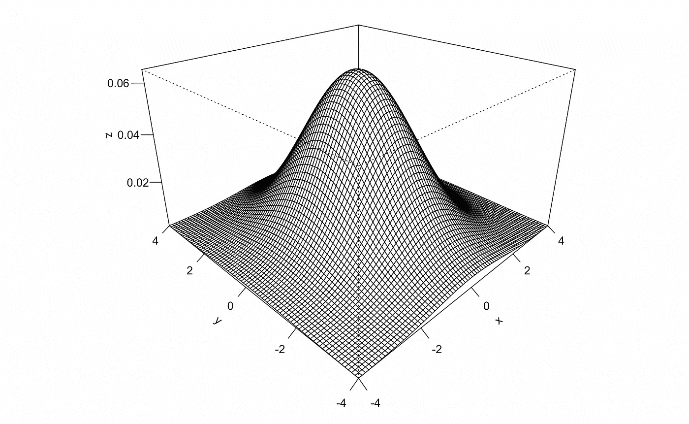
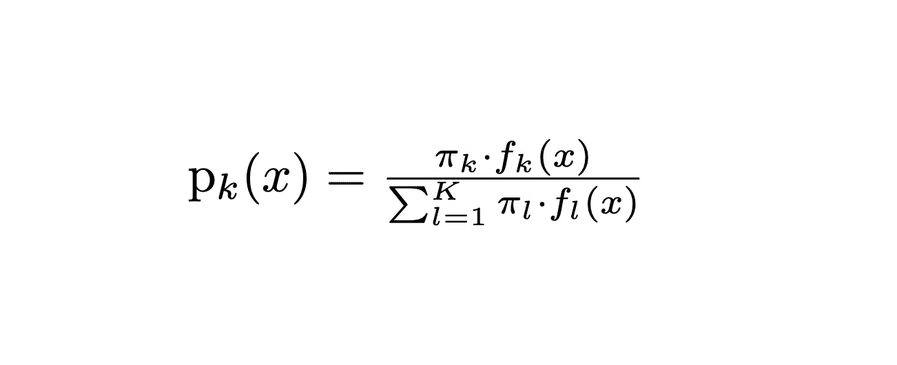
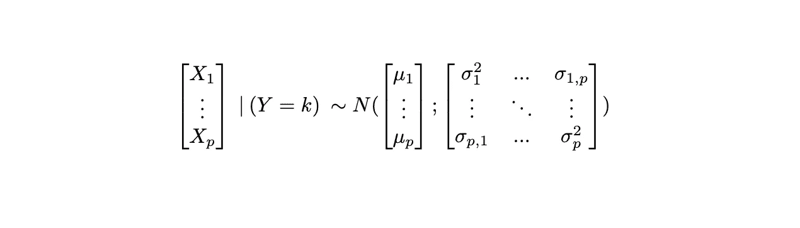
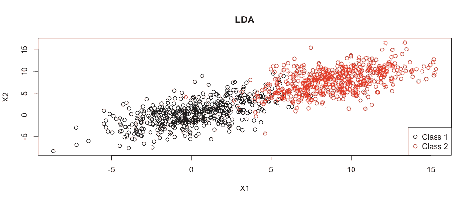
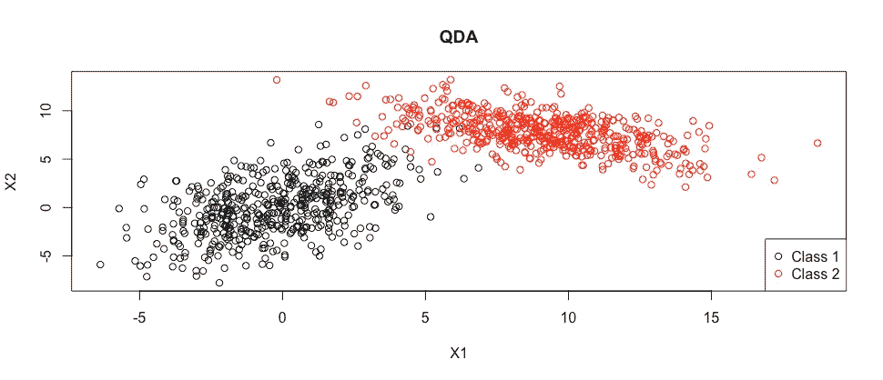
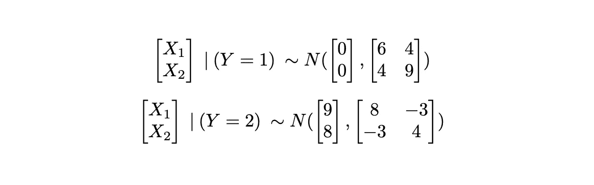
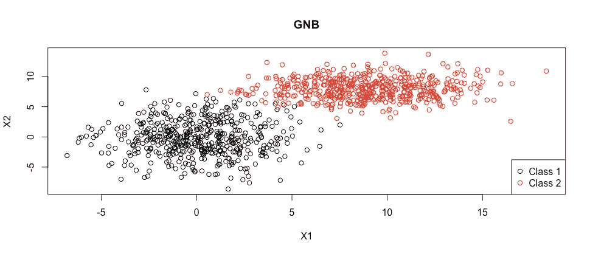
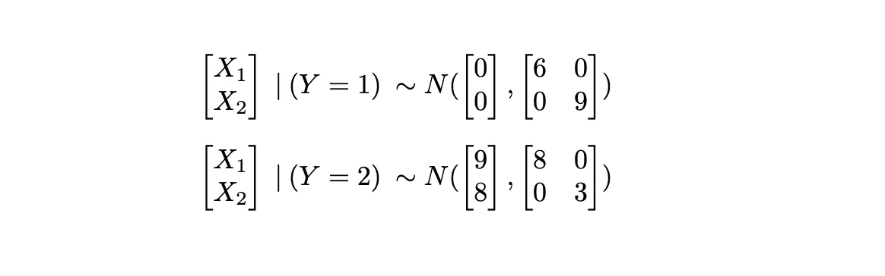
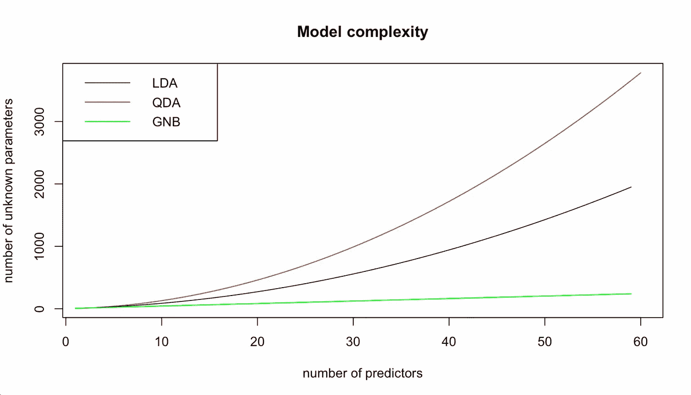

# LDA、QDA 和高斯朴素贝叶斯分类器的区别

> 原文：<https://towardsdatascience.com/differences-of-lda-qda-and-gaussian-naive-bayes-classifiers-eaa4d1e999f6>

## *深入研究建模假设及其含义*

在挖掘经典分类方法的细节时，我发现了关于高斯朴素贝叶斯(GNB)、线性判别分析(LDA)和二次判别分析(QDA)的异同的稀疏信息。这篇文章集中了我为下一个学习者找到的信息。

总结:所有这三种方法都是贝叶斯分类器的一个具体实例，它们都处理连续高斯预测器，它们在预测器之间和类之间关系的假设上有所不同(即，它们指定协方差矩阵的方式)。

## 贝叶斯分类器

我们有一组 X 个 ***p 个*** 预测值，以及一个离散响应变量 Y(类)，取值 k = {1，…，K}，用于样本的 ***n 个*** 观察值。

我们遇到了一个新的观察值，我们知道预测值 X 的值，但不知道 Y 类的值，所以我们想根据我们拥有的信息(我们的样本)对 Y 进行猜测。

贝叶斯分类器将测试观测值分配给具有最高条件概率的类，由下式给出:

贝叶斯定理

其中:pi_k 是先验估计，f_k (x)是我们的似然。为了获得类 k 的概率，我们需要定义先验和似然的公式。

**先验。**观察到类别 k 的概率，即我们的测试观察值属于类别 k，但没有关于预测值的进一步信息。查看我们的示例，我们可以将类 k 中的情况视为具有二项式分布的随机变量的实现:

在一组试验次数 n(样本量)中成功次数(k 类中的观察值)的分布。

其中，对于*n 次试验，在每次试验中，观察值属于(成功)或不属于(失败)类别 k。可以看出，相对成功频率——试验总数中的成功次数— 是 pi_k 的无偏估计量。因此，我们使用相对频率作为观察值属于类别 k 的概率的先验。*

***可能性:**可能性是看到 X 的这些值的概率，假设观测值实际上属于类别 k。因此，我们需要找到类别 k 中预测值 X 的分布。我们不知道“真实”的分布是什么，所以我们无法“找到”它，我们宁愿对它的样子做一些合理的假设，然后使用我们的样本来估计它的参数。*

*如何选择合理的配送？离散的和连续的预测值之间有一个明显的区别。这三种方法都假设在每个类中，*

> *预测值具有高斯分布(p=1)或多元高斯分布(p>1)。*

**

*k 类条件下多元高斯分布的一般形式。*

*因此，只有当我们有连续的预测器时，才能使用这些算法。事实上，高斯朴素贝叶斯是一般朴素贝叶斯的一个特例，具有高斯似然性，这就是为什么我在这篇文章中将它与 LDA 和 QDA 进行比较。*

*从现在开始，我们将考虑能够展示三种方法之间差异的最简单的情况:两个预测器(p=2)和两个类(K=2)。*

## *线性判别分析*

> *LDA 假设跨类的协方差矩阵是相同的。*

*这意味着类别 1 和类别 2 中的预测值可能具有不同的均值，但是它们的方差和协方差是相同的。这意味着预测值之间的“分布”和关系在各个类别中是相同的。*

**

*基于 LDA 假设的类别分布可视化*

*上面的图是从每种形式的分布中生成的:*

**

*LDA 第 1 类和第 2 类预测因子的分布*

*我们观察到协方差矩阵是相同的。如果我们预期预测值之间的关系在不同类别之间不会发生变化，并且如果我们只是观察到分布均值的变化，那么这种假设是合理的。*

## *二次判别分析*

*如果我们放松 LDA 的恒定协方差矩阵假设，我们有 QDA。*

> *QDA 没有假设跨类的协方差矩阵不变。*

**

*基于 QDA 假设的类别分布可视化*

*上面的图是从每种形式的分布中生成的:*

**

*QDA 第一类和第二类预测因子的分布*

*我们观察到这两个分布的所有参数都可以变化。如果我们预期不同类别的预测者之间的行为和关系非常不同，这是一个合理的假设。*

*在这个例子中，甚至两个预测值之间的关系的方向也从类别 1 到类别 2 变化，从正协方差 4 到负协方差-3。*

## *高斯朴素贝叶斯*

*GNB 是朴素贝叶斯的一个特例，其中预测值是连续的，并且正态分布在每个 k 类中。一般的朴素贝叶斯(因此，GNB 也是)假设:*

> *给定 Y，预测因子 X 是条件独立的。*

*独立意味着不相关，即协方差等于零。*

**

*基于 GNB 假设的类别分布可视化*

*上面的图是从每种形式的分布中生成的:*

**

*GNB 第一类和第二类预测因子的分布*

*使用朴素贝叶斯，我们假设预测值之间没有关系。在实际问题中很少出现这种情况，然而，正如我们将在下一节中看到的那样，这大大简化了问题。*

## *假设的含义*

*选择模型后，我们估计类内分布的参数，以确定我们的测试观察的可能性，并获得我们用来分类它的最终条件概率。*

*不同的模型导致不同数量的参数被估计。提醒:我们有 ***p*** 预测器和 ***K*** 总类。对于所有的模型，我们需要估计预测值的高斯分布的平均值，这在每一类中都是不同的。这就产生了一个基数，***p*******K***为所有方法估计的参数。*

*此外，如果我们选择 LDA，我们将估计所有 p 个预测值的方差和每对预测值的协方差，从而得出*

**

*用 LDA 估计的参数数量*

*参数。这些是跨类的常数。*

*对于 QDA，由于它们在每一类中都不同，我们将 LDA 的参数数量乘以 K，得到下面的估计参数数量的等式:*

**

*与 QDA 一起估计的参数数量*

*对于 GNB，我们只有每一类中所有预测因子的方差: **p*K** 。*

*很容易看出对于 p 和/或 K 的大值使用 GNB 的优势。对于经常出现的二进制分类问题，即当 K=2 时，这是三种算法的模型复杂度如何随着 p 的增加而发展。*

**

## *那又怎样？*

*从建模的角度来看，当应用一种方法时，知道你正在处理的假设是很重要的。需要估计的参数越多，最终分类对样本变化越敏感。同时，如果参数的数量太少，我们将无法捕捉到类之间的重要差异。*

*谢谢你的时间，我希望它是有趣的。*

**除特别注明外，所有图片均为作者所有。**

*来源:*

*   *机器学习第三章——汤姆·m·米切尔，2017*
*   *《统计学习导论》第 4 章—James，Witten，Hastie，Tibshirani，2013*