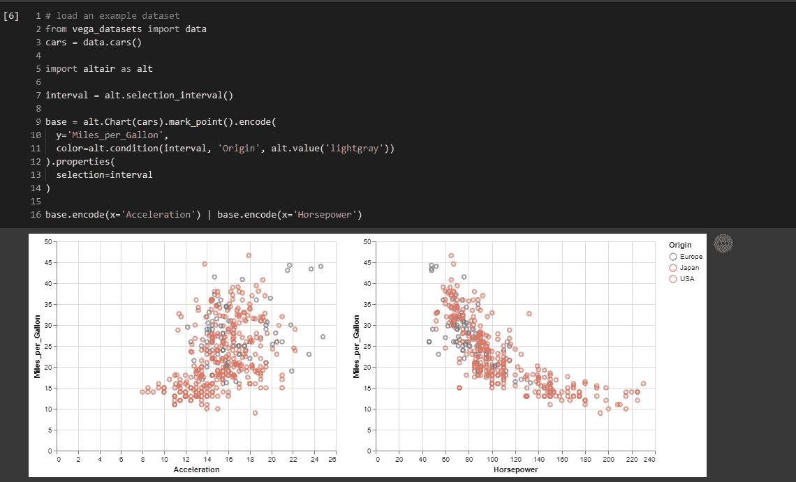
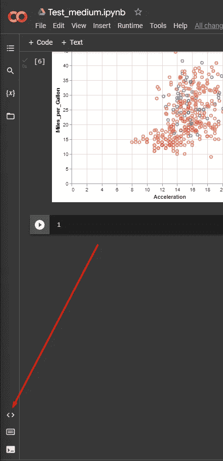
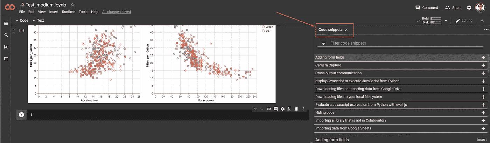
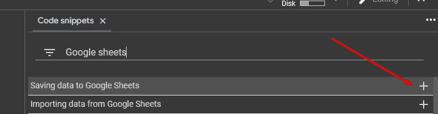
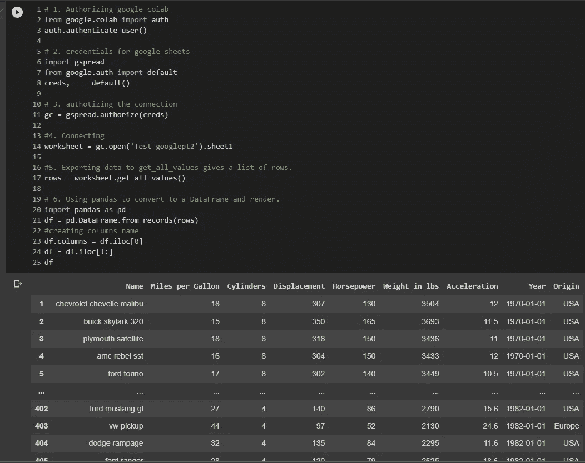
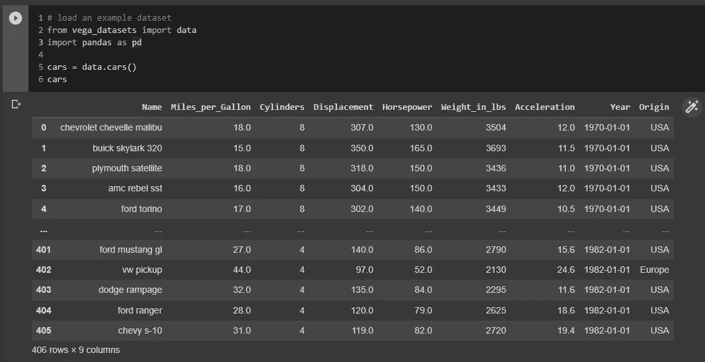
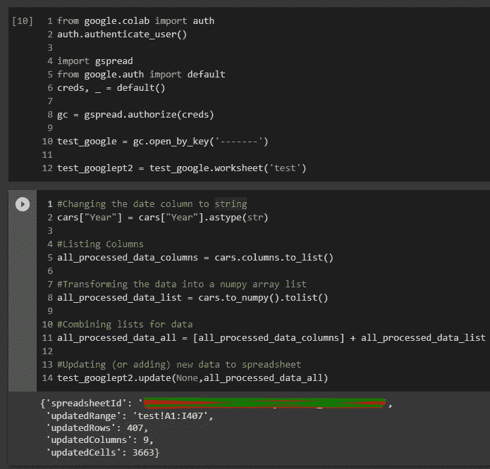
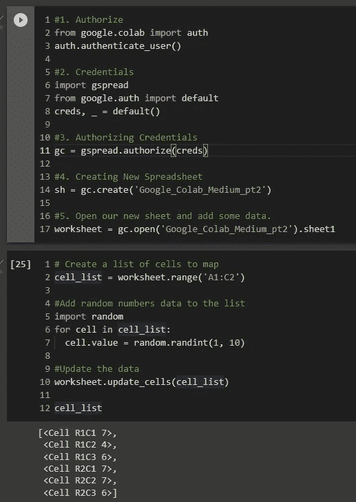
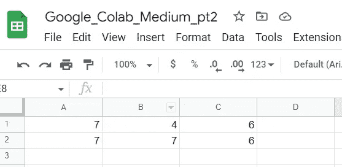

# 将 Google Drive 连接到 Google Colab 笔记本的不同方式！(第二部分)

> 原文：<https://towardsdatascience.com/different-ways-to-connect-google-drive-to-a-google-colab-notebook-part-2-b867786aed55>

## 使用 Google Colab 处理数据的协作方式


照片由[戴恩·托普金](https://unsplash.com/@dtopkin1?utm_source=medium&utm_medium=referral)在 [Unsplash](https://unsplash.com?utm_source=medium&utm_medium=referral) 上拍摄

继续讨论[将 Google Drive 连接到 Google Colab 笔记本的不同方式](https://medium.com/towards-data-science/different-ways-to-connect-google-drive-to-a-google-colab-notebook-pt-1-de03433d2f7a)这一次我想分享仅通过文档名称调用 google sheet 文件并使其成为熊猫数据框的方法。此外，我想分享 2 种不同的方式，我用来发送数据帧到一个新的谷歌表文件或更新现有的一个。


照片由 [Maxime Horlaville](https://unsplash.com/@mxhpics?utm_source=medium&utm_medium=referral) 在 [Unsplash](https://unsplash.com?utm_source=medium&utm_medium=referral) 上拍摄

## Google 协作代码片段

谷歌合作实验室有一个很棒的地方，那就是他们的代码片段可以帮助你做很多事情。从使用 **Altair** 库的可视化到使用 python 的数据库连接，甚至是使用网络摄像头捕捉图像以便在运行时处理的代码片段(Colab 内核)。



Google Colab 代码片段 Altair 库可视化—作者图片

要访问此 Google 协作片段:

1.  去你的 Google Colab 笔记本。
2.  点击笔记本左下方的代码符号。



代码片段—作者图片

3.单击显示代码片段列表后，它会在笔记本上自动提示为一个新选项卡。



代码片段 2 —作者图片

4.您可以使用过滤器部分来搜索您需要的代码片段。



Google Sheets 代码片段——作者图片

如果您忘记了连接到 Google Drive 或将数据保存到 Google Sheet 的代码，这可能会对您有所帮助，我将在本文中向您展示这一点。

## 连接到一个特定的 google 工作表并使其成为一个数据框架

在第一部分中，您将学习如何通过使用文档名将 google sheets 数据连接到 google colab 笔记本。

1.  你将认证
2.  然后将带来谷歌证书进行连接
3.  授权连接
4.  使用 google 工作表的名称连接到该工作表(输入名称，替换“”中的{}。并指定文档的工作表(选项卡)。
5.  导出所有数据值。
6.  使用 pandas 将其转换为 Pandas 数据框架
7.  搞定了。开始你的分析。



代码和示例—作者图片

## 更新现有的 Google 表单

下一段代码将帮助您获取已经存在的 google sheet，并用 Google Colab 中的新数据更新它。

因为在上一点中，我们学习了使用名称打开 Google Sheet，所以让我们使用 Google Sheet 键(URL 中的一系列数字和字母，给出了唯一的键标识符)。

1.  让我们从 google collaboratory 中的 **vega_datasets、** datasets 中获取数据。



Czars 数据集-按作者分类的图像

2.现在我们已经有了数据集，让我们确保它不包含任何 *Nan* 值，因为这在更新过程中不会被识别，并且会给我们带来错误。
-我们可以使用下面的代码来查看任何包含空值的列，以及显示了多少个空值:

```
cars.isnull().sum()
```

由于数据中出现的空值是数值，我们可以用 0 填充这些值。由于这只是一个练习，我们并没有对数据进行深入的分析，所以我将用 0 来填充这些数据，但是在现实世界中，如果我们想要有好的数据，您应该更好地处理这些空值。
-我过去用过的一些处理空值的方法:
1。计算您的列中的空值百分比，如果它很大，您应该考虑删除该列，如果基本上整个列都是 Nan，它不会给您任何洞察力。
2。如果%根本不重要，并且你认为它可以处理，看看你是否可以使用平均值或使用 0。
3。使用数据估算器(参见我的文章[用 Plotly 在地图中显示布宜诺斯艾利斯属性](https://medium.com/towards-data-science/showing-buenos-aires-properties-in-a-map-with-plotly-57ab3cdcd4b1)，其中我展示了如何使用估算器来填充经度和纬度数据列中的空值)。

3.用 0 填充空值

```
cars.fillna(0, inplace=True)
```

4.在用 0 填充这些空值之后，让我们使用键连接到 google sheet。在这里，您需要将{key}更改为可以在 URL 中找到的 google sheet key


谷歌工作表关键字——作者图片

5.现在，我们需要将数据转换成列表，以便在更新过程中可以识别数据，这是为了显示数据应该在哪里(单元格)以及每个值的列名。
在我们进行更新之前，我们应该确保我们所有的数据都是以字符串或 int/float 数据类型分配给更新列表的。



代码示例更新—作者图片

## 使用 Google Colab 创建新的电子表格并添加数据

最后，我们正在使用 Google Colab 笔记本创建一个新的电子表格，并添加新数据。如果您正在使用 google colab 对您带来的一些数据进行分析，并希望使用 google sheets 对其进行分析，但不想下载并上传到 Google sheets，或者不想更新您已经拥有的电子表格，并希望使用新的电子表格进行输出，这可能会对您有所帮助。你可以在不同的场合使用这个。

与我们之前使用的代码有些类似，但这次只是为了从头开始创建一个新的电子表格。



创建和添加数据-按作者分类的图像



结果—作者提供的图像

这样，我最终确定了一些将 Google Drive 连接到 Google Colab 笔记本的不同方式。这些是我过去在协作环境中使用过的一些东西，对我帮助很大，最重要的是，您不需要将代码或 Jupyter 笔记本发送给某人来运行、安装库并为他们创建一个运行它的环境，这也有助于避免发送文件，这需要时间，只需在同事或团队成员之间共享即可。

## 希望这对 yall 很有用！

一如既往，我将很高兴知道您的任何**反馈**！如果你有任何与此相关的新话题，想知道如何去做，请告诉我，我会写下来的！

PD:不要忘记所有这些代码片段都可以在 google colab 笔记本的代码片段特性下找到！


[马特·琼斯](https://unsplash.com/@mattjonesgram?utm_source=medium&utm_medium=referral)在 [Unsplash](https://unsplash.com?utm_source=medium&utm_medium=referral) 上拍照