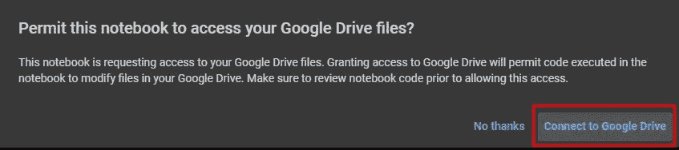
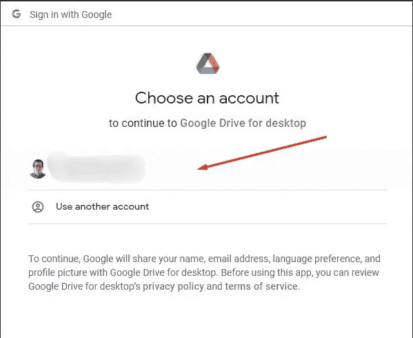
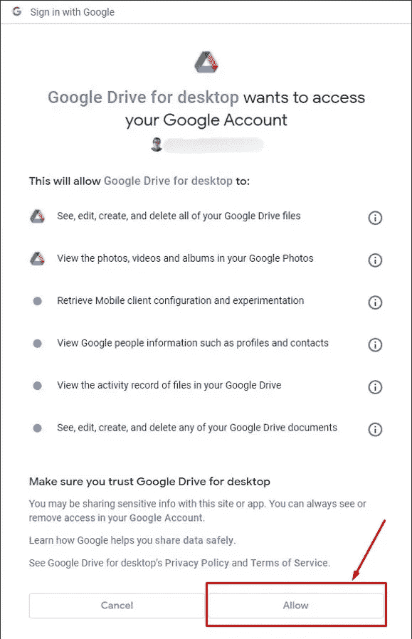
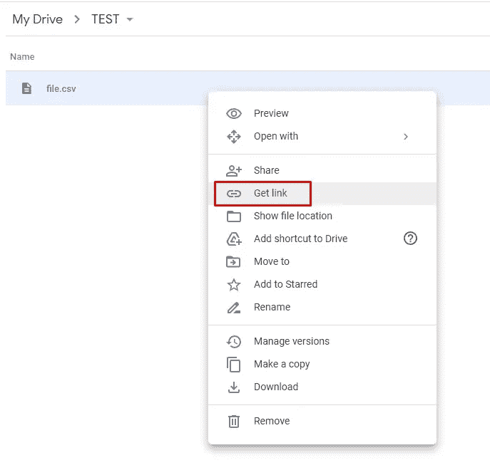
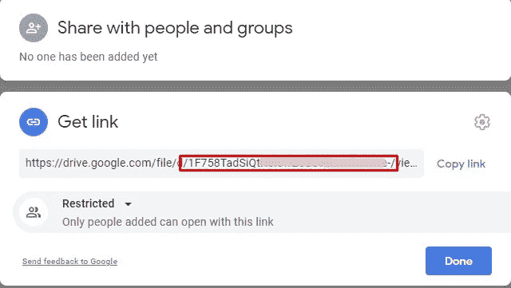
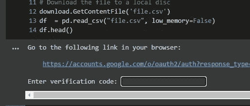
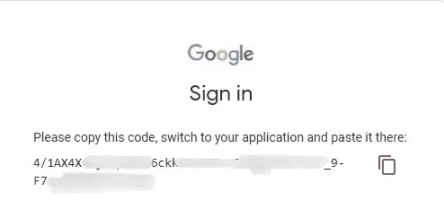

# 将 Google Drive 连接到 Google Colab 笔记本的不同方式！(第一部分)

> 原文：<https://towardsdatascience.com/different-ways-to-connect-google-drive-to-a-google-colab-notebook-pt-1-de03433d2f7a>

## 使用 Google Colab 处理数据的协作方式


约书亚·阿拉贡在 [Unsplash](https://unsplash.com?utm_source=medium&utm_medium=referral) 上拍摄的照片

如今，我们生活在一个协作的环境中，我们的项目与我们的同事共享，以供审查或协作。此外，我们每次都越来越多地使用我们的云存储，如果它必须用于任何数据目的(。csv，。json，。xlsx 文件等。)更好的是，最重要的是，如果我们在一个协作的环境中，任何可以访问这些信息的人都可以在我们的项目中合作或共享更多数据。

因此，在本文的第 1 部分，我将与您分享我在数据路径和协作工作中学到的一些技巧！

# 连接 Google Drive 的特定文件夹

假设我们想要分析 Google Colab 笔记本中的一些数据。最近 Google Drive 分享给我们的 csv 文件。但是，我们不想从 Google Drive 下载所有数据，然后上传到我们的笔记本电脑，这将需要时间，也许那些。csv 文件可能会在未来发生变化，我们将不得不重新制作整个过程。

为此，Google Colab 有一种使用以下代码挂载我们的 Google Drive 的方法:

运行此代码后，将会提示一些消息:



连接到 Google Drive —图片由作者提供



选择您想要安装的 Google Drive 帐户——按作者分类的图片



选择“允许”就可以了。—作者图片

安装 Google Drive 后，您可以浏览所有 Google Drive 文件夹，并导航到您想要读取和分析已共享文件的文件夹。为此，您需要使用以下代码导航到 Google Drive 的主目录:

```
%cd gdrive/MyDrive
```

最后，使用 ***%cd 继续浏览您的文件夹和文件。***

如果你想从一个文件夹中读取很多文件，这是我发现的最好的选择。

我通常使用下面这段代码来读取和连接单个数据帧中的所有文件(仅当所有文件具有相同的模式时；相同数量的列和名称):

你可以查看我的 [***bikes 笔记本***](https://github.com/Sebasc322/Google-Data-Analytics/blob/main/Notebook/Bikes.ipynb) 我用这些代码挂载我的 Google Drive 的地方，导航到我所有的。托管 csv 文件。然后，我读取、清理、处理、转换和连接所有这些文件到一个单一的数据框架。

# 将文件保存在您访问的同一文件夹中

在导航到所需的文件夹并获得所有要分析的数据后，您还可以将最终结果保存在同一文件夹中，或者导航到驱动器中的任何其他文件夹，并使用以下保存代码保存数据。csv 文件:

```
df.to_csv("name_file.csv")
```

或将数据保存到您希望保存的文件类型中的任何其他代码。

# 将特定文件从 Google Drive 上传到我的 Google Colab 笔记本

也许有时我们只需要/想要从我们的 Google Drive 上传单个文件到我们的运行时/内核/环境，而我们不想挂载整个驱动器。

我们可以通过使用以下代码将我们的文件下载到 Google Colab 中来实现:

首先，我们需要导入必要的库:

然后，您可以运行下面的代码:

在运行上面的代码之前，您需要先找到您的文件 id，为此，在 Google Drive 中找到您的文件，右键单击它以找到文件链接:



点击“获取链接”——作者图片

一旦你得到链接，你会看到这样的内容:

```
[https://drive.google.com/file/d/{"ID"}/view?usp=sharing](https://drive.google.com/file/d/1F758TadSiQtX5iew2UdUfS5IUu3CBVe-/view?usp=sharing)
```



红框=文件 id-作者图片

红框中包含数字和字母的整个字符串将是您的 id，需要插入代码的这一部分:

```
file_id = '{insert your id here}'
```

然后会提示一条消息:



点击链接并按照步骤操作——作者图片

点击该链接后，它会要求您登录您的谷歌帐户，并提供访问谷歌 colab 以访问您的谷歌驱动器，最后它会给你一个代码，复制并粘贴到“ ***输入验证码:***



复制粘贴代码，并将其插入输入框——作者图片

最后，你可以对这些文件做任何你想做的事情。

# 结论

我向你展示了两种不同的方式来上传或访问你的谷歌硬盘上的文件。

1.  **将你的 Google Drive 安装到你的 Google Colab**
    ——你可以通过浏览文件夹将文件保存到你的 Google Drive 中。

**优点**:

*   你把你的整个 Google Drive 安装到你的 Google Colab 笔记本上。
*   如果您的项目需要来自不同位置的多个文件，您可以浏览 Google Drive 中的文件夹。

**缺点:**

*   您保存的任何文件都将保存在您所在的确切文件夹中，因此，如果您不确定您在 Google Drive 中的确切位置，那么在保存之前运行以下表达式会很有帮助:

```
%pwd
```

*   有时，如果你不能完全确定你在哪里，文件的保存可能会在你的 Google Drive 里变得一团糟，然后你就需要自己整理一切了。

2.**上传文件，无需安装整个 Google Drive。**

**优点:**

*   您不需要挂载整个驱动器，因此您将始终位于 Google Colab 运行时内的相同路径/目录中。
*   保存的文件将保存到您的运行时中，而不是您的 Google Drive 中，这将是一个 **Pro** 如果您不想将文件保存到 Google Drive 中，或者不需要浏览文件夹，您可以在完成项目后随时将文件下载到您的 Pc 中。

**缺点:**

*   这对于多个文件来说不是最佳的，你需要多次将它们下载到你的运行时(运行相同的代码)，每次下载不同的文件。

最后，这是我将要写的一系列 Google Drive 和 Google Colab 连接的第 1 部分。希望这对您的协作环境有所帮助！

我很高兴知道您的任何反馈！如果你有任何与此相关的新话题，想知道如何去做，请告诉我，我会写下来的！


照片由[刘汉宁·内巴霍](https://unsplash.com/@hannynaibaho?utm_source=medium&utm_medium=referral)在 [Unsplash](https://unsplash.com?utm_source=medium&utm_medium=referral) 上拍摄