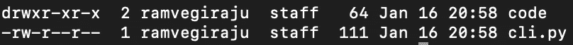
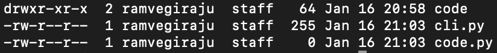
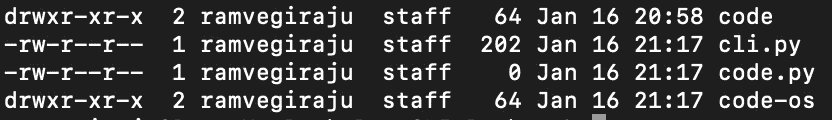
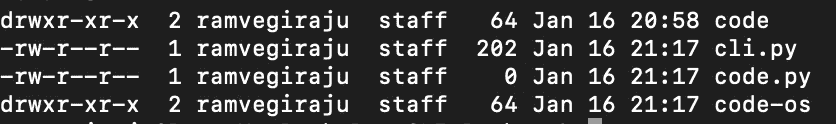
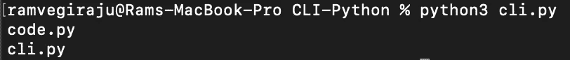

# 在 Python 文件中运行 Bash 脚本的不同方式

> 原文：<https://towardsdatascience.com/different-ways-to-run-bash-scripts-in-your-python-file-8aeb721bc3d1>

# 在 Python 文件中运行 Bash 脚本的不同方式

## 利用子流程、OS、Glob 等

图片来自 [Unsplash](https://unsplash.com/photos/qDG7XKJLKbs) 由[Michael Dziedzic](https://unsplash.com/@lazycreekimages)

对于数据科学家来说，理解 [Shell 脚本](/why-the-cli-is-essential-for-data-scientists-cd7016f86d49)的基础知识至关重要。通过命令行(CLI)的强大功能，许多流程可以实现自动化和简化。有时，当您开始构建更复杂的模块/类时，您会发现自己需要将 Shell 命令合并到 Python 代码中。

幸运的是，我们有几个 Python 模块可以让它变得非常简单。我们将主要关注[子进程](https://docs.python.org/3/library/subprocess.html)、[操作系统](https://docs.python.org/3/library/os.html)和 [glob](https://docs.python.org/3/library/glob.html) 模块。他们每个人都有自己的额外津贴，我只是想给一个如何利用他们的快速概述。

# 子过程

正如他们的文档所示，这个模块有三个主要方面。

1.  可以产生新的过程
2.  连接到它们的输入/输出/错误管道
3.  获取他们的返回代码

让我们直接进入主题，通过几个简单的片段快速了解一下如何执行 Shell 命令。让我们先导入我们的模块。

## 制作目录

让我们首先使用 [mkdir](https://phoenixnap.com/kb/create-directory-linux-mkdir-command) Linux 命令创建一个名为“code”的目录。

创建一个名为 code 的目录

我们现在可以看到在我们的文件结构中创建的目录。

目录已创建(作者截图)

## 建立档案

让我们继续尝试一些更基本的 Linux 命令。让我们创建一个文件，稍后我们可以将它移动到我们的目录中。

建立档案

我们现在可以在同一个目录中看到我们的 Python 文件。

作者截图

您可以继续使用这个 [**调用方法**](https://www.kite.com/python/docs/subprocess.call) 来执行您选择的不同命令。

要生成一个新流程，请检查[子流程。Popen](https://docs.python.org/3/library/subprocess.html#subprocess.Popen) 方法。当您开始处理必须执行的更复杂的命令和程序时，这将特别有用。Subprocess 是一个功能强大的库，具有最新的特性，查看他们的文档[这里](https://docs.python.org/3/library/subprocess.html)。

# 操作系统（Operating System）

顾名思义，[模块](https://docs.python.org/3/library/os.html)可以用来执行许多操作系统任务。它涵盖了子流程模块提供的许多相同功能。让我们重复上面对子流程所做的相同任务。

## 创建目录

使用操作系统模块创建目录

现在，您应该能够看到另一个目录被创建。

作者截图)

假设我们想要列出或解析当前路径的所有文件和目录，您可以使用下面的命令来完成。

## 获取文件路径

使用操作系统获取路径

我们可以将该路径传递给 [listdir](https://www.tutorialspoint.com/python/os_listdir.htm) 命令，该命令将返回该目录中的所有目录和文件。

## 列出文件/目录

获取路径中的文件/目录

我们应该会看到我们在当前目录中创建的所有目录和文件。

作者截图

使用操作系统模块，您可以处理大量文件来执行您可能需要执行的任何标准操作或解析。

# 一团

具体来说， [glob 模块](https://docs.python.org/3/library/glob.html)可以真正用于文件名匹配。通常，您会希望解析具有特定模式或常见类型的文件。

让我们快速看一下如何列出我们目录中的所有 Python 文件。

列出所有 python 文件

这应该会返回我们已经创建的两个 Python 文件。

作者截图

随着您的用例变得越来越复杂，您可以搜索越来越复杂的模式，并加入正则表达式来过滤您的文件。这里有一篇关于 TDS 的优秀的[文章](/the-python-glob-module-47d82f4cbd2d)，深入探讨了 glob 模块。

# 结论

通过使用这三个模块，甚至更多的模块，比如 [Pathlib](https://docs.python.org/3/library/pathlib.html) ，您可以将 Shell 命令合并到您的 Python 脚本中。本文中的简单示例可能不会显示直接的用例，但是随着您对更深层次的代码库的深入研究，有必要与 CLI 进行交互。

*如果你喜欢这篇文章，请在*[*LinkedIn*](https://www.linkedin.com/in/ram-vegiraju-81272b162/)*上与我联系，并订阅我的媒体* [*简讯*](https://ram-vegiraju.medium.com/subscribe) *。如果你是新手，使用我的* [*会员推荐*](https://ram-vegiraju.medium.com/membership) *报名。*