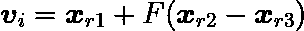
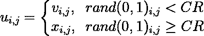
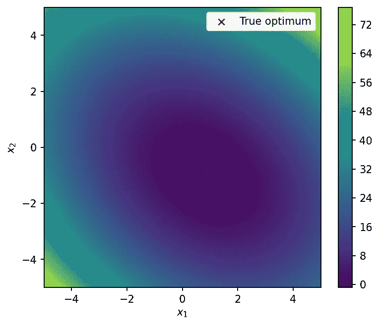
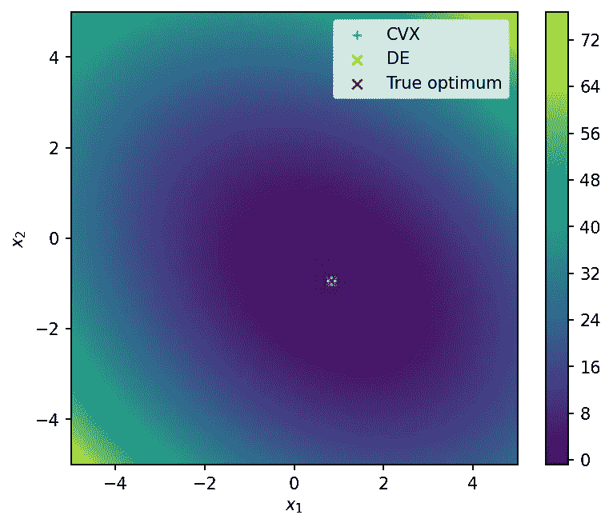
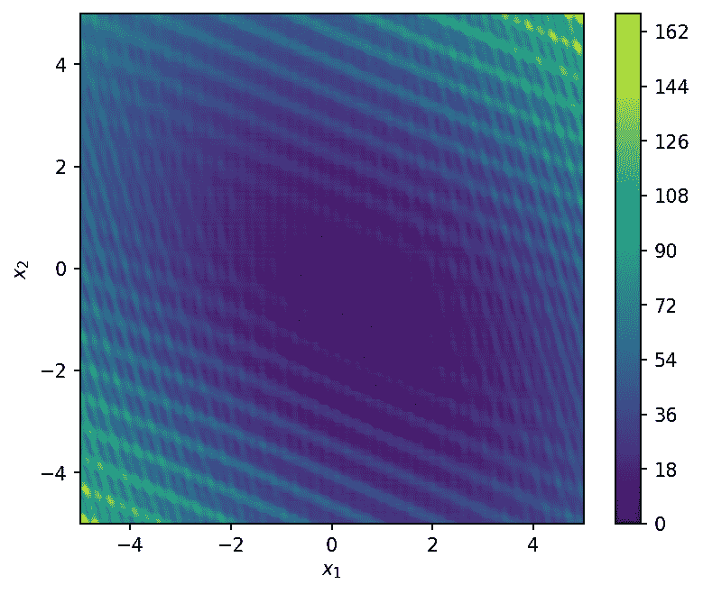
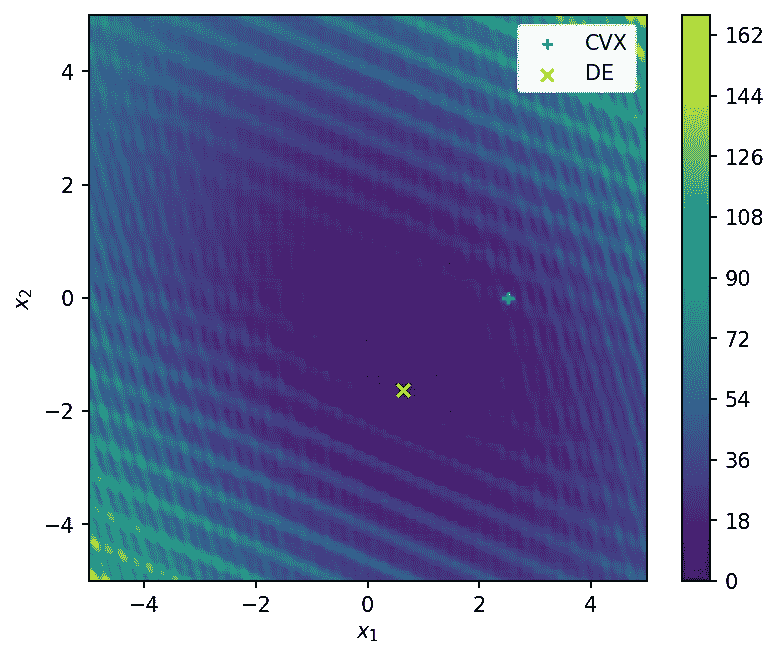
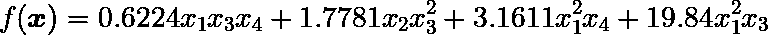
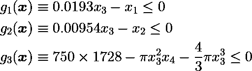
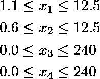

# 差分进化:非线性凸优化的替代方案

> 原文：<https://towardsdatascience.com/differential-evolution-an-alternative-to-nonlinear-convex-optimization-690a123f3413>

## 了解差分进化的基础知识及其在 Python 中的应用


阿曼德·库利在 [Unsplash](https://unsplash.com?utm_source=medium&utm_medium=referral) 上拍摄的照片

> 优化是一种决策制定，或者更具体地说，是决策制定机制中的主要量化工具之一，其中必须做出决策，以在一些规定的情况下优化一个或多个目标(Bilal 等人，2020)。

差分进化(DE) (Storn & Price，1997)是一种进化算法(EA)，最初设计用于解决连续域上的优化问题。它实现简单，但解决问题的质量很好，这使它成为最受欢迎的基于群体的算法之一，有几个成功的应用报告。

从最初的概念来看，DE 的设计是为了满足一些使其特别有用的要求:

1.  处理不可微、非线性和多模态成本函数的能力。
2.  处理计算密集型成本函数的并行性。
3.  易于使用:很少的控制变量来控制最小化。这些变量也应该是稳健的和易于选择的。
4.  良好的收敛性:在连续的独立试验中一致收敛到全局最小值。

在整篇文章中，我们将看到差分进化的基础知识以及对单目标优化问题的应用——尽管它对多目标优化也有一些扩展。它将与传统的基于凸梯度的算法进行比较，以评估每种算法何时更合适。所有这些都将使用 *scipy.optimize* Python 模块来执行。感兴趣的可以在我的[示例笔记本](https://github.com/bruscalia/optimization-demo-files/blob/main/nonconvex/de_scipy.ipynb)中找到实现细节。

如果你对非线性优化不熟悉，建议阅读我之前的文章 [*非线性规划:理论与应用*](/nonlinear-programming-theory-and-applications-cfe127b6060c) 。

[](/nonlinear-programming-theory-and-applications-cfe127b6060c)  

下坡过程在当时是一个很好的类比…然而，搜索空间在本文中可能会变得更加混乱。

# **算法解释**

> 就像自然界一样，进化算子对进化算法种群进行操作，试图产生适应度越来越高的解。与这些算法相关的三个主要算子是突变、重组(交叉)和选择(存活) *(Coello 等人，2007)* 。

下面表示了 DE 算法的基本结构，接下来将描述其中的主要算子和它们各自的控制参数。


差异进化的基本结构。(图片由作者提供)。

该算法首先基于用户指定的个体数量 *N* 和问题的每个决策变量的边界来初始化*群体*。每个个体对应一个优化变量的*向量*。在 5 到 10 倍的决策变量之间选择 *N* 可能是一个好的开始。

基于个体对应的目标函数值和可能的约束值，个体被分配一个适应值。最初，DE 没有约束处理的规则，这是后来几篇文章的焦点。Lampinen (2002 年)提出了一种有用的方法，因为它表现出有竞争力的性能，并且在实施时不需要额外的控制参数。这是在 *scipy* DE 实现中采用的方法。

然后，种群在连续的世代中迭代，直到满足某些停止标准。在每一次迭代中，新的试验向量通过称为*突变*和*交叉*的操作产生。然后，将试验向量与其对应的相同索引的父向量进行比较，并将每对中的最佳向量传递给下一代。停止标准通常基于目标函数和代数的改进。

已经为 DE 提出了几种复制方案。通常用 DE/x/y/z 表示，其中 *x* 对应变异亲本选择方案， *y* 对应差异向量个数， *z* 对应交叉策略。

可能最流行的*突变方案*是 DE/rand/1，由下面的等式表示。



差异进化的突变。(图片由作者提供)。

其中， ***v*** 对应一个索引为 *i* 的突变载体， *r1* 、 *r2* 、 *r3* 为互不相同且与 *i* 不同的三个索引。参数 *F* 是用户自定义的控制参数，表示为*突变*参数或*比例因子*。

一些策略可能会强制*开发*超过*探索*，这取决于如何选择父向量。加强*利用*的一种常用策略是最佳/1 策略，其中基本向量对应于种群中具有最佳适应值的个体。根据我的经验，这种策略通常会导致过早收敛，这也是我通常避免这种策略的原因。

*开发*与*探索*之间的权衡也存在于*突变*参数 *F.* 的选择中。例如，当需要强调*探索*时，例如在具有不连续决策空间的问题中，使用更高的值可能是有用的。相反，为了强调*利用*，使用较低的限制值可以改善结果。

此阶段通常执行的其他操作有*抖动*和*抖动*。*抖动*根据用户指定值的范围，为每个创建的突变向量单独随机化 *F* 。一开始，一个好的选择可以是[0.3，1.0]。*抖动*将每个差向量的每个分量乘以一个随机值，从而加上旋转。

最常见的*交叉*策略是*二项式交叉*或仅 *bin* ，这在下面的等式中描述。



差分进化中的二项式交叉。(图片由作者提供)。

其中*对应于结合相应突变载体 ***v*** 和目标 ***x*** 的元素而创建的试验载体。参数 *CR* 控制从每一个继承一个属性的概率，并且附加的规则规定*的至少一个属性必须从 ***v*** 继承以避免重复。**

**根据 Price 等人(2005)的观点，在低 *CR* 值下表现良好的目标函数是可分解的——可以写成一维函数的和，而那些需要接近 1 的值的目标函数是不可分解的。Zaharie (2009)对差分进化算法中交叉算子的影响进行了详细的研究，我建议对算法细节感兴趣的人进一步阅读。**

**以我的经验来看，大部分非线性现实问题都是不可分的，其中高 *CR* 值，比如 0.7-0.9，是个不错的选择。例外情况包括具有周期性项和强多模态的问题，其中沿着独立坐标轴的搜索可能是有利的。在这类问题中，选择 0.2–0.5 可能会产生更好的结果。**

**接下来让我们看一些应用。在我们的实现中，将使用来自 *scipy.optimize* 的 *differential_evoluton* 函数。**

# **凸问题**

**在第一个例子中，让我们尝试在 [*上一篇文章*](/nonlinear-programming-theory-and-applications-cfe127b6060c) *中使用的相同目标函数。***

****

**凸问题的目标函数。(图片由作者提供)。**

**用 Python 代码。**

```
**# Defining the objective function
def obj_fun(x):
    return (x[0] - 0.5) ** 2 + 0.7 * x[0] * x[1]\
        + 1.2 * (x[1] + 0.7) ** 2

# Defining the gradient function
def gradient_fun(x):
    return np.array([2 * (x[0] - 0.5) + 0.7 * x[1],\
        0.7 * x[0] + 2 * 1.2 * (x[1] + 0.7)])**
```

**看起来像这样。**

****

**决策空间与凸问题的真最优。(图片由作者提供)。**

**我们将使用*拟牛顿 BFGS* 方法和 DE 来解决这个问题。**

```
**# Optimization using BFGS (gradient-based method)
sol_cvx = minimize(obj_fun, [2.5, 0.0], jac=gradient_fun,
                   method="BFGS")

# Otimization using Differential Evolution
sol_de = differential_evolution(
    obj_fun,
    bounds=[(-5., 5.), (-5., 5.)],
    popsize=50, strategy="rand1bin",
    mutation=(0.3, 1.0),
    recombination=0.7,
    tol=1e-8,
    maxiter=200,
    updating="deferred",
    polish=False
)**
```

**请注意，第一个区别是指定决策变量的界限，而不是初始估计值 *x0* 。这些界限用于创建初始群体。**

**自变量 *popsize* 对应于 *N* 人口数量；*策略*为 DE/x/y/z 策略；*突变*为 *F* 参数；*重组*到*CR*； *tol* 对停止准则方面的改进；和 *maxiter* 到最大代数。通过将*上升*设置为“延迟”，我选择使用最初的策略，即每一代只更新当前群体一次。参数 *polish* 定义了在当前最佳解决方案的每次迭代中是否使用局部优化器，我选择不使用。**

**在真正的最优解中，这些解基本上是重叠的。**

****

**凸问题的结果。(图片由作者提供)。**

**主要缺点是 DE 使用 50 的种群大小花费了 56 代来收敛，因此它进行了几个目标函数评估，这可能是计算上昂贵的。相反， *BFGS* 进行了 6 次迭代和 7 次函数评估。**

**理解问题是至关重要的，这样选择的算法才是有效的，而不会导致不必要的函数计算。在第一个问题中，基于凸梯度的算法显然是比 DE 更有效的选择，尽管两者导致完全相同的最终结果。**

**让我们看看它会如何改变…**

# **多模态问题**

**如果搜索空间有几个局部最优怎么办？基于凸梯度的算法是局部搜索方法，因此它们很可能陷入这些点。当局部最优不够时，差分进化是一个更有效的工具。**

**让我们给我们的目标函数添加一些多模态术语。**

```
**# In the nonconvex problem we add some periodical terms
def obj_fun_2(x):
    A = np.array([[1, 0.3],
                 [0.3, 0.7]])
    xt = x.dot(A)
    rugosity_1 = (xt[0] * np.sin(15 * xt[0]) - 0.5) ** 2\
        + (xt[1] * np.sin(15 * xt[1]) - 2) ** 2
    rugosity_2 = np.sin(15 * x[0]) ** 2 + np.sin(25 * x[1]) ** 2
    convex = obj_fun(x)
    return 5 * rugosity_2 + rugosity_1 + convex**
```

****

**非凸例子。(图片由作者提供)。**

**我觉得这张图片很漂亮，尽管相当混乱，而且基于梯度的搜索方向肯定不会带我们去任何地方。让我们试着解决这个问题来看看。**

```
**sol_cvx_2 = minimize(obj_fun_2, [2.5, 0.0], method="BFGS")

sol_de_2 = differential_evolution(
    obj_fun_2,
    bounds=[(-5., 5.), (-5., 5.)],
    popsize=50, strategy="rand1bin",
    mutation=(0.2, 1.0),
    recombination=0.7,
    tol=1e-8, maxiter=200,
    updating="deferred", polish=False)**
```

**使用预先指定的初始估计，*已经实现了 12.12 的目标函数，比 DE 实现的 1.613 差得多(这很可能是全局最优)。***

******

***非凸问题的结果。(图片由作者提供)。***

***我们可以尝试几种不同的初始估计，在二维问题中，可能会导致我们满意的结果。在这个问题中，我尝试了 500 种不同的初始估计，得到的最高结果是 1.855。然而，高维搜索空间的稀疏性使得这样的过程非常无效。***

# ***工程压力容器设计***

***下一个问题由 Sandgren (1990)提出，它使压力容器设计的成本最小化。由于材料供应标准，该问题有两个离散变量 *x1* 和 *x2* ，因此在其原始公式中是不可微的。然而，在本节中，我们将首先解决问题的连续实值变体，然后解决原问题。***

**目标函数由下面的等式描述。**

****

**压力容器设计的目标函数。(图片由作者提供)。**

**和边界约束由下面的等式来表示。**

****

**压力容器设计的功能限制。(图片由作者提供)。**

****

**压力容器设计的界限。(图片由作者提供)。**

**用 Python 代码。**

```
**def f_vessel(x):
    return 0.6224 * x[0] * x[2] * x[3]\
        + 1.7781 * x[1] * x[2] ** 2\
        + 3.1611 * x[0] ** 2 * x[3]\
        + 19.84 * x[0] ** 2 * x[2]

def c1_vessel(x):
    return - (0.0193 * x[2] - x[0])

def c2_vessel(x):
    return - (0.00954 * x[2] - x[1])

def c3_vessel(x):
    return - (750 * 1728 - \
        np.pi * x[2] ** 2 * x[3]\
        - 4/3 * np.pi * x[2] ** 3)**
```

**第一次尝试是使用 *SLSQP* 解决问题。注意，我提到了目标函数的梯度，我已经在示例笔记本中实现了。这里我决定省略这些定义，因为它们太长了。**

```
**sol_cvx_vessel = minimize(
    f_vessel, [2, 2, 50, 50],
    jac=grad_vessel,
    bounds=bounds_vessel,
    constraints=cons_vessel,
    method="SLSQP"
)**
```

**不幸的是，由于第三个约束的非线性性质， *SLSQP* 无法找到合适的解决方案。**

```
**message: 'Positive directional derivative for linesearch'**
```

**然而，差分进化算法并不是解决连续变量问题的唯一合适算法… *信赖域*方法也是*线搜索*方法的替代方法，两者都使用在由某个规则定义的搜索方向上迭代地采取步骤的概念。并且两者都可以使用梯度信息来定义搜索方向。这可以通过仅仅改变*方法*参数来完成。这将导致一个可行点，具有很大的目标函数值。**

```
**sol_tr_vessel = minimize(
    f_vessel, [2, 2, 50, 50],
    jac=grad_vessel,
    bounds=bounds_vessel,
    constraints=cons_vessel,
    method="trust-constr"
)**
```

**现在，让我们实现 DE，看看它的性能如何。**

```
**sol_de_vessel = differential_evolution(
    f_vessel, bounds=bounds_vessel,
    constraints=cons_vessel,
    popsize=50, strategy="rand1bin",
    recombination=0.7, mutation=(0.3, 1.0),
    maxiter=300, seed=12,
    init='latinhypercube', polish=False
)**
```

**虽然找到了可行解，但是 DE(没有 finding)并不能产生低至*trust-const*的目标函数值，仍然取了更多的函数调用。**

**因此，在 DE 之前尝试其他*凸*算法仍然是有用的，特别是如果没有多模态或不可微项的证据。**

# **添加离散变量**

**增加离散变量使得这个问题不可微。因此，在这种情况下，预期 DE 是必要的。使用基于树的模型来映射目标函数的情况在实践中并不罕见。这些也是不可微的问题，DE 为解决它们提供了一个有用的选择。**

**让我们修改我们的目标函数，它将连续的实变量 *x1* 和 *x2* 解释为 0.0625 的离散倍数。**

```
**def integer_x(x):
    x[0] = int(x[0] / 0.0625 + 1) * 0.0625
    x[1] = int(x[1] / 0.0625 + 1) * 0.0625
    return x

def f_vessel_minlp(x):
    x = integer_x(x)
    return f_vessel(x)**
```

**以及实施…**

```
**sol_de_minlp = differential_evolution(
    f_vessel_minlp, bounds=bounds_vessel,
    constraints=cons_vessel,
    popsize=50, strategy="rand1bin",
    recombination=0.7, mutation=(0.3, 1.0),
    maxiter=300, seed=12,
    init='latinhypercube', tol=1e-8, polish=False,
)**
```

**这与 Lampinen & Storn (2004)报告的结果完全相同，因此可以认为是成功的。**

```
**constr_violation: 0.0
fun: 7197.731584692868
Real x: [ 1.125       0.625      58.29011889 43.69286662]**
```

# **进一步阅读**

**差分进化是众多基于种群的*算法中的一种，这种算法在解决优化问题时非常有效。我建议感兴趣的读者探索*粒子群优化*和*遗传算法*作为两个强大的替代方案。***

*此外，在本文中，我们已经看到了差分进化算法在单目标问题中的一些应用。但是如果我们追求多个相互冲突的目标呢？DE 有几个扩展来处理*多目标*优化，在这些情况下非常有用。感兴趣的人会发现 python 库 *pymoode* 非常有用。在另一篇媒体文章中有一个概述:*

*[](/pymoode-differential-evolution-in-python-78e4221e5cbe) * 

# *结论*

*在本文中，使用 *scipy* 实现，用实际的实现例子解释和说明了差分进化的基本理论方面。提出了凸的、多峰的和不可微的问题，其中 DE 与其他优化方法相比具有其性能。所使用的代码在这个 [GIT](https://github.com/bruscalia/optimization-demo-files/blob/main/nonconvex/de_scipy.ipynb) 资源库中对读者完全可用。*

# *参考*

*Bilal 等人，2020 年。二十多年研究的回顾。英国工程师。应用程序 Artif。智能。，第 90 卷，第 103479 页。*

*Lampinen，2002 年。差分进化算法的约束处理方法。2002 年进化计算大会会议录。CEC'02，第 2 卷，第 1468–1473 页。*

*兰皮宁，j .和斯托恩，r .，2004 年。差异进化。*工程中的新优化技术。柏林，海德堡:施普林格出版社，第 123-166 页。**

*普莱斯，K. V .，Storn，R. M .和 Lampinen，J. A .，2005 年。差分进化:一种实用的全局优化方法。第 1 版。柏林。*

*桑德格伦，1990 年。机械设计优化中的非线性整数和离散规划。*《机械设计学报》，* 112(2)，第 223–229 页。*

*storn r .和 Price k .，1997 年。差分进化——连续空间全局优化的简单有效的启发式算法。 *J。Optim。，*第 11 卷第 4 期，第 359—341 页。*