# 扩散模型变得简单

> 原文：<https://towardsdatascience.com/diffusion-models-made-easy-8414298ce4da>

## **了解去噪扩散概率模型的基础知识**

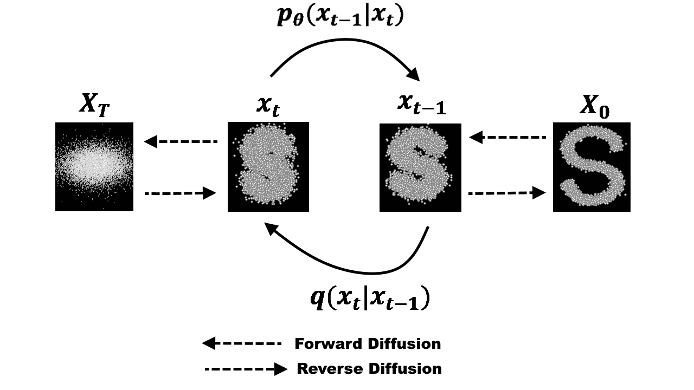

图 1:去噪扩散概率模型的过程(图片由作者提供)

**1** 。**简介**

在最近的过去，我谈到了 GANs 和 VAEs 作为两个重要的生成模型，已经取得了很大的成功和认可。gan 非常适合多种应用，但是它们很难训练，并且由于一些挑战，例如模式崩溃和消失梯度，它们的输出缺乏多样性。虽然 VAEs 具有最坚实的理论基础，但是，在 VAEs 中，良好的损失函数的建模是一个挑战，这使得它们的输出是次优的。

还有另一套技术源自概率似然估计方法，并从物理现象中获得灵感；这就是所谓的扩散模型。扩散模型背后的中心思想来自气体分子的热力学，由此分子从高密度向低密度区域扩散。这种运动在物理学文献中经常被称为熵增加或热寂。在信息论中，这等同于由于噪声的逐渐介入而导致的信息丢失。

扩散建模中的关键概念是，如果我们可以建立一个学习模型，该模型可以学习由于噪声导致的信息的系统衰减，那么应该可以逆转该过程，从而从噪声中恢复信息。这个概念类似于 VAEs，它试图通过首先将数据投影到潜在空间，然后将其恢复到初始状态来优化目标函数。然而，该系统的目的不是学习数据分布，而是在*马尔可夫链*中模拟一系列噪声分布，并通过以分层方式撤销/去噪数据来“解码”数据。

**2。** **去噪扩散模型**

去噪扩散模型的思想由来已久。它源于扩散图概念，这是机器学习文献中使用的降维技术之一。它还借用了概率方法中的概念，如已经在许多应用中使用的*马尔可夫链*。最初的去噪扩散方法是在 *Sohl-Dickstein 等人*中提出的。[1].

去噪扩散建模是两步过程:正向扩散过程和反向过程或重建。在前向扩散过程中，连续引入高斯噪声，直到数据变成全噪声。反向/重建过程通过使用神经网络模型学习条件概率密度来消除噪声。这种过程的示例描述可以在图 1 中看到。

**3。** **前进过程**

我们可以将前向扩散过程正式定义为*马尔可夫链*，因此，与 VAEs 中的编码器不同，它不需要训练。从初始数据点开始，我们为 ***T*** 连续步骤添加高斯噪声，并获得一组噪声样本。时间 ***t*** 的概率密度预测仅依赖于时间 ***t-1*** 的直接前趋，因此条件概率密度可以计算如下:

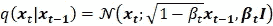

整个过程的完整分布可以计算如下:

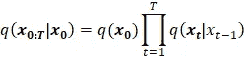

这里，密度函数的均值和方差取决于参数βτ，该参数是一个超参数，其值可以在整个过程中取为常数，也可以在连续步骤中逐渐改变。对于微分参数值分配，可能存在可用于模拟行为的函数范围(例如，sigmoid、tanh、linear 等。).

上面的推导足以预测连续状态，然而，如果我们想要在任何给定的时间间隔 ***t*** 采样，而不经过所有中间步骤，因此，允许有效的实现，那么我们可以通过将超参数替换为ατ = 1 — βτ **来重新制定上面的等式。上面的重新表述变成了:**

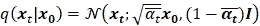

为了在时间步长 ***t*** 产生样本，并且在时间步长*t-1 可用概率密度估计，我们可以采用热力学中的另一个概念，称为，*朗之万动力学*。根据*随机梯度朗之万动力学*【2】我们可以仅通过*马尔可夫链*更新中密度函数的梯度来采样系统的新状态。基于前一时间点 ***t-1*** 的步长 **ε** 的新数据点在时间 ***t*** 的采样可以计算如下:*

*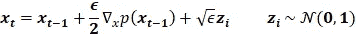*

***4。**重建**重建***

*相反的过程要求在给定系统当前状态的情况下，在较早的时间步估计概率密度。这意味着当*T =***T**时，估计 **q** (χτ-1 | χτ),从而从各向同性高斯噪声中生成数据样本。然而，与正向过程不同，从当前状态对先前状态的估计需要所有先前梯度的知识，在没有能够预测这种估计的学习模型的情况下，我们无法获得这些知识。因此，我们必须训练一个神经网络模型，该神经网络模型基于学习到的权重 **θ** 和在时间**t*t*的当前状态来估计**ψθ**(χτ-1 |χτ)。这可以估计如下:***

*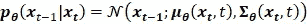**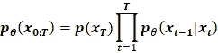*

*平均函数的参数化由 Ho*提出。等* [3]并可计算如下:*

*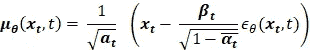*

*作者在*何。et al.* [3]建议使用固定方差函数，如σθ=βτ。在时间 ***t-1*** 的样本可以计算如下:*

*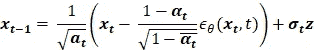*

***5。** **训练和结果***

***5.1。** **模型的构建***

*用于扩散模型的训练中的模型遵循与 VAE 网络相似的模式，然而，与其他网络架构相比，它通常保持更简单和直接。输入层的输入大小与数据维度的输入大小相同。根据网络要求的深度，可以有多个隐藏层。中间层是具有各自激活功能的线性层。最终层的大小再次与原始输入层的大小相同，从而重建原始数据。在*去噪扩散网络*中，最终层由两个独立的输出组成，每个输出分别用于预测概率密度的均值和方差。*

***5.2。** **损失函数的计算***

*网络模型的目标是优化以下损失函数:*

*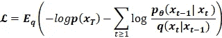*

*Sohl-Dickstein 等人【1】提出了这种损失函数的简化形式，它用两个高斯分布和一组熵之间的 KL 散度的线性组合来表示损失。这简化了计算，并且使得实现损失函数变得容易。损失函数于是变成:*

*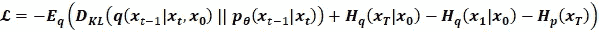*

**Ho 等人*【3】在损失函数中提出了进一步的简化和改进，其中均值的参数化如前一节所述用于正向过程。因此，损失函数变成:*

*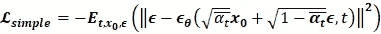*

***5.3。**结果**结果***

*通过遵循*马尔可夫链*添加高斯噪声的正向过程的结果可以在下图中看到。时间步长的总数是 100，而该图显示了来自生成的序列集的 10 个样本。*

*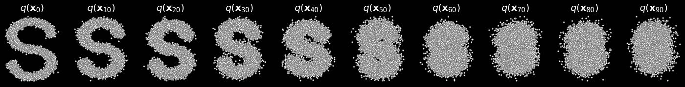*

*图 2:S 曲线合成数据集前向扩散过程的结果(图片由作者提供)*

*下图显示了反向扩散过程的结果。最终输出的质量取决于超参数的调整和训练时期的数量。*

*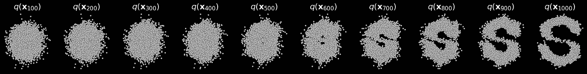*

*图 3:从各向同性高斯噪声中重建数据的结果(图片由作者提供)*

*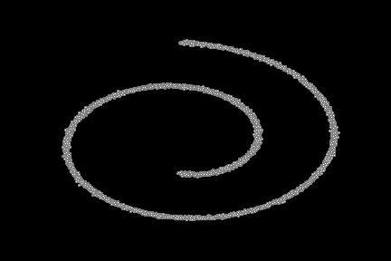**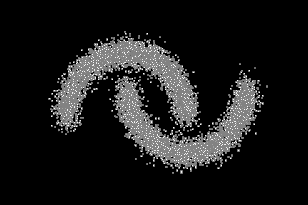**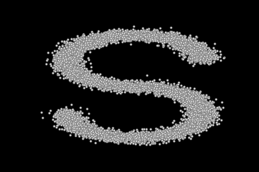*

*图 4:去噪扩散模型在 3 个不同数据集上的结果:瑞士卷、月亮和 S 曲线(图片由作者提供)*

***6。** **结论***

*在这篇文章中，我们讨论了扩散模型的基础，以及它们的实现。尽管扩散模型在计算上比其他深度网络架构更昂贵，但是它们在某些应用中表现得更好。例如，最近在文本和图像合成任务中的应用，扩散模型的表现优于其他架构[4]。更多的实现细节和代码可以在下面的 github 资源库中找到:[https://github . com/Azad-academy/noking-diffusion-model . git](https://github.com/azad-academy/denoising-diffusion-model.git)*

*订阅并关注更多更新:[azad-wolf.medium.com/](https://azad-wolf.medium.com/)*

***参考文献***

*[1] [Sohl-Dickstein，j .、Weiss，E. A .、Maheswaranathan，n .&Ganguli，S. (2015)。使用非平衡热力学的深度无监督学习。arXiv 预印本 arXiv:1503.03585。](https://arxiv.org/pdf/1503.03585)*

*[2]马克斯·韦林和伊惠德。[“通过随机梯度朗之万动力学进行贝叶斯学习。”](http://citeseerx.ist.psu.edu/viewdoc/summary?doi=10.1.1.226.363) ICML 2011。*

*[3] [何，j，贾恩，a .，&阿贝耳，P. (2020)。*去噪扩散概率模型*。预印本 arXiv:2006.11239。](https://arxiv.org/pdf/2006.11239)*

*[4] [普拉富拉·达瑞瓦尔](https://arxiv.org/search/cs?searchtype=author&query=Dhariwal%2C+P)，[亚历克斯·尼科尔](https://arxiv.org/search/cs?searchtype=author&query=Nichol%2C+A)， [*扩散模型在图像合成上击败甘斯*，arXiv: 2105.05233](https://arxiv.org/abs/2105.05233)*