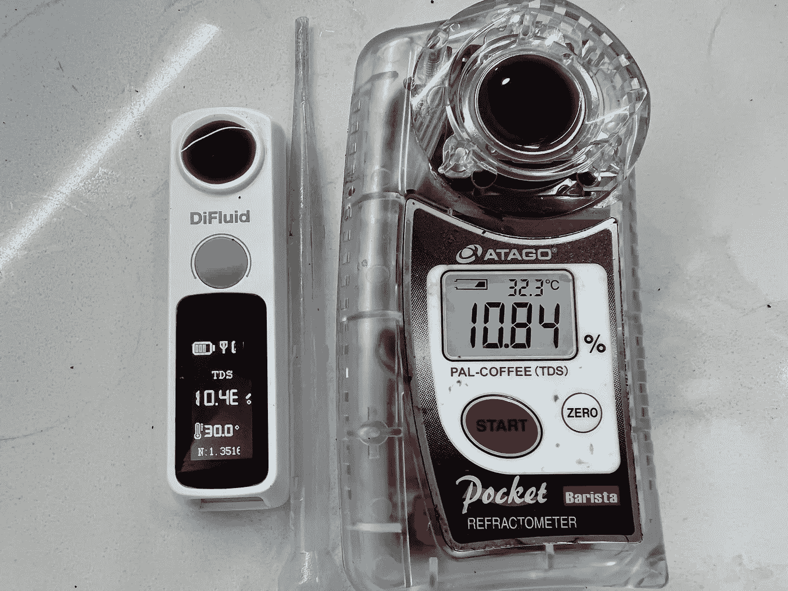
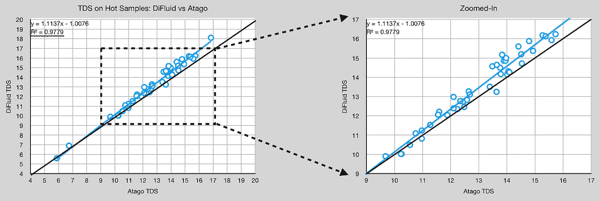
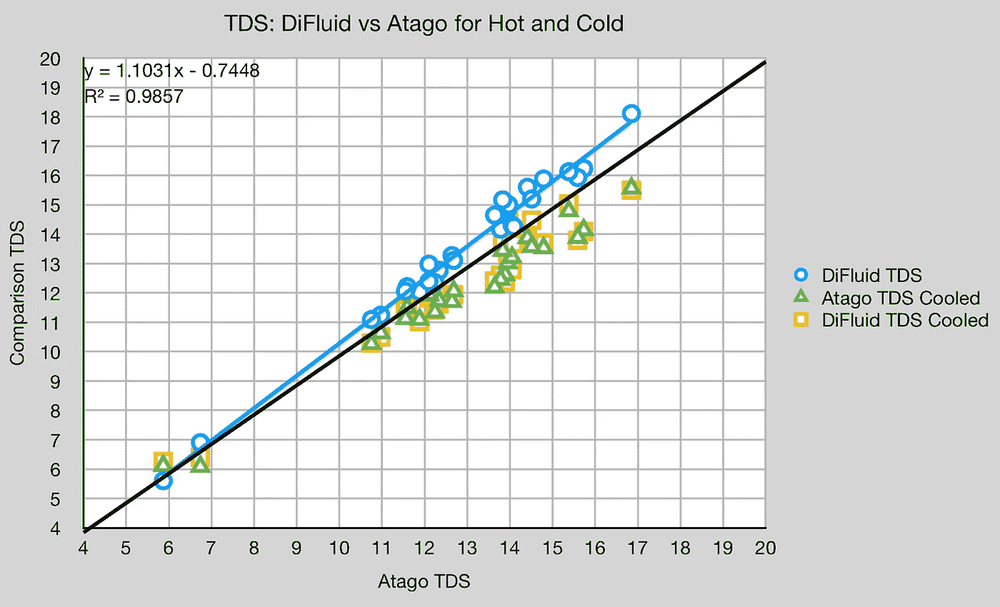
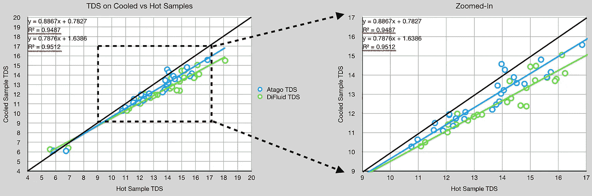
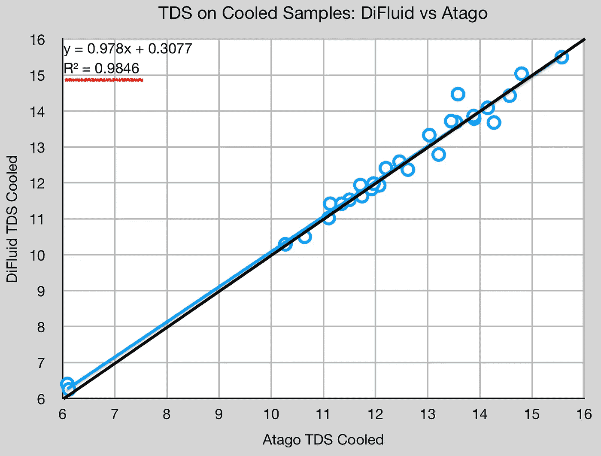
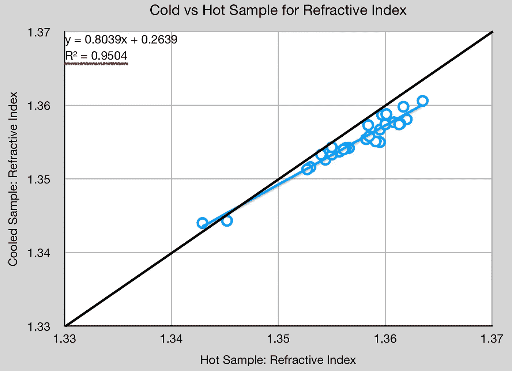
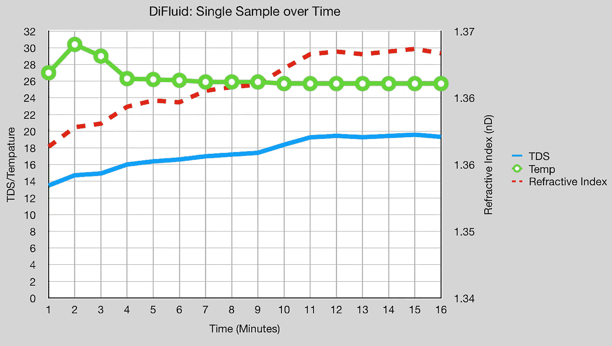

# DiFluid 与 Atago 在浓缩咖啡中的总溶解固体量(TDS)

> 原文：<https://towardsdatascience.com/difluid-vs-atago-for-total-dissolved-solids-tds-in-espresso-d474614ad66f>

## 咖啡数据科学

## 合格折光仪

在过去几年中，数字折光率仪市场有所增长。起初，只有 VST。当 Atago 上市时，一些[实验](/espresso-measurement-solubility-b1f53b91c2b9)结果表明，两者产生了相似的结果，在统计上没有差异。现在，一种更便宜、更小的 [DiFluid](https://store.digitizefluid.com/products/coffee-refractometer) 折光仪已经上市，所以让我们收集数据并看一看。

咖啡中的折射计用于测量折射率，折射率[将](/measuring-refractometer-accuracy-to-groundtruth-for-coffee-421929644587?source=your_stories_page-------------------------------------)与总溶解固体(TDS)相关联，这可用于计算提取的咖啡量。折光率仪测量折光率，有了数据，公司就有了用折光率和温度来测量 TDS 的方程式。否则，人们将不得不干燥用过的咖啡坯来确定提取了多少咖啡。

在充分披露，DiFluid 寄给我这个折射计，他们没有与我有任何沟通，因为。他们认为我在做独立分析，我们没有业务关系。我的评论关注的是使用仪表读取浓缩咖啡的读数，对用户体验几乎没有评论。该仪器读取样品的速度比 Atago 更快，这有时是有利的，但它要求您冷却样品。

我只与 Atago 进行了比较，之前我已经对其进行了多次描述:

[**测量咖啡折光仪的准确度**](https://rmckeon.medium.com/measuring-refractometer-accuracy-to-groundtruth-for-coffee-421929644587?source=your_stories_page-------------------------------------)

[**内外咖啡折光仪测量**](/inside-and-out-coffee-refractometer-measurements-ebfc3952c49c?source=your_stories_page-------------------------------------)

[**咖啡和浓缩咖啡的折光仪精确度**](https://rmckeon.medium.com/refractometer-accuracy-for-coffee-and-espresso-ab72bc6d9b0d?source=your_stories_page-------------------------------------)

[**浓缩咖啡的平价咖啡溶解度工具(TDS):Brix vs Atago**](/affordable-coffee-solubility-tools-tds-for-espresso-brix-vs-atago-f8367efb5aa4?source=your_stories_page----------------------------------------)

[**咖啡中总溶解固体的测量会受到样品温度**](https://rmckeon.medium.com/total-dissolved-solids-tds-in-coffee-is-slightly-affected-by-sample-temperature-929390babf2d?source=your_stories_page----------------------------------------) 的轻微影响

[**用于 TDS 咖啡测量的过滤注射器似乎没有必要**](/filter-syringes-for-tds-coffee-measurements-seem-to-be-unnecessary-e52aded77ac4?source=your_stories_page----------------------------------------)

所有图片由作者提供

在几个星期的时间里，我将这个仪表与我的 Atago 一起使用，以获取读数。我在每个容器中放了一个样本，直到 Atago 记录了一个读数，我才从液体中得到一个读数。这使得样品以与在 Atago 中相同的方式冷却。Atago 通常需要一分钟左右。

我之前曾[发现在冷却样品时，TDS 会有轻微的统计偏移，但我继续使用热样品来保持我的测量技术的一致性。我也没有过滤样本，因为我发现](/total-dissolved-solids-tds-in-coffee-is-slightly-affected-by-sample-temperature-929390babf2d)[没有必要](/filter-syringes-for-tds-coffee-measurements-seem-to-be-unnecessary-e52aded77ac4?source=your_stories_page----------------------------------------)。

# 数据

先说热样。我取了 45 个样本，在这 45 个样本中，有 25 个样本在我用移液器的顶部在冷水(20C)中冷却相同的样本后有了额外的样本。

随着 Atago 的 TDS 增加，二液 TDS 以更高的速度增加。

将这些样本与冷样本进行比较，有一个不同的趋势。

观察冷却样品和热样品，两种仪表都遵循相似的趋势，但是 DiFluid 的偏移更大，这意味着在测量 TDS 时，它比 Atago 更受温度的影响。

当比较冷却的样品时，DiFluid 和 Atago 的性能几乎相同。在双尾 t 检验中，p 值为 0.46，这意味着它们分布的差异没有统计学意义(p>0.05)。

DiFluid 还显示折光率(nD ),因此我绘制了 nD，以显示它如何随着热样品和冷样品而变化。趋势非常线性，这表明两种设备的 TDS 测量差异是由于 DiFluid 使用的公式，而不是硬件的内在差异。

# 一段时间内的单一样本

我观察了一段时间内钻井液的单个样本。一旦温度稳定下来，折射率也随之变化。

总的来说，我真的很喜欢 DiFluid，对于浓缩咖啡来说，它是一个很好的伴侣。对于那些不想倾家荡产的人来说，我认为这是一个不错的选择。应该为低 TDS 咖啡提供更多的数据，但总体上似乎缺乏折光仪的数据。我希望更多的数据将被分享，这样作为一个社区，我们可以更好地了解折光仪如何对咖啡起作用。

如果你愿意，可以在推特、 [YouTube](https://m.youtube.com/channel/UClgcmAtBMTmVVGANjtntXTw?source=post_page---------------------------) 和 [Instagram](https://www.instagram.com/espressofun/) 上关注我，我会在那里发布不同机器上的浓缩咖啡照片和浓缩咖啡相关的视频。你也可以在 [LinkedIn](https://www.linkedin.com/in/dr-robert-mckeon-aloe-01581595) 上找到我。也可以关注我在[中](https://towardsdatascience.com/@rmckeon/follow)和[订阅](https://rmckeon.medium.com/subscribe)。

# [我的进一步阅读](https://rmckeon.medium.com/story-collection-splash-page-e15025710347):

[我未来的书](https://www.kickstarter.com/projects/espressofun/engineering-better-espresso-data-driven-coffee)

[我的链接](https://rmckeon.medium.com/my-links-5de9eb69c26b?source=your_stories_page----------------------------------------)

[浓缩咖啡系列文章](https://rmckeon.medium.com/a-collection-of-espresso-articles-de8a3abf9917?postPublishedType=repub)

工作和学校故事集