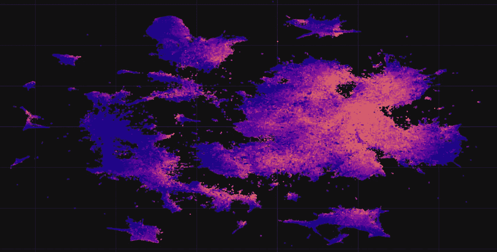
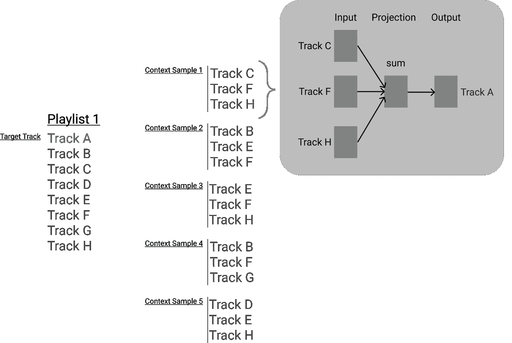
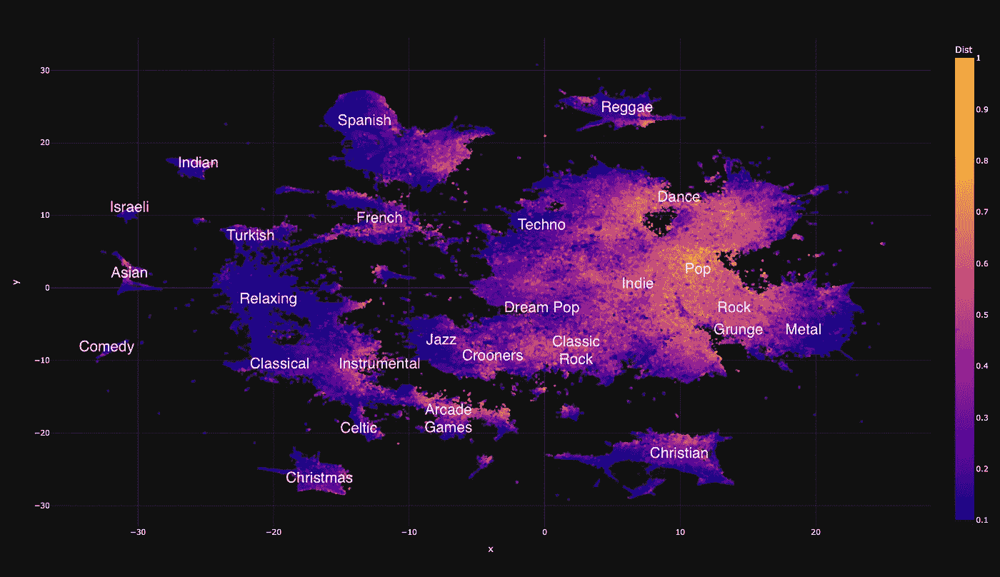
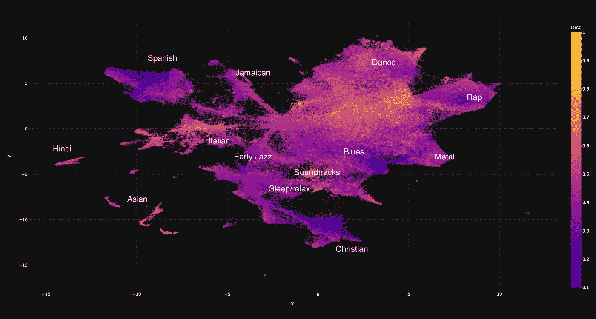
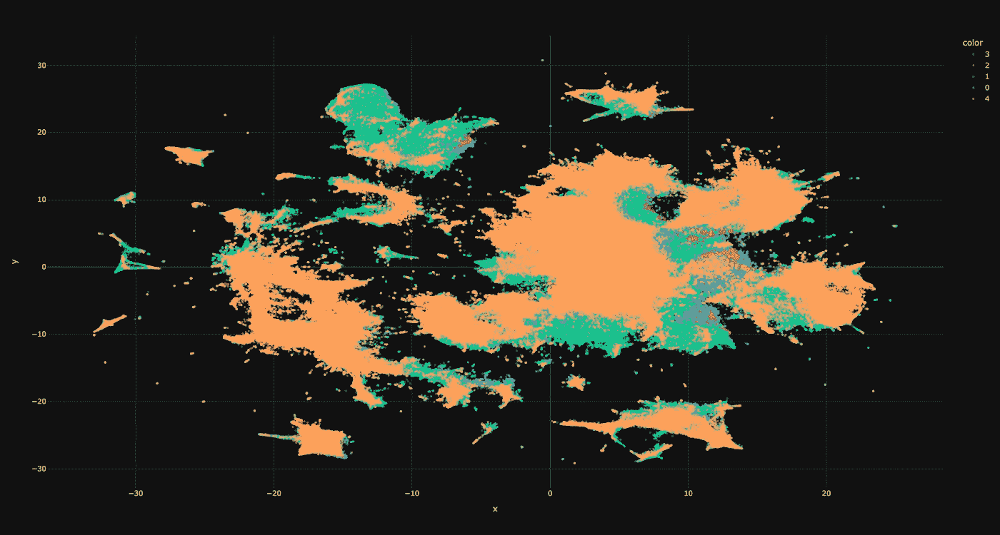

# 用曲目嵌入挖掘我的 Spotify 流媒体年

> 原文：<https://towardsdatascience.com/digging-into-my-year-of-spotify-streaming-with-track-embeddings-6cad51523b0e>

## 受“Spotify Wrapped”的启发，我用嵌入、聚类和情绪分类来审视我这一年的音乐流



作者图片

每年年底，Spotify 都会发布一份“Spotify Wrapped ”,总结用户过去一年的流媒体内容。受到这个总结的启发，我想对我这一年的音乐流媒体进行一次高层次的挖掘。

这篇文章首先有区别地描述了我的听力历史。接下来是基于曲目和艺术家的分布式矢量表示(嵌入)的更“语义”的分析。然后，我挖掘我听过的歌曲中歌词的情绪，并计算一年中情绪的分布。最后，我将一年的流媒体放入一个播放列表，其中包含代表一年中每个月的曲目。

虽然我不会深入分析背后的代码细节，但所有代码都可以在 Github 上我的 [MyYearOfSpotify](https://github.com/mKaloer/MyYearOfSpotify) 回购中获得。这也包含了互动的情节，不幸的是太大了，无法嵌入到这篇文章中。

现在，让我们开始吧🚀

# 获取数据

在开始之前，我需要获得我的流历史。这可以通过 Spotify 个人资料页面的“个人资料”部分进行申请和下载。这个数据转储包含有关我的播放列表、个人资料、库的信息，最重要的是，还有我的整个流媒体历史记录。流媒体历史记录的格式如下，其中`msPlayed`是指音轨播放的毫秒数:

```
[ { "endTime" : "2021-09-19 15:46", "artistName" : "Rainbow", "trackName" : "Can't Let You Go", "msPlayed" : 259867 }, { "endTime" : "2021-09-19 15:51", "artistName" : "Rainbow", "trackName" : "Snake Charmer", "msPlayed" : 270427 },
  ...
]
```

# 初步分析

在这一节中，我将在下一节深入探讨跟踪嵌入之前，描述我在基本统计数据方面的一年。

我总共播放了 14944 首歌曲。然而，为了清理数据集，我删除了所有跳过的曲目。当一首曲目播放时间少于 30 秒时，我认为它被跳过了。我使用 Spotify API 来获取可能跳过的曲目的时长，这样短于 30 秒的曲目就不会被视为跳过。这次清理将磁道数量从 14944 减少到 11353。

## 最常播放的曲目和艺术家

最直接的分析是找出我在这一年中最常播放的曲目和艺术家。这可以通过总播放时间或总播放次数来衡量。我发现结果是相似的，所以我只显示基于总流时间的图表。

下表显示了最多流化的曲目。不过，我认为这有点偏颇，因为我在学习用吉他弹奏 U2。

我最常播放的曲目，以毫秒计算

类似地，我已经确定了我最流式的艺术家，这显示了比曲目更多的多样性，尽管大多数艺术家代表不同的摇滚流派:

我播放次数最多的艺术家，以毫秒计算

## 跳过最多的曲目

有些音轨比其他音轨更容易被跳过。为了找到跳过最多的曲目，我计算了我听的所有曲目的跳过率。以避免误点击等。，我只考虑了至少有 4 次(部分)播放的曲目。如下表所示，一些曲目从未播放结束，有些甚至一直被跳过。显然，我不太喜欢灰熊和格里塔·范·弗利特的两首歌！

跳过最多的曲目

以下是被跳过最多的艺术家。似乎 Ozric Tentacles 的迷幻太空摇滚对我来说太多了！

大多数被跳过的艺术家

## 一天/一周/一月/一年的时间

总共听了 35 天 21 小时 22 分 2 秒的音乐。我在流媒体播放的任何一天(即我至少播放一首歌曲的一天)的平均收听时间是 2 小时 44 分钟。让我们深入了解这些溪流在一周内是如何分布的。

下面的图表显示了我在工作日和一天中的不同时段的收听时间。很明显，我的大部分会议都是在星期二和星期五上午，我喜欢在星期天上午听一些音乐。

受 Github 贡献图的启发，我在下面的图表中总结了我一年来的流媒体工作。要是我的 Github 贡献图也是这样就好了！

Github 风格的播放列表

# 轨道嵌入

在没有任何附加知识的情况下，音轨标题和艺术家姓名不是特别描述音乐音轨的属性。为了更好地理解这些曲目，我需要一种在某种程度上基于其音乐特性的表现形式。

由于许可的原因，分析音轨的音频数据是不可行的，所以我寻找其他相关的数据集来丰富音轨的信息。我最终发现 [Spotify 百万播放列表数据集挑战](https://www.aicrowd.com/challenges/spotify-million-playlist-dataset-challenge)包含了来自 Spotify 的一百万个播放列表。

基于相同播放列表中的曲目之间存在关系的假设，该数据集用作我的曲目嵌入的源。

## Word2Vec、Node2Vec 和… Track2Vec

将单词嵌入分布式表示的最流行和最简单的方法之一是 Word2Vec。Word2Vec 通过训练一个模型来工作，该模型给定一个单词，要么预测该单词在该单词上下文中的分布(skip-gram)，要么预测给定该单词上下文的单词(CBOW)。在优化模型之后，每个单词的权重可以用作密集向量表示。这些向量已经被证明可以捕捉有用的语义属性——最著名的是国王-男人+女人=王后。

Word2Vec 的思想后来被扩展到 Node2Vec，这是一种学习图中节点的分布式表示的方法。Node2Vec 不使用单词的上下文，而是使用通过二阶随机行走可从目标节点到达的节点。

因为我确实想要一个不随播放列表中曲目顺序变化的嵌入，所以我的方法基于 Word2Vec 和 Node2Vec 的混合。我将播放列表中的每首曲目视为一个节点，它与该播放列表中的其他曲目都有边。为了简单起见，我一次只考虑一个播放列表，所以即使一首曲目出现在几个播放列表中，也只有当前播放列表中的曲目被视为邻居。此外，我只对邻居进行了采样，使用的是一阶随机游走，边上没有权重。实际上，这是通过从当前播放列表中随机采样上下文轨道来实现的。

使用 [Gensim](https://radimrehurek.com/gensim/) 和 CBOW 方法训练该模型，即基于从播放列表中采样的其他曲目预测目标曲目。我在每个目标轨道上随机抽取了 5 个情境样本。我对播放列表数据集进行了基本的清理，合并了同一艺术家同名的曲目。这消除了专辑中出现的重复曲目。

下图显示了 Track2Vec 的上下文采样。



Track2Vec 采样示例。图片作者。

除了 Track2Vec，我还训练了艺术家向量。除了我只考虑每个播放列表中不同的艺术家之外，这些都是以与曲目相同的方式训练的。

# T-SNE 可视化

为了可视化轨道嵌入，我使用 T-SNE 绘制了它们的二维图。

颜色代表到 10 个最近邻居的平均距离，即原始嵌入空间中的密度。由于大量的轨迹，使用[和](https://github.com/spotify/annoy)来近似点之间的距离。

下图显示了 Track2Vec 嵌入，标签指示不同的轨道簇。流派相当分明，不同流派之间的距离看似合理。例如，器乐和古典音乐的位置很近，电子音乐和舞蹈也是如此。我很高兴街机游戏的原声音乐恰好在嵌入空间中有自己的位置👾



Track2Vec 可视化。图片作者。

类似地，我绘制了 Artist2Vec 嵌入。类似地，艺术家的流派也定义了聚类:



Artist2Vec 可视化。作者图片

Track2Vec 和 Artist2Vec 剧情的交互剧情都可以在库中[找到。](https://github.com/mKaloer/MyYearOfSpotify/tree/main/plots)

# 基于歌词的基本情绪分布

虽然曲目嵌入代表了曲目，但我想更深入地挖掘曲目的意义，尤其是我这一年所听曲目的意义。我从⁴[百万歌曲数据库](http://millionsongdataset.com/)下载了歌词，其中包含了 237，662 首歌曲的歌词。由于歌词的版权，数据集只包含歌曲的词袋表示。然而，考虑到论文“[的发现:在自然语言理解任务中，句子中单词的顺序有多重要？](https://arxiv.org/abs/2012.15180)“⁵，这对于一个相对简单的情绪分类器来说已经足够了。我使用 [Musixmatch](https://www.musixmatch.com/) API 来获取不属于开放数据集的歌曲的歌词，虽然它是有序的，但只有 30 %的歌词是由免费 API 提供的。

为了进行情绪分类，我使用了拥抱脸的[bhadre sh-savani/distil Bert-base-un cased-emotion](https://huggingface.co/bhadresh-savani/distilbert-base-uncased-emotion)情绪分类器。

下面的视频形象化了我一整年的音乐心情。嵌入图上的亮点是我在给定时间听的曲目。虽然我预计我的情绪会随着一年中的情感事件而变化，但我无法找到任何模式——可能是因为情绪不仅仅基于歌词，还基于流派、节奏、乐器等。所以我将以我第三首听完的歌曲的标题来结束我的分析:我仍然没有找到我要找的东西。

2021 年的情绪分布

# 总结:作为播放列表的我的一年

最后，我根据我在 2021 年期间听过的歌曲生成了一个播放列表，结束了我的一年。该播放列表由每个月的五首经过重复删除的歌曲组成，代表我在该特定月份的收听历史。通过对我每个月播放的曲目的曲目嵌入运行 K-means ( *k* =5)来选择曲目，然后在所有曲目(不仅仅是我听的那些)中选择最接近五个质心的曲目。这意味着播放列表不一定包含我在这一年中流式播放的曲目，而是代表我流式播放的曲目类型的曲目，尽管我可以看到，我播放的一些曲目是存在的。

下图显示了一月份的五个群集。



我的一月集群的可视化。图片作者。

这是结果——我这一年的流媒体播放列表:

## 参考

[1] C.W. Chen、P. Lamere、M. Schedl 和 H. Zamani。 [Recsys Challenge 2018:自动音乐播放列表延续。](https://dl.acm.org/doi/10.1145/3240323.3240342)2018 年第 12 届 ACM 推荐系统会议论文集(RecSys '18)。

[2] T .米科洛夫，k .陈，g .科拉多，j .迪安。[向量空间中单词表示的有效估计](https://arxiv.org/abs/1301.3781)。2013 年，Arxiv.org

[3] A .格罗弗，j .莱斯科维奇。 [node2vec:网络的可扩展特征学习](https://arxiv.org/abs/1607.00653)。2016 年，Arxiv.org

[4] T .贝尔坦-马希约，D.P.W .埃利斯，b .惠特曼，p .拉梅雷。
[百万歌曲数据集](http://millionsongdataset.com/)。第 12 届国际音乐信息检索会议论文集(ISMIR 2011)，2011 年

[5] T.M. Pham，T. Bui，L. Mai，A. Nguyen。[无序:自然语言理解任务中，一个句子中单词的先后顺序有多重要？](https://arxiv.org/abs/2012.15180)Arxiv.org，2021 年