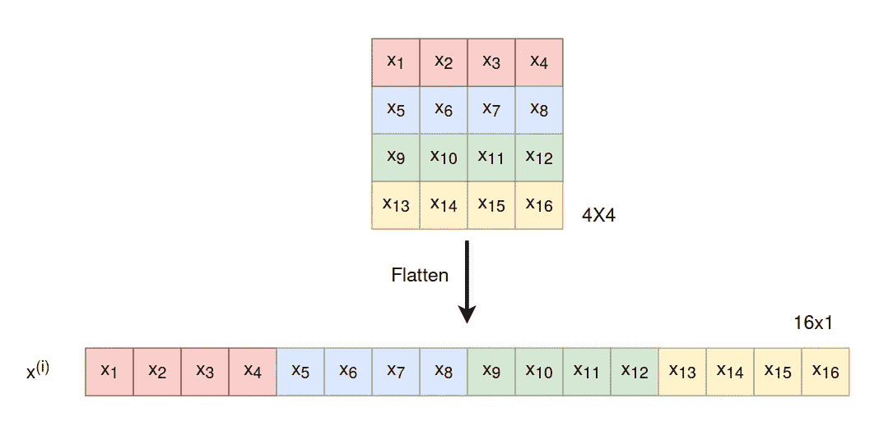
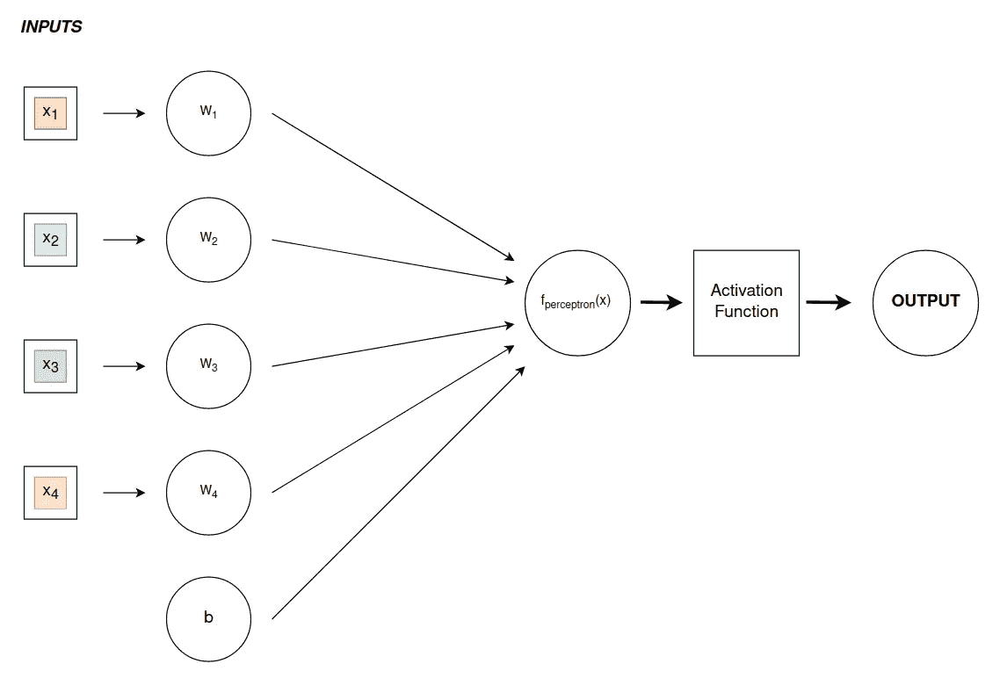
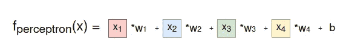
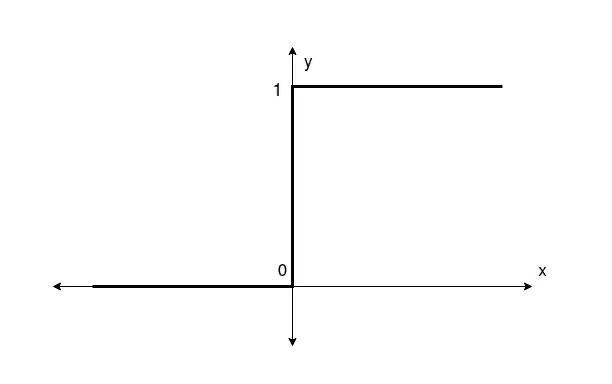
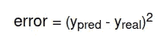
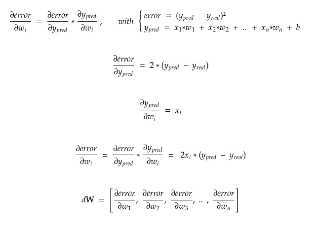
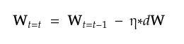
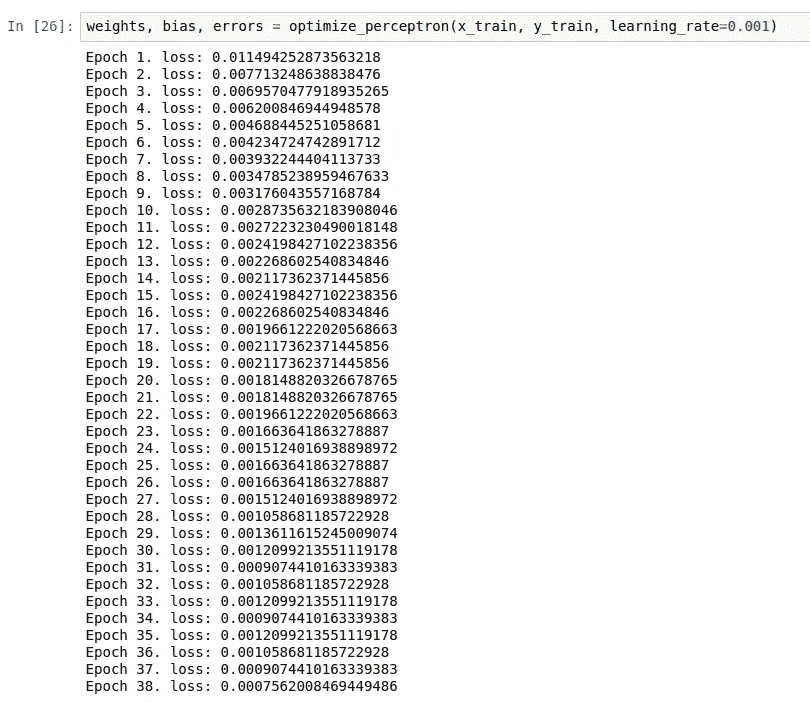
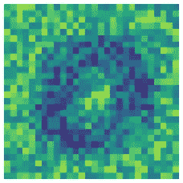
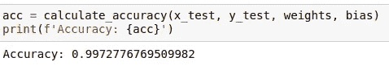

# 基于单层感知器的数字分类

> 原文：<https://towardsdatascience.com/digit-classification-with-single-layer-perceptron-9a4e7d4d9628>

## 从零开始构造单层感知器及其在二进制数字分类中的应用

在 [Unsplash](https://unsplash.com?utm_source=medium&utm_medium=referral) 上由 [Waldemar Brandt](https://unsplash.com/@waldemarbrandt67w?utm_source=medium&utm_medium=referral) 拍照

G 一般来说，当一个人要对图像应用监督学习技术时，首先想到的是利用卷积神经网络(CNN)。事实上，这种类型的神经网络最适合这种类型的任务，主要是由于维数的减少。

如果我们想象一个图像数据集，其中的图像已经被展平(例如，一个 4x4 矩阵的图像被转换为 16 维向量，如图*图 1* 所示)，这些图像是 n 维空间中的数据点，其中 n 是图像中的像素数。可以推断，当我们谈论图像时，数据的维度是巨大的，因此这意味着在神经网络中有大量的参数，这反过来导致更高的计算成本和执行时间。CNN 在神经网络的每一层中减少了图像的维度，也减少了训练中所需的参数数量，并优化了这类任务的模型性能。有关 CNN 的更多信息可在本出版物中找到:

 [## 卷积神经网络综合指南 ELI5 方法

### 人工智能见证了人类能力差距的巨大增长…

towardsdatascience.com](/a-comprehensive-guide-to-convolutional-neural-networks-the-eli5-way-3bd2b1164a53) 

**图一。**图像的展平。作者图片

另一方面，本文旨在通过单层感知器来解决数字图像的二进制分类，这是一种比 CNN 更简单、更古老的架构，因此尽管其起源过早，但仍展示了其巨大的潜力，并为任何想要了解深度神经网络(DNNs)和最新深度学习模型如何工作的人提供了一个良好的起点。

## 感知器

感知机是由心理学家弗兰克·罗森布拉特在 1957 年发明的，它由一个能够执行二元分类任务的线性鉴别器组成。虽然感知器很快就开始用于使用数字特征来训练它的分类，但 Rosenblatt 最初的目的是使用感知器进行图像分类，这最终在 1962 年实现，并在这里再次复制。

感知器可以很容易地理解为一个数学函数，因为它接收大量的输入并从中获得一个结果。这些输入是训练数据集中数据点的每个维度的值。正如我们之前所说，当我们处理展平的图像时，数据点属于一个 n 维的空间，其中 n 是像素的数量。感知器因此接收 n 个输入。

**感知器。**作者图片

上图中感知机的数学函数定义如下。当 y 为 0 时，该等式是 n 维空间上的超平面的等式(0 = **w x** + b，其中 **w** 和 **x** 都是 n 维向量)，该等式将用于根据数据点在超平面的哪一侧来将点分类为一类或另一类。

**感知器的数学函数。**作者图片

所以感知器接收输入向量 ***x*** ，但是 ***w*** 和 *b* 在函数中取什么值呢？这些值分别是权重和偏差，是感知器在训练过程中必须学习的参数。

此时，感知器的高级操作被定义:它接收一个 n 维向量作为输入，用训练好的权重应用它的函数，并返回一个值；这个值将是负的或正的，这取决于它在划分超平面的哪一侧。

感知器的结果，如上所述是正值或负值，通过激活函数映射到其相应的类。这个功能可以在*图 2 中看到。*，映射到 0 或 1 时称为阶跃函数。

**图二。**步进功能。作者图片

用于从感知器获得预测的代码以及激活函数的定义如下所示。

只剩下一件事需要理解。感知器如何学习哪些权重是最佳的，以最佳地执行分类？接下来的步骤将展示负责优化感知器权重的算法的逻辑，以及实现它的代码。

## **1。正向传播**

首先，将训练数据集中的一个数据点加载到感知器中，并计算感知器函数的结果。对这个输出应用激活函数得到最终预测，最后通过比较预测值和真实值得到损耗。

要最小化的变量**误差**或**损失**通过对实际值和预测值之间的差值求平方来计算(在这种特殊情况下)，如下所示。

**误差/损失函数。**作者图片

在这种情况下，前向函数将利用它已经做出的预测来计算误差和误差对预测 y 的偏导数(计算该偏导数的原因和有用性在下面的步骤中解释)。

## 2.**反向传播**

计算损失相对于每个权重的偏导数。这些都是通过应用链式法则来计算的，链式法则将导数一分为二，大大简化了计算过程。这些偏导数是在感知器中的每个权重上计算的，并将在以后的优化过程中使用。

计算这些偏导数(更好地称为**梯度**)的理论原因是，它们形成了一个向量，指示在何处更新感知器的权重向量( ***w*** ),以使损失最小化。为了更好地理解它，如果我们考虑三维图中的损失函数 r(看起来像一组山)，梯度向量( *d* ***W*** )将具有 3 个值/维度，将指示到达局部或全局最小值(或者继续类推，到达山的最低点)所遵循的方向，从而允许我们在每次迭代中最小化损失。有关渐变的更多信息，请访问本文:

 [## 什么是机器学习中的梯度？-机器学习精通

### 梯度是最优化和机器学习中常用的术语。例如，深度学习神经网络是…

machinelearningmastery.comwei](https://machinelearningmastery.com/gradient-in-machine-learning/) 

下面你可以看到基于链式法则计算偏导数的数学发展。

## 3.权重更新

权重按照下面所示的等式更新(注意， ***W*** 和 ***w*** 沿着文章可互换使用)。导数向量 *d* ***W*** 已经从反向传播步骤中获得，并且学习速率 ***η*** 是由用户设置的超参数，其将影响感知机学习的速度。非常低的值会导致算法陷入局部最小值，而太高的值会使算法永远不会收敛。因此，学习率是一个必须仔细确定的参数，通常通过试错法或基于以前的研究。

## 4.优化感知器

优化将存在于一个循环中，该循环将重复上述三个步骤，重复用户想要的**个时期**(迭代)。每次迭代将选取训练数据的每个值，对其应用前向传播和后向传播，并相应地更新权重。

感知器的底层功能已经被理解，将其应用于图像的二值分类是可行的。

## 数字分类

单层感知器只能进行线性分离，因此只能进行二进制分类，所以只能从数据集中的 9 个数字中选择两个数字。在这种情况下，选择 0 和 1，因为在计算机科学的应用中，机器可以提供更大的效用来分类 0 和 1。除了提取与所选数字对相关的数据之外，还需要将标签的值转换为 0 和 1(在这种情况下没有必要，因为标签已经是 0 和 1，但是对于任何其他值对来说都是如此)，或者改变激活函数，以便将感知器的输出映射到一个值或另一个值。映射到 0 和 1 的常量激活函数，以及将任意一对数字的标签更改为 0 和 1 的数据预处理管道，似乎是这项任务的最佳选择。

第一步是加载数据集并过滤标签为 0 和 1 的实例。然后，创建一个训练集和测试集，并依次划分为用于训练的标签和特征。此外，数据点被重新调整为 0 到 1 之间的值。

如前所述，感知器接受一个向量作为输入，该向量的维数与图像中的像素数一样多。许多图像数据集将图像存储为矩阵，因此在这种情况下，有必要将这些矩阵转换为矢量。还需要注意的是，数据集通常以 CSV 文件的形式出现，由于其表格性质，很难将图像存储为矩阵。因此，大多数 CSV 格式的图像数据集将图像存储为矢量而不是度量。

在这种特殊情况下，要使用的数据集包含作为向量的数据点，因此在预处理期间没有必要展平图像。然而，在下面你可以看到在矩阵形式的图像数据集上展平图像的代码。这只是将每个数据点从一个矩阵*m×l*重新整形为一个矢量*n×1*，即*n = m×l*。

一旦数据被预处理，之前构建的感知器被训练。在***optimize _ perceptron()*****函数的主 *while* 循环的条件中可见，为训练设置的两个停止条件是时期数和误差:如果达到最大时期数或损失低于给定阈值，则训练结束。**

****

**现在权重已经被优化了，有趣的是注意到感知机学到了什么。经过训练的权重向量在视觉上不能给出太多信息，但是如果将其转换为 28×28 矩阵，我们将能够看到感知器给予训练图像的哪些像素更大的重要性。**

****

****训练过的重量。**作者图片**

**感知器的权重显示零的形状！画出 0 形状的像素具有暗色调，这意味着这些权重是负的并且具有高绝对值。因此，当这些像素通过接收零而被激活时，感知器的结果将是负的，因为那些权重是负的。相比之下，1 预期通过图像的中心，因此具有正值的重要权重在图像的中心，从而当感知器接收到 1 的图像时，其输出为正。用测试数据集评估感知机的准确性将确认机器已经学会区分类别，正如权重形成的图像似乎显示的那样。**

**通过获得测试数据集中所有图像的预测，并将正确预测的数量除以总预测来计算准确度函数。函数的实现可以在我的 GitHub 资源库中找到。**

****

****准确度。**图片由用户提供**

**感知器取得了 99.72%的准确率，令人难以置信的好成绩！它成功地对测试数据集中的 2204 幅图像中的 2198 幅进行了正确分类，这意味着它已经正确地学习了该任务，并且能够将该知识推广到它从未见过的图像。**

## ****结论****

**在观察了在二进制数字分类中获得的结果之后，可以说 Frank Rosenblatt 在建立图像分类器的愿望方面做得非常好。此外，深度学习领域年复一年的进步表明，罗森布拉特奠定了该学科绝大多数发展所基于的基础。**

**最后，值得注意的是，在像数字分类这样复杂的任务中，从 1957 年的算法中可以获得的结果是惊人的。虽然感知器的性质排除了多类分类，但通过将若干训练与数字对的所有组合相结合，可以构建 9 类数字分类器，这在当时是一项真正令人惊叹的技术！**

## **完整代码**

**所有的功能都可以在我的 GitHub 存储库中找到，还有一个真实的运行示例 Jupyter Notebook 和用于训练的数据集。**

**尽管如此，尝试理解其功能，并亲自对其进行编程仍然是一个很好的练习！**

**如果你喜欢这篇文章和/或觉得它有用，请关注我以后的文章，分享这篇文章，这样其他人也可以学习。非常感谢您的阅读和支持！**

****GitHub 库**:**

** [## GitHub-Javier mtz 5/人工智能

### 此时您不能执行该操作。您已使用另一个标签页或窗口登录。您已在另一个选项卡中注销，或者…

github.com](https://github.com/JavierMtz5/ArtificialIntelligence)** 

## **数据**

**本文使用的数据摘自 ka ggle competition**数字识别器**的名为 *train.csv* 的数据集，可以在下面的链接中找到。该数据集在[知识共享署名-共享 3.0 许可](https://creativecommons.org/licenses/by-sa/3.0/)下可用。**

** [## 数字识别器

### 用著名的 MNIST 数据学习计算机视觉基础

www.kaggle.com](https://www.kaggle.com/competitions/digit-recognizer/overview)**