# 数字艺术摊牌:稳定扩散、DALL-E 和中途

> 原文：<https://towardsdatascience.com/digital-art-showdown-stable-diffusion-dall-e-and-midjourney-db96d83d17cd>

## 从文本提示创作新作品的流行人工智能扩散模型的比较

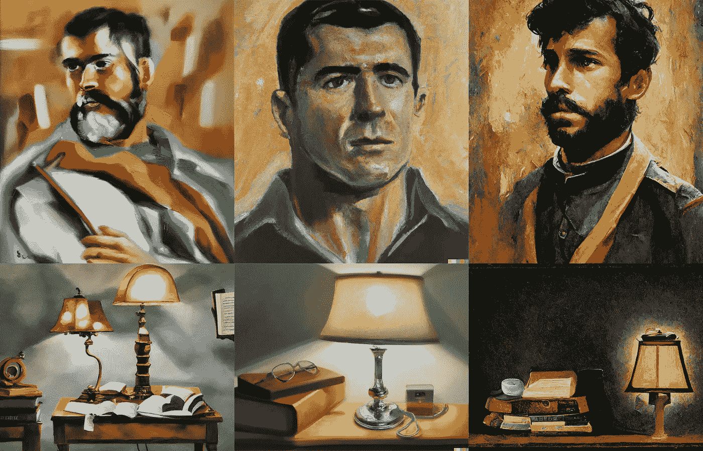

**“一个专注的葡萄牙人的油画”和“一个放着灯、书和老花镜的床头柜的油画”** **由稳定扩散渲染**(左) **DALL-E** (中)**(右)，图片由作者提供**

**我之前写过[关于使用 OpenAI 最新的 DALL-E [1]模型从文本提示中创建数字艺术。在这篇文章中，我将 DALL-E 与另外两个流行的文本到图像模型进行比较，这两个模型分别是 LMU 慕尼黑的 CompVis 集团的 Stable Diffusion 和 Midjourney [3]，这两个模型是由同名的研究实验室开发的。](https://medium.com/towards-data-science/exploring-dall-e-for-digital-art-creation-b244e1a2ed12)**

**我将从扩散模型的一些背景信息开始，它是这里描述的所有三个系统的基础。然后，我将讨论我如何使用同样来自 OpenAI 的 CLIP 模型[4]来自动计算客观指标，以使用一种称为对比相似性测试的新技术来判断生成的艺术。**

**接下来，我将详细介绍这三种型号，并讨论可用的功能和成本。然后我将展示当我发送 16 个不同的提示时，这三个系统创造了什么，展示美学质量和提示相似性的度量。我将通过总结最好的系统来结束这场对决，然后进行简短的讨论。**

# **扩散模型**

**扩散模型是机器学习(ML)系统，最初设计用于从图像中去除噪声。随着降噪系统的训练时间越来越长，变得越来越好，它们最终可以从纯噪声作为唯一的输入生成逼真的图片[5]。**

**最近，扩散模型已经取代生成对抗网络(GANs)成为最先进的图像生成器。2021 年 6 月，OpenAI 发表了一篇名为“扩散模型在图像合成上击败了 GANs”的论文。[6]作者是这样说的。**

> **扩散模型是一类基于似然性的模型，其最近被证明产生高质量的图像，同时提供期望的属性，例如分布覆盖、固定的训练目标和容易的可伸缩性。这些模型通过逐渐去除信号中的噪声来产生样本，并且它们的训练目标可以表示为重新加权的变分下界。…[通过]改进模型架构，然后通过设计一个用多样性换取保真度的方案…我们实现了一个新的艺术状态，在几个不同的指标和数据集上超过了 GANs。**

**扩散模型的作者在数百万个文本/图像对上训练他们的系统，因此当你输入文本提示时，系统将交互式地生成与提示匹配的新图像。例如，下一节中的截图显示了提示“秋林印象画”的结果**

# **认识一下竞争者**

## **稳定扩散**

**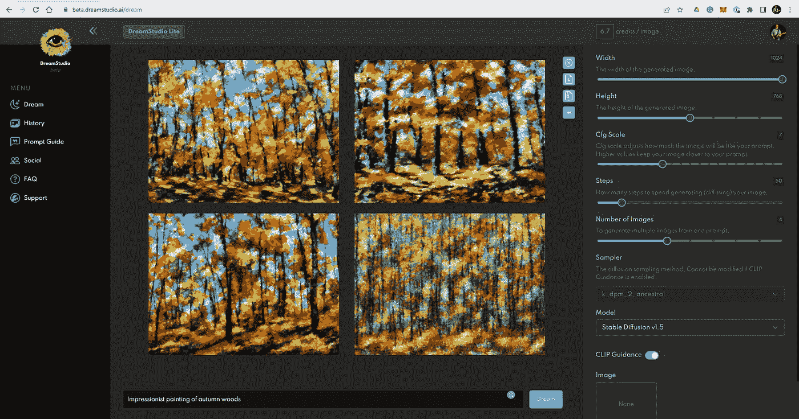**

****使用稳定扩散的 DreamStudio 用户界面**，图片由作者提供**

**摊牌中的第一个扩散模型是稳定扩散。康普维斯集团在 LMU 慕尼黑开发了它。该模型是与[稳定 AI](https://stability.ai/) 和[跑道](https://runwayml.com/)联合开发的。**

**该模型的组件图显示了输入图像(x)如何在扩散过程中被编码成“潜在空间”并被解码成输出图像(x̄).解码过程在使用文本、图像等的训练期间受到限制。**

**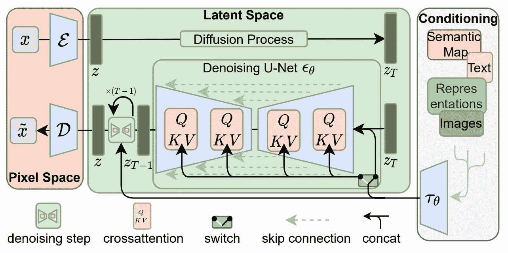**

****稳定扩散分量图**，图片来自[康普维斯论文](https://arxiv.org/pdf/2112.10752.pdf)**

**作者将其作为一个开源项目发布在 GitHub 上，并作为一项商业服务发布，它有一个简单易用的网络用户界面，名为 DreamStudio。我使用了 DreamStudio 服务进行这次摊牌。**

## **达尔-埃**

**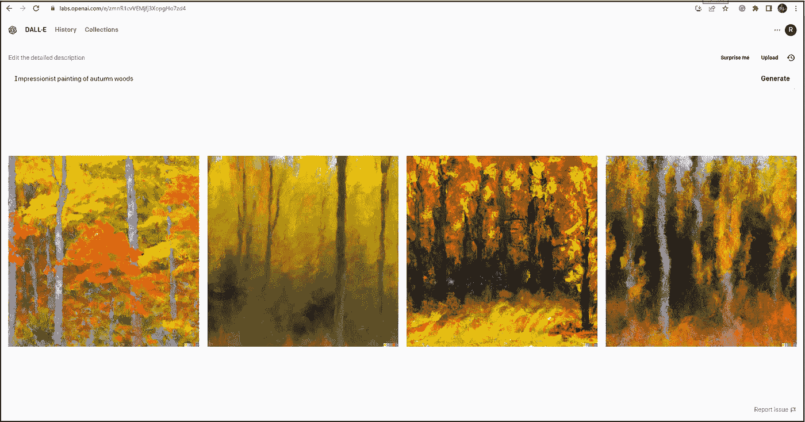**

****DALL-E 用户界面，**作者图片**

**被称为 DALL-E 的系统是 OpenAI [1]开发的扩散模型的第二次迭代，它与他们称为 CLIP [4]的图像/文本编码系统结合使用。在本文中，图像到文本的扩散模型被称为解耦模型。论文的组件图展示了 CLIP 的工作原理，以及该模型如何从文本提示中呈现图像。**

**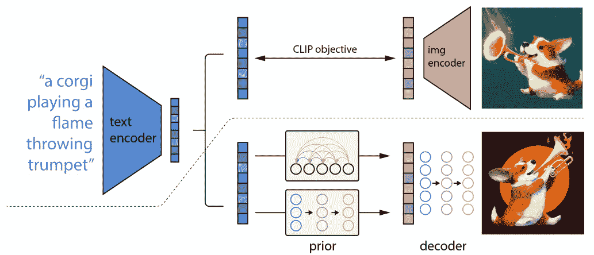**

****解开元件图**，图像来自 [OpenAI 的论文](https://cdn.openai.com/papers/dall-e-2.pdf)**

**为了摊牌，我使用了 OpenAI 的 DALL-E 商业服务。**

## **中途**

**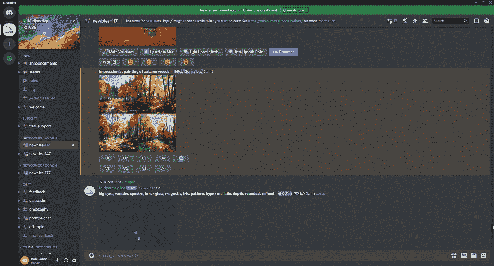**

****中途用户界面，**作者图片**

**Midjourney 是一个商业文本到图像的扩散模型，由一个也叫 Midjourney 的研究实验室创建。该组织由 David Holz 领导，他曾是 Leap Motion 的创始人之一。中途系统使用[不和谐频道](https://www.midjourney.com/home/)上的机器人作为用户界面，结果显示在账户[这里](https://www.midjourney.com/app/)。**

# **比较系统**

## **特征**

**这三个系统都将从文本描述中创建图像。例如，这里有一些来自提示的图像，“秋天树林的印象派绘画。”**

**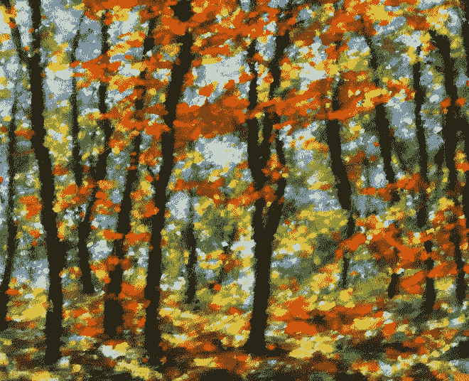****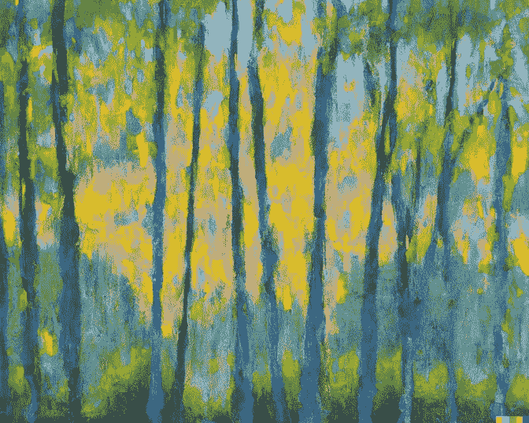****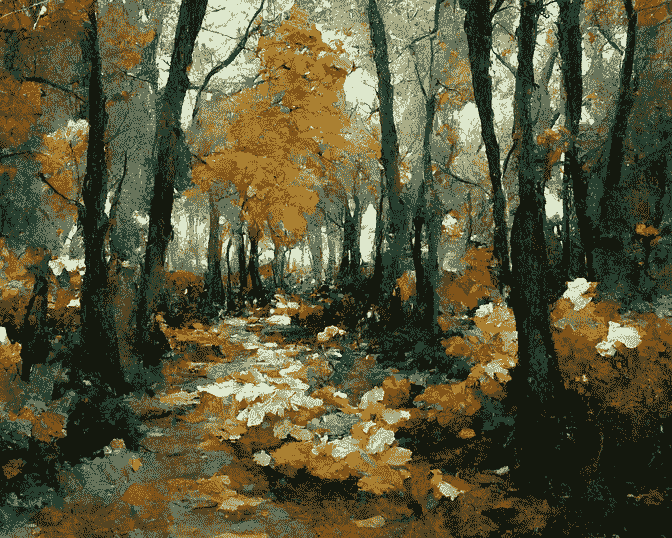**

****《印象派秋林图》稳定扩散渲染**(左) **DALL-E** (中)**中途**(右)，图片作者**

**DreamStudio 和 Midjourney 中的稳定扩散模型有设置屏幕，您可以在其中调整各种参数。对于 DreamStudio，设置在用户界面中的图像旁边。对于中途，键入“/settings”在 Discord 服务器中调出 UI。DALL-E 本身没有任何设置。只有文本提示可用。**

**这是 DreamStudio 和 Midjourney 的设置界面。**

**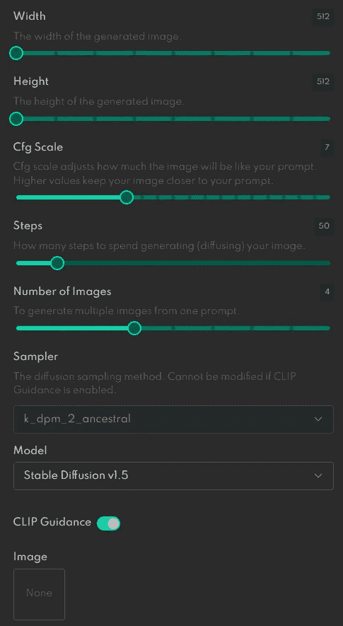****

**稳定扩散设置**(左)和**中途设置**(右)，图片由作者提供** 

**如你所见，这两个系统有很多选择。大多数设置都是自我描述的，而且它们都工作得很好。然而，对于我的摊牌项目，我只使用了默认值。**

## **图像尺寸**

**这三种型号以不同的图像尺寸运行，但是每一种都有进一步调整大小的选项。**

**DreamStudio 中的稳定扩散模型默认使用 512x512 的图像大小，但是您可以使用 64 像素增量的设置将图像大小放大到 1024x1024。我用 1024 作为最长的尺寸创建了大多数来自稳定扩散的图像，除了肖像，我用了 512x640。原因是较大的 832x1024 图像经常有“幻影”部分人出现在构图中，而较小的 512x640 图像只有一个人出现。你可以在下面的例子中看到不同之处。**

**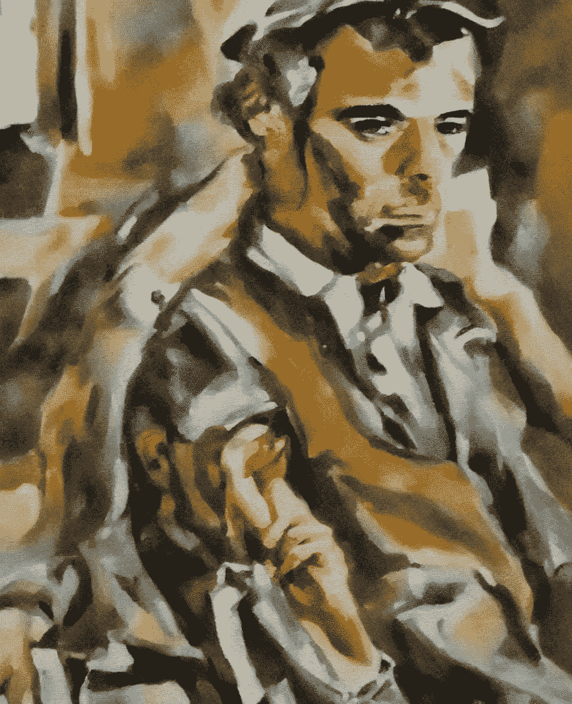****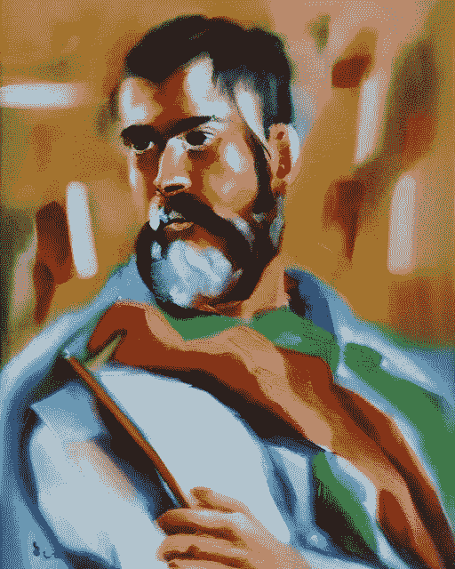**

****“一个专注的葡萄牙人的油画”，以 832x1024** (左)**、512x640** (右)的稳定扩散渲染，图片由作者提供**

**请注意，左边的图像在左下方看起来有一个人的一部分，而右边的图像只显示了一个人。DALL-E 和 Midjourney 系统没有这个问题。**

**DALL-E 型号创建的图像本身为 1024x1024。该系统还提供了一个选项，使用“添加生成帧”功能来放大图像和更改纵横比。在下面的例子中，你可以看到我是如何通过延长肖像来显示这个人的头顶和躯干的一点点来增加长宽比的。**

**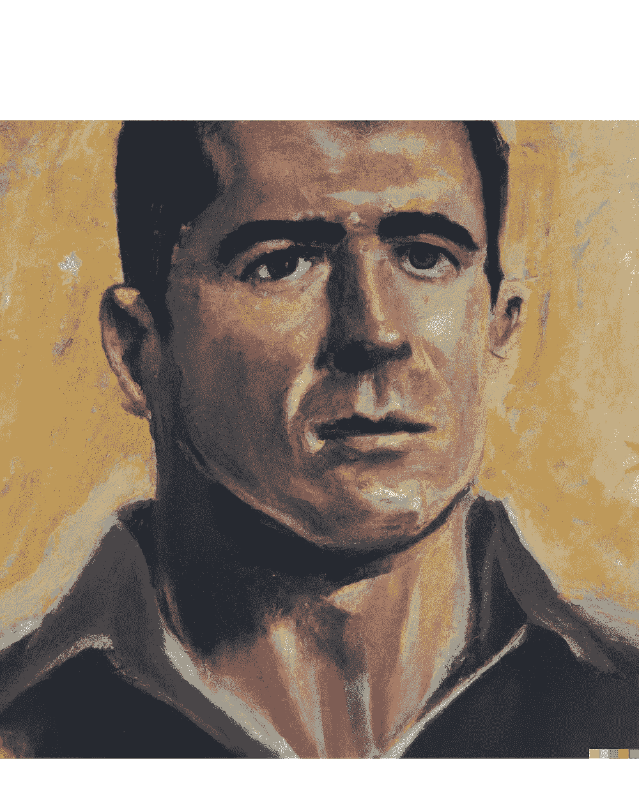****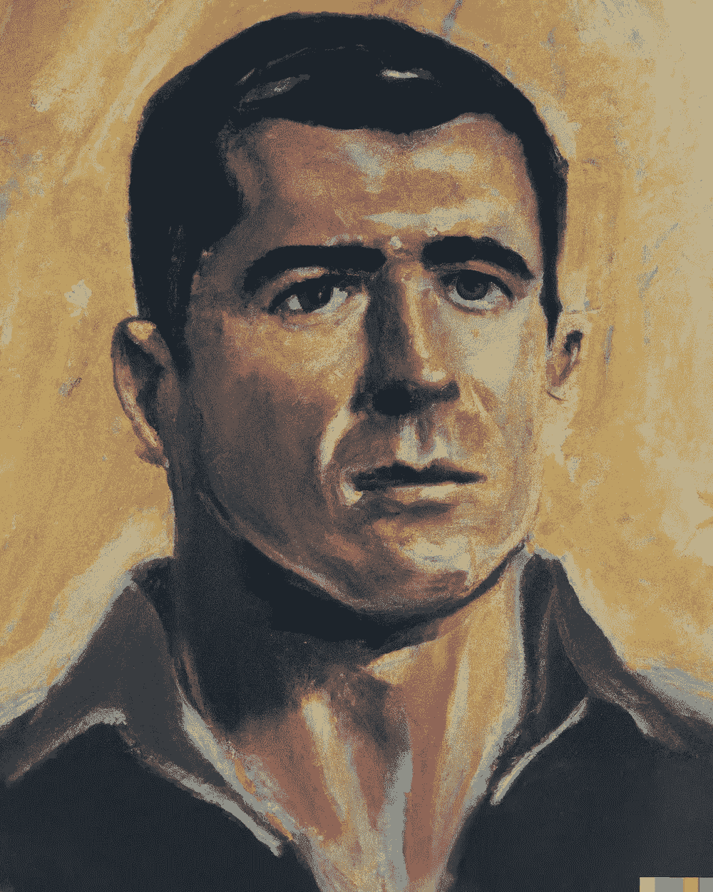**

****“一个专注的葡萄牙人的油画”，以 1024x1024** (左)**和 1024x1280** (右)的比例在 DALL-E 上绘制，图片由作者提供**

**您可以看到 DALL-E 系统如何出色地按照原画的风格渲染图像的缺失部分。**

**默认情况下，Midjourney 以 256x256 的分辨率从文本提示中渲染图像。系统允许用户使用命令行参数随意指定纵横比，即- ar 4:5。使用此纵横比可以生成四幅 256x320 的图像。该系统还允许用户将选定的图像放大 4 倍，达到 1024×1280 的宽高比。调整大小算法使用提示来添加上下文细节。这是一个中途放大的图像的例子。**

**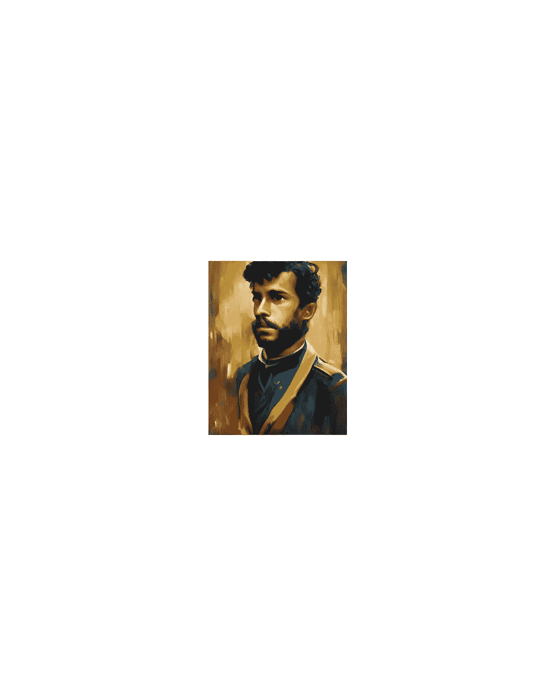****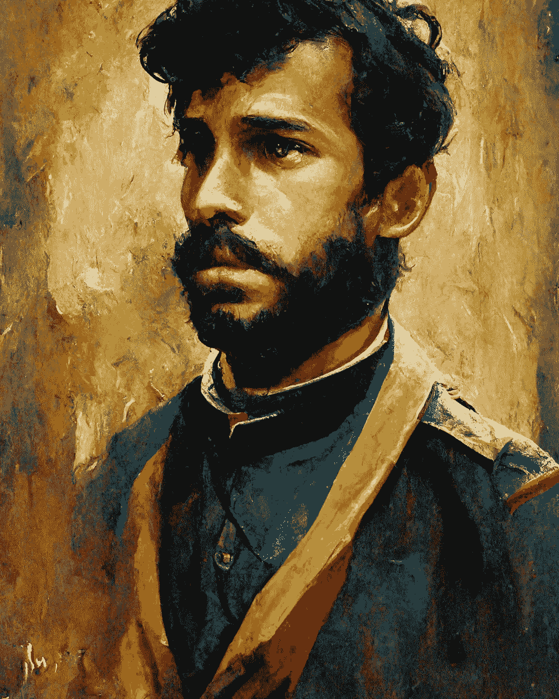**

****“一个专注的葡萄牙人的油画”，中途以 256x320** (左)**、1024x1280** (右)渲染，图片由作者提供**

**你可以看到 Midjourney 是如何在这个人的脸上添加细节，并在笔触中添加额外的细节。**

# **定价**

## **梦工厂定价**

**虽然在 [GitHub](https://github.com/CompVis/stable-diffusion) 上有一个免费的开源版本的 Stable Diffusion，但是它没有任何 DreamStudio 中可用的漂亮 UI 特性。在定价方面，这项服务使用信用系统。当你注册的时候，他们会免费给你 200 学分。收费点数取决于图像的大小和创建图像的“步骤”数量。按照目前的价格，创建一个默认步数为 50 的 1024x1024 图像将花费 9.4 个信用点。所以你可以免费生成 21 张高分辨率的图像。您可以再花 10 美元购买 1000 个积分。在这个价格下，生成 512x512 大小的 50 步图像需要 1 美分，1024x1024 需要 9.4 美分。更多关于 DreamStudio 定价的信息请点击[这里](https://beta.dreamstudio.ai/faq)。**

## **DALL-E 定价**

**DALL-E 也使用信用系统。生成四张带提示的图片需要一个积分。注册时你可以获得 50 个免费学分，每个月还可以额外获得 15 个学分。你可以再花 15 美元购买 115 个积分。一组 4 张图片 13 美分，每张 3.2 美分。更多关于 DALL-E 免费信用的信息可以在这里[获得](https://help.openai.com/en/articles/6399305-how-dall-e-credits-work#:~:text=You%20get%2050%20free%20credits,will%20refill%20on%20September%203rd.)，信用定价信息在这里[获得](https://openai.com/blog/dall-e-now-available-in-beta/)。**

## **中途定价**

**Midjourney 有使用他们服务的包月计划。它基于为“GPU 分钟数”付费。您可以免费获得 25 分钟的 GPU 时间，并可以每月支付 10 美元获得 200 分钟的 GPU 时间。这相当于 4 幅图像 6.7 美分，每幅图像 6.7 美分以调整到 1024×1024。更多关于中途定价的信息请点击[这里](https://midjourney.gitbook.io/docs/billing#basic-membership-usd10-month-offers)。**

**概括地说，对于一个 1024x1024 的图像，DreamStudio 的成本是 9.4 美分，DALL-E 的成本是 3.2 美分，Midjourney 实际上是 13.3 美分。**

# **政策**

**像大多数在线服务一样，这三个系统都定义了它们的使用条款。**

## **DreamStudio 政策**

**以下是 DreamStudio 的使用条款。第一项是一个大项目。用户不拥有他们使用 DreamStudio 服务创建的图像。这些图像被自动发布到公共领域。请注意，这本身并不排除商业用途；只是用户不用为公共领域的作品付钱给你。声明:我不是律师。**

> **所有使用 DreamStudio Beta 和 Stable Diffusion beta Discord 服务的用户特此确认已阅读并接受完整的 CC0 1.0 通用公共域声明(可在[https://creative commons . org/Public Domain/zero/1.0/)，](https://creativecommons.org/publicdomain/zero/1.0/),)获取，其中包括但不限于前述对任何内容的知识产权的放弃。
> DreamStudio 测试版和 Stable Diffusion 测试版不应用于:
> -NSFW、淫秽或性材料
> -仇恨或暴力图像，如反犹太主义肖像、种族主义漫画、厌恶女性和厌恶男性的宣传等。
> -关于您自己或任何其他人的个人信息。这包括但不限于电话号码、居住地址、社会安全号码、驾照号码、账号等。
> -提示中应避免版权或商标材料。**

**DreamStudio 的完整使用条款是[这里是](https://web.archive.org/web/20221103091656/https://stability.ai/stablediffusion-terms-of-service)。**

## **DALL-E 政策**

**相比之下，OpenAI 允许 DALL-E 用户[拥有他们的图像，并将其用于商业目的](https://help.openai.com/en/articles/6468065-dall-e-content-policy-faq)。**

**以下是 DALL-E 内容政策的重点。**

> **在您的使用中，您必须遵守我们的内容政策:
> 不要试图创建、上传或共享非 G 级或可能造成伤害的图像。不要误导你的观众关于人工智能的参与。尊重他人的权利。请通过我们的帮助中心向我们的团队报告任何涉嫌违反这些规则的行为。**

**DALL-E 的完整使用条款在这里是。**

## **中途政策**

**对于用户创建的图像的所有权，Midjourney 区分了非付费用户和付费用户。非付费用户不拥有他们创建的图像，但 Midjourney 授予您这些作品的知识共享非商业性 4.0 归属国际许可证。另一方面，付费用户拥有他们创作的图片的版权，但会授予 Midjourney 完整的使用许可。**

**中途的完整使用策略是[这里是](https://midjourney.gitbook.io/docs/terms-of-service#4.-copyright-and-trademark)。**

**除了使用政策，Midjourney 还有一个内容审核政策。亮点如下。**

> **Midjourney 旨在通过 Discord 和成员画廊成为一个默认开放的社区。我们的规则状态内容必须是 PG-13，特别是，#rules 频道声明，
> 不要创建图像或使用本质上不尊重、攻击性或其他辱骂性的文本提示。任何形式的暴力或骚扰都是不可容忍的。
> 无成人内容或血块。请避免制作视觉上令人震惊或不安的内容。我们将自动阻止一些文本输入。**

**中途的整个内容审核策略是[这里是](https://midjourney.gitbook.io/docs/content-and-moderation-policy)。**

# **社会问题**

**《稳定扩散》和《DALL-E》的作者在论文中讨论了图像生成模型可能存在的社会问题。**

> **像图像这样的媒体生成模型是一把双刃剑:一方面，它们使各种创造性的应用成为可能，特别是像我们这样降低训练和推理成本的方法，有可能促进这种技术的使用，并使其探索民主化。另一方面，这也意味着创建和传播被操纵的数据或传播错误信息和垃圾邮件变得更加容易。特别是，故意操纵图像("深度伪造")是这种情况下的一个常见问题，尤其是妇女受到的影响更大。—罗宾·龙巴赫，LMU 慕尼黑康普维斯集团[2]**
> 
> **正如在 GLIDE 文件中所讨论的，图像生成模型带有与欺骗性和有害内容相关的风险。夹具的性能改进也提高了滑行的风险。随着技术的成熟，它会留下更少的痕迹和指示，即输出是人工智能生成的，这使得更容易将生成的图像误认为真实的图像，反之亦然。还需要对架构的变化如何改变模型在训练数据中学习偏差的方式进行更多的研究。阿迪亚·拉梅什等人。艾尔。，OpenAI [1]**

# **量化好的和坏的艺术**

**在我比较这三个模型的输出之前，我将讨论我开发的一项技术，这项技术完成了一项看似不可能的任务:使用自动算法为艺术品的美学赋予一个量化值。**

## **好艺术**

**为了看看算法是否可行，我先收集了 9 部我们社会认为不错的作品。我在谷歌搜索中输入“名画”，下面是一些出现的图片。**

**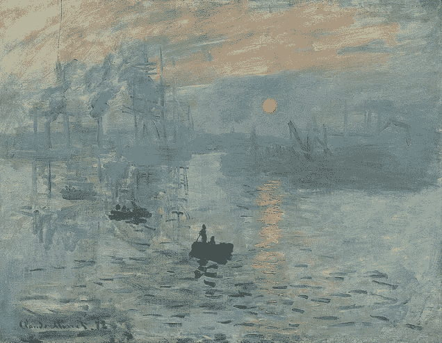****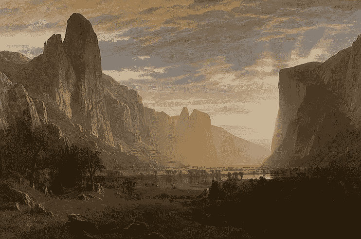****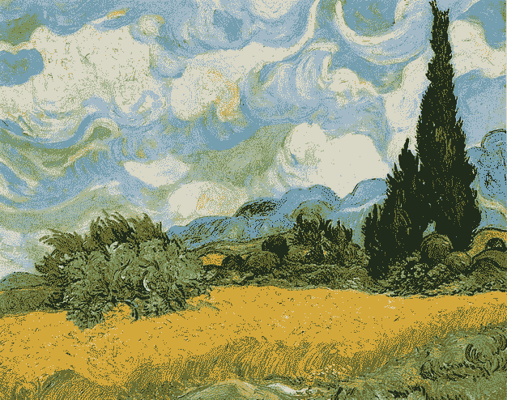****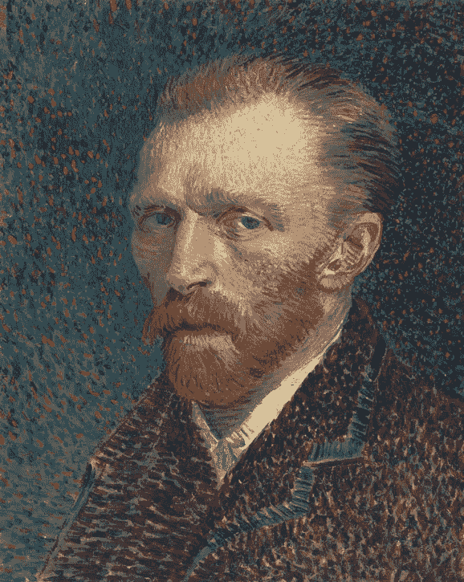****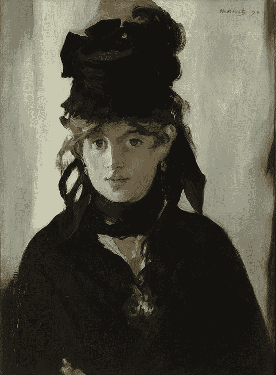****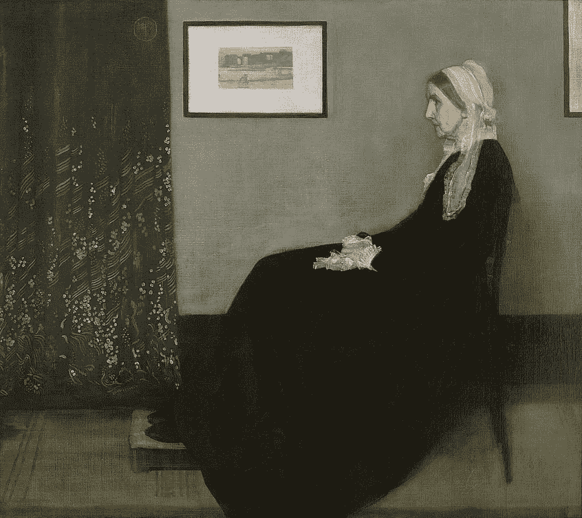****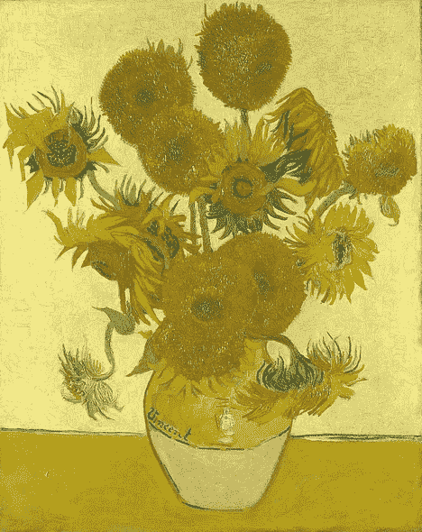****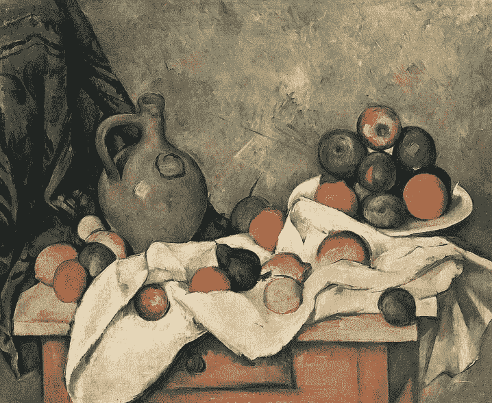****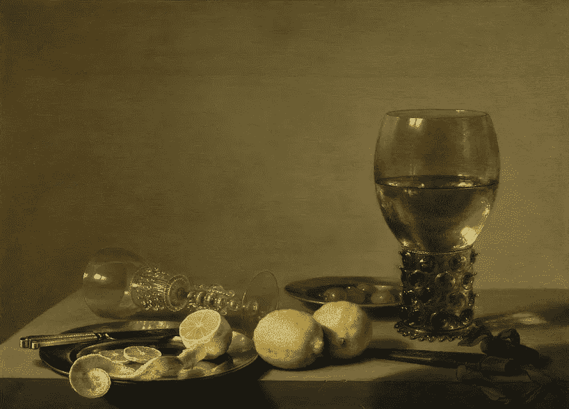**

**wikiart 的杰作。org ，第一排:**克洛德·莫内的《印象日出》、艾伯特·比尔兹塔德的《俯瞰约塞米蒂山谷》、**和**文森特·梵高的《在埃加利耶附近的高林河畔有柏树的麦田》、**第二排:**文森特·梵高的自画像、爱杜尔·马奈的《贝尔特·摩里索特带着一束紫罗兰》、**和**詹姆斯·麦克尼尔·惠斯勒的《惠斯勒的母亲》、**第三排:**文森特·梵高的《向日葵》、保罗 _ 的《窗帘、酒壶和水果》****

**如你所见，我选择了三幅风景画、三幅肖像画和三幅静物画。是的，收藏品中有三幅梵高的作品。**

## **糟糕的艺术**

**接下来，我需要挑选九幅“糟糕”的画。好消息是，在我居住的波士顿地区有一个糟糕艺术博物馆。我得到了博物馆“永久代理临时执行董事”的许可，在这篇文章中使用了他们收藏的一些画作。这里是烂艺术的集合。**

**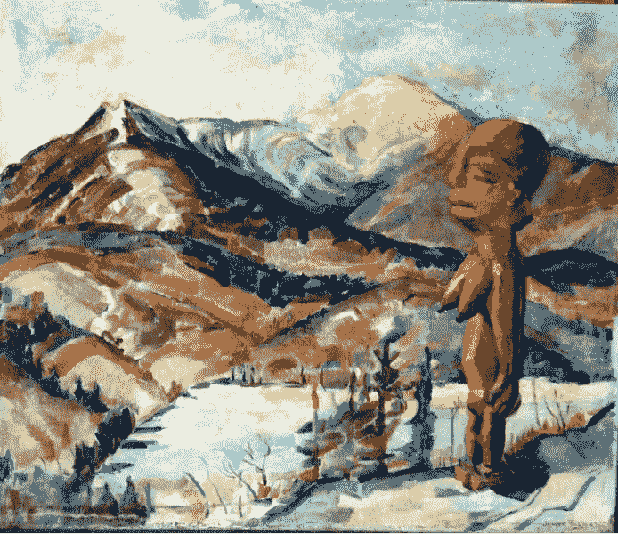****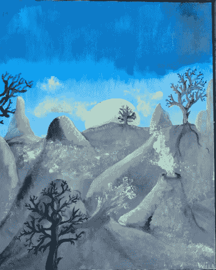****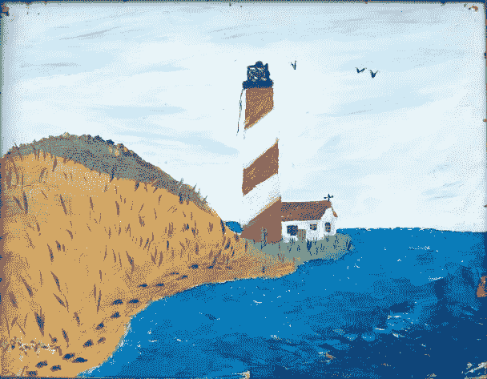****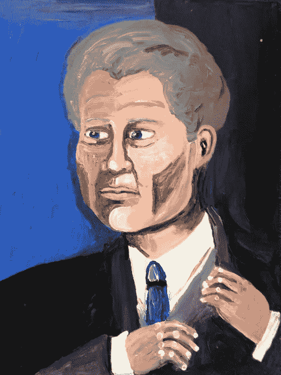****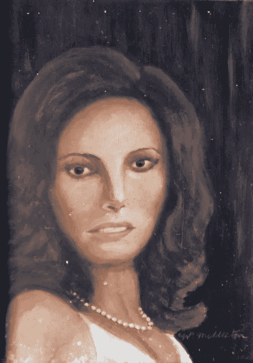****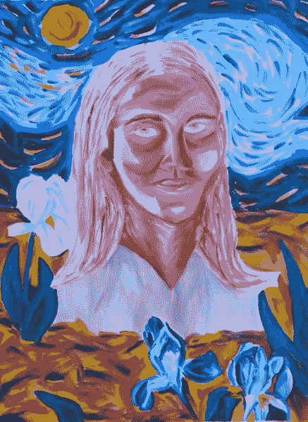****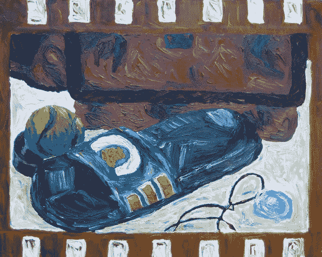****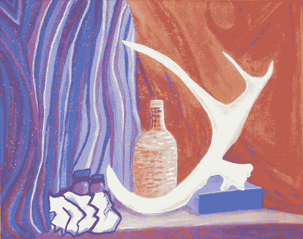****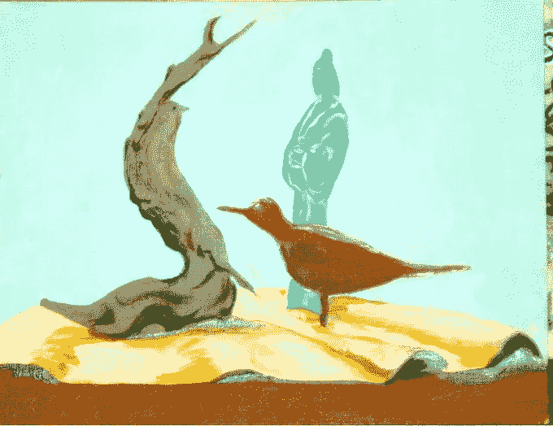**

****来自吟游诗人艺术博物馆的画作**，第一排:**难以辨认的复活节岛**，威尔的**新的一天，无名氏**的**灯塔，第二排:**简·道尔的克林顿总统，**米德尔顿的拉奎尔**，无名氏的**粉红女郎登高**，第三排:**人字拖，冰球，网球，钱包，无名氏的项链， 珍妮·加拉诺**的《鹿角静物》，匿名的**，**museumofbadart.org 的**图片，经许可使用****

**好吧，这似乎是一些真正糟糕的艺术，尤其是与上面的杰作相比。**

## **相似性测试**

**为了看看我是否可以使用剪辑模型来区分两组绘画，我首先将每幅图像的嵌入内容与短语“真正的艺术”和“好的艺术”的嵌入内容进行了比较，并绘制了图像和文字之间的相似之处。正如你在左下图中看到的，这并没有像我预期的那样把好的艺术和坏的艺术分开。事实上，在图表顶部附近有更多“糟糕”的绘画。**

**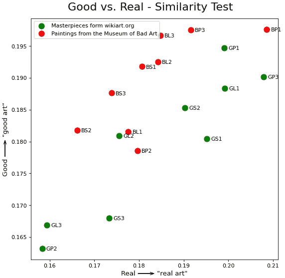****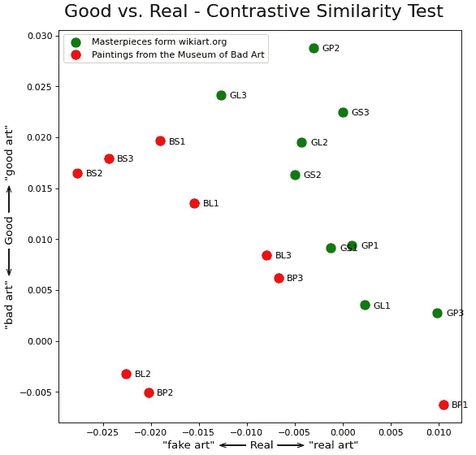**

## **对比相似性测试**

**我尝试了一下，发现诀窍是输入四个短语，“假艺术”、“真艺术”、“坏艺术”和“好艺术”，然后对结果做一点数学运算。在获得文本和图像嵌入的相似性之后，我使用下面的等式来获得我正在寻找的度量。**

**好因素=好艺术-坏艺术
真实因素=真实艺术-假艺术**

**你可以在右上图中看到结果。我称之为对比相似性测试，它似乎对我的 18 张图片样本很有效。**

**然后，我将好的和真实的因素结合起来，创建了一个单一的审美质量指标:审美质量=好的因素+真实的因素。以下是用这个标准衡量好的和坏的艺术作品的方法。**

**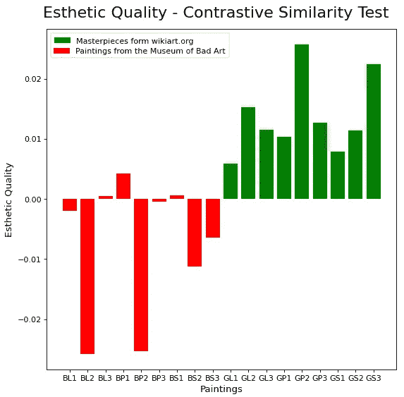**

****好画和坏画的审美质量**，作者图表**

**这似乎大体符合我对画作的分析。你可以看到比尔·克林顿的肖像(BP1)是坏中之好，莫奈的印象日出(GL1)是好中之坏。**

# ****渲染摊牌****

**为了测试这三个系统，我设计了 16 个提示，并输入它们来生成图像。**

```
**Landscapes** 1\. Impressionist painting of autumn woods
2\. painting of rolling farmland
3\. modern seascape with crashing waves
4\. realistic painting of the Boston city skyline**Abstract Paintings**
1\. abstract painting of triangles in orange
2\. block color painting with purple and green squares
3\. abstract painting with spheres in ocean blue
4\. splatter painting with thin yellow and black lines**Still Lifes**
1\. still life painting of a bowl of fruit
2\. Impressionist oil painting of sunflowers in a magenta vase
3\. still life painting of colorful glass bottles
4\. oil painting of a nightstand with lamp, book, and reading glasses**Portraits**
1\. Cubist painting of a man from the 1920s
2\. charcoal drawing of a young Brazilian woman
3\. oil painting of a focused Portuguese guy
4\. pastel painting of a concerned Korean woman
```

**然后，我通过 CLIP 运行结果，找到两个指标并绘制结果。**

**审美质量=良好因素+真实因素
提示相似度=余弦相似度(提示嵌入，图像嵌入)**

# **抽象画**

## ****提示:“橙色三角形抽象画”****

**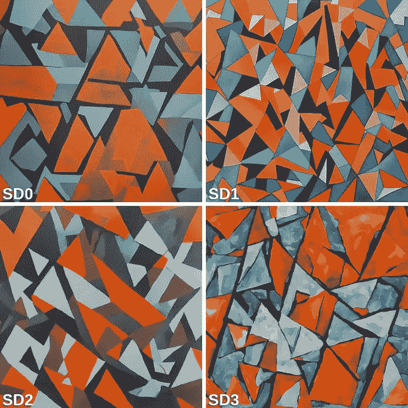****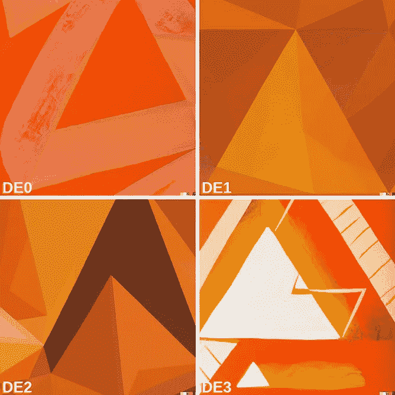****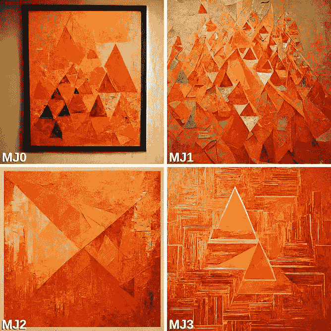**

****“橙色的三角形抽象画”在稳定扩散中渲染**(左) **DALL-E** (中)**midway**(右)，图片由作者提供**

**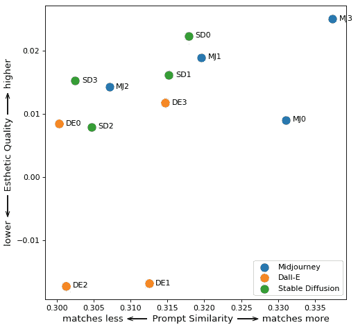**

****即时相似性与审美质量**，作者图表**

## **提示:“用紫色和绿色方块拼色绘画”**

**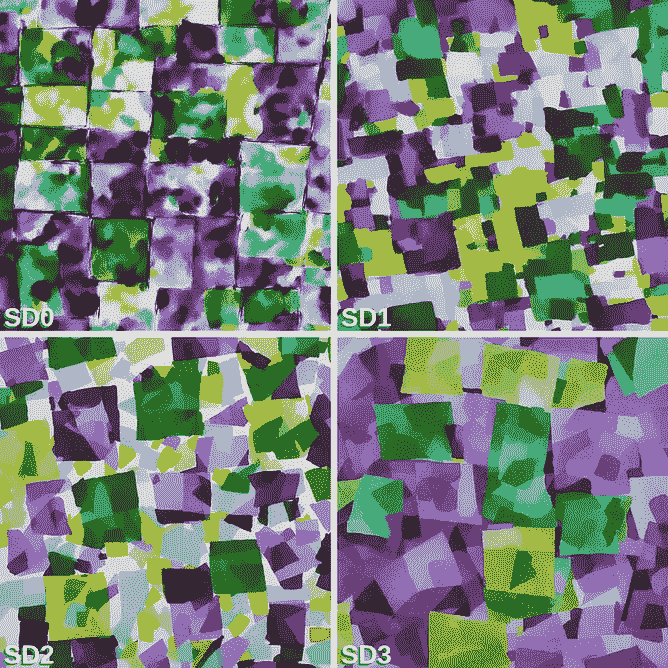****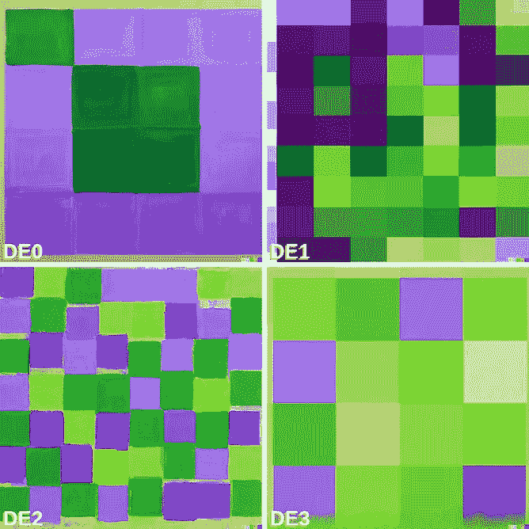****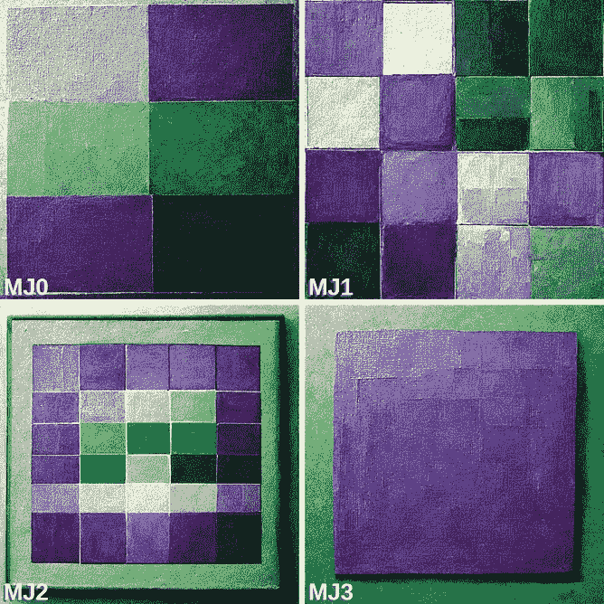**

****“带有紫色和绿色方块的块彩画”以稳定扩散渲染**(左) **DALL-E** (中)**midway**(右)，图片由作者提供**

**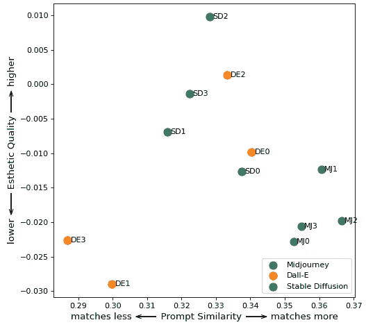**

****即时相似性与审美质量**，作者图表**

## **提示:“海洋蓝色球体抽象画”**

**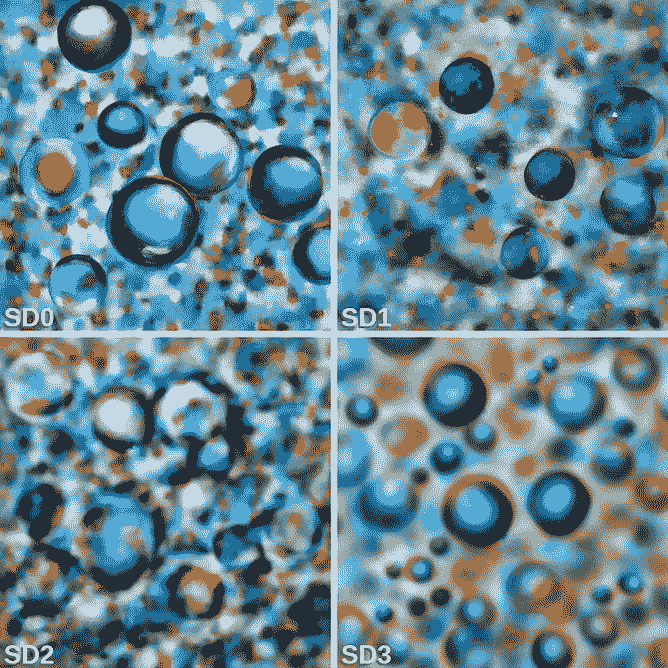****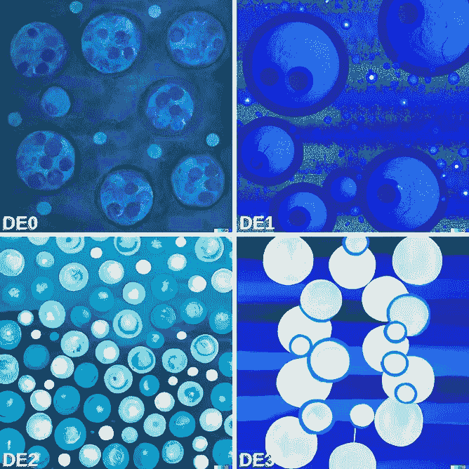****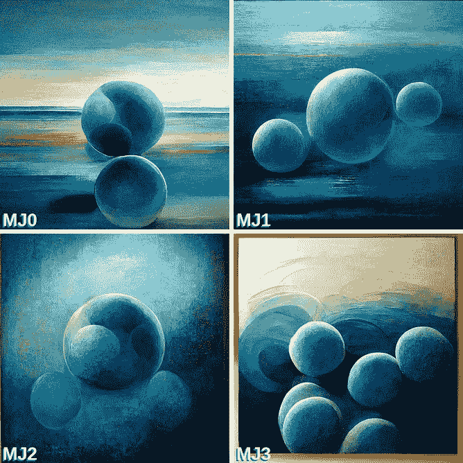**

****“海洋蓝色球体抽象画”** **渲染稳定扩散**(左) **DALL-E** (中)**中途**(右)，图片由作者提供**

**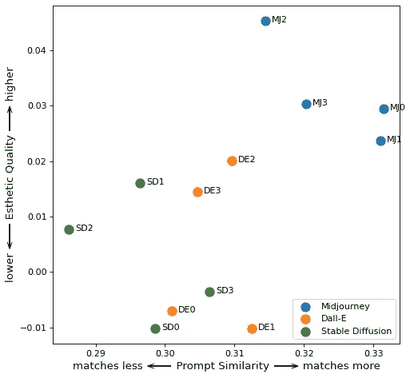**

****即时相似性与审美质量**，作者提供的图表**

## **提示:“带有黄色和黑色细线的飞溅绘画”**

**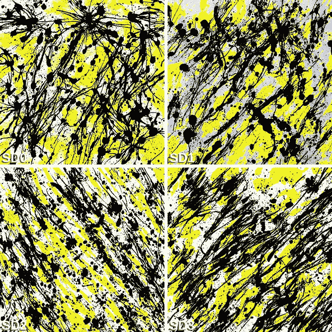**********

****“带有黄色和黑色细线的泼溅绘画”****(左) **DALL-E** (中)**中途**(右)，图片由作者提供****

********

******即时相似性与审美质量**，作者提供的图表****

# ****风景****

## ****提示:“秋天树林的印象派画作。”****

************************

******《秋林印象派绘画》** **渲染稳定扩散**(左) **DALL-E** (中)**中途**(右)，图片作者****

********

******即时相似性与审美质量**，作者图表****

## ****提示:“起伏农田画”****

************************

******《起伏农田图** **渲染》稳定扩散**(左) **DALL-E** (中)**中途**(右)，图片作者****

********

******即时相似性与审美质量**，作者提供的图表****

## ****提示:“海浪翻滚的现代海景”****

************************

******《惊涛拍岸的现代海景》****(左) **DALL-E** (中)**中途**(右)，图片作者******

********

******即时相似性与审美质量**，作者提供的图表****

## ****提示:“波士顿城市天际线的写实绘画”****

************************

******“波士顿城市天际线的写实绘画”** **渲染稳定扩散**(左)**达尔-E** (中)**中途**(右)，图片由作者提供****

********

******即时相似性与审美质量**，作者图表****

# ****静物****

## ****提示:“一碗水果的静物画”****

************************

******《一碗水果的静物画》渲染稳定扩散**(左) **DALL-E** (中)**中途**(右)，图片作者****

********

******即时相似性与审美质量**，作者图表****

## ****提示:“洋红色花瓶中的向日葵印象派油画”****

************************

******“洋红色花瓶中的向日葵印象派油画”在稳定扩散中渲染**(左)**达尔-E** (中)**中途**(右)，图片由作者提供****

********

******即时相似性与审美质量**，作者提供的图表****

## ****提示:“彩色玻璃瓶静物画”****

************************

******《五彩玻璃瓶静物画》渲染稳定扩散**(左) **DALL-E** (中)**中途**(右)，图片作者****

********

******即时相似性与审美质量**，作者提供的图表****

## ****提示:“有灯、书和老花镜的床头柜油画”****

************************

******“有灯、书和老花镜的床头柜油画”在稳定扩散中渲染**(左) **DALL-E** (中)**中途**(右)，图片由作者提供****

********

******即时相似性与审美质量**，作者图表****

# ****画像****

## ****提示:“20 世纪 20 年代一名男子的立体派画作”****

************************

******“20 世纪 20 年代一个人的立体派绘画”****(左) **DALL-E** (中)**midway**(右)，图片由作者提供******

********

******即时相似性与审美质量**，作者提供的图表****

## ****提示:“一个年轻巴西女人的素描”****

************************

******“一个年轻的巴西女人的炭笔素描”在稳定扩散中渲染**(左) **DALL-E** (中)，以及**中途**(右)，图片由作者提供****

********

******即时相似性与审美质量**，作者提供的图表****

## ****提示:“一个专注的葡萄牙人的油画”****

************************

******“一个专注的葡萄牙人的油画”****(左)**【DALL-E】**(中)**(右)，图片由作者提供********

************

********即时相似性与审美质量**，作者图表******

## ****提示:“一位忧心忡忡的朝鲜妇女的蜡笔画”****

************************

******“一个忧心忡忡的朝鲜女人的粉彩画”以稳定扩散的方式呈现**(左)、 **DALL-E** (中)、以及**中途**(右)，图片由作者提供****

********

******即时相似性与审美质量**，作者图表****

# ****结论****

****将所有数据合并到一个图表中，您可以看到 Midjourney 如何获得美学质量的最佳指标。虽然 DALL-E 有一些渲染图与提示最匹配，但与 Midjourney 相比，整体质量有所下降。根据数字和我的眼睛，稳定扩散似乎是三者中表现最差的系统。****

********

******提示相似性与审美质量的概述**，作者提供的图表****

****利用赋予我的权力，我在此宣布 midway 为这场对决的胜利者。****

# ****源代码和 Colabs****

****这个项目的所有源代码都可以在 [GitHub](https://github.com/robgon-art/digital-art-showdown) 获得。我在 [CC BY-SA 许可](https://creativecommons.org/licenses/by-sa/4.0/)下发布了源代码。****

********

****知识共享署名共享****

# ****感谢****

****我要感谢詹尼弗·林对这个项目的帮助。****

# ****参考****

****[1]a . Ramesh 等人的 DALL-E 2，[带剪辑潜在时间的分层文本条件图像生成](https://cdn.openai.com/papers/dall-e-2.pdf) (2022)****

****[2]r . Rombach 等人的稳定扩散，[利用潜在扩散模型的高分辨率图像合成](https://arxiv.org/pdf/2112.10752.pdf) (2022)****

****[3]中途[https://midjourney.gitbook.io/docs/](https://github.com/midjourney/docs)****

****[4]a .拉德福德等人的剪辑，[从自然语言监督中学习可转移的视觉模型](https://cdn.openai.com/papers/Learning_Transferable_Visual_Models_From_Natural_Language_Supervision.pdf) (2021)****

****[5] P. Dhariwal 和 A. Nichol，[扩散模型在图像合成上击败了 GANs](https://arxiv.org/pdf/2105.05233.pdf)(2021)****

****[6] J. Ho 和 C. Saharia，[使用扩散模型生成高保真图像](http://ai.googleblog.com/2021/07/high-fidelity-image-generation-using.html) (2021)****

****为了无限制地访问 Medium 上的所有文章，[成为了](https://robgon.medium.com/membership)的会员，每月支付 5 美元。非会员每月只能看三个锁定的故事。****