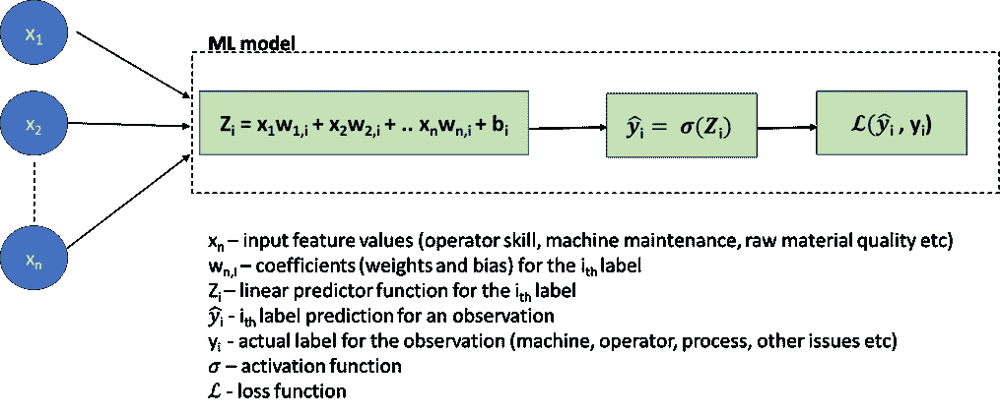
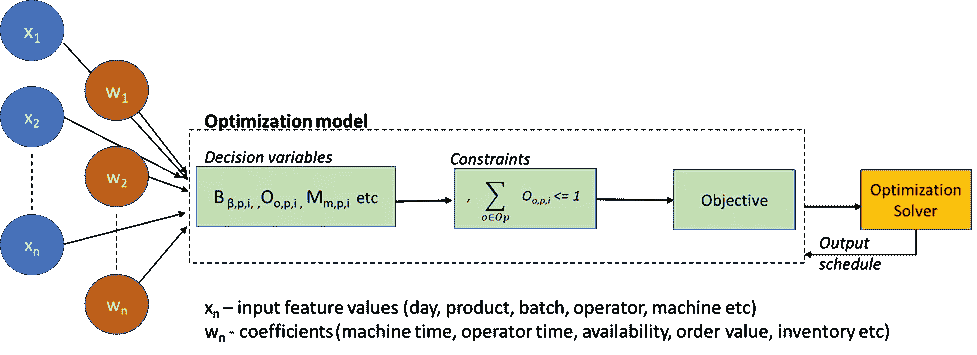
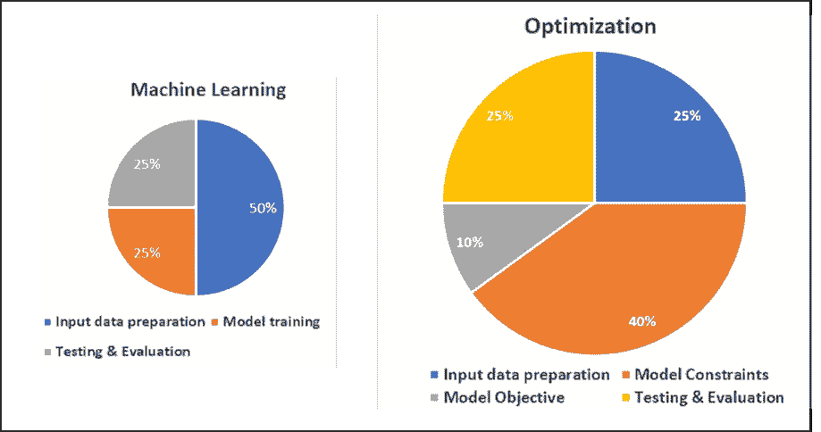

# 使用机器学习和约束优化的数字孪生建模

> 原文：<https://towardsdatascience.com/digital-twin-modeling-using-machine-learning-and-constrained-optimization-401187f2a382>

## 比较分析


Vishal Bansal 在 Unsplash 上拍摄的照片

如今，数据科学被广泛用于创建数字双胞胎，它们是真实世界物理系统或过程的数字副本，可用于模拟、预测输入行为、监控、维护、规划等。虽然这种数字双胞胎在认知客户服务机器人等日常应用中很常见，但在本文中，我将通过行业中的例子来比较用于建模两种不同类型双胞胎的数据科学技术。

本文中讨论的数字双胞胎的两个广泛使用的数据科学领域如下:

**a)** **诊断和预测分析:**给定一系列输入，Twin 应该能够诊断原因或预测系统的未来行为。基于物联网的机器学习模型用于创建智能机器和工厂，通过实时分析来自传感器的输入来诊断、预测，从而在问题和故障发生之前预防它们。

**b)** **说明性分析:**这是对整个网络进行模拟，在给定一组要遵守的变量和约束条件的情况下，从大量候选方案中确定最佳或可行的解决方案，通常目标是最大化规定的业务目标，如吞吐量、利用率、产量等。这些优化问题广泛用于供应链规划和调度，例如当物流提供商为其资源(车辆、人员)创建调度以最大化准时交付时，或者制造商创建调度以优化机器和操作员的利用以实现最大 OTIF 交付时。这里使用的数据科学技术是约束数学优化，使用强大的求解器来解决复杂的决策驱动问题。

总之，ML 模型基于历史预测一组给定输入特征的可能结果，而优化模型帮助您决定如果预测的结果发生，您应该如何计划处理/减轻/利用它，因为您的企业有几个可能竞争的目标，您可以选择用有限的资源来追求这些目标。

数据科学的这两个领域虽然共享一些工具，如 python 库，但部署的数据科学家具有完全不同的技能，通常需要不同的思维方式和业务问题建模方式。因此，让我们尝试理解和比较所涉及的方法，以便在一个领域有经验的数据科学家能够理解、交叉利用可能适用于另一个领域的技能和技术。

## **数字孪生模型的抽象**

为了进行比较，让我们考虑一个基于 ML 的生产根本原因分析(RCA)过程，其目的是诊断在成品或制造过程中发现的缺陷或异常的根本原因。这将有助于生产线经理根据工具的预测对最有可能的根本原因进行故障排除，明确识别问题并快速实施 CAPA(纠正和预防措施),而无需花费太多的人力来检查所有机器维护记录、操作员历史记录、流程 sop、物联网传感器输入等。目标是最大限度地减少机器停机时间、生产损失和提高资源利用率。

从技术上讲，这可以被认为是一个多类分类问题，在给定缺陷的情况下，该模型试图预测一组可能的根本原因标签中的每一个的概率，例如机器相关、操作员相关、过程说明相关、原材料相关或其他，并且在这些 1 级类别中，有诸如机器校准、机器维护、操作员技能、操作员培训等粒度原因。虽然这种情况下的最优解需要评估几个复杂的 ML 模型，但出于本文的目的，让我们假设这是一个多项式逻辑回归问题(原因将在下一节中显而易见)。

作为比较，考虑一个生产计划过程的优化双胞胎，它生成一个时间表，在给定机器、操作员、过程步骤、持续时间、原材料到达时间表、到期日期等的情况下，试图最大化诸如产量或收入等目标。像这样的自动化时间表有助于组织快速调整其资源，以应对市场出现的新机遇(如新冠肺炎病毒导致的药物需求)，或通过改变原材料、供应商、物流提供商和客户/市场组合，最大限度地减少不可预见事件(如最近的供应链瓶颈)的影响。

在对任何业务问题建模的基本层面上，开发这样的数字双胞胎有以下因素:

A.输入特征或尺寸

B.输入数据-这些尺寸的值

C.输入到输出的转换规则

D.输出或目标

让我们更深入地分析和比较 ML 和约束优化模型的这些因素:

**A .输入特征**:这些是系统中的数据维度，ML 和优化都有。对于试图诊断生产过程中的问题的 ML 模型，要考虑的特征可以是物联网输入、机器维护历史、操作员技能和培训、原材料质量、遵循的 SOP 等。

类似地，在约束优化中，设备可用性、操作员可用性、原材料可用性、工作时间、生产率、技能是制定最优生产计划所需的典型特征

**B.** **输入数据—** 这是两种方法以显著不同的方式使用特征值的地方。ML 模型期望大量的历史数据用于训练。然而，在将数据提供给模型之前，通常需要进行与数据准备、处理和标准化相关的大量工作。需要注意的是，历史记录是实际发生的事件的记录(例如，机器故障，或导致输出不足的操作员技能问题)，但通常不是这些特征可以采用的每个可能值的组合。换句话说，事务历史包含更多频繁发生的场景的记录，较少的一些其他场景的记录，可能很少的一些很少发生的场景的记录。训练模型的目标是它应该能够学习特征和输出标签之间的关系，并且即使对于训练数据中很少或不存在的特征值或组合，也能够预测准确的标签。

另一方面，为了优化，特征值通常保留为它们的实际值，例如，天数、批次、截止日期、按日期的原材料可用性、维护计划、机器的转换时间、工艺步骤、操作员技能等。ML 模型的关键区别在于输入数据处理需要生成主数据特征值的每一个可能的有效组合(例如:日、技能、机器、操作员、过程类型)转换成索引表，这些索引表可以形成可行解决方案的一部分。例如，该流程的步骤 1 由技能水平为 S1 的操作员 A 在一周的第 1 天使用机器 M1 执行，或者步骤 1 由技能水平为 S2 的操作员 B 在第 2 天使用机器 M1 执行..等等，对于操作员、机器、技能水平、日期等的每一个可能的组合，不考虑这些组合中的任何一个是否在过去实际发生过。这将产生非常大的输入数据记录集，并提供给优化引擎。优化模型的目标是挑选符合规定约束的特征值的特定组合，同时最大化(或最小化)目标方程。

**C.** **输入到输出的转换规则:**这也是两种方法中有显著差异的地方。虽然 ML 和优化模型都基于高等数学，但与 ML 相比，在优化中对复杂的业务问题进行数学建模和编程通常需要付出更多的努力，这一点在下面的章节中将会很明显。

原因在于，在 ML 中，使用 scikit-learn 等库、Pytorch 或 Tensorflow 等框架或任何云提供商的 ML/深度学习模型，将输入转换为输出的规则留给模型来寻找，包括损失校正以导出最佳规则(权重、偏差、激活函数等)。).数据科学家的主要职责是确保输入要素及其值的质量和完整性。

对于优化而言，情况并非如此，在优化中，必须使用详细的方程来编写关于输入如何相互作用以及如何转换为输出的规则，然后将这些规则提供给 Gurobi、CPLEX 等求解器，以找到最佳或可行的解决方案。此外，将业务问题公式化为数学方程需要深入了解建模过程中的相互关系，以及数据科学家与业务分析师的密切合作。

让我们用下图的问题 RCA 应用的逻辑回归模型来说明这一点:



逻辑回归 ML 模型

请注意，在这种情况下，从输入生成结果(Zᵢ)的规则留给模型来推导，数据科学家通常忙于使用定义明确的混淆矩阵、RMSE 等指标来可视化预测准确性。

与优化生成生产计划的方式形成对比:

I)第一步是定义封装规划过程的业务规则(约束)。以下是生产计划示例的一个示例:

首先，我们定义一些输入变量(其中一些可以是决策变量，用于驱动目标):

```
**Bᵦ,ₚ,**ᵢ — Binary variable denoting if the batch β(in the batches table) of product *p*(in the products table) is scheduled on day *i* **Oₒ,ₚ,ᵢ** – Binary variable denoting if operator at index *o* (in the Operators table), is scheduled to work on a batch of product *p* on day *i* **Mₘ,ₚ,ᵢ** — Binary variable denoting if machine at index *m* (in the Machines table), is scheduled to work on a batch of product *p* on day *i*
```

和一些系数

```
**TOₒ,ₚ** — Time taken by an operator *o* for a batch of product *p* **TMₘ,ₚ** — Time taken by a machine *m* for a batch of product *p* **OAvₒ,ᵢ** — Availability hours of Operator at index *o* on day *i* **MAvₘ,ᵢ** — Availability hours of Machine at index *m* on day *i*
```

在这种情况下，一些约束(规则)如下:

A)一个特定批次在计划中只能启动一次

*每批每种产品，其中 Bt 为批次总数，Pr 为产品总数，D 为附表中的天数:*

b)一个产品一天只能在一个操作员或机器上启动一次

*每个产品每天，其中 Op 是所有操作员的集合，Mc 是所有机器的集合:*

c)批次(所有产品)所用的总时间不应超过当天操作员和机器的可用小时数

*对于每个操作员的每一天，*

*对于每台机器的每一天，*

d)如果操作员在计划的前 5 天处理一批产品，则同一产品的所有其他批次必须分配给相同的操作员。这可能是为了保持操作员的连续性和生产力。

*对于每一天 d(从第 6 天开始)每个操作员和每个产品:*

以上是数百个约束条件中的一小部分，这些约束条件需要编写在程序中，以便将实际生产调度场景的业务规则公式化为数学方程。注意，这些约束是线性方程(或者更具体地说，是混合整数方程)。然而，与逻辑回归 ML 模型的复杂性差异是明显的。

ii)一旦定义了约束条件，就需要定义输出目标。这是至关重要的一步，也可能是一个复杂的过程，下一节将对此进行解释。

iii)最后，输入决策变量、约束和目标被发送到求解器，以获得解决方案(时间表)。

下图描述了基于优化的 Twin:



优化模型

**D.** **输出或目标**

对于一个 ML 模型，基于问题的类型(分类、回归、聚类)，输出和度量其准确性的度量是相当好地建立的。虽然我不会在本文中深入研究这些，但考虑到已经有大量的可用信息，值得注意的是，有一个高水平的自动化可用于评估各种模型的输出，如领先的 CSP(AWS Sagemaker、Azure ML 等)的输出。)

评估优化模型是否产生正确的输出更具挑战性。优化模型通过尝试最大化或最小化被称为目标的计算表达式来工作。与约束一样，目标留给数据科学家根据业务试图实现的目标来设计。这是通过对决策变量附加奖励和惩罚来实现的，优化器试图最大化这些变量的总和。对于现实世界的问题，需要多次迭代才能找到不同目标的正确权重，以便在有时相互矛盾的目标之间找到良好的平衡。

为了说明生产调度的例子，两个这样的目标可以是:

a)时间表应该是前期加载的；应该尽快安排批次，并且计划中剩余的任何能力应该在计划的末尾。为此，我们可以将一天罚金附加到一个批处理中，该罚金随着时间表中每一天的流逝而递增。

b)另一方面，我们还想对同一产品的批次进行分组，以使资源(操作员和机器)得到最佳利用，前提是批次满足交货期限，并且该组在一次运行中不超过机器能力。因此，我们定义了一个 *Batch_group_bonus* ,如果批量在较大的组中比在较小的组中被调度，则它提供显著更高的奖金(因此是下面表达式中的指数)。需要注意的是，这有时会与之前的目标相冲突，因为一些本可以在今天开始的批次会与几天后可用的更多批次一起开始，从而可能在计划的早期留下一些未充分利用的资源。

由于求解者的工作方式，实际实现需要一个批处理组决策变量，但这传达了概念。

求解器将最大化*目标=批次 _ 组 _ 奖金+天数 _ 惩罚*

目标的上述两个组成部分中的哪一个对日程安排的给定日期具有更大的影响取决于 W₁、W₂以及日程安排的日期的权重，因为在日程安排的后面部分中，日期惩罚将逐渐变大(更高的 *i* 值)。如果在某个时间点，日惩罚变得大于 *Batch_group_bonus* ，则求解器将发现不调度批是明智的，因此，即使调度中还有资源能力，也不会招致调度的零惩罚，并且会招致净负惩罚，从而最大化目标。这类问题需要数据科学家来排查和解决。

## **ML 与优化项目的相对努力**

基于以上讨论，可以推测，一般来说，优化项目比 ML 项目需要更多的努力。在开发过程的几乎每个阶段，优化都需要大量的数据科学工作。总结一下:

a) **输入数据处理**:在 ML 和优化中，这都是由数据科学家完成的。ML 数据处理需要选择相关特征、标准化、离散化等。对于文本等非结构化数据，它可能包括基于 NLP 的方法，如特征提取、标记化等。有许多语言版本的库可用于特征的统计分析以及 PCA 等降维方法。

在优化中，每个业务和时间表都有细微差别，需要引入到模型中。优化问题不处理历史数据，而是将每一个可能的数据变化和已识别特征的组合公式化为决策变量和约束必须基于的索引。虽然与 ML 不同，但数据处理需要大量的开发工作。

b) **模型开发**:如上所述，用于优化的模型公式化需要数据科学家和业务分析师付出大量努力来公式化约束和目标。求解器运行数学算法，虽然它的任务是同时求解数百甚至数千个方程来找到一个解决方案，但它没有业务上下文。

在 ML 中，模型训练是高度自动化的，算法打包成开源库 API，或者由云服务提供商提供。高度复杂、预先训练的神经网络模型根据业务特定数据，将训练任务简化到最后几层。AWS Sagemaker Autopilot 或 Azure AutoML 等工具，甚至可以自动化输入数据处理、特征选择、不同模型的训练和评估以及输出生成的整个过程。

c) **测试和输出处理**:在 ML 中，来自模型的输出可以用最少的处理来利用。它通常很容易解释(例如，不同标签的概率)，尽管可能需要一些努力来引入额外的方面，例如结果的可解释性。输出和错误可视化可能也需要一些工作，但与输入处理相比，这些工作并不多。

在这里，优化问题也需要反复的手工测试，并由计划专家训练有素的眼睛来评估时间表。虽然求解程序试图最大化目标，但从进度质量的角度来看，这本身通常没有什么意义。与 ML 不同，不能说高于或低于阈值的目标值包括正确或不正确的时间表。当发现一个调度不满足业务目标时，问题可能出在约束、决策变量或目标函数上，需要仔细分析以找出大型复杂调度中异常的原因。

此外，要考虑的是将求解器的输出解释为人类可读格式所需的开发。求解器输入决策变量，决策变量是调度中实际物理实体的索引值，例如，批次组索引、批次优先级索引、操作员和机器索引，并返回已被选择的那些。需要进行反向处理，以将这些指数值从相应的数据帧转换成连贯的时间表，该时间表可以由专家直观地呈现和分析

d)最后，甚至在操作阶段，与训练阶段相比，ML 模型消耗更少的计算和时间来生成对观察的预测。但是，每次都是从头开始构建计划，每次运行都需要相同的资源。

下图是 ML 和优化项目各阶段相对工作量的粗略说明:



相对努力— ML 与优化

## **ML 和优化能一起工作吗？**

机器学习和优化解决了企业的互补问题，因此在 ML 模型的输出为优化提供反馈的情况下共存，反之亦然。AI/ML 应用，如物联网支持的预测性维护和故障检测、AR/VR 远程维护以及这里提到的生产流程 RCA，构成了制造商*互联工厂*战略的一部分。

优化应用构成了供应链规划的基础，可以被认为是连接业务战略和运营的*。他们帮助组织应对和计划不可预见的事件。例如，如果在生产线上检测到问题，RCA 工具将帮助生产线经理快速缩小可能的原因范围，并实施必要的措施。然而，这有时可能会导致计划外的机器停机时间或重新分配操作员。因此，可能需要用可用的缩减产能重新生成生产计划。*

## *ML 的一些技术可以应用于优化吗，反之亦然？*

*将从 ML 项目中获得的知识应用于优化是可能的，反之亦然。例如，对于优化输出来说至关重要的目标函数有时不像约束那样被商业数学建模很好地定义，约束是必须遵守的规则，因此通常是众所周知的。举例来说，业务目标可能如下:*

*a)在遵守交付期限的同时，应按照优先级顺序尽可能早地安排批次*

*b)时间表应该是前期加载的；尽可能减少差距和资源利用不足*

*c)批次应分组在一起，以有效利用生产能力*

*d)对于高价值产品具有较高技能水平的操作员应优先分配这些批次。*

*其中一些可能是需要适当平衡的竞争优先级，这导致数据科学家编写复杂的影响因素组合(奖励和惩罚)，通常是通过试错法，这些因素似乎适用于最常见的规划场景，但有时很难从逻辑上理解，并且在出现缺陷时很难维护。因为优化解算器是第三方产品，其代码对于构建模型以进行调试的数据科学家来说是不可用的，所以不可能看到某些奖励和惩罚在计划生成期间的任何特定点上采取了什么值，这使得它以现在的方式运行，这使得编写令人信服的客观表达式变得很重要。*

*因此，这有助于采用奖金和惩罚的标准化，这是一种广泛使用的 ML 实践。然后，可以使用配置参数或其他方式，以受控方式缩放标准化值，以控制每个因素的影响、它们如何彼此相关以及它们如何与每个因素内的前一个和后一个值相关。*

## ***结论***

*机器学习和优化都是高度数学化的方法，可以解决组织中和我们日常生活中的不同问题。它们用于部署物理设备、流程或网络的数字双胞胎。虽然这两种类型的应用程序遵循相似的高级开发阶段，但 ML 项目可以利用库中可用的高级自动化和云原生算法，而优化则需要业务和数据科学家的密切合作，以充分模拟复杂的规划流程。一般来说，优化项目需要更多的开发工作，并且是资源密集型的。ML 和优化工具在企业中协同工作，这两种技术对数据科学家学习都很有用。*

**所有图片，除非特别注明，均为作者所有。**